# 卡纳达语-MNIST 语:ML 镇的一个新的手写数字数据集

> 原文：<https://towardsdatascience.com/a-new-handwritten-digits-dataset-in-ml-town-kannada-mnist-69df0f2d1456?source=collection_archive---------28----------------------->

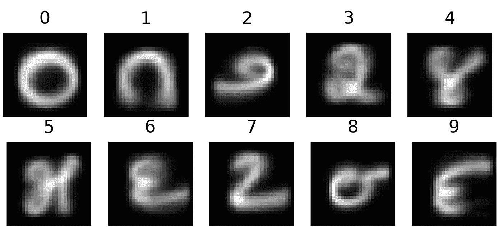

Class-wise mean images of the 10 handwritten digits in the Kannada MNIST dataset

# TLDR:

我在传播 2 个数据集:
**卡纳达语-MNIST 数据集** : 28X 28 灰度图像:60k 火车| 10k 测试
**挖掘 -MNIST:** 28X 28 灰度图像:10240(1024 X10){见下图}

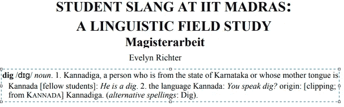

Putting the ‘Dig’ in Dig-MNIST

卡纳达-MNIST 数据集旨在替代 MNIST 数据集🙏虽然在卡纳达语中是数字符号。
此外，我正在传播一个由同一种语言(主要由该语言的非母语用户使用)的 10k 个手写数字组成的额外数据集，名为 Dig-MNIST，可用作额外的测试集。

资源列表:

开源代码库👉:[https://github.com/vinayprabhu/Kannada_MNIST](https://github.com/vinayprabhu/Kannada_MNIST)
卡格尔👉:[https://www.kaggle.com/higgstachyon/kannada-mnist](https://www.kaggle.com/higgstachyon/kannada-mnist)
ArXiv👉https://arxiv.org/pdf/1908.01242.pdf

如果你在同行评议的论文中使用卡纳达语-MNIST 语，我们会很感激地将其称为:

维奈·乌代·帕布。"卡纳达语-MNIST:一个新的卡纳达语手写数字数据集."arXiv 预印本 arXiv:1908.01242 (2019)..

Bibtex 条目:

```
@article{prabhu2019kannada,
  title={Kannada-MNIST: A new handwritten digits dataset for the Kannada language},
  author={Prabhu, Vinay Uday},
  journal={arXiv preprint arXiv:1908.01242},
  year={2019}
}
```

# 简介:

卡纳达语是印度卡纳塔克邦的官方和行政语言，全世界有近 6000 万人使用。此外，根据《印度宪法》第 344(1)条和第 351 条，卡纳达语是印度 22 种预定语言之一。这种语言是用官方的卡纳达语书写的，这是梵语家族的一种 abugida，可以追溯到卡丹巴语(公元 325-550 年)。

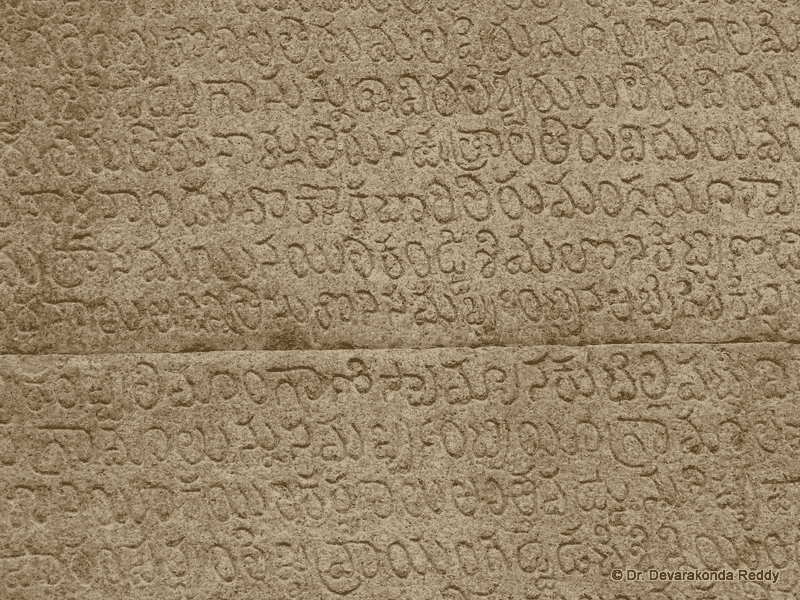

Kannada stone inscriptions: Source: [https://karnatakaitihasaacademy.org/karnataka-epigraphy/inscriptions/](https://karnatakaitihasaacademy.org/karnataka-epigraphy/inscriptions/)

不同的字形被用来代表语言中的数字 0-9，这与当今世界上流行的现代印度-阿拉伯数字截然不同。与其他一些古老的数字系统不同，这些数字在卡纳塔克邦的日常事务中被广泛使用，正如在下面的图片中捕捉到的车辆牌照上这些符号的流行所证明的:


A vehicle license plate with Kannada numeral glyphs

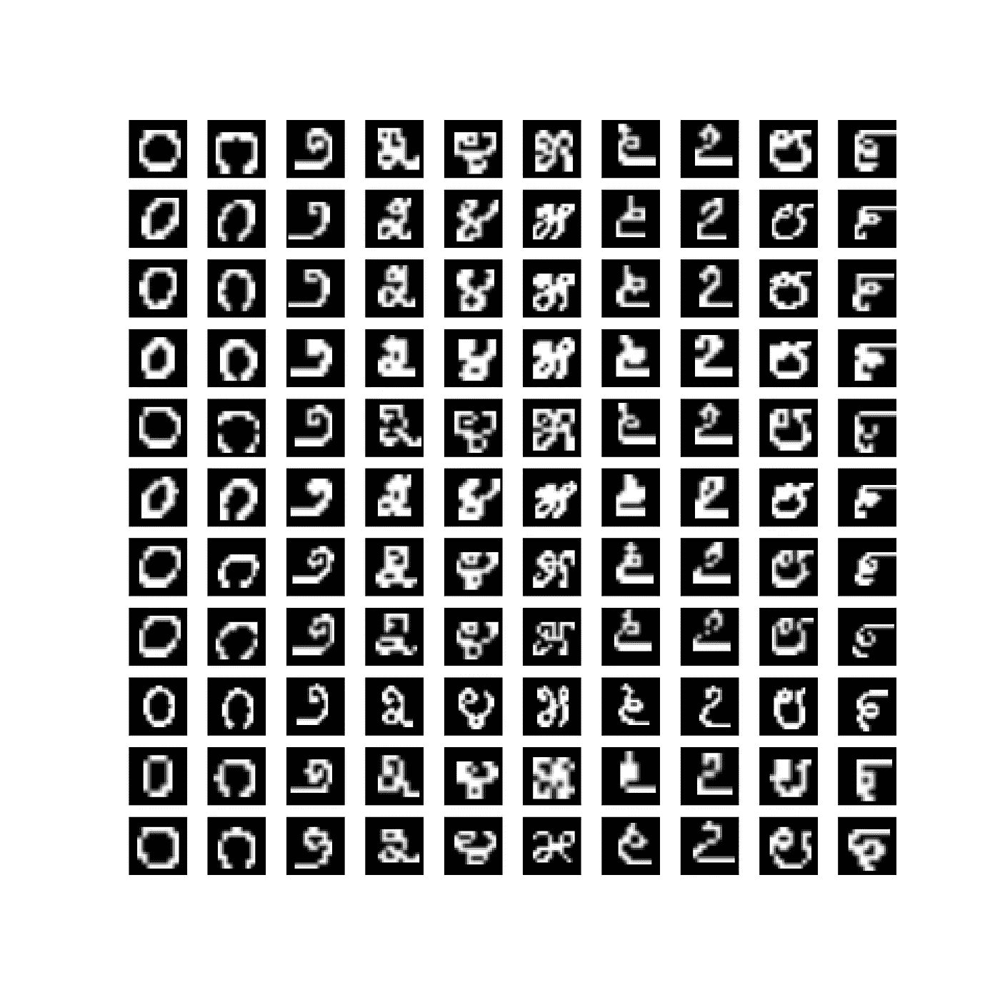

MNIST-ized renderings of the variations of the glyphs across the modern Kannada fonts

此图捕捉了以下现代字体中字形变化的 MNIST 化渲染: *Kedage、Malige-i、Malige-n、Malige-b、Kedage-n、Malige-t、Kedage-t、Kedage-i、Lohit-Kannada、Sampige 和 Hubballi-Regular* 。

# 数据集管理:

## 卡纳达语-MNIST 语:

在印度的班加罗尔招募了 65 名志愿者，他们是这门语言的母语使用者，也是数字文字的日常使用者。每个志愿者填写一张包含 32 × 40 网格的 A3 纸。这就产生了一张填好的 A3 纸，每张纸上有 128 个数字，我们假设这些数字足够大，可以捕捉大多数志愿者内部字形的自然变化。使用 Konica Accurio-Press-C6085 扫描仪以每英寸 600 点的分辨率扫描如此收集的所有纸张，产生 65 个 4963 × 3509 png 图像。

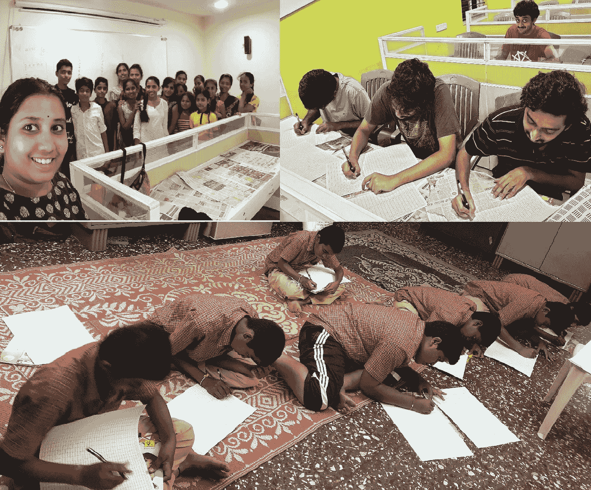

Volunteers helping curate the Kannada-MNIST dataset

## 迪格-MNIST:

招募了 8 名年龄在 20 至 40 岁之间的志愿者来生成 32 × 40 格的卡纳达数字(类似于 2.1)，所有人都用黑色墨水 Z-Grip 系列| Zebra Pen 在商业 Mead Cambridge Quad 书写板上书写，8–1/2 " x 11 "，四格，白色，80 张/本。然后，我们使用具有以下设置的 Dell-s 3845 cdn 扫描仪扫描纸张:输出颜色:灰度原稿类型:文本变亮/变暗:变暗+3 尺寸:自动检测用于书写数字的纸张的缩小尺寸(US-letter vis-a-vis A3)导致扫描更小(。tif)图像，所有图像都大约为 1600×2000。

# 与 MNIST 的比较:

1:平均像素强度分布:

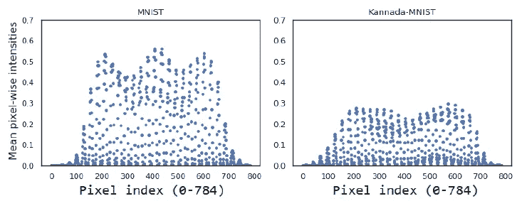

2:形态属性:

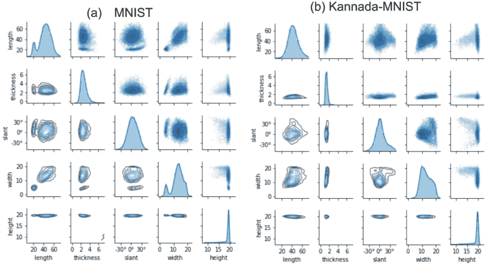

Code source: [https://github.com/dccastro/Morpho-MNIST](https://github.com/dccastro/Morpho-MNIST)

3:主成分分析:

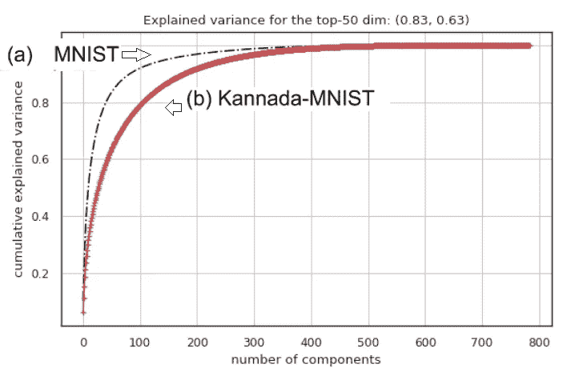

4: UMAP 可视化:

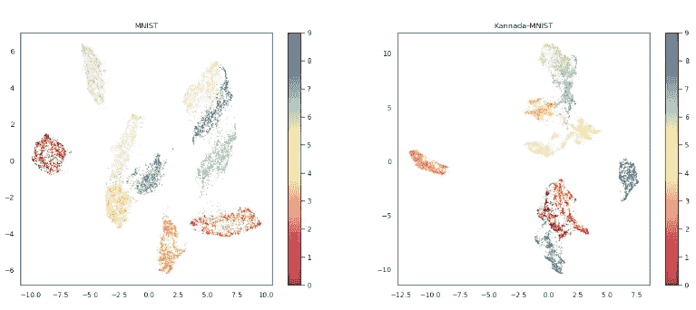

# 一些分类基准:

我使用了一个标准的 MNIST-CNN 架构来获得一些基本的准确性基准(见下图)

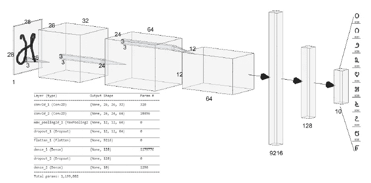

The CNN architecture used for the benchmarks

## (a)卡纳达-MNIST 列车上的培训和卡纳达-MNIST 测试上的测试

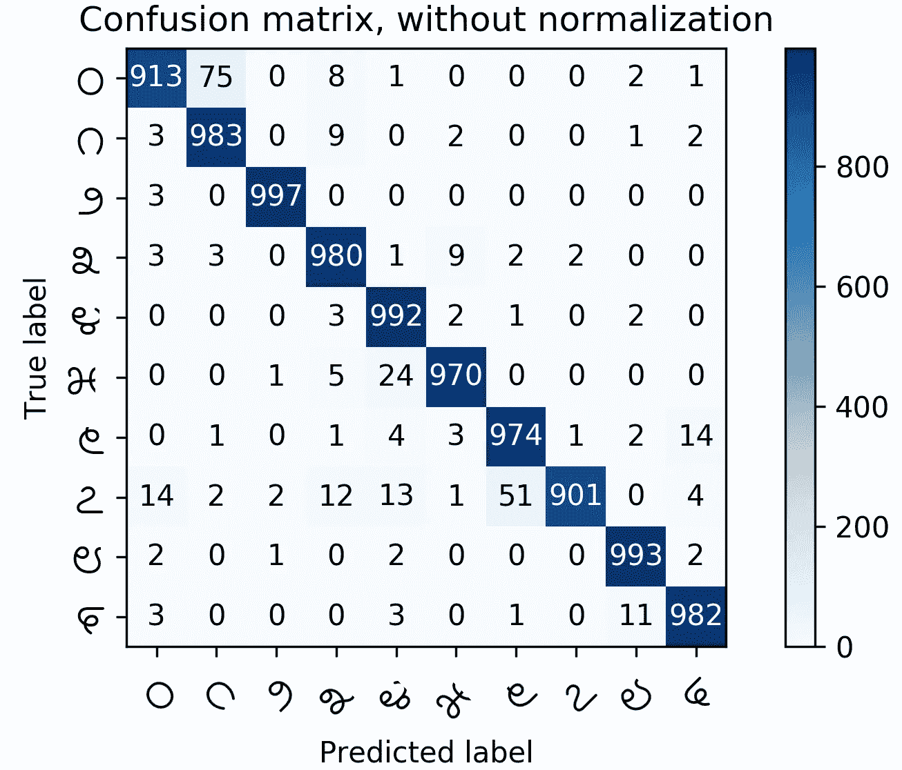

## (b)在卡纳达-MNIST 列车上进行培训，在迪格-MNIST 进行测试

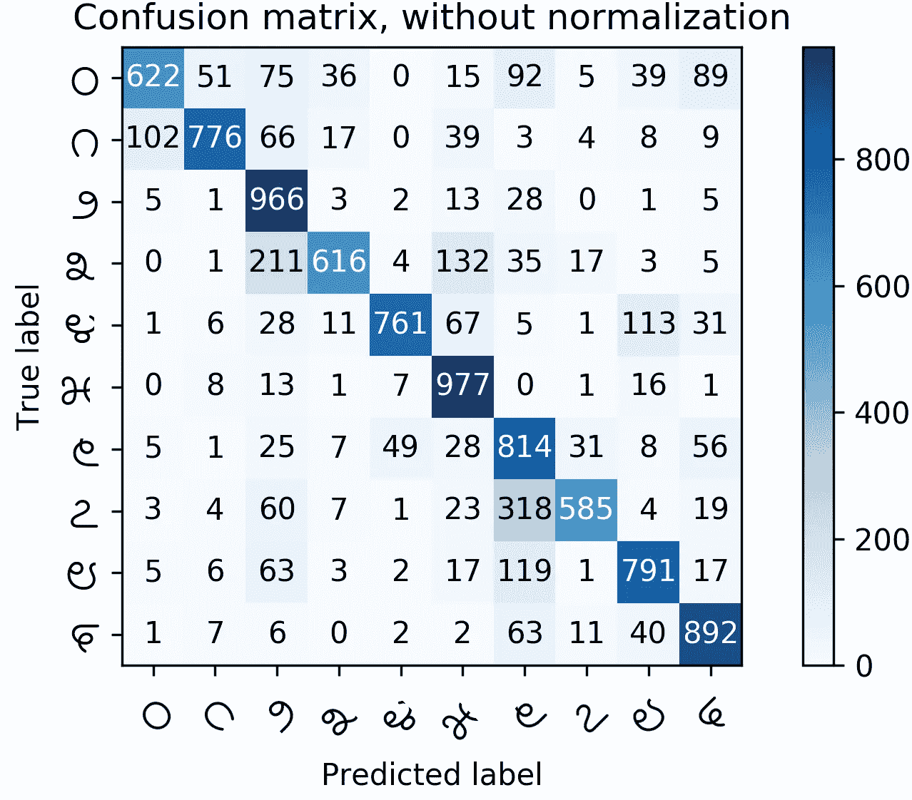

# 对机器学习社区的公开挑战

我们对机器学习社区提出了以下公开挑战。

1.  为了描述灾难性遗忘的本质，一个预先在 MNIST 接受训练的美国有线电视新闻网记者被用卡纳达-MNIST 语重新训练。这是特别有趣的，因为观察到卡纳达语-MNIST 语中 3 和 7 的印刷字形与 MNIST 语中 2 的字形有着不可思议的相似。
2.  获得一个使用字体(如[1])生成的纯合成数据训练的模型，并扩充以实现卡纳达-MNIST 和迪格-MNIST 数据集的高精度。
3.  跨不同的语言/文字，尤其是印度文字，重复本文中描述的过程。
4.  关于迪格-MNIST 数据集，我们看到一些志愿者已经越过了网格的边界，因此一些图像要么只有字形/笔画的部分切片，要么具有可以争论它们可能潜在地属于两个不同类别中的任何一个的外观。关于这些图像，值得看看我们是否可以设计一个分类器，将成比例的 softmax 质量分配给候选类。
5.  我们共享原始扫描图像的主要原因是为了促进对自动分割算法的研究，该算法将解析来自网格的单个数字图像，这可能反过来导致数据集升级版本中的图像质量更高。
6.  通过在卡纳达-MNIST 数据集上进行训练和在迪格-MNIST 数据集上进行测试，无需借助图像预处理，即可达到 MNIST 级别的精度。

[1] Prabhu、Vinay Uday、Sanghyun Han、Dian Ang Yap、Mihail Douhaniaris、Preethi Seshadri 和 John Whaley。"字体-2-手写:通用数字分类的种子扩充训练框架." *arXiv 预印本 arXiv:1905.08633* (2019)。https://arxiv.org/abs/1905.08633