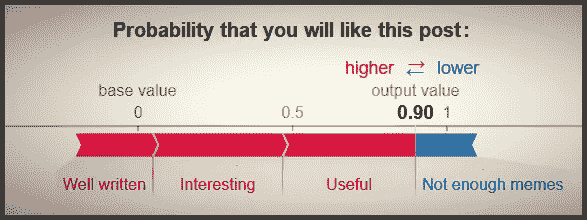
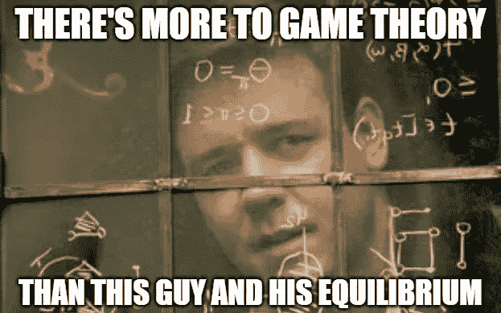
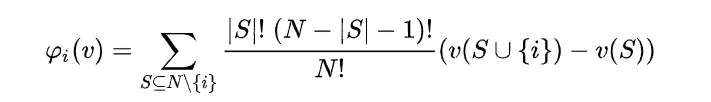
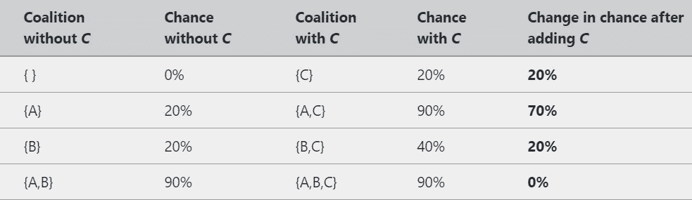
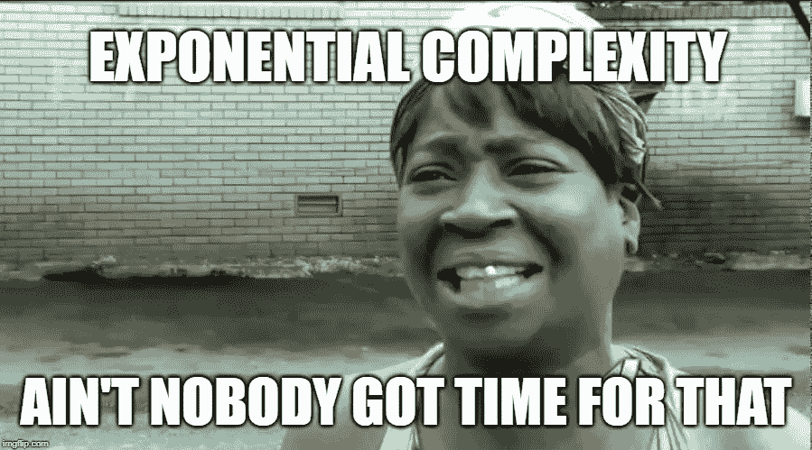
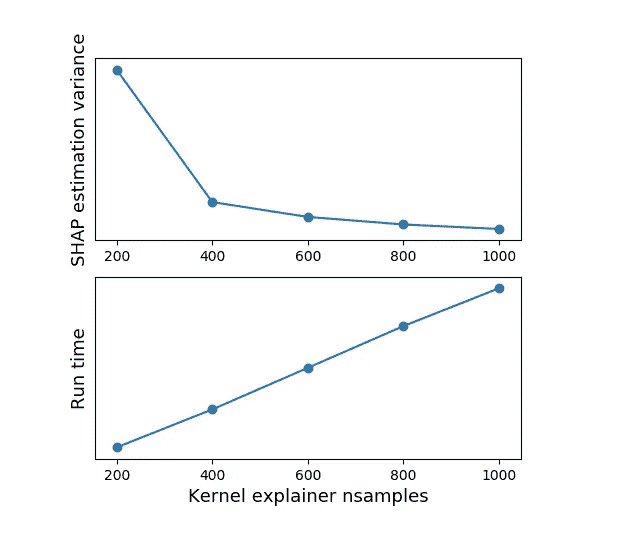
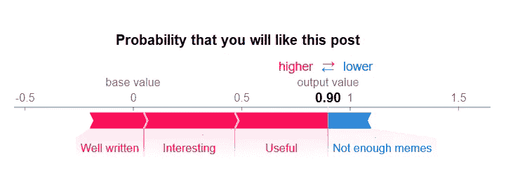

# 沙普利价值观的新视角——介绍沙普利和 SHAP

> 原文：<https://towardsdatascience.com/a-new-perspective-on-shapley-values-an-intro-to-shapley-and-shap-6f1c70161e8d?source=collection_archive---------22----------------------->

## Shapley 值和 SHAP python 库的简明介绍

# 这个帖子是关于什么的？

这篇文章是关于解释 Shapley 值统计模型的两个系列文章中的第一篇。我能想到你可能想读它的两个主要原因(除了，你知道，为了好玩):

1.  **了解沙普利价值观和 SHAP python 库**。这就是这篇文章的主旨。它所提供的解释远非详尽无遗，也没有包含任何无法从其他在线来源收集到的内容，但它仍然可以作为这个主题的一个很好的快速介绍或额外阅读。
2.  **在阅读下一篇关于天真的 Shapley 价值观的文章之前，作为介绍或快速复习。下一个帖子是我对机器学习中 Shapley 值这一主题的一个新颖贡献。你可能已经熟悉了 SHAP 和沙普利，只是浏览了一下这篇文章，以确保我们有共同之处，或者你可能是来澄清下一篇文章中的一些困惑。**

# 什么是沙普利价值观？

网上有很多解释这个话题的资料，所以我在这里的解释会很简短。我特别推荐 Christoph Molnar 的[可解释机器学习](https://christophm.github.io/interpretable-ml-book/)的[这一章](https://christophm.github.io/interpretable-ml-book/shapley.html)做更详细的解释。我还发现，盯着数学公式(在下面或在[维基百科](https://en.wikipedia.org/wiki/Shapley_value)上)直到我得到它，给了我对这个概念最好的直觉。

Shapley 值是博弈论中的一个概念，描述了如何在玩家之间分配玩家联盟产生的总回报。它的定义非常简单:任何玩家的贡献是在不包含该玩家的所有可能的玩家联盟中，将该玩家加入联盟所导致的预测变化的期望值。看起来是这样的:

**我们来看一个例子**:假设我们有一个团队需要执行一项任务。团队中的每个人都有 20%的额外成功机会，但是一个团队成员 *A* 有一个特殊的工具，可以保证 90%的成功机会，只要团队中至少有一个额外的成员。如果我们今天的团队由三个成员组成， *A* 、 *B* 和*C*——他们有 90%的成功机会——那么每个人对这个机会的贡献是多少？

让我们为团队成员 *C* 计算一下，使用不包含他们的所有可能组合:

应用该公式(Shapley 公式中总和的第一项对于{}和{A，B}是 1/3，对于{A}和{B}是 1/6)，我们得到团队成员 *C* 的 Shapley 值 **21.66%** 。团队成员 *B* 自然会有相同的值，而对 *A* 重复这个过程，我们会得到 **46.66%** 。沙普利价值观的一个至关重要的特点是，玩家的贡献总是累加到最后的回报:**21.66%+21.66%+46.66% = 90%**。

# 机器学习中的 Shapley 值

**如果你将*收益*转化为*预测*并将*玩家*转化为*特征*，那么这个框架与机器学习的相关性是显而易见的。**但是计算模型特征的 Shapley 值并不完全简单，因为模型中的特征与团队中的工人行为方式不同。具体来说，**预测模型通常无法处理其输入特征之一被简单删除的情况，从而测试其输出如何变化**。相反，Shapley 值的 ML 实现，特别是 SHAP 方法，将*缺失特征*解释为*值未知的特征*，并通过对该特征的可能值进行平均来模拟这种未知状态(本系列的下一篇文章提出了一种不同的方法，并将其与 SHAP 方法进行了比较)。

**得出 Shapley 值的主要问题是计算的复杂性** —具体来说，它们需要 2ᴹ(其中 m 是特征的数量)来计算。无论你的 GPU 有多强大，指数级的复杂性几乎总是一个障碍(想想当你的特征是 20x20 图像像素时，这需要多少步骤)。在理论文献中，这个问题最常见的解决方法是采样方法——而不是遍历所有可能的特征联盟，使用它们的子样本来估计 Shapley 值(如果您对此感兴趣，请参见例如 [Castro 等人 2009 年](https://www.sciencedirect.com/science/article/pii/S0305054808000804)、 [Castro 等人 2017 年](https://www.sciencedirect.com/science/article/pii/S030505481730028X)或 [Benati 等人 2019 年](https://www.sciencedirect.com/science/article/abs/pii/S0377221719304448))。

# 进入 SHAP python 库

SHAP 图书馆是数据科学家工具箱中最新的强大成员。它提供了三个主要的“解释器”类——tree explainer、DeepExplainer 和 KernelExplainer。前两个分别专门用于计算基于树的模型和神经网络的 Shapley 值，并基于这些模型的架构实现优化。内核解释器是一个“盲”方法，适用于任何模型。我在下面解释这些类，但是对于它们如何工作的更深入的解释，我推荐[这一章](https://christophm.github.io/interpretable-ml-book/shap.html)。

## 内核解释器

KernelExplainer 计算 Shapley 值的方法可以总结为以下两点:

1.  不是遍历所有 2 个 ᴹ **可能的特征排列，而是采样一个小的子集**。默认样本数为*n 样本= 2*M+2048* 。例如，如果我们有 20 个特征，KernelExplainer 将对 2088/2 ⁰或大约 0.2%的可能联盟进行采样。联盟不是完全随机选择的；相反，在 Shapley 公式中具有较高权重的那些将首先被选择(因此，0 或 M-1 个特征的组合，其最能提供关于添加另一个特征的效果的信息，将首先被包括在内)。
2.  **“缺失特征”是通过将模型在自举样本上的预测与取自数据集中其他条目的这些特征的值进行平均来模拟的。**该“背景”数据集没有默认大小，但算法建议 100 个样本。这意味着，对于每个采样的特征联盟，该算法将生成 100 个预测，每个预测基于自举样本，并对它们进行平均。请注意，KernelExplainer 的结果仅基于不同输入的模型输出，这意味着它将适用于任何类型的函数，而无需对其做任何进一步的假设。

**(1)**的意义在于 Shapley 值基本上是用随机抽样估计的。相应地，增加 *nsamples* (或背景数据集的大小)会导致运行时间增加(或多或少呈线性)和估计方差减少(这意味着当您多次运行 explainer 时，Shapley 值会彼此更加相似，并与预期值更加相似)。这很容易通过用不同的 *nsamples* 值运行内核解释器来演示:

Based on the Census Income database included in the SHAP library. There are 12 features in the dataset and so *nsamples* is effectively capped at 212=4096\. Estimation variance and mean run time are computed across 30 iterations of running the SHAP explainer on a K-Nearest-Neighbors classification model.

**(2)**的重要性——通过用替代“背景”数据替换“缺失”特征的值来处理“缺失”特征——更加复杂:

*   首先，也是最简单的，它是 Shapley 值估计的方差的**附加来源，因为结果至少在某种程度上取决于背景数据集的选择。**
*   第二，它对特征独立性进行了**假设:例如，如果特征 *x1* ， *x2* 在我们的训练数据中高度相关，则用来自背景数据集中的随机值替换 *x1* 的值忽略了这种依赖性，并且基于不可能出现在训练集中的{ *x1* ， *x2* }实例生成预测，使得 SHAP 值估计不太可靠。**
*   最后，它表示对特征对预测的贡献的**解释，不是它们如何影响预测模型本身，而是如果这些特征的值未知，它们如何影响已经训练好的模型的结果。这是另一个提醒你的好机会，这一切都指向下一篇文章，在这篇文章中，我们将探索不同的解释。**

## 树解释器

TreeExplainer 是一个为基于树的模型(Random Forest，XGBoost，LightGBM 等)计算 SHAP 值的类。).与 KernelExplainer 相比:

1.  **精确**:它不是通过随机采样来模拟缺失特征，而是通过简单地忽略依赖于缺失特征的决策路径来利用树形结构。因此，TreeExplainer 的输出是确定性的，不会随背景数据集而变化。
2.  **高效**:所有组合不是在每个可能的特征组合(或其子集)上迭代，而是同时通过树推送，使用更复杂的算法来跟踪每个组合的结果——将所有可能组合的复杂度从 *O(TL2* ᴹ *)* 降低到多项式 *O(TLD* *)* (其中 *M* 是特征的数量，*t*

使用 TreeExplainer 我们收获了什么？首先，**我们去除了所有基于采样的估计方差**，因为我们不需要使用背景数据集或选择特征联盟的子集。其次，我们的结果**不再由于特性**之间的依赖性而偏斜，因为这些特性包含在树结构中(尽管在某些情况下，我们可能不得不放弃前面的两个好处)。第三，**我们的运行时间是*显著地*快**，在某些情况下使得*相当快*和*慢得不可接受*。最后，请注意，这两个解释者对特征贡献的解释与给定训练模型的预测没有区别，而与它们如何影响模型本身没有区别。

## 等等，DeepExplainer 呢？

DeepExplainer 是一个专门为神经网络模型计算 SHAP 值的类。我在这里不包括它的详细解释，因为我缺乏与其他解释者的实践经验，这使我能够保证我对他们的解释，并且这篇文章主要是下一篇文章的序言，在下一篇文章中，SHAP 解释者将与天真的 Shapley 值方法进行比较，当谈到解释神经网络时，这种比较在很大程度上是不相关的。

作为粗略的概述，对于神经网络模型，DeepExplainer 比 KernelExplainer 要快得多，但同样使用背景数据集和训练模型来估计 SHAP 值，因此可以得出关于计算的 Shapley 值的性质的类似结论-它们根据背景数据的选择而变化(尽管没有很大程度)，并且在生成用于估计的引导样本时，它们可能不考虑特征之间的依赖性。

# 我如何用 SHAP 来解释我的模型？

哦，那真的很简单。只需导入 [shap](https://shap.readthedocs.io/) ，然后像这样做(例如为内核解释器):

然后使用 SHAP 图书馆的可视化功能查看结果——可以是单个样本的 SHAP 值，也可以是整个数据集。

# 明白了！下一步是什么？

所有这些只是为了让我们在沙普利价值观和 SHAP 解释者上保持同步。您可以在这里停下来，继续(或开始)在您自己的工作中使用这个伟大的工具。**但是如果你想更深入一点，更好地理解这个主题以及你工具集中的另一个工具，请继续阅读下一篇文章******！**。**

***原载于 2019 年 11 月 28 日*[*https://edden-gerber . github . io*](https://edden-gerber.github.io/shapley-part-1/)*。***