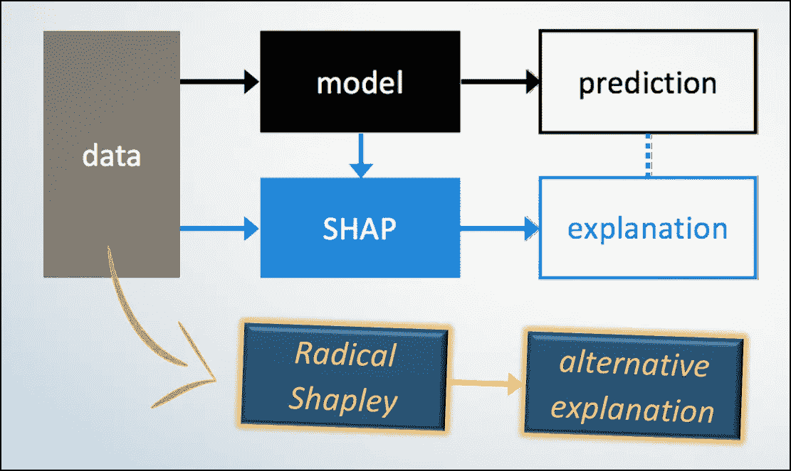
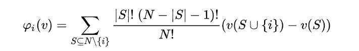
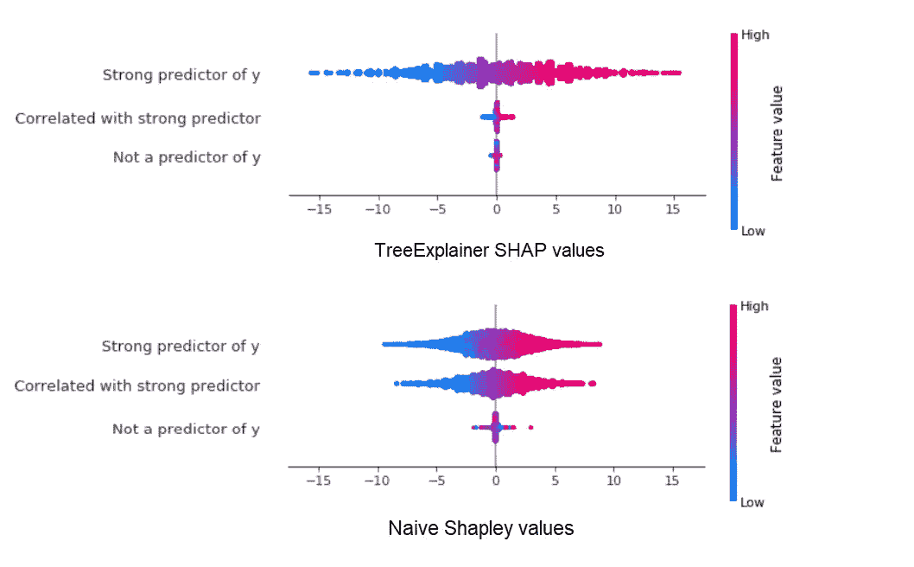
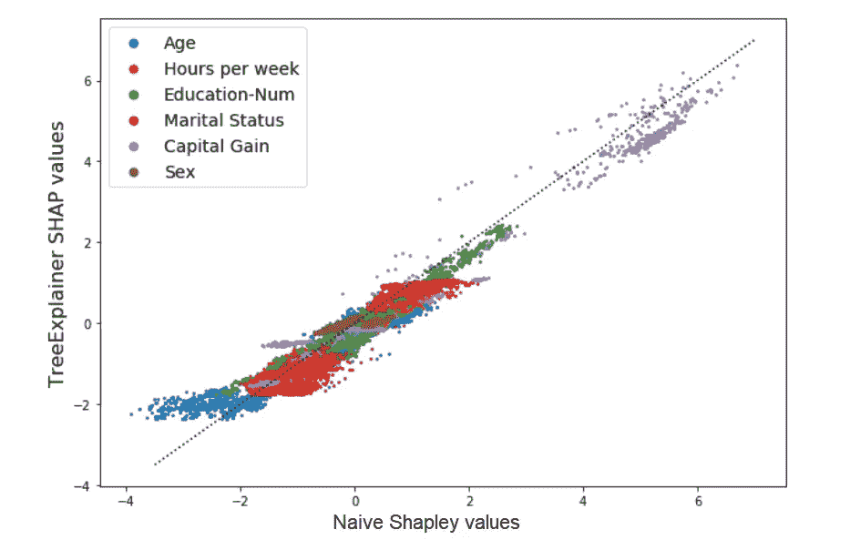
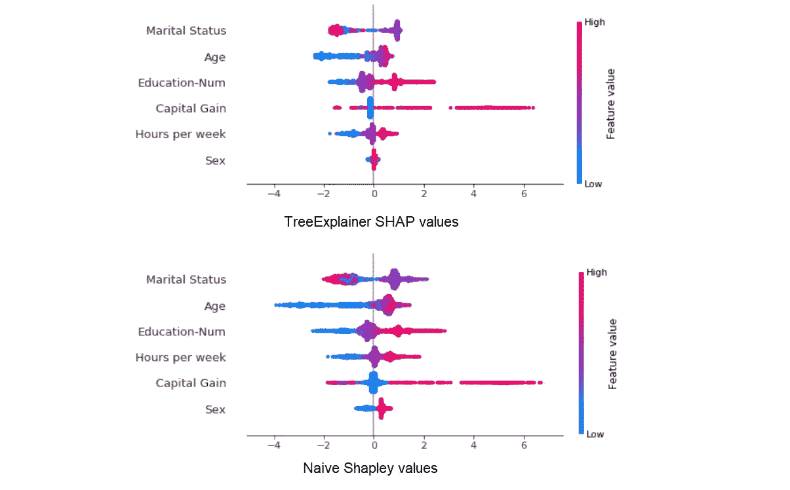
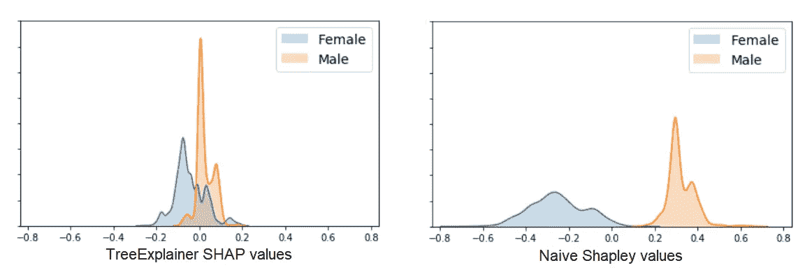
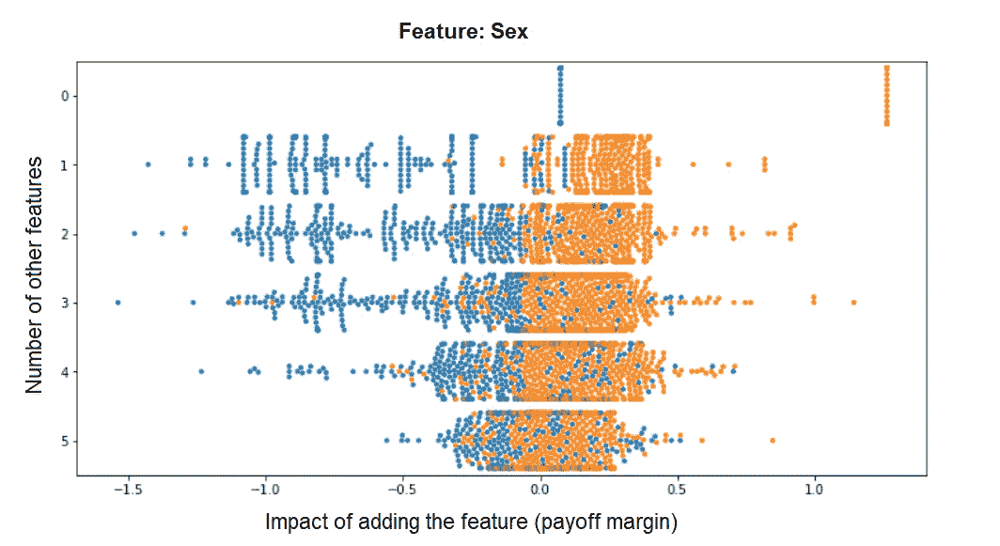
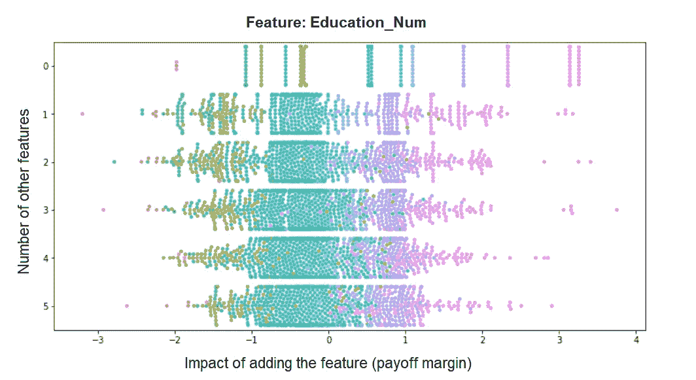
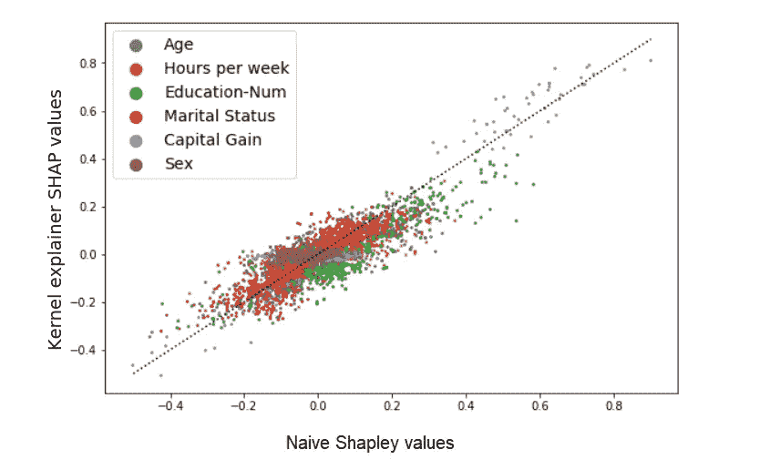
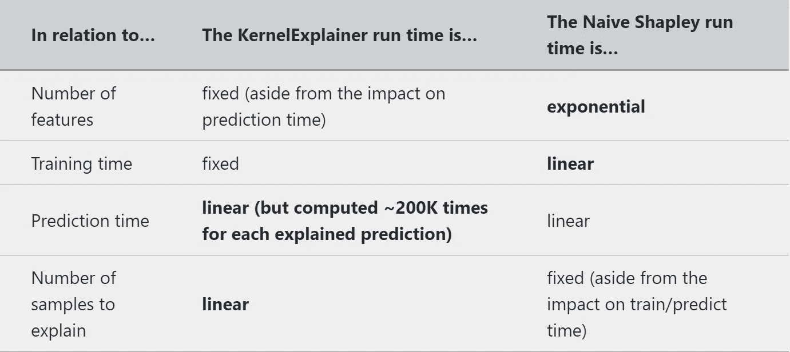

# Shapley 值的新视角:天真的 Shapley 方法

> 原文：<https://towardsdatascience.com/a-new-perspective-on-shapley-values-the-radical-shapley-method-6c2f4af7f922?source=collection_archive---------18----------------------->

Image adapted from [shap.readthedocs.io](https://shap.readthedocs.io/)

## 通过探索一个概念性的替代方案来更好地了解 SHAP。

** **编辑，2020 年 1 月:**我把这里介绍的方法从不太直观的*激进的 Shapley* 改名为*幼稚的 Shapley* 。这在整篇文章中都有所改变，但是代码片段和 git 库可能仍然反映了旧的名称。**

# 你为什么要读这篇文章？

*   **了解沙普利值和 SHAP 工具**。关于这些主题的大多数其他来源是基于现有主要来源的解释(例如，学术论文和 SHAP 文档)。这篇文章试图通过实证的方法来获得一些理解。
*   **了解计算 Shapley 值的另一种方法**，在某些(有限的)情况下，这种方法可能比 SHAP 更可取(或者等待下一篇文章，以获得更广泛适用的想法)。

**如果你不熟悉 Shaply values 或 SHAP** ，或者想简单回顾一下 SHAP 的解释者是如何工作的，[看看这篇文章](https://medium.com/@edden.gerber/a-new-perspective-on-shapley-values-an-intro-to-shapley-and-shap-6f1c70161e8d)。

**赶时间？我强调了关键句子来帮助你快速阅读。**

# 更加冗长的介绍

当我在最近的一次黑客马拉松中使用 SHAP 图书馆来解释一个隔离森林模型的预测时，我对 Shapley 值的兴趣被激发了。我注意到，对于我们的模型，SHAP 计算似乎非常低效，在整个数据集上运行需要太长时间。事实上，时间太长了，以至于我想知道在这种情况下，Shapley 值的“蛮力”指数复杂方法是否是一个更好的选择。这让我编写了一个函数，使用一种对我来说似乎很直观的方法来计算 Shapley 值:**不是通过对可能的值进行积分来模拟缺失的特征(如 SHAP 方法)，而是可以在训练期间将它们从模型中完全删除**。由于文献中缺乏现有的术语，我决定将这些称为**朴素沙普利值**，在某种意义上，它们仅基于数据集(加上一个模型类)，而不是基于训练好的模型。

作为一名神经科学研究生，我学到的一件事是，如果你想理解——并信任——你的分析工具，你需要对它们进行仔细的实证研究，就好像它们是你真正的研究对象一样。阅读现有的文献很重要，亲自获得实践经验也很重要，但我发现真正的洞察力来自于不要认为工具的结果是理所当然的，而是要结合人为的边缘情况或其他方法来测试它。**这篇文章的主旨是，通过与朴素的 Shapley 方法进行比较，更好地理解 SHAP 解释者的优势和局限性。**

**Shapley 函数的代码**和本文中使用的例子可以在[这里](https://github.com/edden-gerber/radical-shapley-values)找到。

# 大纲(不太是 TL；博士)

在这篇文章中，我将尝试展示以下内容:

*   **通过为每个 2ᴹ特征子集(其中 *M* 是特征的数量)重新训练模型，可以为少量特征**计算朴素沙普利值。
*   **SHAP 图书馆的解释者和朴素的 Shapley 方法对 Shapley 值提供了两种不同的解释。**前者最适合解释给定(已训练)模型的单个预测，后者更适合解释数据集和模型*类*的特征重要性(例如，用某些参数初始化的随机森林，但不是已训练的随机森林)。
*   **在某些(有限的)情况下，朴素沙普利计算可以比 SHAP 方法更快。**当以下所有情况都为真时，这些情况是广义的: **a.** 少量特征(< ~15)， **b.** 使用不被高效的 SHAP 解释器支持的模型，以及 **c.** 大量样本(例如，整个数据集)需要 Shapley 值。

在以后的文章中，我希望讨论一个更实用的，多项式复杂的替代方法，用抽样来估计朴素的 Shapley 值。

# 那么什么是“**幼稚**”的沙普利价值观呢？

**首先，什么是沙普利值？**如果你有一个团队，每个人都对总收益做出贡献，但他们的贡献不一定是独立的(就像团队经理的贡献取决于也有做出贡献的工人)，那么 Shapley 值将每个人对总收益的贡献量化为他们在所有可能的团队中的边际贡献的加权平均值(因此我们的团队经理的贡献可能是 0，没有额外的工人，100，至少有一个工人，等等。并且这是在团队的所有可能排列中的平均值)。用更专业的术语来说，Shapley 值反映了在不包括玩家的所有可能联盟中，将玩家加入联盟所产生的剩余收益的期望值。

在统计模型领域，Shapley 值量化了模型预测中的差异，这种差异是通过在模型中添加每个要素来驱动的。但是，由于此类模型通常无法处理不完整的输入，因此不可能简单地从数据集中移除要素来计算其边际贡献。因此，**实现 Shapley 值的概念来解释预测模型是一些解释的问题**。具体来说，

*   **在预测阶段**，对于给定的样本，SHAP 的解释者将“添加一个特征”解释为具有特定的值，而其值是未知的。例如,“年龄=30”对预测个人收入水平的模型输出的边际贡献可以相对于平均预测收入水平来计算，当用其他可能的值替换数据集中的“年龄”时。另一方面，
*   **朴素的 Shapley 方法基于另一种直觉，即在训练过程中，衡量某个特性对模型的影响**。因此，在我们的示例中,“年龄=30”的贡献是相对于模型最初完全没有年龄特征的情况而言的。

**这两种解释都符合 Shapley 值的数学概念，但它们测量的东西略有不同。**

# 计算朴素的 Shapley 值

**计算朴素 Shapley 值的函数**(此处代码)**采用一个数据集和一个收益函数，计算每个可能的特征组合(或“玩家联盟”)的收益。**然后使用标准的 Shapley 公式计算 Shapley 值:

*φi* is the Shapley value for feature *i*, *S* is a coalition of features, *v(S)* is the payoff for this coalition, and N is the total number of features. *N\{i}* is all the possible feature coalitions not containing *i*. The first term within the sum corresponds to the fraction of times *S* appears within the possible feature permutations; intuitively, this gives the highest weight to the most informative contributions of a feature, i.e. when it is isolated or when it is added to a full set of features.

输出的格式与 SHAP 库解释器的格式相同，因此所有的 SHAP 绘图工具都可以用来可视化它。

**收益函数可以是任何接受数据集并返回分数**的函数(例如，我们的工人团队为任何团队构成产生的利润)。因此，它是一个通用函数，可用于任何类型的 Shapley 计算，但为了生成简单的 Shapley 值，它将始终是一个为数据集定型特定类型模型的函数，并为每一行返回一个预测。

**例如**:假设我们想要为 XGBoost 模型计算简单的 Shapley 值。我们将编写一个自定义的支付函数，它初始化一个 xgb 模型，训练它并返回每个样本的预测(或者可能只针对一个验证集)。Shapley 函数会将输入要素的每个可能组合输入到支付函数中，并使用结果输出来计算每个样本和要素的 Shapley 值(您很快就会看到一个活生生的例子)。

**该算法的主要缺点是其计算复杂度** —它需要运行 2ᴹ次(其中 *M* 是特征的数量)，每次都要重新训练模型。这种复杂性当然是需要 SHAP 图书馆的主要原因；另一方面，在某些有限的情况下，这可能是比使用 SHAP 内核解释器更快的选择。**比较运行时间的问题将在本文**的结尾讨论。

# 这和 SHAP 有什么不同，我们为什么要关心？

**我将 Naive Shapley 方法的结果与 SHAP KernelExplainer 和 TreeExplainer 的结果进行了比较。**我没有与 DeepExplainer 进行比较，因为神经网络模型很少具有使比较相关的少量输入变量。简而言之，朴素沙普利方法在概念上不同于所有的 SHAP 解释者，它代表了特征对模型本身的贡献，而不是对个体预测的贡献。同时，虽然在某些情况下，in 可能比 KernelExplainer 更有效，但它通常较慢(对于数量较少的功能来说不切实际)。再一次，如果你不确定 SHAP 的解释者在做什么，这篇文章可以帮助你。

## 天真的 Shapley 值与 TreeExplainer

TreeExplainer 是与 Naive Shapley 方法进行比较的一个很好的首选，因为与 KernelExplainer 不同，它们都是确定性的(不依赖于基于采样的估计)，并且对特性之间的依赖关系不敏感(至少在 TreeExplainer 的默认实现中)。这使我们能够关注概念差异在处理缺失特征方面的影响，即通过重新训练模型与对特征值进行积分。

我们可以用一个简单的人为例子来证明这种差异的重要性。让我们生成一个 3 特征线性回归模型，其中一个特征 *x1* 是 *y* 的强预测器，第二个特征 *x2* 与之强相关(因此对 *y* 的预测性稍差)，第三个非预测器特征 *x3* :

为了获得简单的 Shapley 值，我们需要首先定义支付函数，它简单地训练模型并返回它的预测(为了简单起见，我不包括任何训练-验证分割等。).

现在运行 Shapley 函数本身( *reshape_shapley_output* 只是重新排列原始输出，因为 *compute_shapley_values* 返回一个不采用特定支付格式的字典。在 [github](https://github.com/edden-gerber/radical-shapley-values) 上提供了功能输入和输出的说明。

为了获得 SHAP 值，我们将定义 XGB 回归模型，对其进行训练，并使用 TreeExplainer 计算 SHAP 值:

现在让我们看看 SHAP 值和天真的沙普利值是如何相互比较的。我们将使用 SHAP 图书馆的简洁的 *summary_plot* 可视化工具，该工具绘制每个特征的 Shapley 值的分布:

让我们来分解一下:

*   使用 TreeExplainer，模型已经用所有 3 个特征进行了训练，因此 **SHAP 值反映了这样一个事实，即 *x1* 在训练的模型**中具有最高的影响，而 *x2* 具有小得多的作用，因为它大部分是冗余的。
*   另一方面，使用朴素的 Shapley 方法，x2 对 *y* 的影响几乎与 x1 的影响一样大，因为**在没有 *x1* 的情况下训练模型时， *x2* 的信息量几乎与**一样多。
*   与此同时，非预测性的 *x3* 使用朴素的 Shapley 方法被认为具有更高的影响——这仅仅是因为，特别是当我们没有进行训练/验证分割时，在没有更好的预测器的情况下，它会过度拟合数据。

**现在让我们尝试一个真实世界的例子**。我们将查看 SHAP 图书馆中包含的一个数据集的 Shapley 值——成人普查数据库，该数据库具有 12 个人口统计特征，用于预测个人的收入是否为> 5 万美元(load with*shap . datasets . adult()*)。为了清晰和减少计算运行时间，我们将在我们的模型中只包括 12 个特征中的 6 个(*年龄、每周小时数、教育、婚姻状况、资本收益和性别*)。我们的模型将是一个 XGBoost 分类器。在这种情况下，TreeExplainer 的 SHAP 值和 Naive Shapley 值如何相互比较？散点图给我们一个快速的第一印象:

结果似乎是高度相关的，这应该已经给了我们一个提示，尽管他们的概念不同，这两种方法在结果上可能不会有太大的差异。现在用*总结 _ 情节*:

这里的结果看起来也很相似(尽管差异很大，以至于全局特征重要性的顺序有所改变)。但是让我们放大一下*性别*变量的 Shapley 值分布的差异:

这是怎么回事？

*   天真的 Shapley 结果向我们展示了**对所有可能的特征组合进行了平均，添加该变量将对该数据集**(你好性别工资差距)的预测产生一致的影响。
*   TreeExplainer 的结果向我们展示了**在我们的训练模型中，该变量对样本预测的影响较小且不太一致**，很可能是因为它用于解释较小的残差方差，因为它传达的大部分信息是由其他更具预测性的特征提供的。

> **注意:**实现我们自己的自定义 Shapley 函数的一个好处是，我们可以轻松地获得大量的中间结果，例如，我们计算的每个可能的特征组合在有或没有给定特征的情况下的利润率(其加权平均值是每个样本的 Shapley 值)。只是为了好玩，我从 *compute_shapley_values* 函数中提取了它，这样我们可以看看最终的 shapley 值是如何从这些单独的支付利润中产生的。这些是*性别*变量的收益边际分布，相对于它所添加的功能数量绘制:

> 我们可以看到模型中已经存在的特性越多，这个特性的边际影响就变得越小，越不明显。以 *Education_Num* 的利润率分布为例，无论有多少其他特征组成模型，它的贡献基本上保持不变，这表明它对模型的贡献很大程度上与它们无关:

那么，我们应该用哪种方法来解释我们的数据和模型中的性别变量*的作用呢？我认为最好的表达方式是:*

*   **朴素的 Shapley 值更好地代表了数据集**中特征的全局影响，而
*   **给定我们现有的训练模型**，SHAP 值可以更好地解释特定的预测。

在继续之前，还有两点需要注意:

> **实际注意事项**:我并不是建议如果您关心数据集中的全局特征影响，就一定要使用朴素的 Shapley 方法，这主要是因为在大多数情况下，这在计算上是很难处理的(尽管在最后几节中可能会出现这种情况)。从我的例子中也可以明显看出，SHAP 解释者的结果通常没有太大的不同，因此不应该用于这个目的。我在这里的主要动机是更好地理解 SHAP 结果及其局限性。
> 
> **技术提示**:如果您熟悉 TreeExplainer，您可能知道，由于在二进制分类的情况下，树节点的权重保存的不是概率，而是对数奇数值(最后一步使用逻辑函数将其转换为概率)，TreeExplainer 使用的默认优化方法提供了加起来等于这些未转换值(而不是最终概率)的 SHAP 值。简单地将逻辑函数应用于 SHAP 值本身是行不通的，因为转换值的总和！=总和的转换值。为了生成与概率输出直接对应的 SHAP 值，TreeExplainer 不得不牺牲一些效率，并使用类似于 KernelExplainer 的方法，通过用背景数据集替换来模拟缺失的要素，这自然是一种更慢、更不精确的方法。另一方面，为了用朴素的 Shapley 方法直接解释概率输出，我们需要做的就是选择支付函数的输出作为概率。**由于使用朴素的 Shapley 方法，我们总是支付最大的计算成本，我们不妨使用一个支付函数，它给出了我们所希望的 Shapley 值来解释**。

## 天真的 Shapley 值与 KernelExplainer

KernelExplainer 是一种计算 SHAP 值的模型盲方法。简单总结一下，它的工作原理是:

1.  仅对可能的特征排列的小子集进行采样。
2.  对于每一个这样的排列，通过生成许多自举样本来模拟“缺失的特征”,其中这些特征的值被来自小的“背景数据集”的值所替换，并且平均这些样本的预测。

这意味着**与 TreeExplainer 相比，KernelExplainer 是**:

1.  **较慢**-需要为数据集中的每个解释实例计算大量预测(因为缺失值是通过对要素的许多可能值进行平均来模拟的)。
2.  **不确定性** —估计 KernelExplainer 的 SHAP 值，方差由联合抽样方法和背景数据集选择引入。

**当比较 KernelExplainer SHAP 值和天真的 Shapley 值时，这是怎么回事？**让我们使用预测收入为> 50 万美元的相同 6 特征人口普查数据集作为测试案例。这一次，按照 SHAP 图书馆笔记本中的[示例，我们将使用 KNN 模型进行预测，并使用 KernelExplainer 提供 Shapley 值，我们可以将其与朴素的 Shapley 值进行比较:](https://slundberg.github.io/shap/notebooks/Census%20income%20classification%20with%20scikit-learn.html)

比较结果:

这两种方法产生不同但相关的结果。如果我们对每个样本的 Shapley 值进行排序和分级(从 1 到 6)，则顺序平均会相差大约 0.75 级(例如，在大约 75%的样本中，两个相邻特征的顺序被交换)。让我们记住，我们不是在看精确值和它们的噪声估计之间的关系:相反，**朴素*沙普利值是一个事物的确定性度量，而核 SHAP 值是另一个(相关)事物的估计*** 。

我认为，这里要强调的最后一点是，尽管这两种方法之间存在差异，但结果总体上仍然非常相似，这告诉我们**在许多情况下，这些方法可能可以互换使用**，假设差异对我们来说并不重要。

# 天真的 Shapley 能比 KernelExplainer 快吗？

正如我们已经建立的，天真的 Shapely 方法需要重新训练模型并产生预测 2ᴹ时报。这使得当特性的数量不低时(比如说，超过 15–20)这是不切实际的。但是它能和 SHAP 解释者的少量特性相比吗？

需要指出的一点是**优化的 SHAP 解释器总是比简单的 Shapley 方法更快，但是模型盲的 KernelExplainer 在解释大型数据集时会非常慢**。为了更好地理解，让我们来看看 KernelExplainer 与简单的 Shapley 方法的运行时间:

粗体条目强调了每种方法的弱点。Naive Shapley 方法当然最容易受到特征数量增加的影响，并且还依赖于模型训练时间，而 KernelExplainer 不受这些因素的影响(尽管其预测随着特征数量的增加而变得更加多变)。KernelExplainer 在运行时间方面的缺点是，虽然它不需要花费时间来重新训练模型，但它会为每个解释的预测单独运行(而 Naive Shapley 会立即为所有预测运行)，每次都必须为大约 200K 个样本( *nsamples* X *num)生成预测。背景样本*，默认分别为 2048+2M 和 100)。

**Naive Shapley 方法可能比 KernelExplainer 执行速度更快的模型的一个很好的例子是*隔离森林*模型**，这是一个流行的异常检测工具，尽管它是一个基于树的模型，但它不受 TreeExplainer 的支持，并且它的训练时间(与预测相比)相对较快。为了证明这一点，我使用来自 Kaggle 的[信用卡欺诈检测数据集，一个大约 285K 的样本，30 个用于预测异常信用卡交易的特征数据集。在我们的演示中，让我们使用 100K 个样本，将 30 个特征减少到 15 个。在我的旧笔记本电脑上，我得到了以下大致的运行时间:](https://www.kaggle.com/mlg-ulb/creditcardfraud)

*-训练模型* : **8 秒**
- *对所有 100K 样本进行预测* : **8 秒**
- *计算单个预测的 SHAP 值* : **18 秒**(不出所料，这大约是计算约 200K 引导样本的预测所需的时间)

基于此，我们可以粗略估计计算整个数据集的 Shapley 值需要多长时间。内核解释器应该只需要 100，000 x 18 秒，或者大约 500 小时。朴素的 Shapley 函数将运行多达 2 ⁵*(15+13)秒，或者**大约 150 小时**(实际上，更好的估计可能是大约 50 小时，因为在算法的每次迭代中用于训练的自举数据集将具有 1 到 15 个特征，或者平均 7 到 8 个，使得训练通常更快)。这两种方法都很慢(尽管两者都可以从并行化中获益)，但是这里重要的不是具体的例子，而是理解每种情况下计算时间的来源。总结一下:

*   **如果只需要解释一小部分“重要”的预测，KernelExplainer 应该足够快了。**
*   如果你需要解释一百万个预测，而你只有不到 10-15 个特征，简单的 Shapley 方法会快得多。

# 实际的妥协？用抽样估计朴素 Shapley 值

**如果我们的模型仅受 KernelExplainer 支持，并且我们确实需要整个庞大数据集的 Shapley 值，但有太多的特征来计算天真的 Shapley 值，该怎么办？**

那么，为什么不尝试**使用联合抽样**来估计天真的沙普利值呢？使用随机抽样来估计大量玩家的 Shapley 值(如 KernelExplainer 所做的那样)已经在文献中进行了彻底的讨论，并且改进的方法仍在开发中(例如参见 [Castro 等人 2009 年](https://www.sciencedirect.com/science/article/pii/S0305054808000804)、 [Castro 等人 2017 年](https://www.sciencedirect.com/science/article/pii/S030505481730028X)或 [Benati 等人 2019 年](https://www.sciencedirect.com/science/article/abs/pii/S0377221719304448))。我认为采样可以很好地与朴素的 Shapley 方法结合使用，也就是说，对模型训练的特征组合空间进行采样(因此不需要通过对自举样本求平均来模拟缺失的特征)。

**去除算法中的指数分量将大大减少运行时间，并使该方法对于大量特征变得可行**(以一些估计方差为代价)，而保持重新训练方法仍将确保在计算大型数据集的 Shapley 值时运行时间较短。

在这一点上这只是一个理论上的想法，这个帖子足够长，无需在此展开。我很乐意听取你对这个想法的任何意见(也许你已经在别的地方遇到过了？)，也希望在以后的帖子里展开讨论。

*原载于 2019 年 12 月 8 日*[*https://edden-gerber . github . io*](https://edden-gerber.github.io/shapley-part-2/)*。*