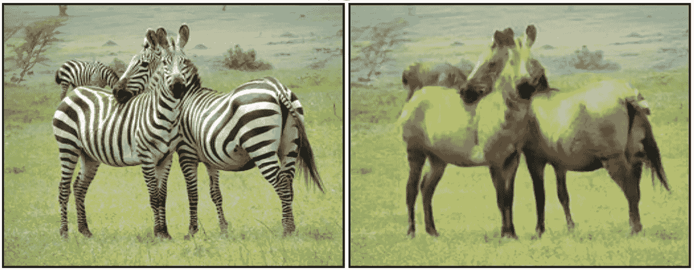
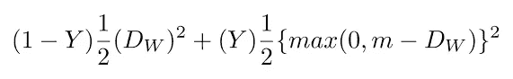
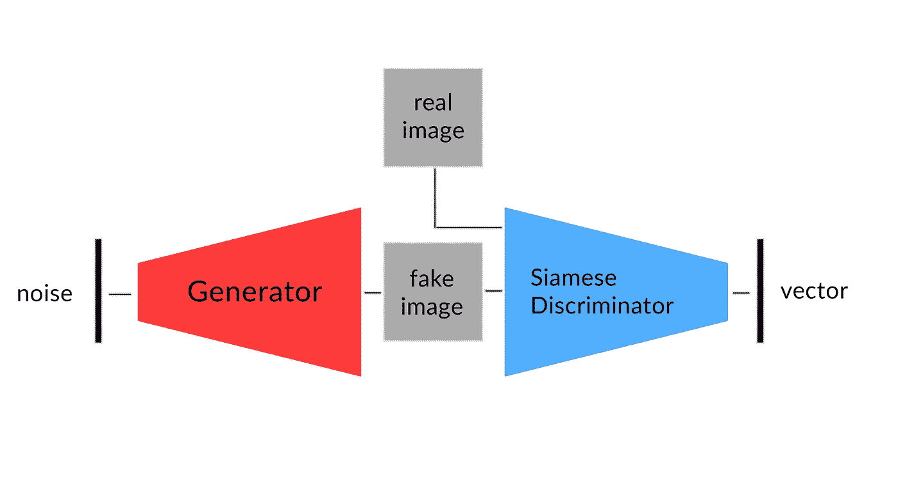
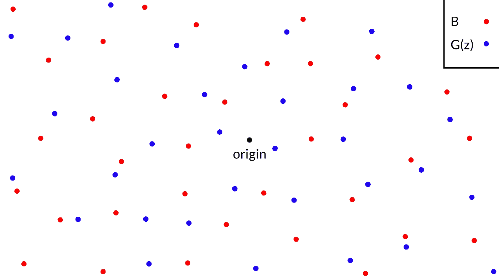
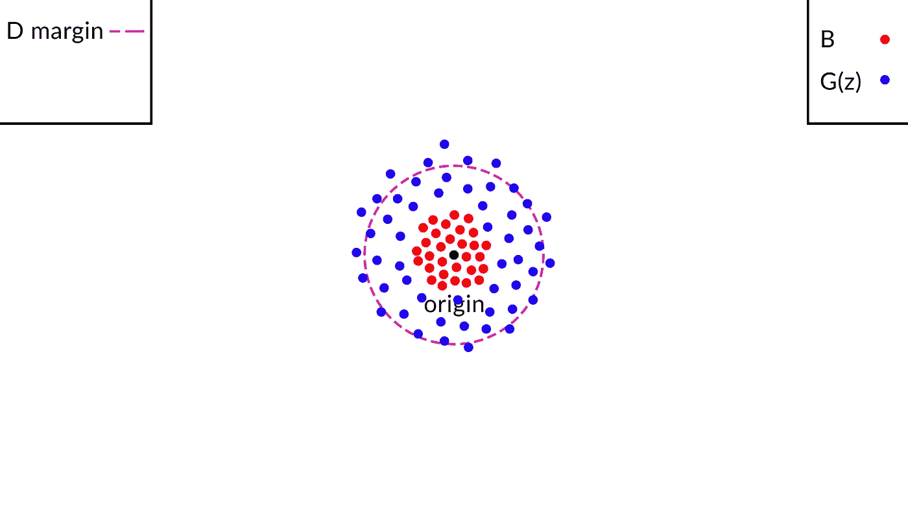
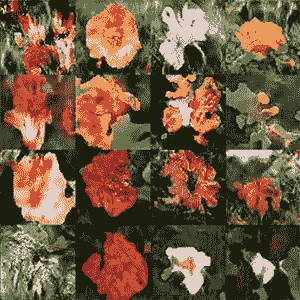
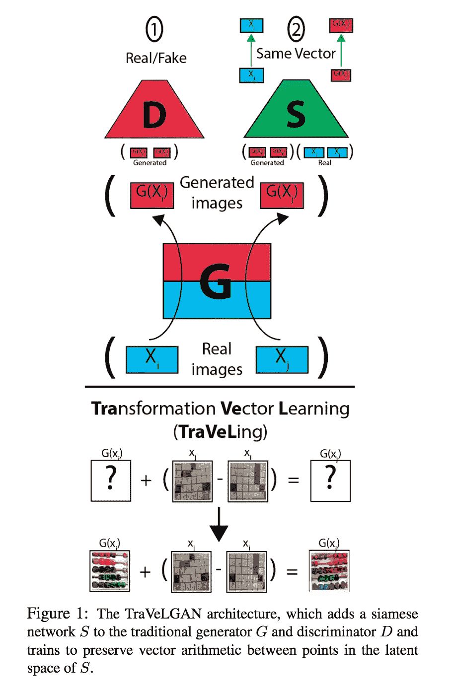
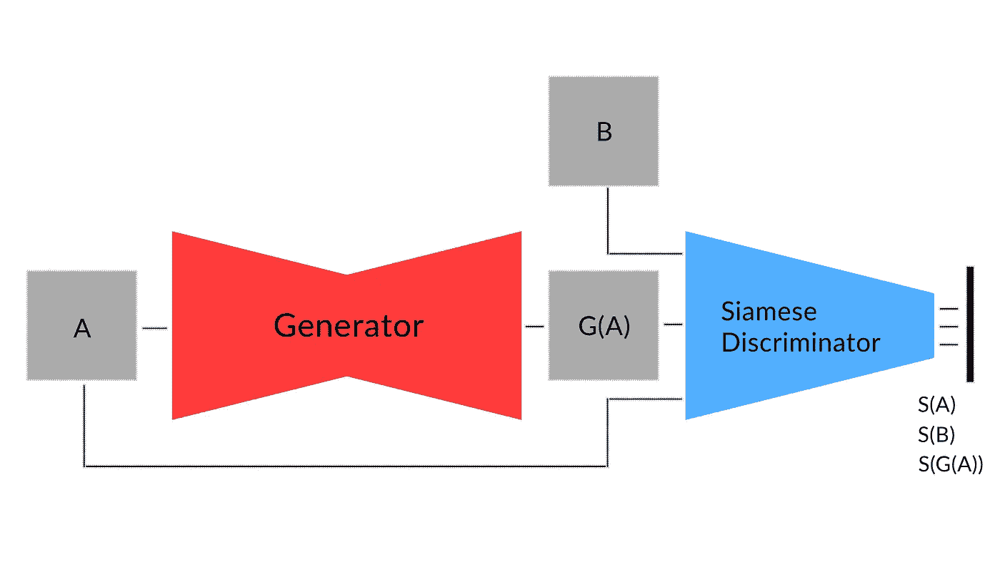
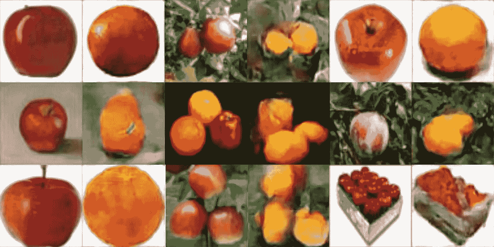
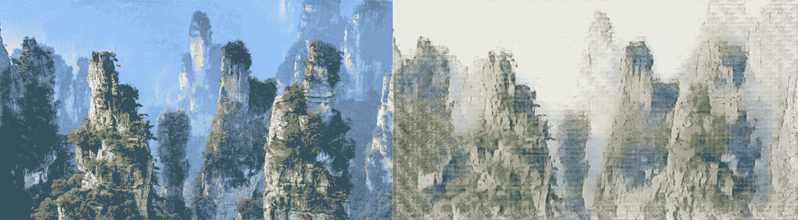

# 看待甘斯的新方法

> 原文：<https://towardsdatascience.com/a-new-way-to-look-at-gans-7c6b6e6e9737?source=collection_archive---------6----------------------->

## 鉴别器比你想象的更有用

# 介绍

生成式对抗网络是一种非常有趣的深度神经网络架构，能够生成新数据(通常是图像)，这些数据类似于训练期间给出的数据(或者用数学术语来说，匹配相同的分布)。

在发现 gan 及其工作原理后，我立刻被吸引住了。在无人监督的情况下生成逼真的图像有一些特别的，也许是神奇的地方。GAN 研究中真正引起我注意的一个领域是图像到图像的翻译:将一幅图像转换为另一幅图像并保持某种对应的能力(例如将一匹马转换为斑马，或将一个苹果转换为橙子)。像介绍 CycleGAN(一种特殊的架构，使用两个 GAN 相互“帮助”执行图像到图像的翻译)的学术论文向我展示了一个强大而迷人的深度学习应用程序，我立即想尝试并实现自己。

Zebra to Horse translation by CycleGAN

通过这篇特别的文章，我很想深入研究 GANs，并提供一种新的方式来看待他们的目标:这可能对一些人来说是微不足道的，而对其他人来说可能是一个有趣的观点。我还将举例说明这种方法的一个有趣的应用，同时提供实用的技巧来帮助您实现它。我会假设你在深度学习方面有一些基础，并且已经知道生成性对抗网络背后的基本思想。

# GANs:简介

让我们考虑一个简单的卷积 GAN 架构(DCGAN)。随机噪声向量是生成器的输入，由不同的顺序卷积层组成，生成最终图像。在训练的开始，这个图像将完全是随机噪声。这个“假”图像然后被送到鉴别器，鉴别器输出一个数字，通常在 0 到 1 之间，代表图像看起来“有多真实”。鉴别器还被馈送真实图像。告诉鉴别器接收到的图像是假的还是真的，允许它随着时间的推移越来越好地完成工作，同时也告诉生成器如何使假图像看起来更真实。

GAN Architecture

# 暹罗网络

在解释经典 GAN 架构的一些新修改之前，我们需要介绍一个称为暹罗网络的特殊网络。暹罗网络用于一次性学习:虽然在大多数情况下，图像分类器需要在大量的训练样本上进行训练，但一次性学习网络能够仅通过一个样本来理解特定对象的特征。这种网络对于实现面部识别算法非常有用，这种算法需要足够灵活，以便偶尔向可识别的面部添加新面孔。

Siamese Network

该架构相当简单:它由一个编码器组成，该编码器将图像的特征编码成一个长度为 *VecLen* 的向量。网络的名字，Siamese，来源于“并行”使用编码器的相同权重来计算两幅图像的潜在向量:如果图像属于同一类，那么这两个向量在潜在空间中应该是接近的，否则，如果它们属于不同的类，它们应该是远离的。这个最终结果是由于一个特殊的损失函数而获得的。虽然文献中存在这种网络的多种损耗函数(对比损耗、三重损耗和磁损耗)，但这里我们首先考虑对比损耗(Hadsell 等人，06)。

这种损失是特别容易和直观的:在它们属于同一类(Y=0)的情况下，它最小化我们两个向量之间的*平方距离* (Dw，考虑欧几里德距离)，而如果它们属于不同类(Y=1)，则最小化( *max(0，Margin-SquaredDistance))* 。这最后一项允许网络在两个向量的*平方距离*低于*裕度*(我们任意选择的常数)的情况下将这两个向量推得彼此远离；否则，如果两个矢量足够远，损耗为零。

不太难吧？现在我们终于准备好把一些拼图拼在一起了。

# 暹罗甘

正如我们之前所述，生成性对抗网络可以被认为是一个生成器和一个鉴别器，它们一起工作，从特定的图像集合或域中生成真实的图像。发生器将随机噪声向量作为输入，并将其“解码”为图像，而鉴别器将图像作为输入，并输出与图像的逼真程度相关的分数。现在让我们尝试使用一个连体网络作为鉴别器。我们现在拥有的是一个解码器-编码器架构，它以一个向量作为输入，以一个向量作为输出。这种结构类似于自动编码器(编码器-解码器)，但两个组件互换了。

Siamese GAN Architecture

这个网络怎么可能训练？

在训练识别人脸的暹罗网络的情况下，我们拥有的总类的数量就是我们的算法必须识别的不同人脸的数量。因此，在这种情况下，我们期望网络以这样一种方式组织潜在空间(网络的输出),即编码同一张脸的所有向量靠近在一起，而远离所有其他向量。

然而，在 GANs 的情况下，类的总数是 2:由生成器创建的假图像和真实图像。然后，我们新的鉴别器目标是安排暹罗网络的输出向量，例如真实图像被编码为彼此靠近，同时保持虚假图像远离它们。

另一方面，生成器试图最小化真实和虚假图像向量之间的距离，或者换句话说，希望真实和虚假编码为同一类。这个新的目标再现了与“传统”情况下非常相似的对抗行为，利用了不同种类的对抗损失函数。

既然我们已经理解了这个想法的基础，让我们试着对它进行迭代和改进。

在我们的损失函数中，我们考虑了向量之间的距离。但是距离到底是什么呢？在我们的例子中，我们评估了两个向量之间的距离，这两个向量可以在鉴别器输出的向量空间中一次又一次地移动。考虑到距离的“相对性”,我们可以进行更稳健的测量，计算从空间固定点的距离。暹罗网络的三重损失考虑到了这个问题，它评估了与中性点(锚点)的距离。

Triplet Loss

这里 *d* 代表平方欧几里德距离， *a* 是“锚”点(我们将认为它固定在空间中)， *n* 是负点， *p* 是正点。

在我们的例子中，只需要处理两个类(最终目标是使一个类与另一个类不可区分),我们在训练之前选择空间中的一个固定点，并使用它作为我们的中性点。在我的测试中，我使用了原点(值全为零的向量)。

为了更好地理解我们的潜在空间，以及我们希望如何为我们的目标组织它，让我们把它形象化。请记住，我们是将我们的空间以等于 *VecLen* 的维数投影到 2D 平面上。

Initial Condition

在训练开始时，我们的图像 *B* 和 *G(z)* (由生成器从噪声向量 *z* 生成的图像)由鉴别器在我们的向量空间中随机编码。

Vector Space during Training

在训练期间，鉴别器将 *B* 的向量推至更靠近固定点，同时试图将 *G(z)* 的编码保持在离该点任意距离(*边距*)处。另一方面，生成器希望 *G(z)* 向量更接近固定点，结果是更接近 *B* 向量。

最后，这里是暹罗甘的一些结果。

Random Flower samples

现在，为了真正理解为什么连体 GAN 与传统 GAN 极其相似，我们需要考虑一种边缘情况:如果连体鉴频器输出一维向量(V *ecLen* =1)会怎样？现在我们有了传统的 GAN 鉴别器输出单个值:如果这个标量接近一个固定的数(我们的 1 维点)，假设 1，图像看起来是真实的，而在相反的情况下看起来是假的。这就相当于把分数保持在接近 1 为真，接近 0 为假。因此，损耗现在变成平方误差，典型的 LSGANs(最小平方 gan)。

所以，这没什么新鲜的。不完全是。将图像编码为潜在向量有时会非常有用。先说一个实际的例子。

# 图像到图像的翻译

最近的一篇论文介绍了 [TraVeLGAN](https://arxiv.org/pdf/1902.09631v1.pdf) ，一种解决不成对图像到图像翻译问题的新方法。与其他方法(例如 CycleGAN)不同，TraVeLGAN 不依赖图像之间的逐像素差异(它不使用任何循环一致性约束)，导致图像在完全不同的域之间转换，几乎没有任何共同点。为了实现这一点，传统的发生器-鉴别器架构与独立的连体网络一起使用。

TraVeLGAN Architecture

假设我们必须将域 *A* 的图像转换为属于域 *B* 的图像。我们称由生成器翻译的图像为 *G(A)* 。

然后，连体网络在潜在空间中对图像进行编码，目的是减小图像对的变换向量之间的距离。使用 *S(X)* 作为来自域 *A* 的 *X* 和 *A1、A2* 两幅图像的矢量编码，网络必须对矢量进行编码，例如:

***(S(A1)-S(A2))***类似于(***)S(G(A1)-S(G(A2)))***

其中使用了诸如余弦距离的相似性度量。

这样，暹罗网络将信息(以渐变的形式)传递给生成器，告诉它如何在生成的图像中保留原始图像的“内容”。

所有这些都发生在鉴别器告诉生成器如何创建更真实的图像的时候，这些图像类似于来自域 *B* 的图像。最终结果是一个生成器，它以域 *B* 的风格生成图像，并保留了域 *A* 中的一些内容(在两个完全不相关的域的情况下，保持了某种对应关系)。

在这个简短的介绍之后(阅读[文件](https://arxiv.org/pdf/1902.09631v1.pdf)以获取更多信息！)，如何将我们的暹罗鉴别器与 TraVeLGAN 方法结合使用？

通过简单地移除特定的连体网络并使已经使用的鉴别器输出向量，我们可以应用先前讨论的损失函数来告诉生成器其生成的图像有多真实，此外，我们能够使用余弦距离来计算潜在空间中图像对的变换向量之间的距离。

Final Architecture with Siamese Discriminator

综上所述，鉴别器将图像编码成矢量，例如:

1.离我们的固定点(原点)的欧几里得距离越小的图像具有更真实的风格

2.编码图像对的变换向量 *(A1- A2)* ， *(G(A1)-G(A2))* 彼此之间具有低余弦距离，从而保留了内容

知道向量的角度和幅度是独立的特征，鉴别器能够学习应用这两个约束的向量空间。

在我的测试中，我使用带有跳跃连接的 U-Net 作为生成器，使用传统的全卷积暹罗网络作为鉴别器。此外，我在生成器和鉴别器中都使用了注意力，并对卷积核进行了频谱归一化，以保持训练的稳定性。在训练期间，使用 TTUR(鉴别器和生成器的不同学习速率)。

下面是一些结果，是根据 ImageNet 上的苹果和橘子图片训练出来的:

Apple to Orange Image Translation

这里有一个高清样本(横向到日本印刷(浮世绘)):

Landscape to Ukiyo e

# 结论

在潜在空间中对图像进行编码非常有用:我们已经表明，使鉴别器输出一个矢量而不是单个值，并相应地改变损失函数，可以导致更灵活的客观景观。像图像到图像转换这样的任务可以仅使用单个生成器和鉴别器来完成，而不需要任何附加的网络，也没有循环一致性限制，循环一致性限制依赖于逐个像素的差异，并且不能处理视觉上非常不同的域。还有很多其他的应用有待探索，比如处理带标签的图像等等。

感谢您宝贵的关注，玩得开心！