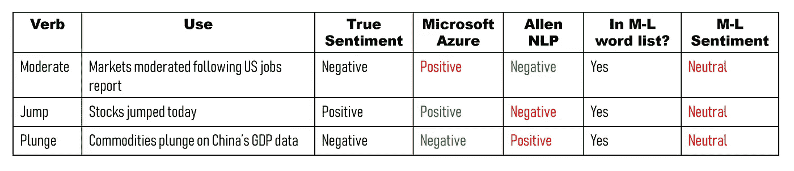
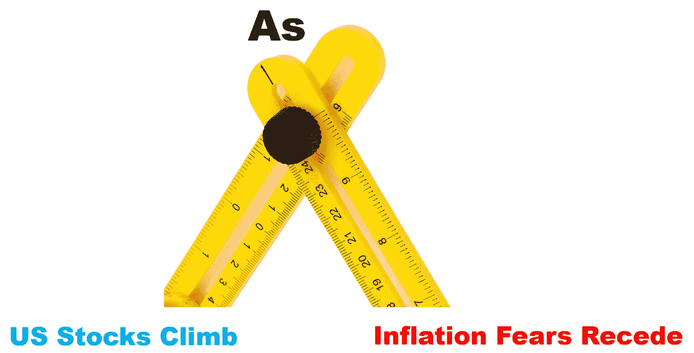
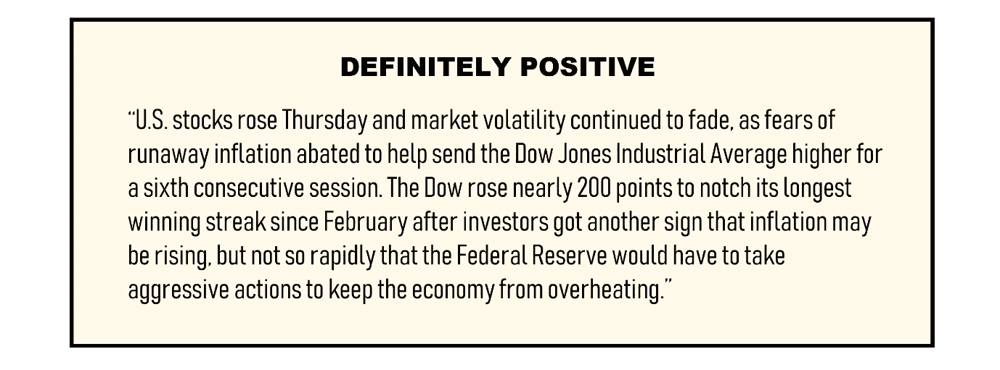
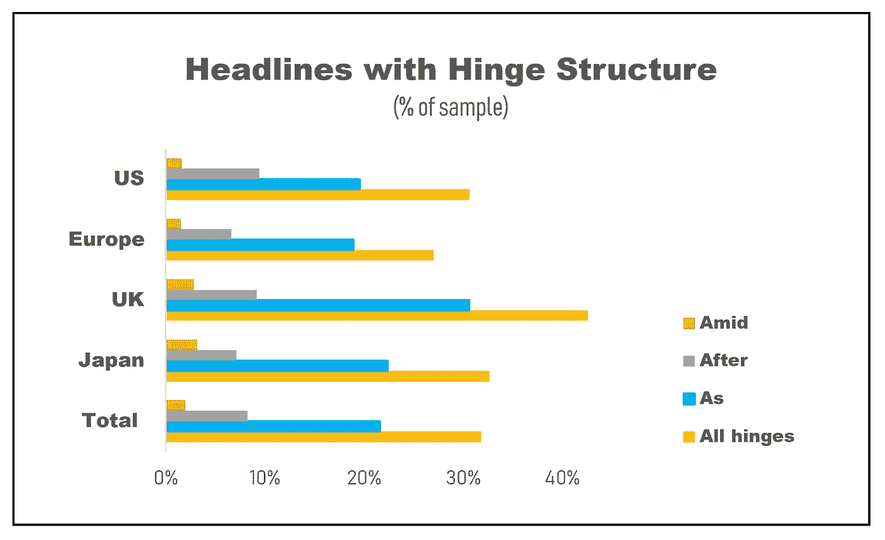
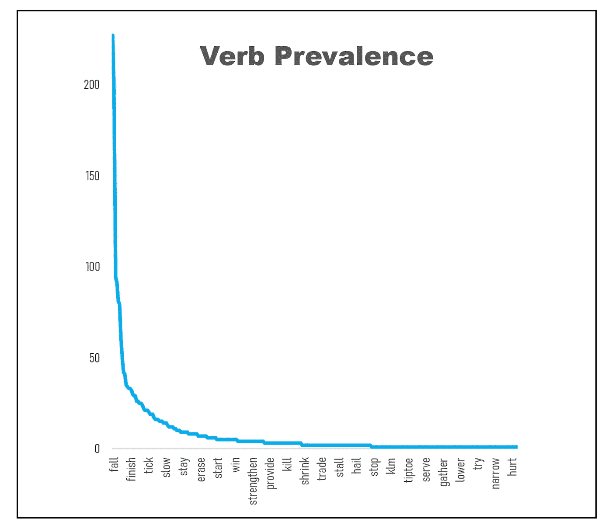
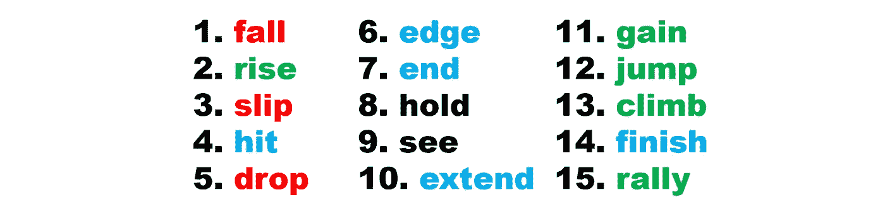
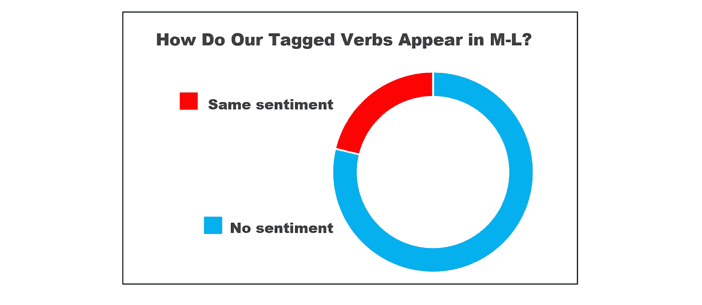

# 给财经新闻贴上情感标签的新方法

> 原文：<https://towardsdatascience.com/a-new-way-to-sentiment-tag-financial-news-9ac7681836a7?source=collection_archive---------11----------------------->

## 30%的财经标题符合特定的模式。

Source: Pexels

在过去的几年里，财经新闻情感分析作为一种商业自然语言处理(NLP)应用已经起飞。

像任何其他类型的情感分析一样，有两种主要的方法:一种，更传统的方法，是使用带有情感标签的单词表(我们也称之为字典)。另一种是使用基于语言模型的情感分类器，这些语言模型是在大型语料库(如亚马逊产品评论或 IMDB 电影评论)上训练的。

对于特定领域的情感分析，后面这些语言模型往往表现不佳。不足为奇:医学文章读起来一点也不像影评。在这方面，迁移学习是一个有趣的成长领域。然而，目前词典仍然是许多特定领域情感分析应用的核心。

在金融领域，那些试图利用开源资源的人可能会以[圣母大学的 McDonald- Loughran](https://sraf.nd.edu/textual-analysis/) (M-L)单词表而告终，这些单词表是通过分析 1994 年至 2008 年期间的五万多份收益报告而创建的[1]。这本字典已经被谷歌、富达、Citadel、道琼斯和标准普尔全球等公司使用过。

## **那还有什么问题呢？**

任何抽样标记词表的明显缺陷是，它很小，无法捕捉一种语言的全部丰富性，无论该领域多么具体。然而，更糟糕的是，即使在一个特定的领域内，单词也可以根据子领域的上下文呈现出非常不同的含义。

例如，在金融写作中，从**金融报道**转移到**金融市场分析**就足够了，事情开始分崩离析:

所以我们知道使用 M-L 单词表会遗漏重要的信息。(我们会看到再往下一点有多少。)

我们还知道，深度学习语言模型(如[微软的 Azure](https://azure.microsoft.com/en-us/services/cognitive-services/text-analytics/) 和[艾伦 NLP](https://demo.allennlp.org/sentiment-analysis) 的情感标签)提供了有限的额外洞察力，因为它们通常是在完全不同的语料库上训练的(艾伦 NLP 演示是在[斯坦福电影评论数据集](https://nlp.stanford.edu/sentiment/treebank.html)上训练的)。所以，[至少在某种程度上是](https://blogs.msdn.microsoft.com/mlserver/2017/04/14/get-sentiment-with-a-pre-trained-model/)，微软 Azure 的文本分析工具)。

最后，为每个子领域的应用支付数据标签是不可持续的。

有什么好做的？

好吧，关于特定领域的事情是他们不仅仅有专门的词汇；他们有写作结构惯例。我说的结构是指带有嵌入式语义的句法选择。

这篇文章着眼于谈论金融市场的一种特殊方式。它展示了利用这种结构如何让您以很少的工作获得大量有用的信息。

**本文其余部分如下:**
1。考察一个特定的金融市场写作惯例，以及它如何有助于情感标签。
2。将这些见解应用到几千个新闻标题的样本中，并探索由此产生的数据。
3。当处理 NLP 问题时，检查这个分析告诉我们关于领域专门知识的什么。

## **1。编写拯救公约**

在金融写作中，人们必须非常小心因果关系。对于单个公司来说，比如说，一份糟糕的收益报告之后，股票绝对会下跌。然而，你很少会想说整个市场都是因为某个事件而移动的，尽管你仍然想暗示那个事件的影响。

所以你用“as”:随着通胀担忧消退，美国股市攀升。

在英语中，as 有多种用法。但在金融标题中，字数很少，“as”几乎只用于一种特定的方式:表示事件 A 发生了，而事件 B 也在发生，并且 B 至少部分是事件 A 发生的原因。

因此，这个词充当了一个枢纽:

扮演这一特殊角色的不仅仅是“As”。为了暗示明显的影响，你用 after 说得含蓄一点，你可以用“在”。

在情感标注方面，这里的关键点是‘as’将句子分成两部分，这两部分**拥有相同的情感**。

明确地说，这两个事件可能同时发生；这不是物理。但是*不会发生，永远不会发生，*是为了用‘as’来描述这种共现，因为选择这种铰链结构的隐含语义:负面事件可以和正面事件在同一天发生，但*不会，因为*正面事件发生了。

因此，如果我们正确地理解了悬挂在“作为”铰链上的一部分的情感，我们也就理解了另一部分的情感。这已经为我们提供了大量描述最近事件的短句的自动情感标签，但它变得更好:

因为介绍性段落通常扩展了新闻故事的主要观点，通过标记悬挂在铰链上的一部分的情感，你已经自动标记了整个段落的情感。

Paragraph tagging by Allen NLP: Negative. By Microsoft Azure: Neutral

## **动词掌握着关键**

由于‘as’和‘amid’的使用方式，主要事件是句子的第一部分；影响事件完成了它的另一半。这种书写约定不适合交换这两个部分:

但金融市场的美妙之处在于，它们只会上升或下降。这意味着你可以通过动词简化情感标签。

这里我们需要稍微谨慎一点。在上面的例子中，攀爬并不是一个绝对积极的发展。当股票上涨时，它是积极的；如果通胀担忧加剧，这将是一个负面消息。

这与[框架语义学](https://en.wikipedia.org/wiki/Frame_semantics_(linguistics))的概念有关:如果没有人们购买某种东西希望它升值的概念，你就无法理解股市中动词“攀升”的概念。

现在，一般来说，市场上涨是积极的，但也有特定的情况并非如此，例如，债券:当债券*收益率*上升时，债券*价格*下降。

为了解决这个问题，我们可以建立一个基于规则的系统，在特定情况下*反转*标记。因此，默认情况下，我们会将第一部分带有“爬升”的新闻故事标记为正面，除非句子的主语是一个与标记相反的例外。

这是个骗局，但谁在乎呢？考虑到标记可能非常昂贵，即使对于迁移学习，您仍然需要一个特定领域的标记样本数据库，以如此少的额外工作获得一个数据库是一个相当不错的结果。

因此，仅仅通过利用这一写作惯例，我们已经命名了两个显而易见的好处:一，标题的大规模情感标签，二，整个段落的有意义标签，潜在地帮助深度学习方法。让我们用一些真实的数据来探究它们的范围。

## **2。数据探索**

出于这项研究的目的，我收集了去年发表的几千条财经新闻标题的样本。这些讨论金融事件和股票、货币和商品市场的一般市场运动，不包括有关特定公司的新闻。

我根据新闻讨论的地理市场对数据进行了分类。总的来说，人们会期望这些之间有一定程度的差异；毕竟，不同的作家群体应该有略微不同的写作模式。

然而，为了支持写作惯例在起作用的论点，请注意差异并没有*那么*显著。在整个市场中，大约 30%的标题遵循这种铰链结构，从而提供可提取的信息。

当然，要真正提取所说的信息，需要解析标题的两个部分，特别是——识别铰链左边的动词。为此，我使用了 SpaCy 标准解析器。总的来说，这种方法很有效，因为标题的左右部分都是简单结构的句子。结果，我们最终确定了大约 300 个动词的列表。

它们在样本中的流行程度符合指数分布，所以有限数量的动词被大量使用*，并且有一条长尾巴的动词只被使用一两次。*

*注意不是所有的动词都带有感情色彩。有时候，新闻故事本身是中性的。但通常情况下，这是因为动词实际上是动词复合词的一部分，由一个动词和一个上升/下降介词组成:市场上涨**上涨**，道琼斯指数下跌**结束**。将情感标记扩展到包括这样的实例并不困难。*

*最常用的 15 个动词是:*

**

*有趣的观察——在列表的下方，我们发现动词“feed”看起来很奇怪。你能猜到它为什么会出现吗？(提示:过往事件的新闻报道)。思考如何批量修复这个解析问题是一个很好的练习。*

*最后，我们现在可以评估 M-L 字典的缺失程度了。局限于出现在不止一个标题中的表达情感的动词，我们可以看看这些是否出现在字典中，如果出现，它们是否表达相似的情感。*

*在我们的示例中，有 45 个这样的词汇化动词，它们对应于 80 个不同的动词的原始形式。从好的方面来看，所有带情感标签的动词都在字典里。此外，也没有字典颠倒我们情感标签的例子(当我们把某件事贴上负面标签时，说它是正面的，反之亦然)。*

*另一方面，大多数动词都没有情感标签。*

**

*特别是，当查看我们的前 15 个列表中携带情感的词汇化动词时(回想一下，由于指数分布，这些动词覆盖了大多数标题)，只有一个词“增益”被 M-L 字典标记为情感。*

*它在财务报表的上下文中是有意义的，M-L 标记是基于财务报表的。如上所述，例如，动词‘climb’不是一个绝对肯定的词；在财务报表中，如果制造成本上升，这将是一个负面消息。*

*所有这些似乎表明，当对以这种铰链结构撰写的财经新闻标题进行情感标注时，依赖 M-L 词典将会错过许多重要信息。鉴于如此多的新闻故事遵循这种结构，这是一个相当大的损失。*

## ***3。这告诉我们什么是领域专业知识***

*这是一个诱人的信念，如果你能让你的算法足够好，*足够聪明，*足够聪明，它将能够破解一个 NLP 任务，而不考虑领域。*

*谁知道呢？有一天，这可能就是事实。*

*但是现在，它不是。*

*因此，上面的讨论在提问时是有用的:**领域专长实际上增加了什么价值？***

*通常，领域专业知识在词汇层面上被认为是有用的。例如，前面我们已经看到了动词“温和”，在市场语境中，人们在试图避免惊吓投资者时将其用作“下跌”的同义词。*

*更广泛地说，词汇领域专业知识意味着应用外部知识来确定一些术语比其他术语更重要，或者单词具有特定的含义。*

*这就是说社会语言的一部分，社会语言是一种表明属于特定社会群体的子语言。但是专业词汇(包括行话)只是一个层面，表达思想的模式也是社会的一部分。想想律师吧，他们看起来会说英语，但却是用这些死板、复杂的句子结构来说的。*

*扎实的领域专业知识允许您识别这些模式，并利用它们来提取信息。*

*在本文中，我们将这一原则应用于金融市场子领域。因此，我们能够改进现有的情感分析工具，并生成可扩展的自动情感标签。*

*这是通过使用相当老式的单词列表和粗鄙的标记(一小组动词)的方法来完成的，同时加入了一些规则。然而，它表明这项工作如何能够支持更高级的深度学习技术。*

*就我个人而言，我觉得仅仅由于书写习惯，我们就能从这个微小的语法单元中获得如此多的语义价值，这很令人高兴。*

*不是吗？*

***来源:**
1。Loughran，t .和 McDonald，B. (2011) [什么时候是责任而不是责任文本分析、词典和 10-k](https://www.uts.edu.au/sites/default/files/ADG_Cons2015_Loughran%20McDonald%20JE%202011.pdf)。金融杂志，66 年，35-65 页。*