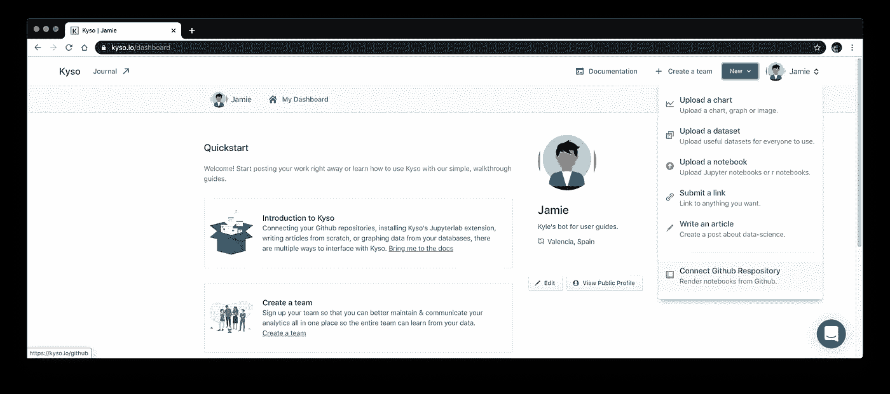
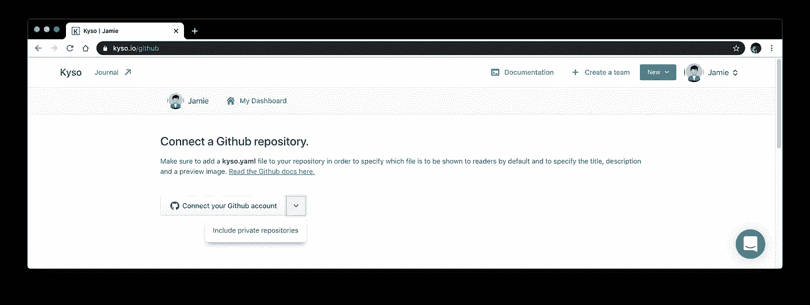

# Jupyter 笔记本共享和协作的新方式

> 原文：<https://towardsdatascience.com/a-new-way-to-share-collaborate-on-jupyter-notebooks-483f8f0c46ef?source=collection_archive---------23----------------------->

## *将 Github 与 Kyso 集成，增强您交流数据的方式&分析。*

共享和复制数据科学仍然不容易。大多数公司仍然没有一个知识管理的中心。内部数据团队使用 Github 等工具进行项目管理，通常只有数据科学家和工程师才能访问。这意味着他们的工作不与公司的非技术人员分享。他们使用数据科学笔记本这样的技术文档进行数据探索和分析，但是代码的存在、终端输出等。意味着它们不是非技术受众的最佳沟通工具。所有这些都导致了很多锁定的商业价值，因为不是公司中的每个人都从产生的见解中学习。

Kyso 通过我们的 Github 集成和一个优雅的博客平台解决了这个问题，该平台用于呈现数据科学笔记本，使每个人都可以访问以前只有少数人拥有的信息。Kyso 通过将笔记本呈现为网络文章，让技术团队以更易读的格式发布和分享他们的分析。把它想象成你的团队自己的内部[媒介](http://medium.com/)，但是对于数据科学——你可以发布 Jupyter & R 笔记本。默认情况下，任何代码都是隐藏的，并且可以切换，以便技术和非技术受众都能理解您的帖子。你也可以使用我们的应用内 Markdown 编辑器从头开始写文章。

我们创建了 Kyso 来优化内部数据团队和其他科学计算从业者的计算到交流工作流，从他们工作的探索阶段到结果的交流。在这篇文章中，我将介绍如何为您的个人和专业项目做到这一点。

# 工作流程

## 入门指南

如果你还没有账户，去 [Kyso](https://kyso.io/) 注册——这是一个免费的个人账户！如果你愿意，你可以注册你的 Github 帐户，它会自动同步到 Kyso。

然后，在您的仪表板上，导航到我们的 *Github* 页面。

Navigating to your Github repositories on Kyso

## 批准

如果你在 Github 上注册了 Kyso，你会自动连接上，你会在这个页面上看到你所有的公共库。如果没有，只需点击*连接 Github 账号*按钮即可。使用右边的下拉菜单，您可以选择授权您所有的 Github 库，或者只授权您的公共库(默认)。鉴于 Github 的 OAuth 授权方式，目前不可能只授权一个库。

Authorising your Github repositories on Kyso

在 Github OAuth 页面上，您可以选择授权您自己的帐户和您可能加入的任何组织。您可以搜索和过滤您的存储库，并通过单击*连接到 Kyso* 将它们导入到 Kyso。然后，您可以在 Kyso 仪表板上浏览这些帖子。

请记住，虽然 Kyso 上的帖子可能看起来像一个单独的渲染笔记本，但事实上，它是一个完整的 Github 存储库(或 Github 存储库的子目录)的反映，这意味着您可以在 Kyso 上浏览所有附件。如果你的库包含许多不同的文件夹，在 Kyso 上以不同的文章呈现会更好，这也是可能的。

查看我们的[文档](https://docs.kyso.io/connect-a-github-repo-to-kyso)，看看配置是如何工作的。

# 结论

现在你知道了！您可以继续在现有的工作流程中操作，使用 Jupyter 笔记本进行数据探索、机器学习等。，将您的提交推送到 Github，这样您的项目的历史就会得到维护。所有提交都将以可读格式自动反映在 Kyso 姐妹帖子上。

关于 Kyso 的 Github 集成如何与您的笔记本配合工作的示例，请查看这个 Github 知识库，了解各种[数据分析项目](https://github.com/KyleOS/Data-Analysis)。你会看到很多子目录，我已经在 Kyso 上设置了单独的帖子。查看我们的[文档](https://docs.kyso.io/connect-a-github-repo-to-kyso)了解我们的配置指南。

最后，去[我的简介](https://kyso.io/KyleOS)看看这些帖子是如何漂亮地呈现出来的。Kyso 的 Github 集成也可以用于内部私人知识共享，使用 Kyso 在您的团队中展示和协作您的分析。所有团队成员将能够消费、搜索&并以博客风格对发布的内容进行评论来提供反馈。

Jupyter 笔记本和类似的工具正在成为新的 Excel。为了获得这种现象的全部好处，这些文档中的知识需要在整个组织中有效地交流，这样每个人(我是说每个人)都可以学习&将数据洞察应用到各自的角色中，以推动业务价值。在 Kyso，我们希望帮助您做到这一点。