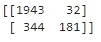
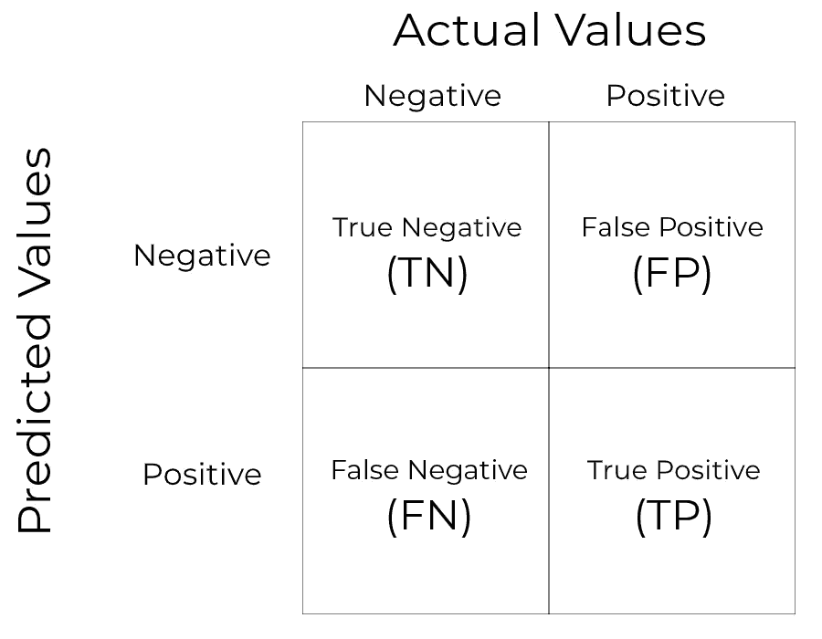
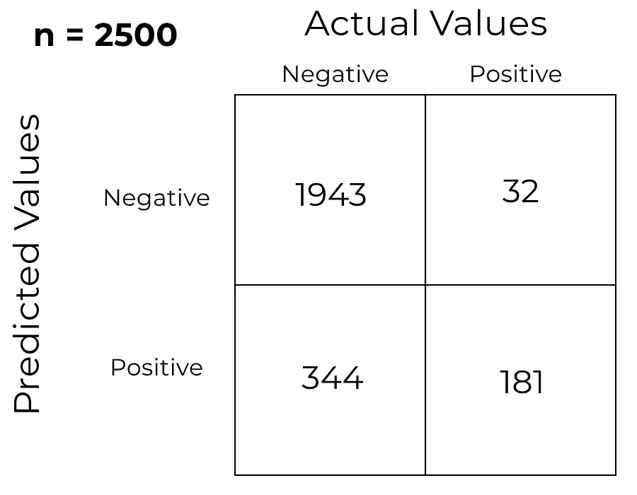
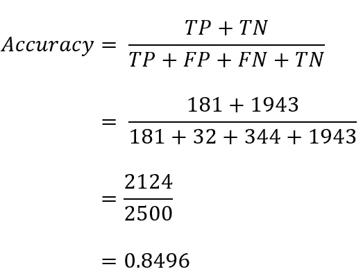
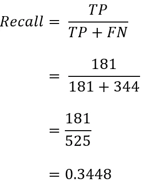
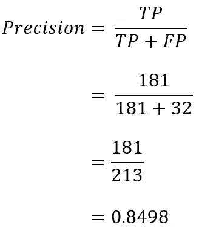
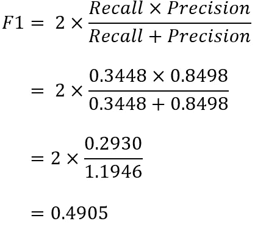

# 混淆矩阵的非混淆指南

> 原文：<https://towardsdatascience.com/a-non-confusing-guide-to-confusion-matrix-7071d2c2204f?source=collection_archive---------7----------------------->

你在炒作机器学习。你不太懂统计学，但你知道均值是什么。你决定跳过所有先决条件，训练你的第一个机器学习模型。你跟随了 YouTube 上某个印度人的代码视频教程。在花了 10 个小时意识到你错过了 IF 语句的缩进之后，你的模型终于被训练好了。

你已经获得了超过 90%的准确率。生活是美好的。


Photo by [Markus Spiske](https://unsplash.com/@markusspiske?utm_source=medium&utm_medium=referral) on [Unsplash](https://unsplash.com?utm_source=medium&utm_medium=referral)

但我要告诉你，你的模型很可能很烂。这是意料之中的，见鬼，**太好了**！

玩笑归玩笑，当你是数据科学和机器学习的新手时，模型评估可能会很困难。困惑矩阵是让你困惑的东西，这是意料之中的。你不会相信你能从愚蠢简单的 2x2 矩阵中得到多少东西。

以下是模型训练后获得的混淆矩阵示例:



好吃吗？很糟糕吗？答案是你最喜欢的——**看情况** ( *结果很糟糕*)。

# 提取混淆矩阵

这里有一个看起来更普通的混淆矩阵:



是的，我知道你在想什么— *干得好，笨蛋，现在我更糊涂了！但是不要着急，让我们把它分成更小的、更容易理解的部分。*

## 实际值

*   数据集的值(目标变量的值)

## 预测值

*   模型预测的值

## 积极的

*   目标变量中的值
*   如果预测疾病，这将是*‘有疾病’*
*   二进制目标变量中的 1

## 否定的；消极的；负面的；负的

*   目标变量中的值
*   如果预测疾病，这将是*‘没有疾病’*
*   二进制目标变量中的 0

好吧，这很容易理解，但是那些真正的肯定和否定是什么意思呢？

好问题读者。我在想你什么时候会问这个问题。对这些的解释对你来说很容易读懂。但是它们更容易忘记，所以你可能想每隔几天就重读一遍。或者更好的是，把它们写在一张纸上。写下一些东西会更容易坚持。但是我在这里跑题了，我们正在讨论假阳性和真阴性，让我们深入探讨一下。

## 真阳性(TP)

*   你的模型预测为正，实际为正
*   在二项式变量中是 1
*   你预测病人有疾病，而他已经有了

## 假阳性

*   你的模型预测为正，而实际为负
*   模型预测的是 1，但在二项式变量中是 0
*   你预测病人会生病，但他并没有
*   第一类错误

## 假阴性(FN)

*   你的模型预测为负，而实际为正
*   模型预测的是 0，但在二项式变量中是 1
*   你预测病人没有病，但他却得了
*   *第二类错误*

## 真阴性(TN)

*   你的模型预测是负的，而实际是负的
*   模型预测 0，二项式变量是 0
*   你预测病人没有病，他也没有

你看，混淆矩阵没有任何令人困惑的地方。当然，你需要记住这些术语，是的，它们听起来很相似，但至少它们不像你可能遇到的其他机器学习概念那样抽象。

# 与 Scorings 一起生活

在阅读了所有关于积极和消极的东西之后(*几次，最好是*)，你现在对混淆矩阵有了一个基本的想法和直觉，你会发现它并不那么令人困惑——它只是需要适当地“融入”。

***但那都是关于混乱矩阵的吗？***

我希望你是在开玩笑。我们才进行了一半。也许吧。

接下来，我想讨论可以从混淆矩阵中获得的各种得分。而且有很多。根据维基百科[1]，以下是所有这些人的名单:

1.  敏感度/召回率/命中率/真阳性率 **(TPR)**
2.  特异性/选择性/真阴性率 **(TNR)**
3.  精度/阳性预测值 **(PPV)**
4.  阴性预测值 **(NPV)**
5.  漏检率/假阴性率 **(FNR)**
6.  脱落/假阳性率 **(FPR)**
7.  错误发现率 **(FDR)**
8.  假漏检率**(为)**
9.  威胁分数/关键成功指数 **(CSI)**
10.  精度 **(ACC)**
11.  F1 分数
12.  马修斯相关系数 **(MCC)**
13.  知情/庄家知情 **(BM)**
14.  标记性 **(MK)**

By [GIPHY](https://giphy.com/gifs/YVPwi7L2izTJS/html5)

感到困惑？这是意料之中的。我也是。我从未听说过其中的一些术语，但我仍然想把它们放在这里，只是为了证明你可以理解混乱矩阵所提供的一切，而不会发疯。

但是想想你怎么能仅仅从这个看起来很愚蠢的 2x2 矩阵中计算出这么多不同的分数，这真是令人惊讶。我的意思是只有 4 个数字，看在上帝的份上！

对于本文的第二部分，我想深入探讨机器学习领域最常用的评分方法，它们是:

*   准确(性)
*   回忆
*   精确
*   F1 分数

没错，我将只讨论 14 个中的 4 个，因为我觉得这些是最重要的，只要对它们有基本的了解，你就完全有能力优化你的模型。你不需要记住公式，那些已经内置到 Python 的[***Scikit-Learn***](https://scikit-learn.org/stable/)中了，但是你要知道什么时候选择一个而不是另一个。

在开始之前，让我们来看看您将要处理的混淆矩阵:



简而言之，在给定的矩阵中，我们有:

*   真底片 **(TN)** — 1943 年
*   误报 **(FP)** — 32
*   真阳性 **(TP)** — 181
*   假阴性 **(FN)** — 344

您可能已经注意到，这与本文开头的混淆矩阵是一样的，只是表现得更好。事不宜迟，让我们开始吧！

## 准确度分数

*   最直观的理解——正确预测的观察值与总观察值的比率
*   不太适合大多数业务需求
*   计算很简单:所有真实实例除以实例总数
*   **(TP+TN) / (TP+FP+FN+TN)**



Python 中的实现:

```
**from** **sklearn.metrics** **import** accuracy_scoreprint(accuracy_score(y_true, y_pred))
>>> 0.8496
```

## 回忆分数

*   模型在数据集中查找所有相关案例的能力
*   对于我们的例子，这将是模型的能力，找到所有的情况下，病人有疾病
*   计算很简单:用真阳性(TP)除以真阳性(TP)和假阴性(FN)之和
*   **TP / (TP + FN)**



Python 实现:

```
**from** **sklearn.metrics** **import** recall_scoreprint(recall_score(y_true, y_pred))
>>> 0.3448
```

## 精确分数

*   模型仅识别相关数据点的能力
*   对于我们的例子，这将是模型的能力，正确分类的病人没有疾病
*   计算:用真阳性(TP)除以真阳性(TP)和假阳性(FP)之和
*   **TP / (TP + FP)**



Python 中的实现:

```
**from** **sklearn.metrics** **import** precision_scoreprint(precision_score(y_true, y_pred))
>>> 0.8498
```

## F1 分数

*   精确度和召回率的加权平均值。
*   同时考虑误报和漏报
*   您的误报率(FP)和漏报率(FN)都很低，能够正确识别真正的威胁，并且不会受到误报的干扰
*   该计算需要先前计算的召回率和精确度
*   **2*(召回*精度)/(召回+精度)**



Python 中的实现:

```
**from** **sklearn.metrics** **import** f1_scoreprint(f1_score(y_true, y_pred))
>>> 0.4905
```

这些解释应该给你一个清晰的画面，使用准确性作为评分标准并不总是一个好的选择。在我们关于患者和疾病的例子中，使用回忆会更好，因为**你可能想要正确地识别每个患有疾病的患者**——试想一下，在癌症检测中有大量的错误分类会有多可怕。

这些材料足够你忙上一段时间了。当这对你来说变得容易时，请参考维基百科文章(文章底部张贴的*)来学习更多的评分。*

# 临终遗言

我的意图是以一种不混乱的方式分解这个看起来愚蠢简单的矩阵，因为当你第一次遇到它时，它会变得非常混乱。

我当然没有说关于这个话题的所有内容，但是每一个关键的想法和概念都在这里，等着被学习。很容易忘记这些东西，试图在一天之内学会它们只会让这些术语更加混淆。**缓慢而稳定的人赢得比赛。**

是的，大多数术语的叫法相似，你会被它弄糊涂——这是完全正常的。不时回顾一下你想要的文章中的材料。

By [GIPHY](https://giphy.com/gifs/KctrWMQ7u9D2du0YmD/html5)

***你有什么想法？看了几遍还有什么不明白的吗？欢迎在下面发表评论。***

*喜欢这篇文章吗？成为* [*中等会员*](https://medium.com/@radecicdario/membership) *继续无限制学习。如果你使用下面的链接，我会收到你的一部分会员费，不需要你额外付费。*

[](https://medium.com/@radecicdario/membership) [## 通过我的推荐链接加入 Medium-Dario rade ci

### 作为一个媒体会员，你的会员费的一部分会给你阅读的作家，你可以完全接触到每一个故事…

medium.com](https://medium.com/@radecicdario/membership) 

# 资源

[1][https://en.wikipedia.org/wiki/Confusion_matrix](https://en.wikipedia.org/wiki/Confusion_matrix)