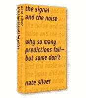
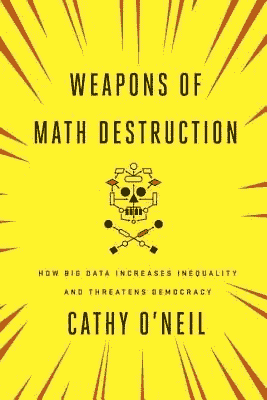
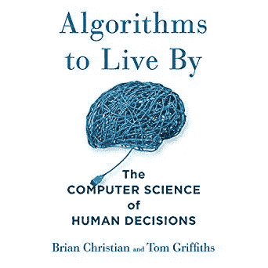
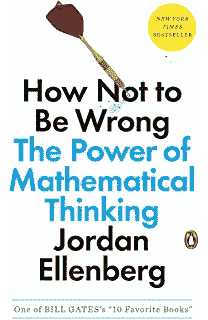
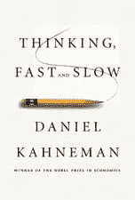
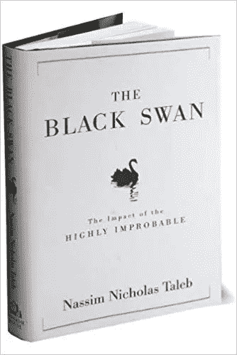

# 数据科学的非技术性阅读清单

> 原文：<https://towardsdatascience.com/a-non-technical-reading-list-for-data-science-d72451429a70?source=collection_archive---------2----------------------->

[(Source)](https://www.pexels.com/photo/top-view-photo-of-boat-near-airplane-1575833/)

## 无需钻研技术细节就能让你成为更好的数据科学家的书籍

与一些数据科学家可能愿意相信的相反，我们永远无法将世界简化为单纯的数字和算法。归根结底，决策是由人类做出的，而成为一名高效的数据科学家意味着既了解*人*又了解数据。

考虑以下现实生活中的例子:

[当软件公司 OPower 想要让人们使用更少的能源](https://news.nationalgeographic.com/news/2010/07/100715-energy-smart-meter-competition/)时，他们向客户提供了大量关于他们用电量和成本的统计数据。然而，数据本身不足以让人们改变。此外，OPower 需要利用行为科学，即[研究表明，当人们在账单上收到笑脸表情符号](https://sparq.stanford.edu/solutions/emoticons-reduce-energy-use)时，他们会减少能源消耗，这些表情符号显示了他们与邻居的对比！

把一个简单的干预😃当人们比他们的邻居用的少的时候，他们的电费账单😦当他们可以做得更好时，最终减少了 2-3%的电力消耗，在此过程中节省了数百万美元，并防止了数百万磅二氧化碳的排放🏆！对于数据科学家来说，这可能是一个震惊——你的意思是人们不会对纯数据做出反应！——但这对于 OPower 的首席科学官罗伯特·恰尔迪尼来说并不奇怪，他曾是心理学教授，写过一本关于人类行为的书。要点是，你可以拥有任何你想要的数据，但你仍然需要了解人类如何实现真正的改变。

The most effective visualization isn’t a bar chart, it’s a smiley face.

在我们作为数据科学家的日常工作和正规教育中，很难瞥见人类的工作方式，或者后退一步思考我们工作的社会影响。因此，重要的是不仅要阅读[技术文章](http://arxiv.org)和[教科书](http://shop.oreilly.com/product/0636920052289.do)，还要扩展到研究人们如何做出选择以及如何利用数据来改善这些选择的著作。

在本文中，我将重点介绍 6 本非技术性的书籍，因为它们不涉及数学和算法，但却是数据科学家的重要读物。这些书对于任何想要实现数据科学目标的人都是必要的:通过数据实现更好的现实世界决策。

这里列出了 6 本书，并附有简要评论和要点:

1.  ***信号和噪音:为什么如此多的预测失败——但有些却没有*** 内特·西尔弗
2.  ***数学毁灭的武器:大数据如何增加不平等并威胁民主*** 作者凯茜·奥尼尔
3.  Brian Christian 和 Tom Griffiths 的《人类决策的计算机科学》和 Jordan Ellenberg 的《如何不犯错:数学思维的力量》
4.  ***思考，快与慢*** 丹尼尔·卡内曼
5.  **(黑马)*《黑天鹅:可能性极小的冲击》*作者**纳西姆·尼古拉斯·塔勒布

## 要点和评论

1.  [***信号和噪声:为什么这么多预测失败——但有些却没有***](https://www.penguinrandomhouse.com/books/305826/the-signal-and-the-noise-by-nate-silver/9780143125082/) **作者内特·西尔弗**

对未来的预测——在选举、经济、国家政治和技术进步等领域— [经常是错误的，令人捧腹。当这些预测具有真实的现实世界的后果时，它们就不那么幽默了，在这部作品中，西尔弗解释了为什么人们往往不擅长做出预测，并研究了少数几个在不同领域成功打破趋势的人。事实证明，预测未来并不存在一个神奇的规则，只是伟大的预测家们实践的一些基本规则。](https://www.inc.com/jessica-stillman/12-hilariously-wrong-tech-predictions.html)

任何人都可以从整本书提供的简单建议中受益:

*   像狐狸一样思考(不是刺猬):有很多小点子(狐狸)，而不是一个大点子(刺猬)。如果你只有一个想法，你会倾向于寻找确定的证据，忽略任何与你的观点相矛盾的东西(T2 确认偏差)。如果你有很多小想法，你会更关心什么是正确的，而不是什么支持你当前的信念，当证据不再支持它们时，你可以放弃任何想法。这两种不同的思维方式也解释了为什么对自己的预测更有信心的人(比如电视专家)往往更多时候是错的。
*   **进行大量预测并获得快速反馈:**我们更擅长对频繁发生的事件进行估计，这主要是因为反馈和改进周期。天气预报每天都出错，这些信息进入模型，使明天的预报变得更好(这也是为什么天气预报在过去几十年里有了很大改进的一个原因)。在我们很少经历的情况下，我们最不擅长做出选择，在这些情况下，使用尽可能多的数据是关键
*   尽可能多的利用不同的来源:每个数据提供者都有自己的偏见，但是通过汇总不同的估计值，你可以找出错误的平均值 Silver 的 [FiveThirtyEight](https://fivethirtyeight.com) 网站很好的说明了这一点。这种群体智慧的方法意味着使用与你的观点不一致的资源，而不是仅仅依靠某个领域的“专家”。
*   **永远包含不确定性区间，当证据发生变化时，不要害怕更新你的观点:**人们在预测时犯的最大错误是提供一个数字。虽然一个答案可能是公众想要听到的，但世界从来不是严格的黑或白，而是存在于灰色阴影中，我们有责任在我们的预测中表现出来。表达不确定性可能看起来很懦弱——说希拉里有 70%的胜算意味着无论结果如何，你都是对的——但这比一个简单的是/否更现实。此外，人们认为改变自己的观点是一种弱点，但当事实发生变化时，更新你的信念实际上是一种重要的力量，在数据科学和形成世界观方面。

> 我们对世界的预测永远不可能完全正确，但这不应该阻止我们依靠经过充分证明的原则来做出更好的预测，从而减少错误。

这一类别的另外两本书是菲利普·泰特洛克的《超级预测》 和《专家政治判断》*。*

***2。** [***数学毁灭的武器:大数据如何增加不平等并威胁民主***](https://weaponsofmathdestructionbook.com/) **作者凯茜·奥尼尔***

**

*数学毁灭武器应该成为攻读统计学、机器学习或数据科学学位的学生以及任何必须做出部署模型决定的人的必读书目。“破坏数学的武器”是任何不透明的算法——不容易解释；影响数百万甚至数十亿人，并有可能造成严重损害，如破坏民主选举或使我们的大批人口被监禁。*

*核心前提是，这些破坏数学的武器有能力创造传播不平等的反馈循环，因为我们看不到这些算法的内部，我们不知道如何纠正它们。只有在我们回顾并观察到巨大的破坏——如 2016 年大选或 2008 年金融危机(都是由为负面目的服务的算法造成的)——我们对这些模型的盲目信任可能造成的伤害之后。*

*此外，我们的模型只和输入的数据一样好，当数据有偏差时，模型的预测也会一样好。考虑一个对罪犯判刑的模型，这个模型考虑到了一个人第一次与执法机关打交道的时间。由于[不公正的治安策略，如拦截和搜身](https://features.propublica.org/walking-while-black/jacksonville-pedestrian-violations-racial-profiling/)，即使考虑到其他因素，一个黑人很可能在比白人年轻得多的时候就与警察发生口角。这将导致模型建议延长黑人的刑期，在此期间，这些人将失去经济机会，并被社会排斥。这些人更有可能再次犯罪，导致监禁的恶性循环，这一切都是因为不公正的政策产生的数据，然后被送入[黑匣子](https://www.technologyreview.com/s/604087/the-dark-secret-at-the-heart-of-ai/)。*

*奥尼尔的书于 2016 年初发行，现在比以往任何时候都更需要它。2016 年底，俄罗斯演员利用脸书的算法进行宣传，对美国的民主进程造成了严重破坏。这些行动远非学术活动，而是产生了现实世界的后果，引发了对美国选举合法性的质疑。极右翼广告继续困扰着脸书，这是由一种算法驱动的，这种算法(最有可能的是，我们真的不知道)认为参与是重中之重。*

*算法只会在我们的日常生活中发挥更大的作用。我们在哪里上学，我们读什么，我们是否被批准贷款，我们是否找到工作，我们买什么都在很大程度上由算法决定，我们无法控制，也无法查询解释。奥尼尔的书似乎对机器学习模型持悲观态度，但我更愿意认为这是一种必要的批评:围绕机器学习有这么多肆无忌惮的热情，我们需要人们愿意退一步问:这些工具真的改善了人们的生活吗？作为一个社会，我们应该如何采用它们？*

*机器学习算法只是工具，和任何工具一样，它们可以用于好的方面，也可以用于坏的方面。幸运的是，我们仍处于早期阶段，这意味着我们可以塑造模型的使用，以确保它们朝着做出客观决策和为尽可能多的人创造最佳结果的方向努力。我们现在在这方面做出的选择将塑造未来几十年数据科学的未来，最好在充分知情的情况下参与这些辩论。*

> *数据科学可能是一个年轻的领域，但已经对数百万个人的生活产生了巨大的影响，无论是好的还是坏的。作为这个新领域的先驱，我们这些现在工作的人有义务确保我们的算法不会变成数学毁灭的武器。*

***3。(Tie)** [***算法赖以生存:人类决策的计算机科学***](http://algorithmstoliveby.com/) **布莱恩·克里斯蒂安和汤姆·格里菲斯著** [***如何不出错:数学思维的力量***](https://www.penguinrandomhouse.com/books/312349/how-not-to-be-wrong-by-jordan-ellenberg/9780143127536/) **乔丹·埃伦伯格著***

****

*在学校教授计算机科学和统计学(以及其他研究领域)时，它们都有一个问题:抽象的内容令人生厌。只有当它们应用于现实世界的问题时，它们才会变得足够有趣，让我们想去理解。这两本书都做了一项令人难以置信的工作，将枯燥的主题转化为娱乐性和知识性的叙事，讲述如何在我们的日常生活中使用算法、统计数据和数学。*

*例如，在《T21 生活的算法》一书中，作者展示了我们如何使用探索与利用权衡和最优停止的思想来找出我们应该花多长时间寻找配偶(或新员工，晚餐的餐馆等)。).同样，我们可以使用排序算法来最有效地组织我们的物品，以便快速检索您需要的东西。你认为你知道这些想法，你甚至可以用代码写出来，但是你可能从来没有应用它们来优化你的生活。*

**如何不犯错*的主要思想与艾伦伯格带领我们通过故事展示线性回归、推理、贝叶斯推理和概率等统计概念的使用和误用类似。应用概率定律告诉我们，玩彩票永远是一个失败的命题——除非在极少数情况下，回报实际上是正的(正如麻省理工学院的一群学生发现的[)。艾伦伯格并不回避向我们展示方程式，但他将它们应用于现实世界的情况。](https://www.maa.org/meetings/calendar-events/how-to-get-rich-playing-the-lottery)*

*艾伦伯格书中的中心引语是，数学思维是“常识通过其他方式的延伸”在许多情况下，主要是在遥远的过去，我们的直觉很好地服务于我们，但是，现在在现代世界，有许多情况下我们最初的反应是完全错误的(见下一本书)。在这种情况下，我们不需要依靠直觉，而是可以使用概率和统计数据，以达到最佳决策。*

*这两本书的严谨程度恰到好处——混合了几个等式和大量的故事——读起来都很有趣。在这些书中，我发现了大量我在课堂上从未完全掌握的数据科学概念，最终我一次又一次地体验到了“啊哈”时刻的喜悦。*数学、统计学和计算机科学只有在能让你的生活变得更好的程度上才有用，这两本书都展示了你从未停下来思考过的这些学科的所有用途。**

***4。** [***思考，快与慢***](https://us.macmillan.com/books/9780374533557) **丹尼尔·卡内曼***

**

*如果你还没有意识到这一点，那么这里有一个有用的教训:人类是非理性的，我们经常在生活的各个方面做出可怕的决定。然而，我们有理由抱有希望:一旦我们理解了为什么我们没有采取最佳行动，我们就可以开始改变我们的行为以获得更好的结果。这是卡尼曼记录几十年实验发现的杰作的核心前提。*

*卡尼曼(2002 年诺贝尔经济学奖得主)和他的研究伙伴阿莫斯·特沃斯基(以及理查德·塞勒等其他人)创建了极具影响力的[行为经济学领域](https://en.wikipedia.org/wiki/Behavioral_economics)，该领域将人们*视为非理性的决策者*，而不是理性的效用最大化者。这不仅在经济领域，而且在医药、体育、商业实践、节能和退休基金等生活领域，都带来了思维和设计选择的真正转变。我们还可以将许多发现应用于数据科学，例如如何呈现研究结果。*

*在这部严谨而又非常令人愉快的作品中，卡尼曼概述了我们不按逻辑行事的所有方式，包括[锚定、可用性和替代试探法(经验法则)](https://en.wikipedia.org/wiki/Thinking,_Fast_and_Slow#Heuristics_and_biases)或我们倾向于[规避损失](https://www.scientificamerican.com/article/what-is-loss-aversion/)以及成为沉没成本谬误的牺牲品。他还概述了可能是最重要的一点:我们有两种不同的思想体系。*

*   ***系统 1 快速而直观:**这种模式是进化设计出来的，可以在不考虑证据的情况下快速做出决策。虽然这在我们狩猎采集的过去对我们很有帮助，但在我们信息丰富的世界里，当我们没有时间查看数据时，它经常会给我们带来麻烦。*
*   ***系统 2 缓慢而理性:**我们需要在有很多选项和不同证据来源需要考虑的情况下使用这种模式。采用系统 2 需要付出努力，但这种努力会得到更好的决策和结果。*

*使用系统 1 是自然的，我们必须克服数百万年的进化才能使用系统 2。尽管这很难，但在我们这个数据丰富的世界里，我们需要花时间磨练我们的系统 2 思维。当然，我们有时可能会遇到过度思考的问题，但是思考不足——使用系统 1 而不是系统 2——是一个更严重的问题。*

> *这本书对于理解人们如何做决定以及我们作为数据科学家可以做些什么来帮助人们做出更好的选择至关重要。*

*这本书也有适用于数据科学之外的结论，比如[两个自我](https://www.brainpickings.org/2011/10/26/thinking-fast-and-slow-daniel-kahneman/)的概念:体验和记忆。体验自我是我们在一个事件中时时刻刻的感受，但远没有回忆自我重要，回忆自我是我们事后对事件的感知。记忆自我根据峰-端规则对一次经历进行评级，这对于医学、生活满意度和强迫自己做不愉快的任务有着深远的意义。我们记忆事件的时间会比我们经历它们的时间长得多，所以在一次经历中，我们努力最大化记忆自我的未来满足感是至关重要的。*

*如果你想了解实际的人类心理，而不是传统课堂上呈现的理想化版本，那么这本书是最好的起点。*

***5。(黑马):** [***黑天鹅:极不可能的冲击***](http://www.randomhouse.com/highschool/catalog/display.pperl?isbn=9780812973815) **纳西姆·尼古拉斯·塔勒布***

**

*塔勒布在名单上只有一个位置，而且是一个局外人的位置。塔勒布曾是一名量化交易者，他在 2000 年和 2007 年的市场低迷期间赚了很多钱，现在他已经成为一名直言不讳的学者和研究人员，他的作品赢得了全世界的赞誉和批评。首先，塔勒布被一个想法所占据:当代思维方式的失败，尤其是在充满不确定性的时代。在《黑天鹅》中，塔勒布提出了这样一个概念:我们对支配人类活动的随机性视而不见，因此，当事情不如预期时，我们会被摧毁。最初于 2007 年出版的*《黑天鹅*自从 2008 年和 2016 年的意外事件完全颠覆了传统模式以来，变得更加相关。*

*当然，基于这个中心前提，立即出现的问题是:按照定义，不可能发生的事件不会经常发生，所以我们不应该担心它们？关键的一点是，虽然每个不可能发生的事件本身不太可能发生，但综合起来看，几乎可以肯定的是，在你的一生中，甚至在一年内，许多意想不到的事件将会发生。任何一年发生经济崩溃的可能性都是微乎其微的，但是这种可能性越来越大，直到世界某个地方每十年发生一次经济衰退的可能性非常小。*

*我们不仅应该期待改变世界的事件会频繁发生，而且我们不应该听信那些被过去发生的事情所束缚的专家。任何投资股市的人都应该知道，过去的表现不能预测未来的表现，这是我们在数据科学模型(使用过去的数据)中考虑的一个明智的教训。此外，我们的世界不是正态分布，而是厚尾分布，少数极端事件——大衰退——或少数富人——比尔·盖茨——盖过了所有其他人。当极端事件发生时，没有人做好准备，因为它们的规模远远超过以往任何一次。*

*黑天鹅对数据科学家来说很重要，因为它表明，任何只基于过去表现的模型往往都是错误的，会带来灾难性的后果。所有的机器学习模型都是只用过去的数据建立的，这意味着我们不想太相信它们。模型(包括 Taleb 的)是对现实的有缺陷的近似，我们应该确保我们有适当的系统来处理它们不可避免的失败。*

*值得注意的是，[塔勒布不仅因其新颖的想法而闻名，也因其极度好斗而闻名。他愿意接纳所有来者，并定期](https://rationalwiki.org/wiki/Nassim_Nicholas_Taleb)[批评像史蒂芬·平克](https://www.chronicle.com/blogs/linguafranca/2018/03/14/taleb-on-pinker-neologism-and-bile/)这样的学者，或者像内特·西尔弗这样的公众人物。在我们这个严重扭曲的时代，他的想法有助于理解，但他的态度可能有点令人不快。尽管如此，我认为这本书还是值得一读，因为它提供了一个非主流的思想体系。*

*(这本书是塔勒布五部曲中的第二部，开始展示他的完整哲学。*《黑天鹅》*讨论了极不可能发生的事件的概念，而*到*，*抗脆弱:从无序中获益的事物*中的第四本书讨论了如何让自己不仅对混乱保持稳健，而且让自己因此变得更好。我认为*这只黑天鹅*与数据科学最为相关。*

# *结论*

*在盯着电脑屏幕看了一整天之后，我想不出比看书更好的方式来结束一天的工作了(纸质书、电子书或有声读物都可以)。数据科学需要不断扩展工具箱中的工具，即使当我们想要放松一下，把注意力从工作上移开，这也不意味着我们不能学习。*

*这些书都是引人入胜的读物，也教给我们关于数据科学和生活的课程。这里描述的 6 部作品将通过展示人类的实际驱动力，为更多的技术作品提供有益的补充。理解人们在现实中是如何思考的——而不是理想化的模型——对于实现更好的数据驱动型决策来说，与统计学一样重要。*

*一如既往，我欢迎反馈和建设性的批评。可以通过推特 [@koehrsen_will](http://twitter.com/@koehrsen_will) 联系到我。*