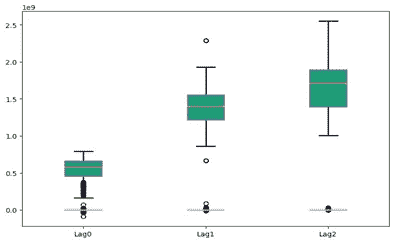
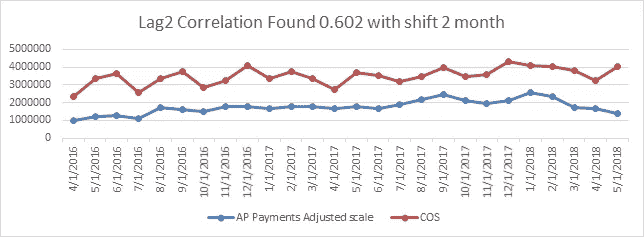
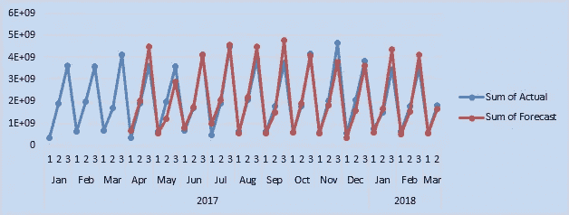

# 利用未来指标进行预测的新方法

> 原文：<https://towardsdatascience.com/a-novel-approach-for-forecasting-with-future-indicators-f2c57312de3d?source=collection_archive---------17----------------------->

时间序列建模和预测在许多实际领域都具有重要意义。因此，在这几年中，在这个课题上进行了许多积极的研究。为了提高时间序列建模和预测的精度和效率，文献中提出了许多重要的模型。预测是一项数据科学任务，是组织内许多活动的核心。例如，像苹果这样的大型组织必须分配稀缺的资源和目标设置，以便相对于基线来衡量绩效。公司的财务规划和分析团队多年来一直使用基于驱动因素的算法模型来预测全球现金流。我们的目标是探索最现代的技术，根据传统方法验证它们，并开发一个比现有业务实践更加稳健、灵活和一致的全球现金预测。理解产生高质量的预测对机器或分析师来说不是一个容易的问题。在创建各种业务预测的实践中，我们观察到两个主要主题:

1.  完全自动的预测技术可能是脆弱的，并且它们通常太不灵活而不能结合有用的假设或启发
2.  能够做出高质量预测的分析师非常罕见，因为预测是一项需要丰富经验的专业数据科学技能

**问题陈述**

我们的目标是基于业务驱动因素，使用机器学习技术预测 90 天(13 周)范围内应付账款(AP)和子部分的现金流。

如果预测模型能够准确预测:

1.  公司财务部门可以分配必要的预算，并在其他创收垂直领域进行投资
2.  如果预测有偏差，那么团队可以进行根本原因分析，根据模型提供的未来指标来检查偏差
3.  该模型是一个持续改进的模型，因为它捕捉了假日效应和商业意识形态的转变

**我们的应付账款(AP)现金预测解决方案:**

数据来自不同的来源，执行数据清理活动以使数据对建模和探索性数据分析(EDA)有用，执行完整性分析以验证来自数据源的数据与银行对账单的实际数据。分析了 58 个独立变量，以观察对 USD_AMT 付款的显著依赖性。其中支付条款是 AP 付款的主要驱动因素

如下所示，支付条款分为三类。

1.  滞后 0(在同一个月过账和支付):所有具有 0-30 个起息日的支付条款都属于这一类别
2.  滞后 1(过账和支付有一个月的差异):所有有 30-60 个起息日的支付条款都属于这一类别
3.  滞后 2(过帐和支付有两个月的差异):所有具有 60–90/以上起息日的支付条款都属于这一类别

下面的图 1 显示了具有统计平均差异的薪酬类别的行为差异。明确需要在全球薪酬条件下对不同的滞后时段分别建模，并在报告中将它们整合在一起。

Figure 1

***包含未来指标* : -** 包含未来指标为业务增加了巨大的解释力。它还为预测的梯度提供了一个指南，使其朝着未来指标相关的方向移动。术语回归用于统计中的这一因素，如果可以用衡量标准来解释，这是以相关方式流动的受抚养人付款的正当理由。数据科学团队尝试了三个主要的未来指标，它们是可用的 COS(销售成本)、COS 加 Open X(运营支出)和 COS 加 Open Inventory。下图显示了成本作为 AP 支付驱动因素的影响，该驱动因素在统计上证明了滞后 2 的相关系数为 0.602。

Figure 2

我们使用一个可分解的时间序列模型(Harvey & Peters 1990 ),该模型有三个主要组成部分:趋势、季节性和节假日。它们在以下等式中合并:

这里 g(t)是对时间序列值的非周期性变化进行建模的趋势函数，s(t)表示周期性变化(例如，每周和每年的季节性)，h(t)表示在一天或多天内可能不规则的时间表上发生的假期的影响。误差项表示模型不适应的任何特殊变化；稍后我们将作出误差项是正态分布的参数假设

C 表示承载能力，k 表示增长率，m 表示偏移参数。

我们依靠傅立叶级数来提供一个灵活的周期效应模型(Harvey & Shephard 1993)。假设 P 是我们期望时间序列具有的规则周期(例如，对于年度数据，P = 365.25 对于周数据，当我们以天为单位调整时间变量时，P = 7)。我们可以用以下公式来近似任意平滑的季节效应

***解释 HP predict 和网格包含设置基准* :-** Prophet 模型用作基线，这是一种集合方法。集成方法是一组训练数据的方法的核心，它根据训练数据给出最佳模型的输出预测。脸书先知是 HP 预言的基线。两者都使用一般加性模型的集合方法。使 HPpropehcy 更好的功能是具有额外的时间序列交叉验证和网格搜索。

***HP predictive 中的交叉验证和网格搜索:-***HP predictive 中的交叉验证和网格搜索评估不同时间序列数据和参数(如每周、每月、每季度和每年的季节性影响)的模型准确性。它主要在数据上训练算法时对傅立叶级数进行处理，并基于验证集上的最佳 rmse 值对参数管道进行排序。该算法优于行业中的大多数算法，因为它在多种算法上接受训练，并在训练期间选择最佳算法，并通过在验证集(算法从未训练过的数据)上评估它们来从网格搜索中获取参数。最后用网格搜索得到的最佳参数进行预测。

**证明解决方案有效**

下图 4 显示了 AP 付款的移动窗口预测，包括 COS 加上未结库存和未来指标。

Figure 4

**当前状态**

该模型目前正在生产中，为 AP 团队提供预测，并帮助惠普财务部门进行预算分配。

**参考文献**

[https://research.fb.com/prophet-forecasting-at-scale/](https://research.fb.com/prophet-forecasting-at-scale/)

[https://arxiv.org/ftp/arxiv/papers/1302/1302.6613.pdf](https://arxiv.org/ftp/arxiv/papers/1302/1302.6613.pdf)