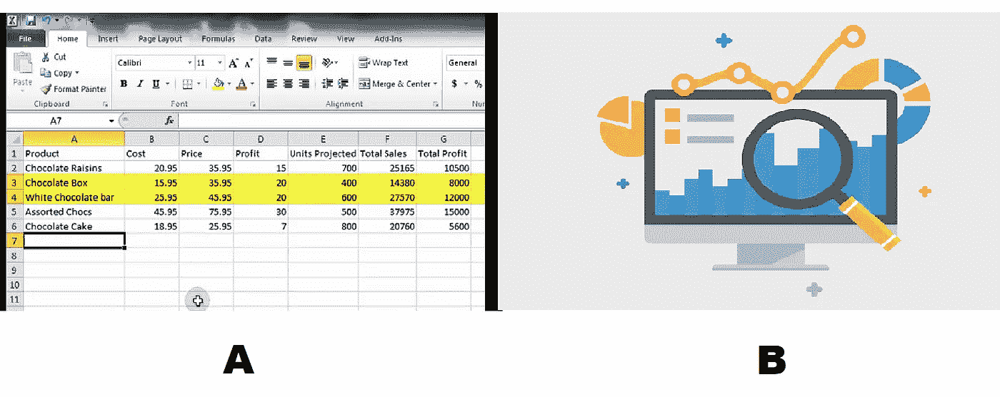
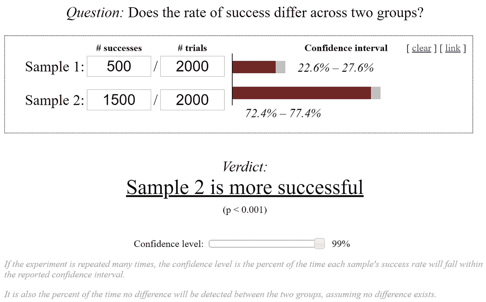

# “内部”利用 A/B 测试的新想法

> 原文：<https://towardsdatascience.com/a-novel-idea-of-utilizing-a-b-testing-internally-63039679869b?source=collection_archive---------31----------------------->

## 一份数据驱动且易于遵循的指南，用于衡量程序变更的内部影响。

最后，辛苦的工作是有回报的时候了:作为一名数据科学家，你帮助业务团队开发了一个先进的数据驱动的决策工具，预计将提高整体工作效率，并为具体的业务问题提供建议。然而，衡量这些巨大影响的最佳方式是什么？

这正是我的实习团队面临的情况，因为我们正在与我们的客户 [Hilti](https://www.hilti.com/) 结束为期一年的分析项目。幸运的是，有了 A/B 测试的背景知识，我找到了一种新颖而适用的方法。

*什么是 A/B 测试？*

A/B 测试是一个常用的过程，用于隔离和测试营销中的因素以及网站内容的影响[1]。例如，为了确定添加“下订单”按钮的有效性，公司可以利用 A/B 测试。不同版本的网站将被随机分配给用户，并根据用户的反馈，如退房率，公司可以微调盈利能力和客户体验。

*那么，为什么 A/B 测试非常适合我们项目的测量呢？*

首先，我们拥有大量受众，因为喜利得北美所有办事处的销售代表都将使用这一新工具。

第二，我们自然有两个版本的“产品”，即旧版本和新版本的定价工具。过去，喜利得的财务和销售代表依赖 excel 表格来评估报价；现在他们配备了更强大的数据和推荐工具。

> *喜利得的财务和销售代表过去依赖 excel 表格来评估报价；现在他们配备了更强大的数据工具。*

这里稍有不同的是，我们假设该工具将对决策和收入的整体有效性产生积极影响。这也被称为测试的“替代假设”。

熟悉了背景之后，我先带大家看一个设计实验的一般流程。

***1。选择主题:我们希望通过什么水平来显示差异？***

通常，在一个网站层面，我们必须决定是否要显示不同用户或不同网站访问之间的差异，等等。因为我们想要隔离控制组和测试组单元，这样控制组中的**用户不会碰巧发现差异**并因此冲淡结果。

在这种情况下，我们考虑在办公室层面进行实验，这样一个办公室的人只能使用一种决策工具，但一个城市的不同办公室可能会收到不同的工具。

***2。选择人口***

我们需要决定实验的作业水平。在这种情况下，我们关心的是选择哪些城市来进行分析。这可以直接影响显著性结果。鉴于核心市场和非核心市场的销售业绩差异很大，我们将分别基于核心市场和非核心市场来分析结果。

***3。持续时间***

实验的持续时间受**多久能观察到效果的影响**。在商业场景中，持续时间非常重要，因为总体市场趋势和季节性会极大地影响结果。

在这种情况下，我们同时测试决策效率和收入增长。对于第一个指标，可以每天快速观察，我们将持续时间选择为 1 天，也可以在不同的工作日重复实验，比较一致性。对于第二个指标，考虑到销售的每周季节性，我们将选择一个更长的持续时间为 1 个月。

***4。尺寸***

一般来说，对于具有不确定性的变更，我们会限制该变更的暴露程度。我们将确定实验的最小有效规模，这样我们既可以避免意外风险，又可以得到可信的结果。在这种情况下，为了计算出我们需要邀请多少销售代表来进行工具变更，我们需要提前决定**测试的功效(1-β)、显著性水平(α)、有效规模和基线指标** [2]。为了简化这一过程，人们将使用已有的工具，如 Evan Miller 的“ [A/B 测试计算器](https://www.evanmiller.org/ab-testing/sample-size.html)”。通常的做法是将检验的功效设置为 80%，显著性水平为 1%或 5%，对应于 90%和 95%的置信区间。由于我们只测试工具的正面效果，我们将选择单面作为参数(当我们考虑平等/不平等问题时，我们将选择双面)。

此外，由于我们对我们的新工具相当有信心(我们已经在研究上花了很多钱)，我们将选择整个人口作为样本量。因此，我们通过使用最大的样本量获得了最大的可观察期望效果。

*该进行分析了！*

但是等等等等！我们需要首先做一个**健全性检查**，检查那些预计不会改变的指标。如果他们也发生了变化，这是一个消极的迹象，表明测试结果不可信，你可能想检查一下环境的设置，看看是否有巨大的影响因素改变了所有的结果。

在这个具体的例子中，我将选择雇员的工作时间、建筑行业的股票指数、电动工具的平均市场价格作为不变的度量。

如果健全性检查的结果令人满意，我们可以继续进行测试的有效评估。这将包括总体显著性测试和符号测试。

在这种情况下，总体显著性测试是将实验中涉及的所有城市相加的结果，并使用估计的置信区间评估控制/实验组之间的差异。

感谢成熟的在线计算工具，我们只需输入结果就可以得到估计的置信区间[3]。你也可以通过计算混合概率和标准误差来得到这些。

**符号测试**是关于结果频繁发生的可能性。例如，如果我们在 20 个城市进行了一项实验，并获得了 20 个积极改善结果中的 20 个，这种情况的可能性有多大？我们可以更好地了解我们对自己的发现有多大的信心。

最终，一切都是关于迭代，并根据结果采取行动。希望我们的新决策工具将显著增加花费在折扣决策上的时间，并帮助喜利得产生显著更好的收入！

*参考*

[1][https://towards data science . com/ab-testing-in-real-life-9b 490 B3 c50 d 1](/ab-testing-in-real-life-9b490b3c50d1)

[https://patents.google.com/patent/US7975000](https://patents.google.com/patent/US7975000)

[3][https://split metrics . com/blog/mobile-a-b-testing-statistical-significance/](https://splitmetrics.com/blog/mobile-a-b-testing-statistical-significance/)

[https://www.evanmiller.org/ab-testing/sample-size.html](https://www.evanmiller.org/ab-testing/sample-size.html)

[https://classroom.udacity.com/courses/ud257](https://classroom.udacity.com/courses/ud257)