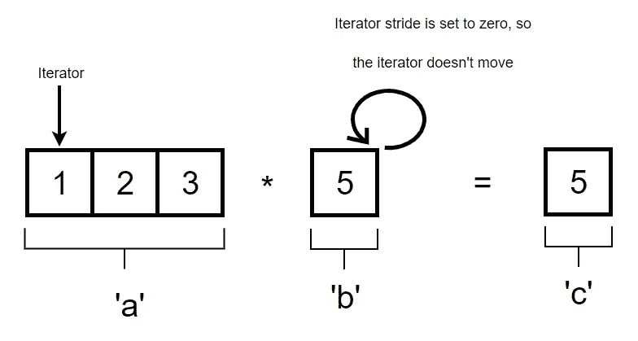

# 数字事件:广播

> 原文：<https://towardsdatascience.com/a-numpy-affair-broadcasting-ead20d9661f?source=collection_archive---------21----------------------->

本文探讨了 NumPy 科学计算包中使用的广播概念。

我们将通过给出一个简单的定义来介绍广播的概念，并通过一些例子来说明如何利用 NumPy 数组在 Python 中实现广播。我们将提供更详细的解释，以及更深入的定义，广播是什么，它的规则，好处和限制。

广播是 NumPy 中采用的方法，用于对不同维度的数组执行算术运算。加法、乘法、减法等一般算术运算。倾向于在对大小不同的数组执行操作之前广播数组。

为了给上面的定义提供一个推理的上下文，下面的代码描述了一个算术运算在没有广播的情况下是如何工作的示例#1 和示例#2 中示出了相同的算术运算，但是这次使用了广播。

**例子# 1——一个没有广播的世界**

```
import numpy as npa = np.array([1,2,3], dtype=float)
b = 5
c = np.empty([3])for idx, i in enumerate(a):
    c[idx] = i * bprint(c)
>> [5\. 10\. 15.]
```

在例#1 中，我们有一个包含三个元素的 NumPy 数组:1、2 和 3；这个数组被赋值给变量“a”。变量“b”被赋给标量 5，而“c”被初始化为一个包含 3 个元素的空数组。“c”的形状是“a”和“b”之间算术运算结果的预定预期形状。

所执行的算术运算是乘法。在这个操作中，标量“b”乘以数组“a”中的每个元素。用更专业的术语来说，我们在变量‘a’和‘b’中保存的值之间执行一个元素式的操作。

为了执行基于元素的操作，我们遍历数组“a ”,并将每个元素与“b”中保存的标量相乘。运算结果放在变量“c”中“a”内元素的相应索引位置。所以“a”中索引 0 的元素(a[0] = 2)和“b”中保存的标量的乘积将被放在“c”中的索引 1 处(c[0] = 1* 5 = 5)。

**例子# 2——一个有广播的世界**

```
import numpy as npa = np.array([1,2,3], dtype=float)
b = 5
c = a * bprint(c)
>> [5\. 10\. 15.]
```

在示例#2 中，我们可以看到我们编写的代码更少，并且我们不需要循环来实现与示例#1 相同的操作结果。这是因为利用广播来执行算术运算。


上图直观地描述了例 2 中发生的情况。数组和标量之间的算术运算是解释广播如何工作的最简单的方法。在示例#2 中，分配给变量“b”的标量值 5 已经“广播”给变量“a”中数组的所有元素。通俗地说，值 5 已经被复制了几次，以匹配数组“a”的形状的维度，从而为操作的执行提供合适的条件。

更有目的和更直观地重新定义广播，我们可以得出如下描述:广播是 python 中使用的一种方法，它为数组操作提供了一个**包装器**，通过**向量化**实现了基于循环的操作的优化。

**【包装器】**指的是通过广播进行的操作是通过 python 抽象出来的，因为实际执行是在一种更低级的语言中进行的，即 [**C.**](https://en.wikipedia.org/wiki/C_%28programming_language%29)

**向量化**指的是对几个元素进行操作，而不对操作进行任何修改。该运算可以是示例#2 中所示的乘法算术运算。

前面，我们已经说过，示例#2 中的标量值是“复制的”,以匹配变量“a”中的数组的维度，目的是使两个数据具有相同的维度，从而实现适当的元素式操作。这并不完全正确。

发生的不是复制，而是扩展维度上的迭代器实际上并没有移动，或者说是迭代。为了更简单地描述正在发生的事情，标量“5”或任何数据值，无论是一个数组，只要被扩展以满足另一个数组的维数，就具有一个在广播操作期间不移动的迭代器。这是因为变量“b”中标量 5 的迭代器的**步距**在 NumPy 内核中被设置为 **0** 。下图显示了变量“a”和“b”中保存的数据值之间的迭代运算的时序，同时显示了每个时间步的运算结果。



1st Iteration


2nd Iteration


3rd Iteration

现在我们在某种程度上理解了 NumPy 中的广播是如何工作的。为了进一步了解什么是广播以及如何利用广播，我们将探索支持适当广播的规则和条件，以及如何利用广播的实际例子。

**播出规则和条件:**

要将一组阵列视为“可广播的”，需要满足一组条件。

1.  数组的形状相同，或者两个数组的最终尺寸匹配
2.  如果一个数组与另一个数组的维数不同，那么维数较小的数组将被扩展 1，直到两个数组的维数相等
3.  如果两个数组是可广播的，那么维度大小为 1 的数组的行为方式是使维度较小的数组能够通过复制扩展到第二个数组的长度。

**条件#1**

```
# Condition 1: The shape of the arrays are the same or the ending dimensions for both arrays matchx = np.array([3,2,1])
y = np.array([6,5,2])
z = x * yprint(x.shape)
>> (3,)
print(y.shape)
>> (3,)
print(x.shape == y.shape)
>> True
print(z)
>> [18 10 2]
```

**条件二**

```
x = np.random.randn(4,3)
y = np.arange(4).reshape((4,1))
print(x.shape)
>> (4,3)
print(y.shape)
>> (4,1)
z = x * y
print(z)
>>[[-0\.         -0\.          0\.        ]
 [ 2.2984589   0.27385878 -1.17348763]
 [-1.96979462 -4.9748125   0.65956746]
 [-1.24697399  0.80710713  1.61002339]]
```

**条件#3**

```
x = np.random.randn(5,4)
y = np.random.randn(1,4)# The array 'x' has a length of 5 and the array 'y' has length of 1, by following condition 3, the array 'y' has been stretched 5 times to match the array 'x' during broadcasting.print(len(x))
>> 5
print(len(y))
>> 1
print(x + y)
>>[[-0.99329397 -0.98391026  0.85963453  0.28137122]
 [-2.17210589  0.99278479  1.98294275  1.11116366]
 [ 0.92228273 -0.39603659  1.99637842  2.31311734]
 [-1.29068518  0.22292541  1.56178367  2.07585643]
 [ 2.42435639 -0.07977165  0.28020364  1.42663066]]
```

最后，广播在效率方面提供了一些好处，因为广播中发生的循环是在 C 中发生的，而不是在 Python 中；这意味着指令在 CPU 中执行之前不会被解释，从而提高了效率。此外，正如前面说明广播如何工作的图表所示，我们可以观察到广播提供的内存效率，因为我们没有制作不必要的数据副本。

广播在实践中是有用的，尤其是在数据分析方面。一个例子是，当承担贬低数据的任务时，我们可以利用广播。贬低数据是通过用数据集分组的平均值减去数据集的每个元素，使一组数据集的平均值为零。代码片段提供了这是如何实现的。

```
# Broadcasting can be used for demeaning data.
# Demeaning is the process of making the mean of a group of data zero by subtracting each element of the data by the mean of the grouped data.arr = np.array([[1,2,3],
                [4,5,6],
                [7,8,9],
                [10,11,12]])
# Take the mean of each column within the array
arr_mean = arr.mean(0)
# Now we use broadcasting to perform element wise subtraction between the array and the mean
demeaned_data = arr - arr_mean
# To prove that array has been demeaned, we should get a mean of zero for each column when computing the meandemeaned_data.mean(0)
>> array([0., 0., 0.])
```

请随意从下面提供的链接了解更多关于广播的信息。

 [## 通用功能(ufunc) - NumPy v1.17 手册

### 通用函数(或简称为 universal function)是一种以逐个元素的方式操作的函数，支持数组…

docs.scipy.org](https://docs.scipy.org/doc/numpy/reference/ufuncs.html#broadcasting)  [## 词汇表-NumPy 1.17 版手册

### 沿轴为具有多个维度的阵列定义轴。一个二维数组有两个对应的…

docs.scipy.org](https://docs.scipy.org/doc/numpy/glossary.html#term-vectorization)  [## NumPy C 代码解释- NumPy v1.13 手册

### 通用函数是可调用的对象，它接受输入并通过包装基本的一维循环产生输出…

docs.scipy.org](https://docs.scipy.org/doc/numpy-1.13.0/reference/internals.code-explanations.html#broadcasting)