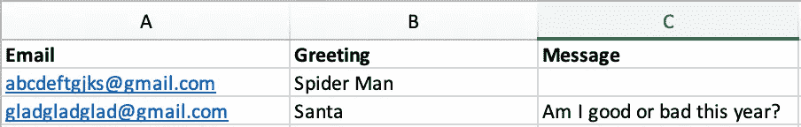

# 无纸化假期

> 原文：<https://towardsdatascience.com/a-paperless-holiday-2b59b0b98b1f?source=collection_archive---------23----------------------->

## 自动化示例

## 使用 Python 发送贺卡

Photo by [Aaron Burdon](https://unsplash.com/@aaronburden) on [Unsplash](https://unsplash.com/photos/1XeeHt9APXY)

假日是温暖和充满爱的季节，但这也意味着包装纸、贺卡和信封等会产生大量废物。

> “美国人在感恩节到新年期间扔掉的垃圾比一年中的其他时间多 25%。额外的废物相当于 2，500 万吨垃圾，或大约每周额外 100 万吨”。— [斯坦福大学](https://lbre.stanford.edu/pssistanford-recycling/frequently-asked-questions/frequently-asked-questions-holiday-waste-prevention)

缓解这个问题的一个解决方案是发送电子贺卡，而不是纸质贺卡。这将节省不必要的纸张浪费和金钱。今年，在 Python 的帮助下，我们能够向全球 100 多个家庭成员和朋友发送带有个性化信息的贺卡，并且实现了零纸张浪费。

# 联系人名单和贺卡

要管理联系人，您可以使用 Excel 或 Google Sheet，无论哪种对您来说更简单。我的只有三个栏目，“电子邮件”、“问候”和“信息”。电子邮件列包含收件人的电子邮件地址。“问候”栏是您希望如何问候他们，最后,“消息”栏可以包含任何个性化的消息，如果您愿意的话。如果没有，就留空白。

Contact List

至于制作圣诞卡，有很多应用程序可以帮助你制作自己的圣诞卡。今年，我用一款名为“InstaMag”的 iPhone 应用程序制作了我们的地图

现在我们有了联系信息和圣诞卡，我们可以将它们加载到 Python 中。确保将文件与代码保存在同一个文件夹中。

import files

# 步骤 2 设置 SMTP 服务器

我们将使用 SMTP 服务器连接到您的电子邮件服务器。请注意，如果您有 Gmail，您需要将 [*设置为允许不太安全的应用*](https://myaccount.google.com/lesssecureapps) 打开，这可能会导致安全问题，并使其他人更容易访问您的 Gmail 帐户。有些人建议为 Python 开一个新的 Gmail 账户，只是出于安全考虑，但对我来说，这次我只用了我的 outlook 账户，因为我不会用它做任何重要的事情。另一个选择是在发送电子贺卡时打开设置，然后在发送完毕后再次关闭。

set up server

# 编写信息并发送电子邮件

有了 Excel 文件中的联系信息，我们可以遍历提供的电子邮件地址行。如果没有提供个性化信息，邮件正文将是“圣诞快乐，新年快乐！”。如果电子表格中有个性化消息，那么它将被放在正文中。一旦我们将正文和圣诞卡附加到邮件中，我们就可以发送电子邮件了。

write message

希望这篇文章对你有用。节日快乐！

holiday.py

# 资源

1.  [用 Python 发送电子邮件](https://realpython.com/python-send-email/)