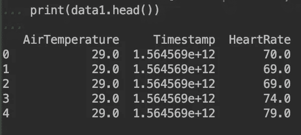
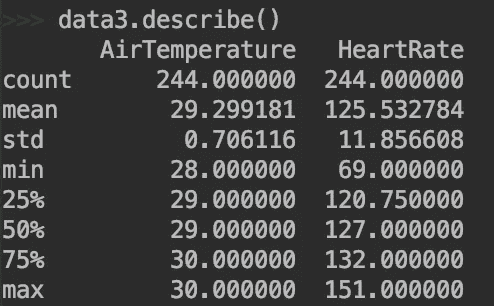
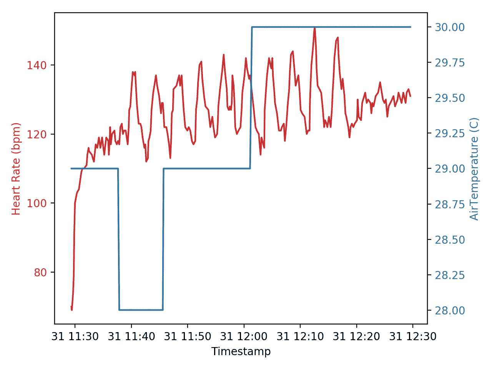
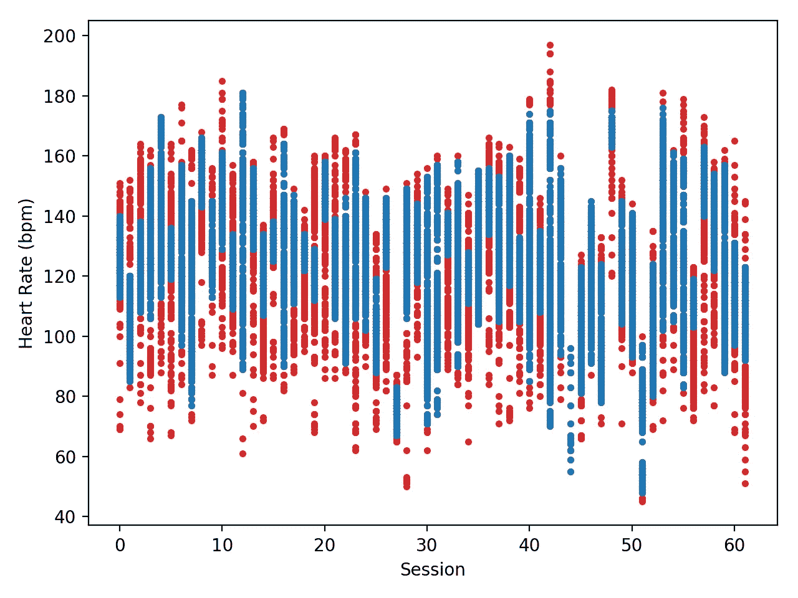
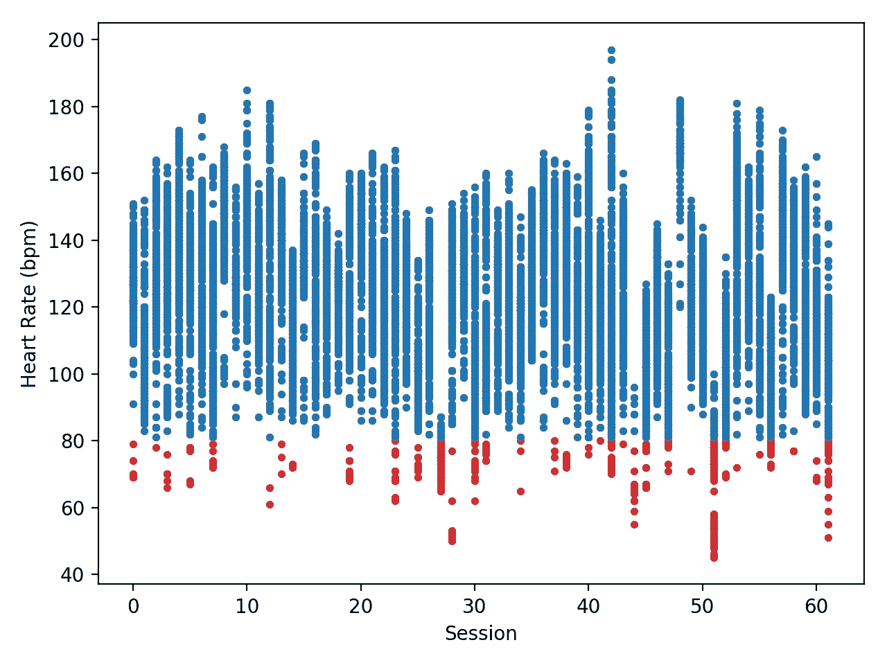
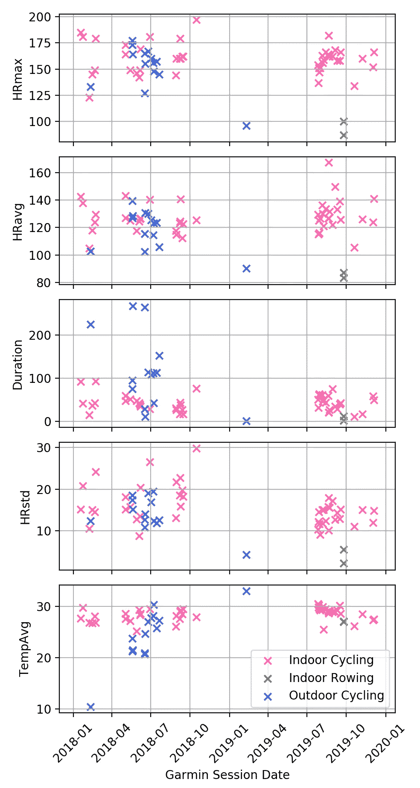
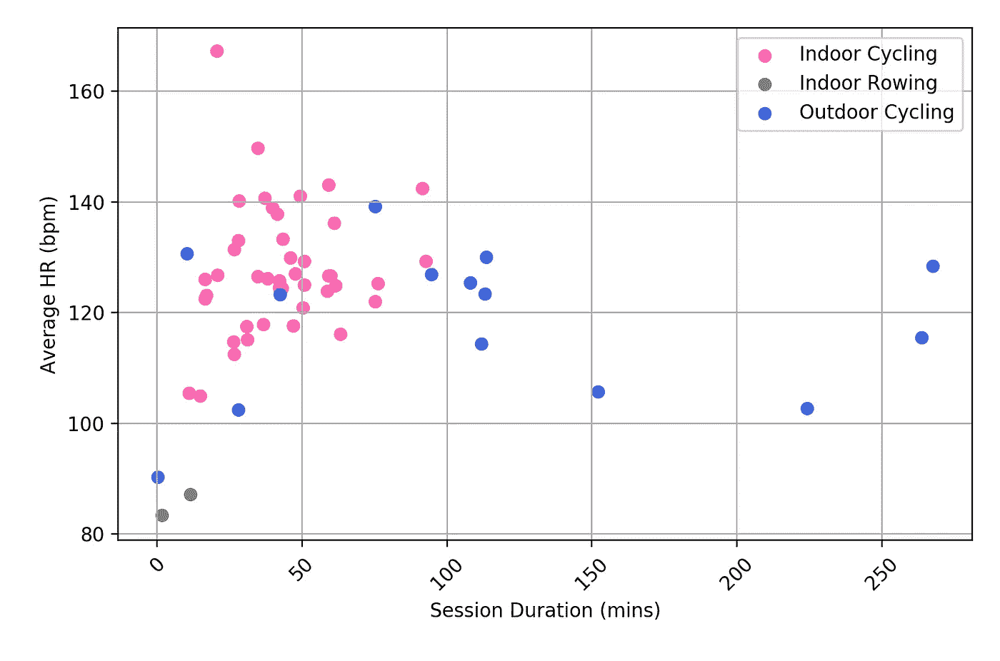
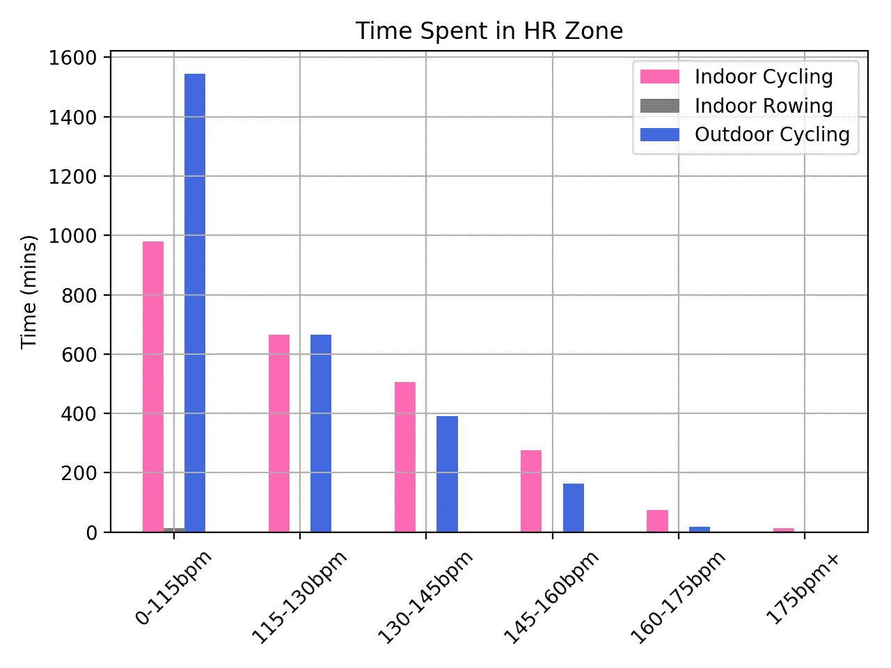

# 有效数据预处理的实用对话

> 原文：<https://towardsdatascience.com/a-practical-dialogue-for-effective-data-preprocessing-147cdc000f6c?source=collection_archive---------31----------------------->

## *3 个基本的数据清理函数，2 个奇怪的字符&一个可怕的数据集*


**阿基米德:**请坐伟大的列奥尼达，我能为你做什么？

**列奥尼达:**我需要一个机器学习模型来告诉我在我的公路车上开启超能力的秘密。

冷静点，年轻的巴克，我不是魔术师。

**L:***指向手表*但是你可以用这个，不是吗？

**答:**嗯，一块智能手表。

**L:** 不仅仅是“智能手表”Archemides！这个设备可以让我跟踪心率——在我训练的时候以及一天中的其他时间。

等等，你的意思是告诉我你的手表让你知道你什么时候……活着？

先生，你是一个小丑。

**答:**数据科学家其实。虽然有时候我也分不清。

T21:让我们看看吧。我已经使用[这个非常有用的 github 库](https://github.com/93tilinfinity/garminconnect_analysis/blob/master/gc_download.py)在本地转储了我所有的 *Garmin* 会话数据集。

**答:** *机器学习*是个热门话题但是你知道什么比 ML 更热吗？快速获得结果。

我只想做 ML。

**答:**T34 毫升？听着，现实是你可能不需要它来提取你想知道的东西。

## 告诉我——你的目标是什么？

**L:** 我要超车，不是被超车！

来吧，列奥尼达，给我一些我能做的事。

**L:** 好的……在更长的时间内持续产生更高水平的力量。我想知道怎样训练才能最好地做到这一点。

**答:**太好了。成功的项目始于对目标的思考。不管我们是否需要参考一个 ML 模型，保证数据干净、一致、准确是一个必要的前提**【0】。第一步是进行一次***简单的数据质量检查***【1】。**

**你是怎么做到的？**

## ****答:让我们为您的 Garmin 会话数据集快速浏览 3 个基本的清理函数。****

```
**import pandas as pd
import os
import datetime as dt
from datetime import datetime
import matplotlib.pyplot as plt
import gc_download

raw_session = gc_download.load_sessions()[0]
print(raw_session.head())**
```

****

**我应该在这里看什么？**

****答:**正是。对于知识发现来说，现在还没什么用。**

****L:*****数据清洗******预处理*** 的作用是然后使原始数据集*有用*？**

****答:**没有正式的定义，但是我所说的*有用的*是两个一般的东西。首先，要习惯数据集【2】的 ***变异和质量。第二，安装一个 ***标准数据结构。*** 满足你的分析要求。*分析*是一个广义名词。它融合了基于规则的，机器学习，深度学习，你会明白的。*****

*继续，这对我的数据集意味着什么？*

*很明显，原始数据集包含了太多的信息，所以…*

## *答:分离出你需要的信息。(*步骤 1*)*

```
*details = raw_session['details']
raw_df = pd.DataFrame(
           [r['metrics'] for r in details['activityDetailMetrics']],
           columns=[r['key'] for r in details['metricDescriptors']])
print(raw_df.head())
print(raw_df.columns.to_list())*
```

**

***答:**从原始数据集中分离出“activityDetailMetrics”和“metricDescriptors”后，我们剩下 5 行 x 7 列有希望的信息。让我们保留' directTimestamp '和' directHeartRate '。*

***L:** 和‘directAirTemperature’。*

***答:**为什么不。*

```
*c_name =['directAirTemperature','directTimestamp','directHeartRate']
c_rename = ['AirTemperature','Timestamp','HeartRate']
data1 = raw_df.copy()
data1 = data1[c_name]
data1 = data1.rename(columns={a:b for a,b in zip(c_name,c_rename)})
print(data1.head())*
```

**

*我很高兴我们重新命名了那些栏目，但是在这里，回答我一些问题…*

## *那究竟是什么格式？！(*步骤 2*)*

```
*data2 = data1.copy()
data2['Timestamp'] = [datetime.fromtimestamp(int(i/1000)) for i in data2['Timestamp'].to_list()]
data2.set_index('Timestamp')
data2[['HeartRate','AirTemperature']] = data2[['HeartRate','AirTemperature']].astype('float32')*
```

***答:** [Unix 时间戳](https://www.unixtimestamp.com/)！数据之神以这种格式读取时间。它们以秒或毫秒来标记自 1970 年 1 月 1 日以来的时间长度。*

*Garmin 以毫秒为单位记录这个时间戳。然后我们将这个时间戳除以 1000，对吗？*

***答:**正是。更一般地说，没有必要花太多时间格式化。只要学习算法能够解释输入，并且我们有一个映射，这就足够了。*

***L:** 如何知道自己是否过度格式化？这听起来像是耐心的作用。*

***答:**某种程度上来说，是。不是耐心格式化数据集，而是耐心等待代码运行。*

*L: 什么意思？*

***答:**格式化归结为一个 ***可读性*** vs ***代码性能*** 的权衡。在“心率”和“气温”的情况下，将这些变量的数据类型设置为***float 32***【3】会在不影响精度的情况下分配较小的存储量。*

```
*print(data2.head())*
```

**

***L:** 众所周知，提高性能而不牺牲精度是一张金奖券。但是我们是不是错过了什么？*

***答:**那是什么？*

## ****L:缺失数据，得到了吗？！(*第三步*)****

*我真的很担心你。*

*我担心你的幽默感，阿基米德。现在告诉我丢失的数据。*

***答:***叹气*一般来说，处理缺失属性值的方法属于两种思想流派之一[4]。第一个是 ***阴错阳差的失踪。*** 最常见的情况是，在一个较大的属性和值块中对属性进行**删除**或**替换**。*

***L:** 第二个呢？*

***答:** ***故意遗漏*** 。进入“不在乎”假设。当被认为重要的信息只在某些群体中出现时。通过将数据块重新布线到 ***属性-值*** 对来处理。*

*第二类与此无关。这个装置是用来记录的。任何丢失的数据都是硬件问题。*

***答:***gone _ missing()*函数将处理丢失的数据。*

***L:** *地址* —你的意思是删除整行条目吗？*

*答:不，反正不是没有想过。我们现在有一个选择 ***删除*** 或者 ***重建***【5】。如果我们遗漏了数据集的一个边缘案例，我们将删除整个条目。*

*L: 数据集的其余部分呢？*

***答:**直接删除包含任何缺失变量的行是一种保守的方法。插值也是一种选择。心率是一个缓慢发展的过程，这意味着对于任何时间戳，都有一个可能的 bpm 值的紧密间隔。*

*L: 对于单个丢失的时间戳来说，这可能行得通。但是对于连续缺失条目，我宁愿采取保守的方法。30 秒对于心跳加速来说已经足够了。*

***答:**让我们这样做，线性插值或删除由一个开关控制。*

```
*data3 = data2.copy()
useInterp = False
if useInterp:
     data3 = data3.interpolate(method='linear',        limit_direction='forward',limit_area='inside',axis=1)
data3 = data3.dropna()
data3.describe()*
```

**

*244 次观察，平均 125.5 bpm，最大 151bpm。简洁的总结但是要适可而止。给我看看 mon-…图。给我看看情节。*

```
*def uni_plot(df):
    fig, ax1 = plt.subplots()
    color1,color2 = 'tab:red','tab:blue' ax1.set_xlabel('Timestamp')
    ax1.set_ylabel('Heart Rate (bpm)',color=color1)
    ax1.plot(df['HeartRate'].index, df['HeartRate'], color=color1)
    ax1.tick_params(axis='y', labelcolor=color1)

    ax2 = ax1.twinx()
    ax2.set_ylabel('AirTemperature (C)',color=color2)
    ax2.plot(df['HeartRate'].index,df['AirTemperature'], color=color2)
    ax2.tick_params(axis='y', labelcolor=color2)

    fig.tight_layout()
    plt.show()uni_plot(data3)*
```

**

*李:现在我们正式开始工作了。*

## *我们还没完呢。离群值。*

*L: 为什么会有异常值？该设备正在测量我的心率，为什么这些值会是错误的？*

```
*data3.boxplot(column=['HeartRate'])*
```

**

***答:**离群值并不总是*错*。他们强调不同于常规的观点[6]。高于或低于标准的所有点都以圆圈突出显示。让我们看看所有会话的情况。*

**

***L:** 有哪些剧情给我看？*

***答:**粉色——传统箱线图。大多数离群值位于数据集的低端。*

***L:** 最下面的两个地块呢，数据是怎么处理的？*

***答:**补救异常值的一个常用方法是设置阈值。平均值标准偏差的倍数。在它之外的所有数据点将被递归地删除。在蓝色图中，阈值是 3 个标准差，绿色图中是 2 个标准差。*

***L:** 使用 3 标准差阈值仍会保留异常值。让我们用 2 个标准差向前看。*

*稍等一会儿。 ***并非所有异常值都是非法污染物，也并非所有非法分数都显示为异常值***【7】。*

*T21:我认为圈子不好。你是想告诉我圆圈不是坏事吗？*

***答:**圈子并不总是坏的。*

*'你到底是什么意思？！*

*A: 我们倒回去一点。箱线图将异常值定义为数据集四分位范围的标准差的倍数。事实上，每个方框下面都有更多的异常值，这表明数据存在偏斜。不一定是不自然的观察。*

***L:** 那为什么截尾到 2 个标准差的时候没有异常值？*

***答:**你自己说的——在 2 个标准差处截断。数据集已经失去了原来的形状，因为忽略了太多的点。让我们在下面想象一下。*

**

***L:** Woah，这么说红点都被装箱了？这么多人？！我不喜欢这样。*

***答:**盲目处理离群值可能是危险的。*

***L:** *危险*因为在专注于摆脱方框图的圈子时，我们没能思考那些观察结果代表了什么。出现在时段上端的圆圈代表有用的最大心率努力。我们不可能把它们扔掉。*

***答:**你怎么看待较低的离群点？*

***L:** 他们是数据集的人工制品。我开始手动记录我的训练，大部分时间我都有热身阶段。*

*但是我们真的需要包括热身数据吗？看更长的热身将会扭曲你的总结统计。这意味着会议的工作部分将被歪曲。*

*我无法告诉你热身在哪里结束，工作在哪里开始。让我们去掉任何低于 80bpm 的数据。这也可以捕捉 Garmin 在中途停止可靠跟踪的情况。*

**

*猜猜接下来会发生什么？*

***L:** 剧情？*

## ****答:剧情****

**

*答:我不需要机器学习模型来告诉你你没有坚持训练。你在室内训练的次数也比室外多。*

***L:** 这是希腊，阿基米德。我不想被战车压扁。不，谢谢你。*

*A: 所以你试着在健身房复制户外训练？*

***L:** 正是。*

***答:**事实是你没有改变室内训练的持续时间。尤其是今年。时段持续时间和心率标准差中紧密的粉红色簇代表一致强度努力的阻滞期。*

***L:** 也就是说，相对于 2018 年，2019 年的会议强度平均水平(HRavg)变化更大。*

***答:**真。室内会议似乎更激烈，时间更短。*

**

*嗯，当你把它画成那样的时候，就很明显了。在自行车世界，我们谈论心率区[8]。我的区域看起来像什么？*

***答:**我们没有乳酸门槛数据，但我们可以将数据分成代理区域桶。*

**

*一个人越有耐力，就越难振奋人心。目前还不清楚更高的心率是否意味着更好的表现。性能应该由比赛结果和功率数据来衡量。*

***答:**如果是那样的话，匆忙进入一个 ML 模型将会是时间下沉。您需要做的是丰富您的数据集，在这种情况下使用功率数据。*

***L:** 不管怎样，需要做的事情很明显——改变室内会议的长度和持续时间。花更多时间在心率较低的区域是没问题的。你可以称之为主动恢复。*

**

## *甲:我把这个留给你。*

> *机器学习中的一个重要哲学是，人们不应该期望模型做所有困难的工作，即使是一个强大的非线性模型[2]。*

***答:**今天，我们已经非常快速地可视化了您的完整 Garmin 会话历史，只给出了您的非结构化原始数据。*

***L:** 对。我们已经通过 ***做到了 1)删除不必要的数据，2)格式化和重新索引，*** 和 ***3)堵塞丢失的值。****

*是的，这些都是关键的编码任务，但是在这个过程中效率更低的环节是*对话*。有效的 ***数据清理*** 是关于确保原始记录符合*任务特定的*——不一定是通用的——指导方针。它有很多定义，但可以肯定的是，它是一个*交互过程*。*

***L:** 至关重要的是，它需要在领域专业知识和计算标准之间来回转换。我认识到知识发现不仅仅来自机器学习。*

> *知识发现被定义为从数据中提取明确的、先前未知的和潜在有用的信息。[10]*

*不幸的是，你还不是轮子上的火箭。*

*但是我更有能力成为一名教师。我了解到我的室内课程并不像我想象的那样可以复制室外课程。我需要包括会话持续时间的变化，并纳入功率数据作为性能的衡量标准。我对不一致的训练更有责任感。我很惊讶我们这么快就做到了。*

***答:**我们关注*对复杂性的影响。**

*阿基米德，我喜欢这个原则……现在，回到掠夺村庄和雕刻雕像的话题。*

*下次见，列奥尼达。*

# *附录*

*[0]—[https://www . kdnugges . com/2018/12/六步-master-machine-learning-data-preparation . html](https://www.kdnuggets.com/2018/12/six-steps-master-machine-learning-data-preparation.html)*

*[1]—[https://www . kdnugges . com/2016/10/data-preparation-tips-tricks-tools . html](https://www.kdnuggets.com/2016/10/data-preparation-tips-tricks-tools.html)*

*[2] —预测分析的基础，伍沾德，Stephen Coggeshall，2012 年*

*[3]——[https://docs.scipy.org/doc/numpy/user/basics.types.html](https://docs.scipy.org/doc/numpy/user/basics.types.html)*

*[4] —处理缺失属性值，Jerry W . Grzymala-Busse，wit old J . Grzymala-Busse，2010 年*

*[5]—[https://towards data science . com/how-to-handle-missing-data-8646 b 18 db0d 4](/how-to-handle-missing-data-8646b18db0d4)*

*[6]——离群值的力量，Osborne & Overbay，2004 年*

*[7] —统计数据中的异常值，Barnett & Lewis，1994 年*

*[8]—[https://www . British cycling . org . uk/knowledge/article/izn 2014 08 08-理解-强度-2 -心率-0](https://www.britishcycling.org.uk/knowledge/article/izn20140808-understanding-intensity-2--heart-rate-0)*

*[9] —数据清理:知识发现的前奏，Johnathon I Maltic 和 Andrian Marcus，2000 年*

*[10] —数据挖掘原理，Max Bramer，2007*