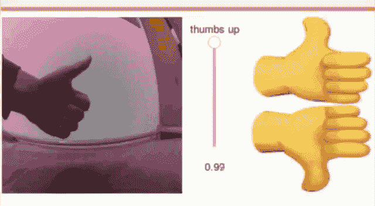
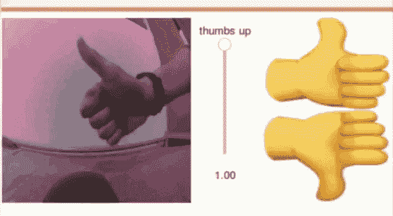

# 用 PyTorch 学习迁移学习的实例

> 原文：<https://towardsdatascience.com/a-practical-example-in-transfer-learning-with-pytorch-846bb835f2db?source=collection_archive---------11----------------------->

## 如何用潜在的小数据集解决计算机视觉问题，并且不需要太多的计算机能力和专门的硬件


在这篇文章中，我们将了解迁移学习如何帮助我们解决问题，而无需花费太多时间训练模型和利用预训练的架构。为了了解这是如何工作的，我们将开发一个能够区分竖起大拇指👍拇指朝下👎以高精度实时进行。

什么是迁移学习，什么时候应该使用？

迁移学习是一种技术，在这种技术中，您可以使用经过训练的神经网络来解决特定类型的问题，经过一些更改，您可以重新使用它来解决相关的问题。例如，如果你想开发一个模型来区分汽车和卡车，使用通过 [ImageNet](http://www.image-net.org/) 竞赛训练的网络是一个很好的解决方案，并应用迁移学习来微调网络以完成你的任务。

使用这种技术，学习过程可以更快、更准确并且需要更少的训练数据，事实上，数据集的**大小和**与原始数据集**(网络最初在其中被训练的数据集)的相似性是在应用迁移学习之前要考虑的两个关键因素。有四种情况:**

1.  **小的**数据集和**与原始的**相似:只训练(最后)完全连接的层
2.  **小**数据集和**不同**到原始:只训练完全连接的层
3.  **大型**数据集和**与原始数据集相似**:冻结早期的层(简单特征)并训练其余的层
4.  **大型**数据集和**不同**原始:从零开始训练模型，重用网络架构(使用训练好的权重作为起点)。

在网络中，早期层捕获图像的最简单特征(边缘、线条……)，而深层层在早期层的组合中捕获更复杂的特征(例如人脸识别问题中的眼睛或嘴巴)。为了微调一个模型，我们需要重新训练最后几层，因为前面几层有对我们有用的知识。

> 数据集的大小和与原始数据集的相似性是应用迁移学习之前要考虑的两个关键因素

**迁移学习的数据收集**

首先，我们需要收集一些数据。这些数据需要能够代表我们在真实情况下将要发现的所有案例。在我们的例子中，我们将开发一个能够区分拇指向上或向下的模型。以下是一些收集数据的技巧:

*   尝试相机前面的不同位置(中央、左侧、右侧、放大、缩小……)
*   将相机放置在不同的背景中
*   尝试不同的环境光
*   用双手

> 在拍摄快照之前，需要考虑的一个重要方面是我们将使用的网络架构，因为每个图像的大小/形状都很重要


Use both hands, try different positions, different angles…

特别是在这种情况下，我在每个班级收集了 114 张图像来解决这个二元问题(拇指向上或拇指向下)。这是一个小数据集，并且与 ImageNet 数据集(在简单特征方面)相似，其中我们要使用的网络被训练(参见下面的部分),因此，小的数据集与原始数据集相似:仅训练最后一个完全连接的层。

网络的输入层需要固定大小的图像，因此我们可以采用两种方法来实现这一点:

*   拍摄具有所需宽度和高度的图像(通道通常为 3，因为是 RGB 颜色)
*   拍摄图像，没有任何类型的限制，并根据我们的网络架构将它们重新采样为所需的大小/形状(在训练时间内)。PyTorch 有一个解决这个问题的方法(来源[这里](https://pytorch.org/docs/stable/torchvision/transforms.html))。


resize a entire dataset is easy with torchvision

**用 PyTorch 转移学习**

PyTorch 为我们提供了几个训练有素的网络，可以下载到您的计算机上。[这里的](https://pytorch.org/docs/stable/torchvision/models.html)是可用的型号。出于我们的目的，我们将选择 [AlexNet](https://papers.nips.cc/paper/4824-imagenet-classification-with-deep-convolutional-neural-networks.pdf) 。


每种模型在解决特定类型的问题时都有自己的优势。从图像分类到语义分割。一些比另一些更快，运行时需要更少/更多的计算能力。例如，选择 [SqueezeNet](https://arxiv.org/abs/1602.07360) 需要的参数比 AlexNet 少 50 倍，同时在 ImageNet 数据集上实现相同的精度，因此它是一种快速、较小和高精度的网络架构(适用于低功耗的嵌入式设备),而 [VGG](https://arxiv.org/abs/1409.1556) 网络架构比 AlexNet 或 SqueezeNet 具有更好的精度，但在推理过程中训练和运行更繁重。下面，您可以看到 PyTorch 在缓存目录中下载的不同网络架构及其大小。


different model sizes

到目前为止，我们只谈了理论，让我们把概念付诸实践吧。在 [**这个**](https://github.com/davidRetana/thumbs_jetbot) GitHub 页面中，你有所有必要的代码来收集你的数据，训练模型并在现场演示中运行它。

首先，让我们导入所有必需的包

```
import torch
import torch.optim as optim
import torch.nn.functional as F
import torchvision
import torchvision.datasets as datasets
import torchvision.models as models
import torchvision.transforms as transforms
```

现在我们使用 *torchvision.datasets* 包中可用的 ImageFolder 数据集类。我们附加转换以准备用于训练的数据，然后将数据集分成*训练*和*测试*集

```
dataset = datasets.ImageFolder(
    'dataset',
    transforms.Compose([
        transforms.ColorJitter(0.1, 0.1, 0.1, 0.1),
        transforms.Resize((224, 224)),
        transforms.ToTensor(),
        transforms.Normalize([0.485, 0.456, 0.406], [0.229, 0.224, 0.225])
    ])
)
train_dataset, test_dataset = torch.utils.data.random_split(dataset, [len(dataset) - 50, 50])
```

我们将创建两个 *DataLoader* 实例，它们提供了用于混排数据、生成批量图像以及使用多个 workers 并行加载样本的实用程序。

```
train_loader = torch.utils.data.DataLoader(
    train_dataset,
    batch_size=16,
    shuffle=True,
    num_workers=4
)

test_loader = torch.utils.data.DataLoader(
    test_dataset,
    batch_size=16,
    shuffle=True,
    num_workers=4
)
```

现在，我们定义将要训练的神经网络。`alexnet`模型最初是为有 1000 个类标签的数据集训练的，但是我们的数据集只有两个类标签！我们将用一个新的、未经训练的、只有两个输出(👍和👎).

```
model = models.alexnet(pretrained=True)
model.classifier[6] = torch.nn.Linear(model.classifier[6].in_features, 2)
```

现在，是时候训练神经网络并尽可能以最佳性能保存模型了。请随意尝试不同的超参数，看看它的表现如何

```
NUM_EPOCHS = 10
BEST_MODEL_PATH = 'best_model.pth'
best_accuracy = 0.0

optimizer = optim.SGD(model.parameters(), lr=0.001, momentum=0.9)

for epoch in range(NUM_EPOCHS):

    for images, labels in iter(train_loader):
        images = images.to(device)
        labels = labels.to(device)
        optimizer.zero_grad()
        outputs = model(images)
        loss = F.cross_entropy(outputs, labels)
        loss.backward()
        optimizer.step()

    test_error_count = 0.0
    for images, labels in iter(test_loader):
        images = images.to(device)
        labels = labels.to(device)
        outputs = model(images)
        test_error_count += float(torch.sum(torch.abs(labels - outputs.argmax(1))))

    test_accuracy = 1.0 - float(test_error_count) / float(len(test_dataset))
    print('%d: %f' % (epoch, test_accuracy))
    if test_accuracy > best_accuracy:
        torch.save(model.state_dict(), BEST_MODEL_PATH)
        best_accuracy = test_accuracy
```

仅此而已，现在我们的模型能够实时分类我们的图像了！



**进一步工作**:

为了提高模型性能，以下是一些在未来工作中可以尝试的方法:

*   收集具有不同背景的图像来改进(概括)我们的模型
*   从不同的人那里收集图像添加到数据集
*   当你没有竖起或放下拇指的时候，也许可以增加第三类

[](https://github.com/davidRetana) [## 大卫塔纳-概述

### 在 GitHub 上注册您自己的个人资料，这是托管代码、管理项目和与 40…

github.com](https://github.com/davidRetana) 

## **参考文献**

[](https://github.com/NVIDIA-AI-IOT/jetbot) [## NVIDIA-AI-IOT/jetbot

### 有兴趣和杰特森纳米一起做这样的项目吗？查看我们于 2019 年 5 月 16 日发布的网络研讨会！JetBot 是一个…

github.com](https://github.com/NVIDIA-AI-IOT/jetbot) 

AlexNet paper