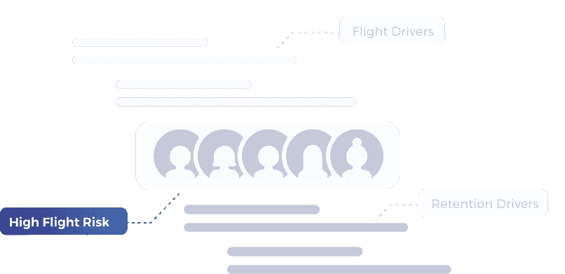
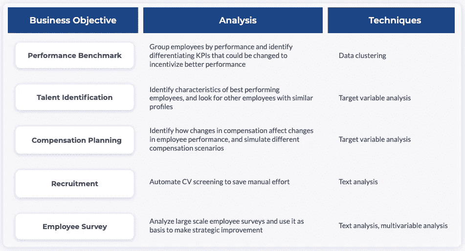

# 应用人员分析的实用指南

> 原文：<https://towardsdatascience.com/a-practical-guide-to-apply-people-analytics-f0d08bc231cc?source=collection_archive---------23----------------------->

人员分析是人力资源领域的新热点。然而，尽管人力资源领导热情地谈论它，但很少有公司能够应用它并从中受益。在 [Graphext](http://www.graphext.com) ，我们一直在与客户合作实施各种人员分析计划，以推动行为改变。在本文中，我想分享我们工作中的一些收获，特别是关于如何以实用有效的方式应用人员分析。

给你一点背景，我们的大部分客户来自服务行业，他们的业绩与他们的员工紧密相连。其中许多公司认识到利用数据科学提高盈利能力的潜力，并正在采取积极措施将不同的解决方案融入日常运营中。

不管行业、规模和地理位置如何，以下是公司在应用人员分析时面临的一些常见挑战:

首先，**收集数据的困难**。员工数据经常驻留在不同的系统上，并且不能很好地同步。与公司更愿意投资的客户数据不同，员工数据通常被放在次要位置，底层数据基础设施也没有得到很好的开发。因此，在进行任何分析之前，公司需要花费大量时间来收集和清理这些数据。

其次，**缺乏人才**。要正确应用人员分析，您需要平衡技术(编程和统计)和人力资源知识。这种技能非常罕见，很难找到。公司经常不得不在没有技术经验的人力资源专家和没有商业背景的技术人员之间做出选择。两者都有缺点。

最后，**根据建议**执行不力。许多公司非常乐意进行分析，但未能贯彻执行建议。没有执行，您就看不到建议的结果，没有结果，您就无法提供有洞察力的反馈来验证分析是对还是错。

尽管面临这些挑战，我们的许多客户成功地使用人员分析来提高他们的业务绩效。以下是我们从他们身上观察到的一些最佳实践。

首先，**将你的分析与具体的业务目标联系起来**。这是关于寻找可能对您的业务产生最大影响的用例。你可以运行许多很酷的分析，但是哪一个在今天产生商业结果方面最有效呢？

在这里，我们总结了一个最常用的人分析用例列表，深受我们客户的喜爱。大多数都是简单直接的分析，但是非常有效。

除了上面的用例，我们还看到公司在多元化研究、职业道路甚至组织网络中运行分析。这些用例很好探索，但是在现实中，基于分析实现任何改变是非常困难的，并且影响往往是长期的和无形的。如果你正在寻找唾手可得的果实和立竿见影的效果，我建议你首先跳过它们。

其次，**将人员分析整合到您的日常运营中**。许多公司每年只运行一次人员分析项目来设定年度目标，之后就放弃了。这种想法很危险。有了这么多的机会，人们换工作的速度比以往任何时候都快。看到一家服务公司有 20%的离职率并不奇怪，在最优秀的员工中，这个数字甚至更高。从发现问题到制定计划并实施变革的机会之窗非常短暂。

我们见过的最好的公司都在持续地运行他们的核心人员分析。此外，他们还定期试验和探索有趣的主题，以添加到他们的分析组合中。开发一个分析组合，并建立一个连续的项目路线图，将有助于将数据驱动的文化嵌入到您的组织中，并对您的公司绩效产生更大的影响。

最后，**建立一个从执行到分析的有效反馈回路**。一旦你在分析的基础上实施了你的策略，不管你是否看到了影响，收集结果并把它作为输入来改进你的分析是非常重要的。数据科学基于试错的思想。从长远来看，反馈环将帮助你改进和完善你的分析技术。

希望你喜欢阅读。下面是我关于数据科学的其他文章:

[为什么我们必须让数据科学民主化](/why-we-must-democratize-data-science-baacfea650c3)

[构建数据驱动的文化](https://medium.com/@ke_73209/building-a-data-driven-culture-one-step-at-a-time-85409c164630)

[针对您的客户洞察团队的顶级分析](https://medium.com/@ke_73209/top-analysis-for-your-customer-insights-team-c8c1f01a51c5)

[关于数据科学，Kaggle 调查告诉了我们什么](/what-does-kaggle-survey-tell-us-about-data-science-1f634ea000b1)