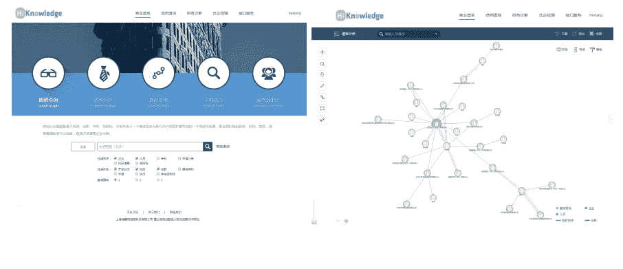

# 为投资分析构建企业知识图的实用指南

> 原文：<https://towardsdatascience.com/a-practical-guide-to-build-an-enterprise-knowledge-graph-for-investment-analysis-3a15363098b7?source=collection_archive---------12----------------------->

## 如何解决构建真正的企业知识图谱服务时的实际问题

Photo by [Peter Nguyen](https://unsplash.com/@peterng1618?utm_source=unsplash&utm_medium=referral&utm_content=creditCopyText) on [Unsplash](https://unsplash.com/s/photos/company?utm_source=unsplash&utm_medium=referral&utm_content=creditCopyText)

这是一篇关于在开发企业知识图(EKG)服务时如何解决挑战的应用论文，该服务整合了大约 40，000，000 家公司的信息。如果有人想为真正的商业建立一个 EKG，我发现这篇文章非常实用。所以我写这个总结是为了节省你的时间。如果你想知道细节，我推荐你直接看报纸。PDF 这里是[这里是](http://www-kasm.nii.ac.jp/iswc2016/papers/paper_A29_.pdf)。

from [connected-data-london-as-a-graph](https://connected-data.london/2018/04/25/connected-data-london-as-a-graph/)

这项 EKG 服务出售给证券公司。由于证券公司提供投资银行服务和投资咨询服务，他们必须了解中小企业的信息。因此，该产品可以帮助证券公司更好、更快地了解和接近目标公司。

在这个项目中有两种挑战，技术挑战和业务挑战。

# 业务挑战

在商业方面有两个挑战。

- **数据隐私**:如何在不侵犯公司及其员工隐私的情况下，提供深度有用的分析服务。
- **黑仔服务**关于图表:EKG 复杂而庞大，如何让图表易于使用是一个挑战。

两大挑战的解决方案。

**数据隐私** :
-将原始数据转换为秩形式或比率形式，而不是使用真正精确的值(秩形式或比率形式？)
-在将 EKG 可视化为图形时，隐藏不应显示的关键节点(例如，与人相关的信息)

**图上的黑仔服务**:
——提供直接满足用户业务需求的服务。例如，寻找企业真正控制者的服务告诉投资银行的投资者谁是公司的真正所有者，而企业路径发现服务提供了投资者如何到达他们想要投资的企业的提示。

# 技术挑战

数据来源的多样性和规模带来了技术挑战。

-构建问题，如将数据库转换为 RDF (D2R)，当涉及元属性和 n 元关系时表示和查询困难
-性能问题，因为 KG 包含超过 10 亿个三元组

在详细介绍挑战之前，让我们先看看构建 EKG 的整个工作流程。

*   在项目的第一阶段，我们主要利用 CSAIC 的关系数据库(RDB)。
*   其次，我们用中国政府采购网(CGPN)的投标信息和东方财富网(EWN)的股票信息补充 EKG。
*   然后，在另一个项目中，EKG 与从国家知识产权局专利检索和分析网络(PASN-SIPO)提取的专利信息融合。
*   最后，将竞争对手关系和收购事件添加到 EKG 中。这些信息摘自百科网站，即维基百科、百度百科和互动百科。

在上述过程中会遇到以下挑战:

*   数据模型(复杂数据类型):元属性(关系的属性，或属性图)和事件(n 元关系)。但是目前还没有成熟的解决方案来有效地表示和查询元属性和事件。
*   D2R 映射:使用 D2R 工具(例如，D2RQ9)将 RDB 从 CSAIC 映射到 RDF 具有以下挑战:a)元属性的映射。b)RDB 的同一列中的数据映射到 RDF 中的不同类。c)相同 RDB 表中的数据可以映射到具有子类关系的不同类。
*   信息提取:从各种类型中提取有用的关系，如“竞争”、“收购”等。当百科网站中存在公司名称的缩写时，实体提取变得困难。
*   查询性能:我们遇到了性能瓶颈，因为我们的 EGK 的三元组数量已经达到了数十亿。此外，当 EKG 使用场景增加时，会有更复杂的查询模式:a)当用户查询 IPC 代码上的 KG 时，我们应该递归地找到 IPC 代码的所有
    子类，然后找到属于这些子类的专利。b)查询实例的所有属性。由于同一实例的不同属性可能在图形存储中存储为不同的三元组，因此出现了问题。c)元属性和 n 元关系的查询。

作者仔细选择最合适的方法，并使它们适应上述问题。

1.  首先，我们将原始表分成原子表和复杂表，然后我们使用 D2RQ 工具来处理原子表上的映射。最后，我们开发了程序来处理复杂表上的特殊映射。
2.  我们在[16]( Bootstrapping yahoo！由维基百科资助用于竞争对手挖掘)来从百科网站的各种数据源中提取竞争对手关系和收购事件。
3.  我们采用文献[2]中基于图的实体连接算法(图排序用于集体命名实体消歧)来完成实体连接任务。
4.  我们设计了自己的存储结构来充分优化 EKG 中各种查询的性能。我们使用由多种数据库组成的混合存储解决方案。对于大规模数据，我们使用 NoSQL 数据库即 Mongodb 作为底层存储。对于高频查询数据，我们使用内存数据库来存储数据。

# 方法概述

## 构建 EKG 的数据源和相关任务

Building EGK from multiple sources :Aluminum Corporation of China Limited Example

此图举例说明了从多个来源提取*中国铝业有限公司示例*的信息的过程。

*   首先，他们使用 CSAIC 中的*中国铝业有限公司示例*数据作为基本千克。然后，他们将 RDB 转换为 RDF，形成基本的企业 KG，并得到 triples like(中国铝业股份有限公司，董事，熊维平)。
*   其次，他们从一个专利网站上提取专利信息，建立一个专利 KG。基础企业 KG 由 CSAIC 转型而来。这两种 kg 服务于不同的用户。因此，他们使用数据融合算法将两个 kg 与公司和个人联系起来。
*   最后，他们从股票网站中提取股票代码，从百度百科和维基百科的 infobox 中提取公司高管，从百科网站的免费文本中提取收购事件。

# 构建知识图表

Data-driven KG constructing process

整个构建过程有 5 个主要步骤:**模式设计**、 **D2R 变换**、**信息提取**、**数据融合**与实例匹配、**存储设计和查询优化**。

## 1.模式设计

虽然大多数通用知识库(如 DBpedia 和 YAGO)是以自下而上的方式构建的，以确保跨域数据的广泛覆盖，但作者在 EKG 构建中采用了自上而下的方法，以确保数据质量和更严格的模式。

在第一次迭代中，EKG 包括四个基本概念，即“公司”、“人”、“信用”和“诉讼”。主要关系包括“子公司”、“股东”和“高管”。专利 KG 中的概念只包括“专利”。主要关系是“申请人”。在第二次迭代中，我们将“上市公司”、“股票”、“投标”和“投资”添加到 EKG 中。

## 2.D2R 变换

作者采取三个步骤将 RDB 转换为 RDF，即表分裂、D2RQ 的基本 D2R 变换和后处理。

*   分表:如图 4 所示，原表*人员信息*也包含企业信息。我们将表格分为 *Person_P* 、 *Enterprise_E* 和 *Person Enterprise_PE* 。 *Enterprise_E* 表与原来的*企业信息*表进一步合并，因为这两个表共享相似的企业信息。
*   D2RQ 的基本 D2R 变换:我们用 D2RQ 编写一个定制的映射文件，将与原子实体表和原子关系表相关的字段映射成 RDF 格式。我们将表名映射到类中，将表的列映射到属性中，并将每个记录的单元格值映射为给定实体的相应属性值。
*   后处理:a)元属性映射。该程序为具有元属性的事实提供了一个自增加的 ID 注释。然后，元属性将是由该 ID 标识该 n 元关系的属性。因此，我们得到一些新的三元组(例如)。b)条件分类映射。我们的程序根据实体是否出现在与子类相关的表中来确定实体是否映射到子类。例如，如果一家公司存在于公司和股票的关系表中，这意味着该公司是一家上市公司，因此我们添加了一个三元组

## 3.信息提取

作者采用多策略学习方法从各种数据源中提取多种类型的数据。整个过程如下:

*   通过使用 HTML 包装器，分别从 PSAN 国家知识产权局、EWN 和 CGPN 提取专利、股票和投标信息的实体和属性值对。
*   通过使用 HTML 包装器，从百科全书站点的信息盒中提取企业的属性值对(例如，企业的董事长)。
*   自由文本上的二元关系、事件和同义词识别需要句子中的种子标注来学习模式。

对于公司名称缩写的问题，作者使用实体链接算法将文中提到的公司链接到基本 EKG 中的公司。他们采用基于图形的方法分两步完成实体链接的任务:

*   **候选检测:**在知识库中寻找每个提及所涉及的候选实体。它删除后缀(Corp. Co. Ltd，Group)来计算提及的核心作品与实体的核心词之间的相似度(以 KB 为单位)。
*   **消歧:**选择最可能的候选链接。这里，我们使用文献中提出的消歧算法(集体命名实体消歧的图排序)

## 4.具有实例匹配的数据融合

问题很简单，比如公司的匹配。然而，问题是棘手的，例如人的匹配。虽然每个人都有个人 ID 号，但在专利数据源中没有这样的 ID。作者使用一个简单的启发式规则来匹配专利 KG 中的人和基本 KG 中的人。如果专利发明人和申请人的名字分别等于基本 KG 中的人和公司的名字，他们说专利发明人与基本 KG 中的人的名字相匹配。

## 5.存储设计和查询优化

作者使用 MongoDB 作为主要存储，因为它拥有庞大的安装基数、良好的查询性能、海量数据存储以及支持集群的可伸缩性。

# 部署和使用场景

本节讲述如何使图表易于使用。作者为一些用例预定义了一些查询。

Different structures for a person to control an enterprise

*   寻找企业的真正控制者。拥有最大股权份额的人是真正的决策者。但是图案很多，见上图。
*   创新企业分析。看公司的专利。
*   企业路径发现。证券公司想知道是否有途径到达他们的新客户，他们也想知道他们的潜在客户是否有途径到达他们的竞争对手。
*   多维关系发现。给定两家公司，它们之间可能存在不同的关系。

最后，如果你需要为真正的商业建立一个 KG，我强烈推荐你阅读这篇文章。

> ***查看我的其他帖子*** [***中***](https://medium.com/@bramblexu) ***同*** [***一个分类查看***](https://bramblexu.com/posts/eb7bd472/) ***！
> GitHub:***[***bramble Xu***](https://github.com/BrambleXu) ***LinkedIn:***[***徐亮***](https://www.linkedin.com/in/xu-liang-99356891/) ***博客:***[***bramble Xu***](https://bramblexu.com)

# 参考

*   [http://www-kasm.nii.ac.jp/iswc2016/papers/paper_A29_.pdf](http://www-kasm.nii.ac.jp/iswc2016/papers/paper_A29_.pdf)

其他与知识图表相关的帖子:

*   [构建大规模、精准、新鲜的知识图谱](/the-building-a-large-scale-accurate-and-fresh-knowledge-graph-71ebd912210e)
*   [知识图嵌入的翻译模型概述](/summary-of-translate-model-for-knowledge-graph-embedding-29042be64273)