# 解释和可视化支持向量机的实用指南

> 原文：<https://towardsdatascience.com/a-practical-guide-to-interpreting-and-visualising-support-vector-machines-97d2a5b0564e?source=collection_archive---------0----------------------->

## SVM 通常被认为是“黑匣子”。在这篇文章中，我们涵盖的技术，以可视化学习 SVM 模型和他们的现实世界的数据表现。

Image Shot by Hugo Dolan

> **关于作者**
> 
> Hugo Dolan 是都柏林大学金融数学系的本科生。这主要是基于最近在 NFL Punt Analytics Kaggle 比赛中的数据分析和机器学习体验，以及成为赢得 Citadel Dublin Data Open 的团队的一部分，以及斯坦福大学 CS229 在线课程的材料。

**本文包含以下章节:**

1.  线性模型、SVM 和核的介绍
2.  解释利用 SVM 核的高维工程特征空间…
3.  评估高维分类边界性能的技术
4.  处理大规模阶级不平衡的实际选择
5.  训练一只 SVM 需要多少数据

**我会做一些假设:**

> 本文将假设熟悉基本的 ML 模型，如逻辑和线性回归。它还假设你知道如何绘制我讨论的一些图表(如果你卡住了，我有一个[指南](/a-guide-to-pandas-and-matplotlib-for-data-exploration-56fad95f951c))。).我们还假设你知道什么是决策函数和目标/成本函数，并且你有一些基本的线性代数知识。如果不是，它仍然值得一读，你可以把它收藏起来，以后再回来深入阅读这篇文章中更数学化的部分。

## 线性模型、SVM 和核的介绍

在机器学习中，线性分类器是其中存在单个假设函数的任何模型，该假设函数在模型输入和预测输出之间映射。

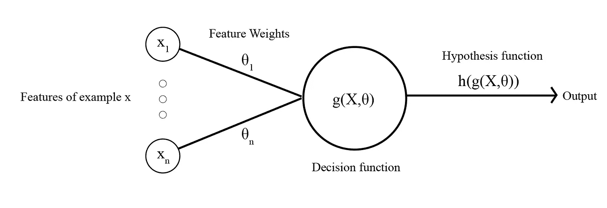

Many models such as Logistic regression, Naive Bayes and Discriminant Analysis to name a few, are all examples of linear models.

线性模型相对于神经网络(非线性模型)的主要优势在于特征权重直接对应于模型中特征的重要性。因此，很容易理解模型已经“学习”了什么。

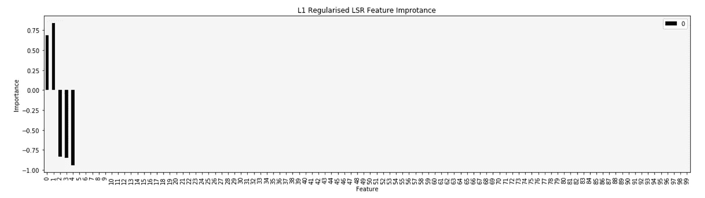

Training a L1 Regularised Regression model it is immediately obvious that most of our features in our dataset are totally irrelevant to predicting our output. It is clear that features 0,1 make positive contributions to the model, whilst the presence of features 2,3,4 in a given example result in negative contributions to the output

任何线性模型的核心都是输入示例和参数/权重向量之间的点积。在线性回归的情况下，这是整个假设函数。其中逻辑回归通过 sigmoid 函数提供点积，使得输出在 0 和 1 之间，因此适用于二元分类问题。

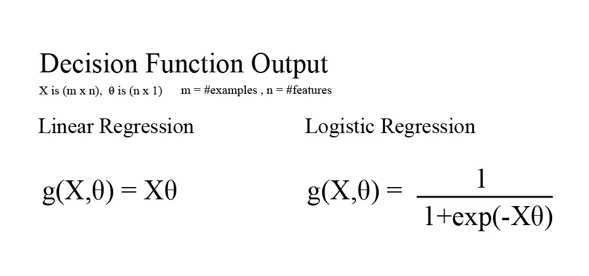

当考虑分类问题时，线性模型的缺点是最终决策边界是一条直线、平面或超平面，其系数等于模型权重/参数，因此只能对可线性分离的数据进行分类，这在处理更复杂的分析问题时可能是一个很大的限制。

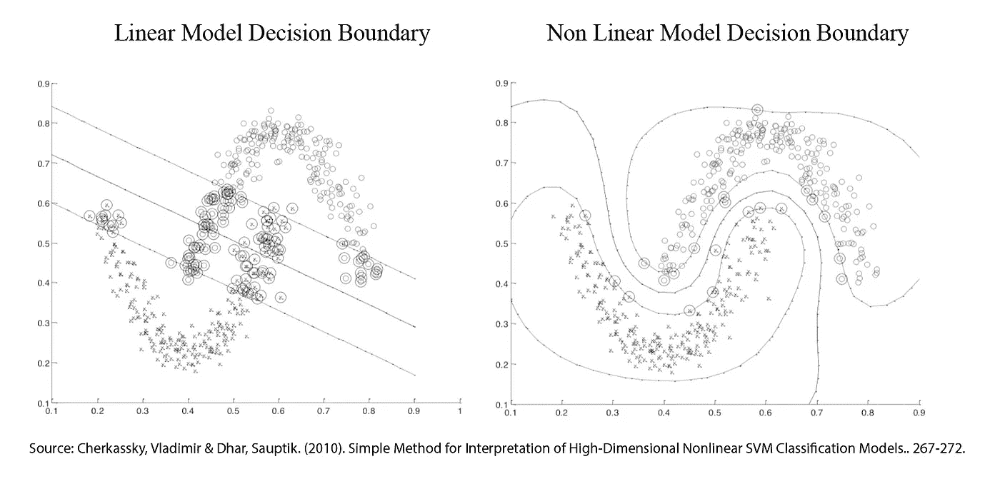

As we can see the simple linear model cannot separate the two ‘Noisy Hyperbola’ as it can only fit a ‘straight’ plane / line through the data. The second example uses a non linear model (actually a kernel trick, we’ll get to this soon)

支持向量机(SVM)是唯一可以对不可线性分离的数据进行分类的线性模型。

您可能会问，SVM 是一种线性模型，如何将线性分类器应用于非线性数据。凭直觉，利用简单的线性回归模型，我们可以手动设计 x，x，x…特征，以尝试实现对一组非线性数据点的拟合。

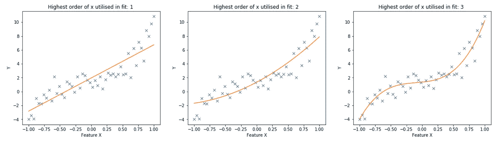

Whilst feature X is the only independent variable we have to predict y, which has an inherently non linear relationship with x, we can engineer x² and x³ features to improve our fit to y.

将这种直觉转移到我们的 SVM，当我们设计 x 特征时，我们本质上是将特征 x 乘以它本身。因此，假设我们通过将特征 x1、x2、x3…的组合相乘来设计数据集的特征，那么理论上我们*可能*最终得到一个空间，在该空间中，您设计的特征是线性可分的。以前面的简单例子为例，看看下面的数据是如何在 x 特征空间中转换成几乎线性的趋势的。

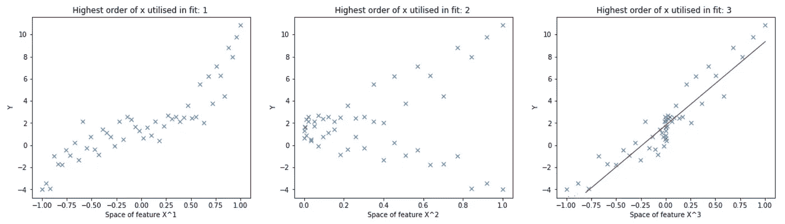

As a further intuition towards the previous example, we can see by transforming the x-axis from the original feature space of x up to the feature space of x³ how the model could be seen as a linear relationship between x³ and y.

不幸的是，要用复杂的数据集实现这一点，需要创建的不仅仅是 3 维空间(特征 x，x，x ),而是实际上非常高维的特征空间，这对于我们数据集中的每个例子来说计算起来都是非常昂贵的。下面我展示了一个函数(x)的例子，它采用我们的原始特征 x，并将它们组合起来以创建许多二阶多项式特征。

**在我们继续**之前:我将使用 x 符号来表示数据点/训练示例，用上标来表示特定的数据点，用下标来表示特定的特征。

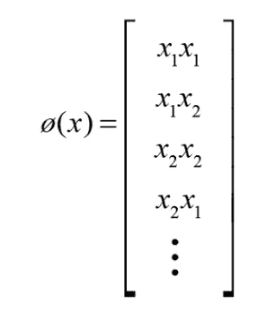

This is a typically high dimensional space, if we had 100 features originally then this function would produce 100 * 100 engineered features. This is computationally expensive, in this case Big-O(n²) time complexity, think of having to write two nested for-loops to generate all the combinations produced by ø(x).

幸运的是，我们有办法解决这个计算复杂性难题！当我们推导 SVM 的优化问题(复杂的公式告诉我们如何在坐标上升过程中推导和更新我们的权重以实现最大化)时，结果是我们的训练输入 x 的特征向量只出现在整个优化公式中的一个地方(以红色突出显示)。

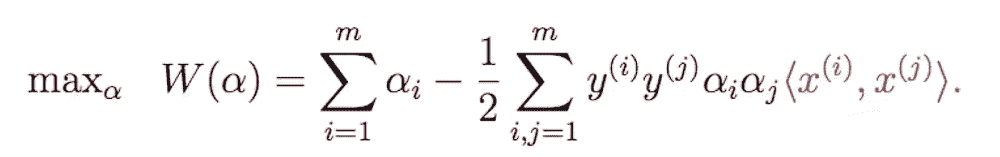

这个点积是用于我们的原始特征空间的，所以现在让我们用我们的工程特征空间替换它。

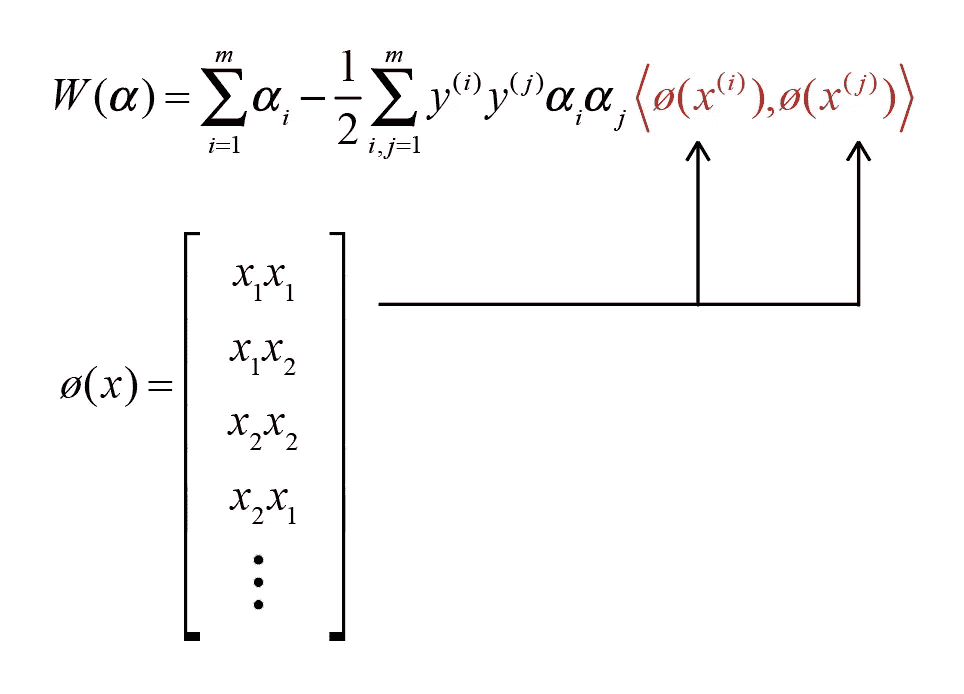

那么这如何有助于降低计算复杂度呢？根据点积的定义，我们将(x(i))的第 I 项乘以(x(j))的第 I 项，然后将所有这些相加，得到一个标量。应用这个我们得到:

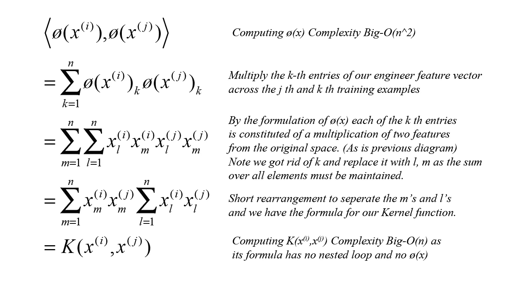

As if by magic we can remove the need to compute ø(x) completely by simple algebraic manipulation by the kernel trick. Now we have all the benefits of a high dimensional feature space without the additional computational complexity

内核技巧是对原始方程的一种非常简单的重新排列，我们可以看到，我们已经完全移除了(x ),只需使用原始输入特征来执行计算，但仍然具有计算高维空间的效果。

我们现在所要做的就是用核等价体(K(x^i，x^j)代替涉及(x)的点积:

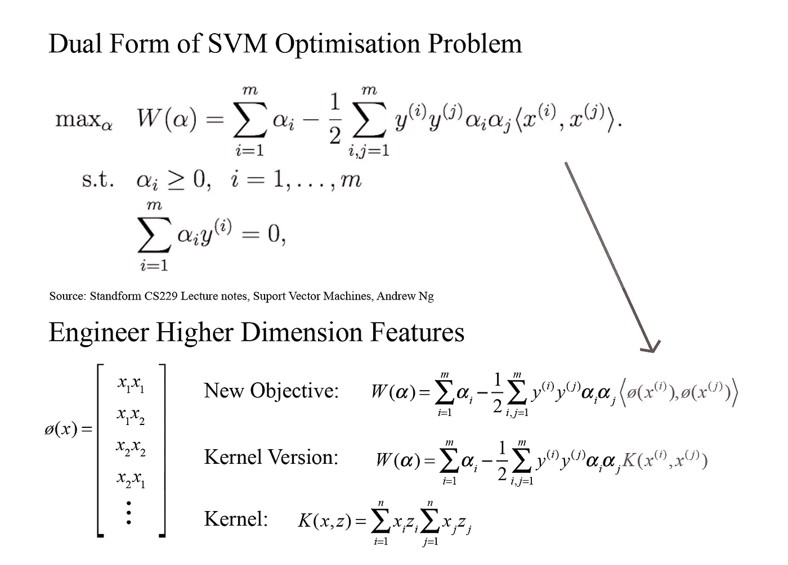

Simple substitution, note that our Kernel is using x and z here just to remove the superscript notation.

类似地，当我们想要使用我们的模型来进行预测时，我们从不明确地计算高维空间的权重，而是使用核技巧来进行预测:

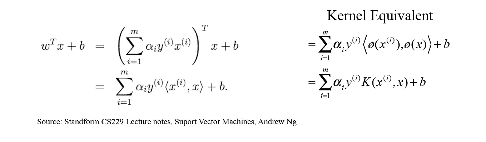

> 在总结中，我们可以使用内核技巧将非线性数据集转换成线性可分的数据集，就在高维空间中。Sklearn 在 SVC 实现中预装了许多内核，包括半径基内核(RBF)和多项式内核，每个内核都有自己的超参数，可以使用交叉验证进行实验调整，以获得最佳结果。

## 一个小故障，解释高维工程特征空间…

还记得我们说过线性模型的最大好处是模型的权重/参数可以解释为特征的重要性。一旦我们设计了一个高维或无限维的特征集，模型的权重就隐含地对应于高维空间，这对我们的理解没有帮助。

相反，我们可以做的是拟合逻辑回归模型，该模型估计给定原始特征时标签 y 为 1 的概率，其中 f(x)是 SVM 决策函数:

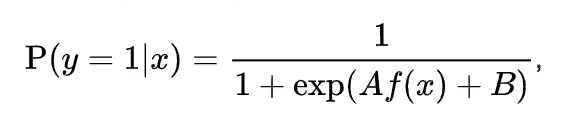

If this looks familiar it is, think logistic regression!

我们使用最大似然估计来拟合这个逻辑回归模型的参数，这种技术被称为普拉特标度，如果你对内部工作方式感兴趣，那么[的原始论文](http://citeseer.ist.psu.edu/viewdoc/download?doi=10.1.1.41.1639&rep=rep1&type=pdf) [3]绝对值得一读。

那么这如何帮助我们理解 SVM 是如何工作的呢？我们只需拟合模型，并在数据集中选择一个点进行评估，然后通过一系列值一次扰动一个特征，同时保持其他特征不变。我们可以用这个来画出模型对每个特征的敏感度的图表。

SKlearn 将这个特性内置到 SVC 模型中，你只需要在初始化时确保*概率=真，*，然后使用 clf。 *predict_proba(X)* 函数获取概率。

在实践中，我发现与其只评估一个点，不如对相关点的集合进行采样，例如 40 个负面例子，然后按特征对概率分布进行平均，以获得更有代表性的东西。

这是我在 NFL Punt Analytics Kaggle 比赛中做的一个例子，研究各种因素对脑震荡的影响:

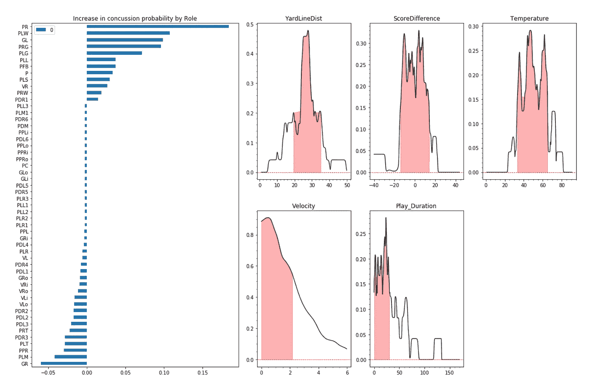

我选取了所有的负面例子，并对它们的概率进行平均，我用红色突出显示了每个特征中球员最有可能受到脑震荡的区域。如果你有一堆像玩家角色这样的热门编码变量，一个技巧是将它们聚集成一个条形图，然后查看该特征出现和不出现之间的概率净变化。

还有一个很好的应用于营销数据的例子[1]，你可以在这里找到[。我还要感谢 Georgi，他花时间回答了我关于这篇论文的一些问题。](https://www.researchgate.net/publication/221649277_Solving_and_Interpreting_Binary_Classification_Problems_in_Marketing_with_SVMs)

## 评估绩效的技术

当您处理涉及 SVM 的高维模型时，如果能够可视化模型如何对数据点进行分类，而不单纯依赖 F1 分数或 ROC AUC 等指标，那就太好了。

虽然有些人可能使用诸如主成分分析之类的技术来可视化分类，但在这样做的时候，我们失去了特征空间的维度，从而扭曲了我们希望实现的视觉效果。

我发现一个很好的技术叫做“项目直方图”[2]，它包括为你的训练和测试集绘制 SVM 决策函数的输出分布图。

在 SKlearn 的 SVC 实现中很容易获得决策函数，只需调用 *decision_function(X)。*您可能希望跟踪数据集标签，以便对投影直方图进行颜色编码，如下所示:

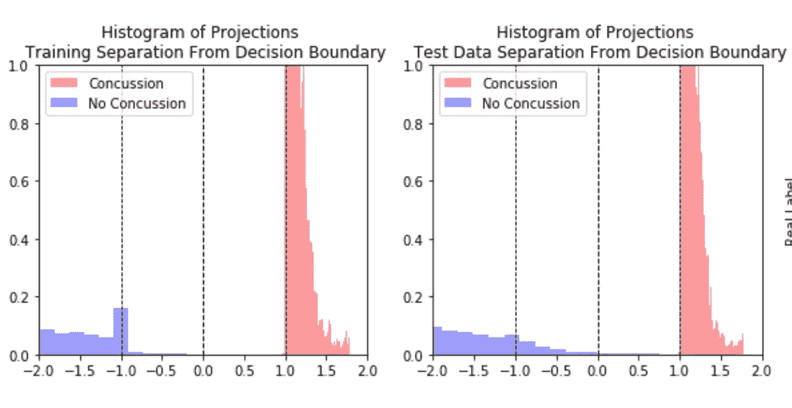

投影直方图很容易解释。直方图 x 轴标识特定训练示例离 SVM 的决策边界的距离(由中间的虚线指示)。

SVM 在决策边界的任一侧具有等于 1 的分离裕度，这是双重优化问题的强制约束(“支持向量”是位于这些裕度上的数据点)。你会注意到，在上面的模型中，有一些泄漏到了边缘区域，并且确实从一个类跨越到了决策边界对面的类中。这是因为我们已经将正则化超参数 C > 0(它允许在一些错误分类和最小化 SVM 目标函数之间进行权衡)。

尽管与高维特征空间一起工作，该图表成功地可视化了决策边界区域和所有分类，而没有损失维度。在混淆矩阵中看到的所有指标(即真阳性、假阳性、真阴性和假阴性的数量)也可以通过直方图看到。它还使我们能够观察模型是否能很好地推广到测试集。如果测试集具有与训练集相似的决策函数输出分布，那么我们可以说该模型具有良好的泛化性能。该模型还可以用于确定给定所选超参数时数据集是否是线性可分的。

## 处理不平衡数据的实用选项

当一个数据集的一个类相对于另一个类有不成比例数量的例子时，我们说它是不平衡的。

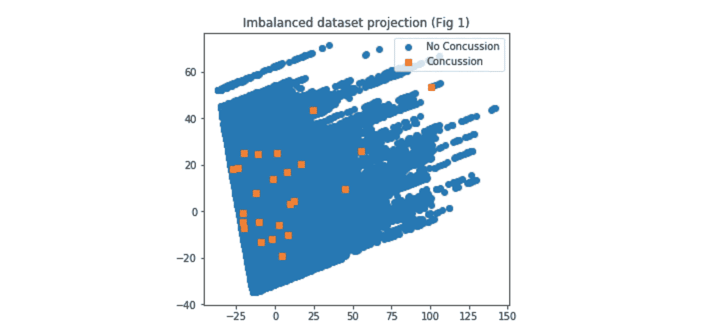

An example of a real world dataset which has an imbalance of over 3000:1

如果我们想建立一个 ML 模型来预测少数民族的出现，这是一个问题，因为我们可以通过简单地将所有少数民族的例子错误分类为多数民族类来实现高水平的准确性。

这在现实世界的数据中很常见，无论是识别恶性组织、信用卡欺诈还是体育运动中的脑震荡，因为我们希望正确识别的事件相对较少。

有两种普遍接受的做法来纠正处理不平衡数据的 ML 模型:

1.  对少数类过采样/对多数类欠采样
2.  增加成本函数中少数样本的权重

**选项 1 : SMOTE**

有两种方法可以对数据进行重采样，要么删除现有样本(欠采样)，要么添加新样本(过采样)。最普遍接受的方法是使用一种称为 SMOTE(合成少数过采样技术)的算法对少数类进行过采样[5]

它比名字所暗示的要简单得多，对于数据集中的每个少数民族点，它选择 k 个最近的其他少数民族例子(通常为 5 个),并沿着“连接”现有少数民族例子的线随机插入新的少数民族例子。

这是一件合理的事情，因为我们只是简单地假设，通过在相似的现有示例之间进行插值，我们将获得相同类别的新示例。

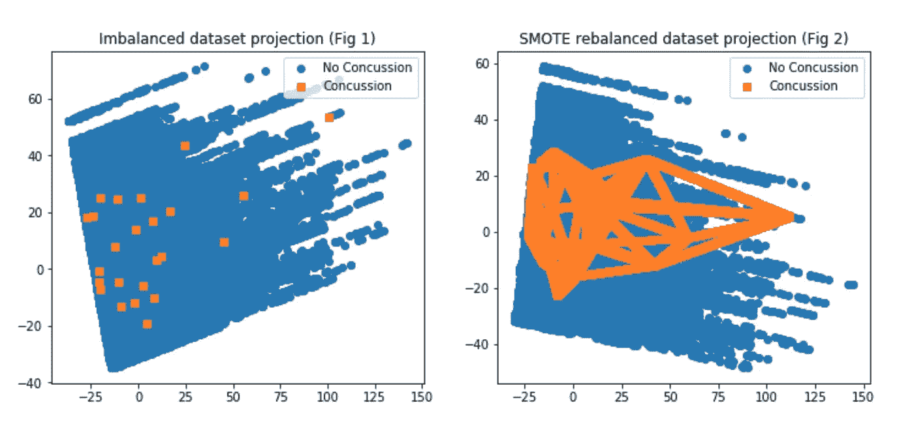

We can see how SMOTE has generated new data points along the lines of existing points

这有助于显著提高模型的性能，并有助于概括少数示例的决策边界。

**选项 2:将权重引入目标函数**

可以采用的另一个过程是在目标函数中为少数实例的错误分类分配更高的权重。这将“激励”算法正确分类少数民族类别。

我没有使用这种方法的个人经验，但它可以与选项 1 结合使用。这是一篇好论文的链接[这里](http://www.cs.ox.ac.uk/people/vasile.palade/papers/Class-Imbalance-SVM.pdf)【4】详述了许多处理阶级不平衡的方法

## 训练一只 SVM 需要多少数据

一个合理的经验法则是，训练示例的数量至少是功能的 10 倍。如果您有大量的训练数据，最好使用少于 50，000 个训练示例，因为 sklearn 中的 SVC 实现具有 O(n)复杂度，这意味着收敛到解决方案的时间随着训练示例的数量呈立方增长，即使在像样的笔记本电脑或 kaggle 容器上也会变得相当慢。

首先在较小的数据集上进行训练，并调整模型的超参数通常是值得的。您可以为模型选择保留一个小型的交叉验证测试集。当您在剩余的数据集上进行测试时，您可能会惊讶于您的模型概括得有多好，尽管您可能已经使用了一小部分实际数据。

注意:如果您对此不熟悉，一个技巧是使用 sklearn 的*训练测试分割模块*并修复随机种子，这样如果您碰巧回去编辑一些早期代码并重新运行训练/模型选择过程，您的结果是可重复的。

# 结论

我希望这篇文章对你有所帮助，如果你有任何意见或问题，请在下面留下，我会尽力回答。

## 论文参考

[1] Nalbantov，Georgi & C. Bioch，Jan & Groenen，Patrick .(2005).用支持向量机解决和解释市场营销中的二元分类问题。566–573.10.1007/3–540–31314–1_69.

[2]切尔卡斯基，弗拉基米尔&达尔，索普蒂克。(2010).解释高维非线性 SVM 分类模型的简单方法..267–272.

[3]普拉特，J. (2019)。*支持向量机的概率输出以及与正则化似然方法的比较*。[在线]Citeseer.ist.psu.edu。可在:【http://citeseer.ist.psu.edu/viewdoc/summary? 买到 doi=10.1.1.41.1639 。

[4]巴图维塔，鲁克山和帕拉迪，瓦西里。(2013).支持向量机的类别不平衡学习方法。10.1002/9781118646106.ch5

[5] Chawla，N. V .等人，“SMOTE:合成少数过采样技术”*人工智能研究杂志*，[www.jair.org/index.php/jair/article/view/10302.](http://www.jair.org/index.php/jair/article/view/10302.)