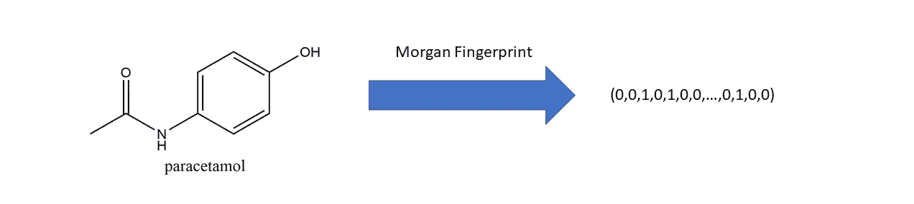

# 在药物发现中使用分子指纹的实用介绍

> 原文：<https://towardsdatascience.com/a-practical-introduction-to-the-use-of-molecular-fingerprints-in-drug-discovery-7f15021be2b1?source=collection_archive---------9----------------------->

Morgan fingerprinting

## 分子指纹用于药物发现有许多原因。今天我们将集中讨论它们在药物结合亲和力预测中的应用。

分子指纹是一种将分子表示为数学对象的方法。通过这样做，我们可以对这组分子进行统计分析和/或机器学习技术，以获得我们作为人类无法获得的新见解。最常见的分子指纹法之一是**扩展连接性指纹法(ECFP)** ，我们今天就来看看。

# **扩展连接指纹识别(ECFP)**

基本想法如下。每一点都将详述。

1.  给每个原子分配一个标识符
2.  基于其邻居更新每个原子的标识符
3.  删除重复项
4.  将标识符列表折叠成 2048 位向量(摩根指纹)

# 1.给每个原子分配一个标识符

我们选择分子中的一个原子，记下:

*   最近邻非氢原子数
*   连接在原子上的键的数目(不包括连接在氢上的键)
*   原子序数
*   原子量
*   连接到原子上的氢的数目
*   环中的原子是(1)还是不是(0)？

这些值形成了*日光原子不变量规则。*

这些值被散列成一个整数。对每个原子重复这个过程，直到所有原子都被分配了散列整数值。作为一个例子，这是这个过程在这个任意分子上的结果:

The first iteration

# 2.迭代地更新每个原子的标识符

用一个例子可以很容易地解释更新过程。以 atom 4 为例，它当前的标识符是-1100000244。

我们初始化一个数组，并将迭代级别(1)和 atom 4 的标识符(-1100000244)添加到其中。到目前为止，该数组为:[(1，-1100000244)]。

接下来，我们为每个非氢连接再添加两个数字。第一个是特定连接的键序(单键、双键、三键和芳香键为 1、2、3、4)。第二个是原子的标识符。然后，我们按照原子标识符降序排列这些对。

最终数组为:[(1，-11000000244)，(1，1559650422)，(1，1572579716)，(2，-1074141656)]。在第一次迭代之后，我们散列这个数组来生成 atom 4 的新标识符:-1708545601。

我们对每个原子重复这个过程；结果如下:

最后，我们的新指纹现在是来自两个迭代级别的这些标识符中的每一个的连接，即:[734603939，1559650422，1559650422，-1100000244，1572579716，-1074141656，863188371，-1793471910，-1789102870，-17085456671

对于*第二次迭代*，我们重复上面的过程，但是现在更进一步。对于每个原子，我们查看它最近的邻居，然后是它的第二最近的邻居，像这样创建一个数组。然后，我们对数组进行哈希运算以生成新的标识符。

# 3.重复子结构移除

我们需要确保，在每次迭代中，我们删除对应于重复子结构的标识符。这可以用一个图像来解释:

The two substructures on the bottom left are identical, so one of them is discarded

# 4.包扎

最后，在执行所需次数的迭代(大多数情况下为 2-4 次)后，我们从每个迭代级别创建一个每个原子标识符的数组，删除重复项，并使用哈希算法将其折叠成一个长度为 2048 位的向量。

我们已经做到了:我们已经把一个分子变成了一种数学表示，通过它我们可以进行机器学习和统计分析。

这可能是一个干巴巴的帖子，但如果你想使用这些指纹进行机器学习，在高层次上理解这一点是很重要的。

> 例如，如果我们想要预测一种药物是否会由于某个特定的部分(比如说苯胺部分)而有毒，那么我们就需要使用至少重复 4 次的指纹来捕获整个环。
> 
> 相反，如果我们想预测疏水性，我们可以只使用 1 或 2 次迭代，因为疏水性更多地取决于原子和键的类型，而不是更大的亚结构。

# 5.后续步骤

要查看用于非常准确地预测药物是否与靶标结合的指纹应用，请参见此处:[随机矩阵理论:预测药物结合的最佳分类器？](https://medium.com/@lakshaithani/random-matrix-theory-the-best-classifier-for-prediction-of-drug-binding-f82613fb48ed)

请随时在 [LinkedIn](https://www.linkedin.com/in/laksh-aithani-7b0451148/) 上与我联系，告诉我你是否喜欢阅读这篇文章/计划在你的研究/工作中实施它。

最好的，

*拉克什*

***来自《走向数据科学》编辑的提示:*** *虽然我们允许独立作者根据我们的* [*规则和指南*](/questions-96667b06af5) *发表文章，但我们并不认可每个作者的贡献。你不应该在没有寻求专业建议的情况下依赖一个作者的作品。详见我们的* [*读者术语*](/readers-terms-b5d780a700a4) *。*