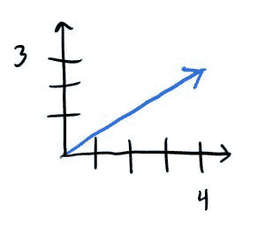
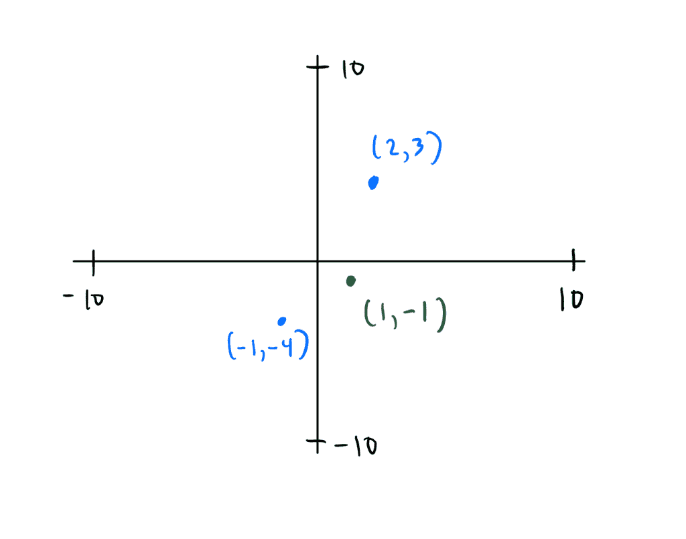
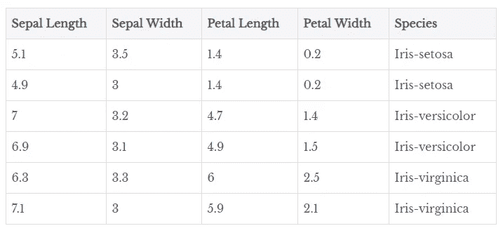
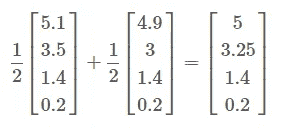

# 对向量和数据的实际观察

> 原文：<https://towardsdatascience.com/a-practical-look-at-vectors-and-your-data-95bde21b37d1?source=collection_archive---------13----------------------->

A vector in the night sky

 [## 想在数据科学方面变得更好吗？

### 当我在我发布独家帖子的媒体和个人网站上发布新内容时，请单击此处获得通知。](https://bobbywlindsey.ck.page/5dca5d4310) 

我记得在我的第一堂线性代数课上，当我第一次学习向量空间时，有一种完全混乱的感觉。什么是空间？这些向量到底是什么？名单？功能？小猫？这和我为科学研究分析的所有数据有什么关系？在这篇文章中，我试图解释向量、向量空间的主题，以及它们如何以一种我以前的自己会欣赏的方式与数据相关联。

# 向量的效用

想象一个你可能在学校里见过的 2 乘 2 的图形。一个 ***向量*** 是一个通常以有序元素列表的形式出现的对象，比如 *(4，3)* ，它位于一个向量空间中，通常被表示为一个箭头，其尾部从原点 *(0，0)* 开始，并在其他某个点结束，比如 *(4，3)* 。

The vector (4, 3) represented as an arrow

这个箭头有几个值得注意的属性:它有方向和长度。向量可以表示许多现实世界的物体，如风、足球的投掷和汽车的速度。它甚至可以代表一种动物的特征，你的购物清单的数量，或者你的电子表格中的一行数据。

# 给你的向量一个空间

但是你怎么知道你的对象或者有序列表是不是一个向量呢？嗯，它一定属于一个叫做 ***的集合向量空间*** 。向量空间可以是任何一组元素(可以是列表、函数或其他对象)，但这些元素必须遵循一些规则:

*   在集合中添加任意两个元素都会导致集合中已经存在另一个元素
*   将集合中的任何元素乘以某个数字(称为标量)会得到集合中已经存在的另一个元素
*   所有的元素都是[结合的](https://en.wikipedia.org/wiki/Associative_property)、[交换的](https://en.wikipedia.org/wiki/Commutative_property)，标量相对于元素加法是[分配的](https://en.wikipedia.org/wiki/Distributive_property)
*   集合中有一个元素，将其添加到任何其他元素都不会改变其值
*   有一些数字(称为标量)使得它乘以任何其他元素都不会改变元素的值
*   集合中的任何元素都有可以添加的元素，这导致元素为 0(称为零向量)

如果你集合中的所有元素都遵循上面的规则，那么恭喜你！你的元素叫做向量，它们所属的集合叫做向量空间。但是违反这些规则中的任何一条，你的集合是*而不是*向量空间，你的集合*中的元素不是*向量。

用数学术语来说，这些规则解释如下:

*   所有元素都在加法下闭合
*   在标量乘法下，所有元素都是封闭的
*   所有的元素都是结合的、交换的，标量相对于元素的加法是分配的
*   每个元素都有一个附加标识
*   每个元素都有一个乘法单位
*   每个元素都有一个加法逆元

# 有形的向量空间

想想你已经知道并喜欢的那套， *R* 。 *R* 就是 *R × R* 是所有可能的二维列表的集合，用以下集合符号表示 *{(a，b) : a，b in R}* 。您可以想象下面的 *R* (显然 *x* 和 *y* 轴的极限并不在 10 处停止，而是接近无穷大):

R² visualized as the Cartesian Plane

集合 *R* 是向量空间吗？如果是的话，它需要遵循上面提到的向量空间的所有规则。考虑第一条规则:在集合中添加任意两个元素会导致集合中已经存在另一个元素。T21 遵循这个规则吗？嗯，比如取 *R* 中任意两个元素，像 *(2，3)**(-1，-4)* 。当你把它们加在一起时，你会得到一个也在 *R* 中的元素吗？是啊！事实上，你得到 *(1，-1)* ，它确实存在于集合 *R* 中。这适用于你在 *R* 中添加的任何两个元素——你总是会得到同样属于 *R* 的东西。

所以你已经验证了第一条规则！但是为了让 *R* 被称为向量空间，你必须验证它遵循所有的规则；确实如此。

简而言之，有许多集合遵循上面的规则，所以你很自然地给它一个名字。现在当有人谈论某个任意集合时，你知道如果集合的元素遵循向量空间的规则，那么这个集合一定是向量空间。

# 菲尔茨

另一个需要注意的是这些标量，你可以用它们来乘向量。标量是属于一个称为 ***字段*** 的集合的元素，该集合具有与向量空间相同的规则，但是具有乘法逆运算的额外好处。

因为域是一个集合，它具有向量空间的所有规则，那么域也是一个向量空间。你实际上一直在使用字段，比如实数集或者复数集。任何时候你在二维网格上绘图，你实际上是在二维区域上绘图。

# 子空间

在实践中，您可能认为对照一个集合检查每个规则以查看该集合是否是一个向量空间是乏味的。你说得对。所以这就是为什么把一个集合识别为你已经知道的向量空间的*子集*要容易得多(就像实数的集合)，并且证明这个子集是非空的，并且在与向量空间相同的运算下(即在加法和标量乘法下)它是封闭的。

如果你能够做到这一点，那么你的子集被称为 ***子空间*** ，它本身也恰好是一个向量空间(同样，为了自己看，取一个子空间并验证它具有向量空间的所有属性)。

所以如果你想证明一个集合是一个向量空间，试着证明它是一个子空间。由于子空间本身就是向量空间，你已经成功地证明了集合是向量空间。

# 真实世界的数据

现在所有这些理论如果你不能应用，都没有太大的帮助。因此，考虑经典鸢尾数据集的前几行，该数据集包含三种不同种类的鸢尾花的样本。

Some rows of the Iris dataset

从标题中可以看出，每个样品的特点是:

*   萼片长度
*   萼片宽度
*   花瓣长度
*   花瓣宽度

每一行特征都可以被视为一个有序列表。第一个列表是 *(5.1，3.5，1.4，0.2)* ，第二个是 *(4.9，3，1.4，0.2)* ，依此类推。但是这些有序列表是向量吗？列表中的每个条目都是一个实数，因此属于实数集， *R* 。因为每个有序列表都是四维的，所以它们存在于 R⁴。由于 *R⁴* 是一个向量空间，那么这些有序列表可以称为向量。

请注意，这些向量中的每个条目代表 r⁴*中的一个维度，其中每个维度对应于数据集中的一个特征(如萼片长度、萼片宽度等……)。也就是说，数据中的每个要素都可以被视为一个随机变量。因为它们是随机变量，我们可以做一些描述性的统计，比如求它们的平均值和标准差。*

因为您已经将表中的每一行表示为一个向量，所以您可以一下子计算出每个随机变量的平均值和标准差。这就是向量的力量。

假设行/向量 *(5.1，3.5，1.4，0.2)* 和 *(4.9，3，1.4，0.2)* 是上表中所有的数据。使用两个向量空间规则，标量乘法和加法，我们可以很容易地计算出每个随机变量的平均值。

Scaling and adding vectors to find the mean

所以萼片长度的平均值为 *5* ，萼片宽度的平均值为 *3.25* ，以此类推。将数据表示为一组向量不仅美观，而且计算性能更高，因为计算机针对涉及向量的计算进行了优化(事实证明，您可以用向量和矩阵运算代替大量 for 循环)。

# 结论

最后，因为您可以将数据表示为向量，这些向量属于一个具有特殊规则的集合，称为向量空间，所以您对数据所做的许多令人惊叹的事情，如:线性特征变换、标准化和降维技术，都可以通过向量空间的规则来证明。

向量空间不仅是任何涉及数据的工作的基础，它还构成了几乎所有数学领域的核心线性代数的基石。即使你正在研究的现象是非线性的，线性代数也是用作一阶近似的首选工具。

简而言之，向量与你的数据紧密交织在一起，非常有用！因此，下次当您将数据导入数据帧并执行一系列操作时，请记住，您的计算机会将您的数据视为一组向量，并愉快地以高性能的方式应用转换。多亏了这些叫做矢量的小东西。

*如果你喜欢我在这里写的东西，一定要看看我的个人博客***，我在那里有一些在媒体上看不到的文章。**

**原载于 2019 年 3 月 5 日 bobbywlindsey.com***。***