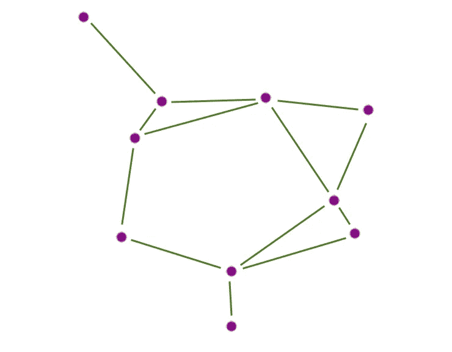

# 相似性评分实践指南，第 1 部分

> 原文：<https://towardsdatascience.com/a-practitioners-guide-to-similarity-scoring-part-1-29625b9ac481?source=collection_archive---------18----------------------->

A sample nearest neighbor graph in 2D

大多数重要的现实世界应用领域都存在一些问题，这些问题不完全适合传统的有监督的机器学习框架。获取标签的成本可能很高，或者定义不清，而高影响力的决策通常需要人来做出决定。需要昂贵的标记和人工干预的应用领域的一个例子是恶意行为者检测，包括高价值欺诈检测或网络入侵检测。在这种情况下，高技能的坏演员将知道避免历史模式，并经常在监督学习的检测能力下飞行。另一个这样的例子是汽车、飞机或其他物理系统的根本原因工程问题。任何明显的系统性和重复性问题都可能已经得到解决，所以剩下的问题可能很难系统地描述，也不符合清晰的历史模式。

很容易将类似的推理应用于医疗保健、能源、零售等其他高价值问题，并得出结论，许多重要问题不会屈服于直接的监督学习。在这种情况下，一项值得机器学习从业者保持警惕的技术是相似性评分。在这篇由两部分组成的博文的第一部分中，我们将介绍这类技术，并通过应用来激励它们。第 1 节介绍并激励相似性评分。接下来，在第 2 节中，我们为一个示例应用程序构建了一个非常基本的相似性评分函数。除了第 2 部分中非常基本的评分之外，第 3 部分涵盖了许多改进相似性评分的方法。我们将在第 4 节用一些主要的收获来结束这篇文章。第二篇文章将深入探讨最困难的实现问题，我们称之为“n 问题”。

# 1.什么是相似性评分，为什么？

相似性评分的目的是创建一个函数，该函数采用一对对象并产生一个量化其相关性的数值分数。对于一对新闻文章，当这一对的内容涉及相同的主题时，这个分数可能较高。汽车缺陷的两个结构化记录的高分可以传达这两个缺陷源自相同的根本原因。与标准的监督学习形成对比:对于两个实体(文档、记录、图像……)e1 和 e2，监督学习的目的是产生函数 f(e1)->数值分数，f(e2)->数值分数对实体 E1 和 e2 的相关性进行排序，而相似性评分的目的是产生函数 g(e1，e2)->数值分数，对实体*对*的相关性进行排序。

我们的希望是，对于我们上面讨论的棘手的、对立的和不明确的领域，对于领域专家工程师、分析师或科学家来说,“g”形式的函数比更普遍构建的监督函数“f”更有用。为什么会出现这种情况？

举个例子来说明，假设我是一名制造工程师，正在查看送往修理厂的破损汽车零件的照片。如果我在数据中观察到一个明显的模式，比如轻微碰撞中撞碎的后保险杠，我可以将这些标记为“破损的后保险杠”，训练一个简单的监督图像分类模型来检测这种模式，并在很大程度上完成。相反，如果我要处理的是我还没有找到原因的发动机故障的增加，第一步可能是深入调查实例并确定这些故障的子组。在进行调查时，我发现一个有用的功能是拍摄一张损坏的发动机照片，并找到其他密切相关的照片。可以使用相似性函数 g 来提供这种“给我看更多像 X 的图片”的能力:给定一个有趣的图片 X，找到使 g(x，y)最大化的图片 y。

> 旁注:你也可以通过在单个例子 X 与其他随机选择的例子上训练监督模型“f ”,然后说“最相似的对象 y”最大化 f(y ),来解决“给我看更多像 X 的图片”的问题。用很少的例子学习“f”通常被称为单次或少次学习，相似性学习是解决单次/少次学习的一种常用方法。该方法的一个版本然后再次简化为[，创建相似性评分函数“g”](https://www.cs.cmu.edu/~rsalakhu/papers/oneshot1.pdf)。

与其将我们的相似度函数“g”应用于单个示例来查找相关示例，我们还不如将其应用于我感兴趣的一批发动机图片来查找相关实体。这是许多推荐系统使用的方法，比如 Spotify(他们开源了他们的近似最近邻居框架[惹恼了](https://github.com/spotify/annoy)，网飞/亚马逊/Youtube 视频和产品推荐也可能使用这种方法。

现在，您对相似性评分的输出以及它为什么有用有了更好的了解，让我们为欺诈检测中的一个样本问题构建一个简单的相似性评分函数。

# 2.第一个例子

## 例如:信用卡欺诈

举一个简单的例子来说明常见的相似性评分技术，假设一家大型银行的一组信用卡欺诈分析师想要找出最近报告的欺诈增加的根本原因。对于每张卡上的每一次刷卡，银行都会收到交易地理位置、供应商名称、时间、金额、涉及的卡号以及大量其他个人/供应商信息。

与上面的制造根源示例一样，我们希望欺诈分析师能够高效地从感兴趣的交易转向可能相关的交易，最终目标是构建一个完整的欺诈网络。我们将使用上面列出的五个字段来构建我们的初始分数:分别使用每个字段对实体进行评分，然后合并这些分数。

## 简单的初始相似性得分

方向性，我们认为同一时间相同金额的交易更有可能是相关的。然后，我们可以将作为金额和时间的函数的相似性得分设置为时间和金额差异的反函数:例如，金额为 1/abs(金额 1-金额 2 ),时间为 1/abs(时间 1-时间 2)。我们可以采用类似的方法来计算物理距离，让距离的相似度为 1/测地线距离(位置 1，位置 2)。

对于分类属性，如供应商名称和涉及的卡号，相似性的一个简单版本是当属性完全相等时设置相似性=1，否则设置为 0。这可能太粗略了:在供应商“Starbucks”上匹配的两个交易可能比在波特兰的特定精品咖啡店上匹配的信息量少得多。这里一个简单的贴现方法是通过供应商/分类变量的频率。因此，如果分类匹配，我们可以设置 score = 1/attribute-frequency，如果不匹配，则设置为零。这种用于在自然语言处理中匹配记号的思想的扩展是逆文档频率，然后取调整后的文档记号频率的余弦或欧几里德相似度。

现在，我们已经为每个属性定义了分数，我们需要跨属性组合分数。最简单的说明方法之一是通过线性组合:权重 1 *时间戳-分数+权重 2 *金额-分数+ …在此计算和上面的简单属性分数之后，我们有了一个可以用来开始与欺诈分析师迭代的初始基线。给定这个简单的基准，我们下一步可以做什么来产生更高性能(计算/内存)和更高质量的评分？

## 提高性能/质量

在检查我们的分数的计算/内存性能时，我们将很快遇到第二篇博文专门讨论的“n 问题”。用我们的信用卡用例来说明这个问题:一个真实的信用卡交易数据集可能有几百万行甚至更多。天真地对每一对 1 亿笔交易评分需要订单 1 亿=10 次⁶计算，这是一个非常大的数字。

相反，我们可以通过提高每个属性得分或如何组合这些属性得分来提高得分质量。例如，我们可以使用 Levenshtein 距离或其他字符串相似性度量来匹配特许店或相关商店。为了提高分数聚合中权重的质量，我们可以基于用户标记的反馈来优化这些权重。进一步提高分数的方法很多，因此在接下来的几节中，我们将致力于深入探讨这些技巧。

# 3.相似性评分技术

提高相似性得分质量的几大类技术包括密度调整、向量嵌入以及同现和列联表。

## 调整密度

两个物体位置的感知相似性通常取决于这些物体周围的环境。在我们的信用卡交易示例中，发生在西伯利亚相距一英里的两笔交易比发生在曼哈顿相距一英里的交易更有可能相关。我们想要调整我们的简单 1/测地线(位置 1，位置 2)分数来解决这个问题。我们想要的基本属性是，对于位置之间的相同距离，密度越高，相似性得分越低。我们将介绍进行这种调整的几种方法:一种是通过显式建模密度，另一种是通过等级转换测地线相似性。

模拟密度的最简单方法之一是使用局部球面高斯分布。在某个位置 X 周围，假设我们将使用距离 X 最近的 100 个点来估计 X 周围的密度，例如，我们可以将这 100 个点到 X 的均方根距离称为球面高斯标准差 R_X，然后我们可以将任意点 Y 和 X 之间的调整相似度设置为 R _ X/测地线(X，Y)。对于曼哈顿的某个点 X，我们期望 R_X 很小，因此大的密度调整测地线相似性只会导致非常小的测地线距离。您可以采用这种想法，并进行一些变化，例如通过使用更高容量的模型，如多元高斯模型或非线性模型。在概率模型的一般情况下，您可以根据 X 周围的密度用 Y 的概率替换测地线(X，Y ),并取 P(Y；分布-近(X))和 P(X；distribution-near(Y))来对称化。

拟合每个点的参数密度需要计算和选择模型和参数，但是我们也可以使用非参数方法。最简单的方法之一是最近邻排序法。设 nn-rank(X，Y)是 Y 在 X 的最近邻居列表中的秩索引，从最近到最远排序。将我们的 nn-rank-相似性得分(X，Y)设为 1/nn-rank(X，Y ),则说明了变化的密度。对于 nn-rank(X1，Y1)=nn-rank(X2，Y2)，曼哈顿的一些点 X1 和 Y1 需要比西伯利亚的一些 X2 和 Y2 更近，以满足我们最初的密度标准。在我们的参数方法中，我们可能再次希望通过取 1/nn-rank(X，Y)和 1/nn-rank(Y，X)的最小值、最大值或平均值来对称化我们的分数。

这种密度调整的思想可以应用于任何空间中的任何属性，而不仅仅是测地线空间中的位置。例如，如果应用于信用卡交易的时间戳，我们可以避免在假日季节与一年中其他不太繁忙的时间过度匹配。当应用于零售商店销售的产品时，与纸巾等较窄的类别相比，这可能会迫使玩具等广泛而繁忙的类别发生细分。我们可能会说，两个玩具不应该被视为相似和可替换的，而两个品牌的纸巾更接近，因为类别不太密集。

## 向量嵌入

在我们的信用卡交易示例中，所有的属性都是相对低维的:纬度/经度、分类、数字和时间戳数据。如果我们被赋予更高维度的属性，比如音频信号、图像或文档，会怎么样？像深度学习这样的向量嵌入方法通常在处理高维数据时获得最先进的结果，这同样适用于相似性评分。

处理深度向量嵌入进行相似性评分的一种方法是，假设我们给定了一个特定于形态的深度嵌入函数“h ”,它获取一个文档、图像或音频片段，并返回一个嵌入向量。对于实体 e1 和 e2，我们将我们的相似性函数设为 g(h(e1)，h(e2))，其中 g 是向量相似性函数，如余弦相似性、jaccard 相似性或反欧几里德距离。这些预先训练的深度嵌入函数“h”中的许多已经以通常半监督的方式在大量不同的语料库上被训练，例如[图像嵌入](https://github.com/tensorflow/models/tree/master/research/slim#pre-trained-models)、[文本嵌入](https://github.com/google-research/bert)和[音频嵌入](https://research.google.com/audioset/)。

在无法获得适合目标任务的预训练嵌入的情况下，许多论文展示了端到端的训练相似性得分[。训练嵌入函数“h”通常在实体对上的“相关/不相关”二进制标签上完成。那些二进制标签上的错误通过交叉熵或其他分类损失、通过 h(e1)、h(e2)之间的余弦/欧几里德/…相似性、然后通过应用于两个实体的参数“h”被反向传播。注意，应用于 e1 和 e2 的网络“h”的参数是共享的，因此单个标签导致“h”的两个参数更新。](http://papers.nips.cc/paper/769-signature-verification-using-a-siamese-time-delay-neural-network.pdf)

与我们讨论的其他属性评分方法一样，我们将把使所有对的相似性评分在计算上和内存上高效的问题放在一边。

## 共现和列联表

到目前为止，我们已经讨论了仅基于这些实体的核心属性的相似性评分实体:个人实体的名称、事务实体的时间戳或者图像的内容。在应用于用户项目推荐系统时，利用与实体相关的动作或交易数据也很常见，称为[协同过滤](https://en.wikipedia.org/wiki/Collaborative_filtering)。让我们用一个例子来具体说明这一点。

对于信用卡交易，我们有一些可用的实体类型:拥有信用卡的人或公司、供应商和交易。假设我们试图根据人们在哪里购物来识别哪些人是相似的，根据共同的兴趣来推荐友谊。作为开始，我们可以说“在许多相似供应商处购物的人应该是匹配的”。另一种说法是，如果 A 和 B 分别是约翰和玛丽购物的供应商集，那么如果 A&B 比预期高得多，我们应该匹配约翰和玛丽。许多指标可以用来确定 A&B 是否足够高:A 和 B 的 jaccard 相似性，或者像[卡方](https://en.wikipedia.org/wiki/Chi-squared_test)、 [G](https://en.wikipedia.org/wiki/G-test) 和[费希尔精确测试](https://en.wikipedia.org/wiki/Fisher%27s_exact_test)这样的列联表测试。

只有当 John 和 Mary 在同一个供应商处购物时，这才是匹配的，但是如果他们有相似的兴趣，但不在完全相同的地方购物呢？例如，我们可能会发现他们都对健身感兴趣，但一个人在耐克购物，另一个人在 Planet Fitness 购买健身会员。在这种情况下，为了帮助匹配 John 和 Mary，我们可以分两个阶段首先匹配供应商，然后使用供应商匹配来匹配人员。例如，在第一阶段，我们可能会发现耐克和 Planet Fitness 在购物人群中有很大的 jaccard 相似性，并给这两个品牌一个高分。利用这一知识，在第二阶段，我们可以说 John 和 Mary 具有高匹配分数，因为他们有一个共同的高分数供应商对。我们可以说，任何两对人的分数是所有匹配这两对人的供应商分数的加权和、平均值或其他总和。

在利用这种“用户行为”数据时，可以采取更广泛的方法，但通常最重要的是知道当交易信息可用并与被评分的实体相关联时，它通常是值得利用的。

# 4.总结

我们已经简要介绍了相似性评分技术，在下一篇文章的[中，我们将深入探讨 n 问题。](https://medium.com/@melkherj/a-practitioners-guide-to-similarity-scoring-part-2-the-n%C2%B2-problem-af707461276a)

当你自己建立相似性分数时，你可能想得到一些要点:

*   在对立的、频繁变化的或者标签稀少或昂贵的问题领域中，尝试使用与领域专家紧密结合的相似性评分
*   调整相似性得分中的频率和密度
*   首先将相似性评分问题视为成对二进制分类:标记二进制匹配并使用二进制分类度量
*   除了手动设计的配对属性分数之外，还存在更多种类的技术。这些包括深度嵌入的向量相似性和协作过滤。