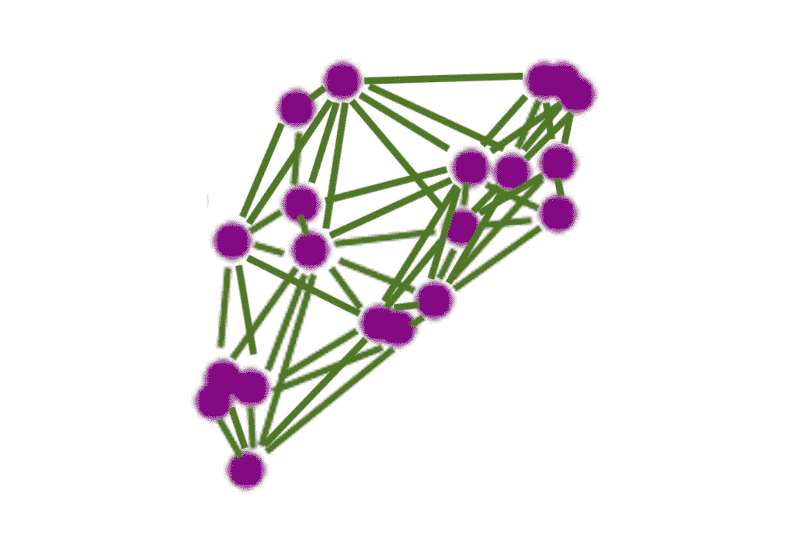

# 相似性评分实践指南，第 2 部分:n 问题

> 原文：<https://towardsdatascience.com/a-practitioners-guide-to-similarity-scoring-part-2-the-n%C2%B2-problem-af707461276a?source=collection_archive---------30----------------------->

Sometimes connecting all pairs of nearest neighbors can be a lot of pairs

## 参见上一篇文章[“相似性评分实践指南，第 1 部分”](https://medium.com/@melkherj/a-practitioners-guide-to-similarity-scoring-part-1-29625b9ac481)

# 处理 n 问题

在[之前的帖子](https://medium.com/@melkherj/a-practitioners-guide-to-similarity-scoring-part-1-29625b9ac481)中，我们鼓励相似性评分，并提供了示例技术和应用。在构建和应用相似性得分时，从业者接下来可能面临的最困难的问题之一是我们称之为 n 问题的问题:对于 n 个实体，计算和存储所有对的相似性得分需要 n 个空间和计算。

在这篇文章的第一部分，我们将深入探讨 n 问题，并将其与排序进行比较。接下来，在第 2 和第 3 节中，我们将介绍一些处理计算/空间问题的常用方法:分块和近似最近邻。在第 4 节中，我们将调查解决与标签收集、模型训练和性能评估中出现的 n 问题相关的问题的方法。最后，在第 5 部分，我们将总结这篇文章的主要收获。

# 1.n 问题:排序的类比

相似性得分通常以两种方式消耗，我们称之为批处理和实时评分。批量评分的目的是给定一大组实体，产生所有匹配的实体对。对于实时评分，我们假设我们有一个可以索引或处理的大型初始实体集，并且我们必须实时返回一小组实体相对于该大型初始集的最高评分匹配。

解决批量用例需要运行 O(n)个相似性分数，以及每个实时对象查找的实时 O(n)。对于大多数大小 N>10M 的真实数据集，O(n ) batch 和 O(n) per object realtime 的计算/内存太多。与简单方法具有相似性能属性的一个密切相关的问题是排序:简单的批量排序需要 O(n)次比较，在排序后的数组中简单的插入/查找也需要 O(n)次比较。就像二分搜索法树/堆可以用于排序以实现 O(n*logn)批量排序和 O(logn)增量查找/插入一样，我们将通过构建有效的索引来实现 O(n*logn)批量和 O(logn)查找性能。我们将从头到尾从类比到排序，通过一些假阴性的假设来获得这些性能特征。

# 2.阻塞

早期高效排序算法中使用的一个最简单的想法是[桶排序](https://en.wikipedia.org/wiki/Bucket_sort)，当扩展到[基数排序](https://en.wikipedia.org/wiki/Radix_sort)时，仍然在使用。对于最近邻搜索，我们将遵循一种类似的方法:从一种非常类似于桶排序的方法开始，我们称之为分块，然后用多重分块来扩展和改进这种方法。让我们通过对来自[之前的博客文章](https://medium.com/@melkherj/a-practitioners-guide-to-similarity-scoring-part-1-29625b9ac481)的信用卡交易应用阻塞来具体说明这一点。

## 基本阻塞

我们的目标是产生所有高评分的信用卡交易对。为此，我们对邮政编码进行“屏蔽”。这意味着，我们不是使用 O(n ) compute 对所有交易对进行评分，而是只考虑具有相同邮政编码的交易对。给定每个邮政编码最多 m 个邮政编码交易，那么每个交易将只需要与最多 m 个其他交易进行比较，需要 O(n*m)的计算和空间。如果 m 是ω(n ),这仍然是二次的，但是如果一个开发者成功地使 m 比 n 小得多，性能可以变得容易处理。

请注意，这为我们的相似性评分管道增加了一个额外的步骤。首先，我们生成候选对，用分块来评分，然后用我们的相似度函数对这些候选对进行评分。在批处理和实时评分用例中，这是一个相对容易实现的附加步骤。如果我们的目标是批量产生所有高相似性得分对，我们可以通过邮政编码事务的自连接产生阻塞候选。对于实时相似性评分，可以预先计算映射邮政编码-> set(邮政编码中的交易)的查找表，并根据该表高效地查找新的交易邮政编码。

## 块密钥过滤和联合

您可能认为阻塞是缓解 n 问题的一种非常简单的方法，但是性能和质量会受到阻塞键选择的显著影响。例如，由于我们对邮政编码的选择，我们永远不会匹配不同邮政编码的信用卡交易，从而降低了召回率。精确度和假阳性应该不会受到阻塞的严重负面影响，因为我们根据分数后过滤掉候选匹配，但是大量的假阳性阻塞匹配会影响性能。10%精度的阻塞精度意味着我们必须将 5 倍于 50%阻塞精度的示例数计分。低得多的精度(如 1%或 0.1%)可能会对性能产生 100 或 1000 倍的影响，因为有大量虚假候选项需要评分，因此非常低的精度可能会导致非常差的性能(尽管质量不太可能)。

影响精度和性能的最常见问题之一是重键。如果我们通过邮政编码阻止信用卡交易，其中一个邮政编码在曼哈顿，比如说有 100 万笔交易，我们可能需要对大约 100 万笔交易进行相似性评分。缓解这一问题的一个简单方法是过滤掉重要的阻塞键。所以先按键计算实体的计数，不要在计数高的键上自连接或匹配。然而，这以质量为代价提高了性能:我们永远无法匹配曼哈顿的两个事务！处理这个问题的一种方法是生成多组阻塞键，以及跨这些键的联合候选。例如，我们可以考虑对具有相同邮政编码或供应商名称的交易对进行评分。潜在匹配候选项的数量最多与候选键类型的数量成线性比例，因此联合几个正交的块键不会显著影响性能。

在许多情况下，仔细选择和联合块密钥，并过滤掉重要的密钥，就足以产生达到质量和性能标准的评分管道。当只有重要的键(名字、性别、邮政编码)可用时，有一些更困难的用例。这就引出了我们的最后一个阻塞变体:多重阻塞。

## 多重阻塞

这里的方法是:代替作为 K_name，K_gender，K_zip 上的块密钥的并集的块密钥集合 K(e ),将块密钥定义为这些集合的笛卡尔乘积。所以一个键可能是(Emily，女，12345)。这些组合键的出现频率较低，因此对性能的影响比仅阻止性别更低。这些键可以像正常的阻塞键一样在频率上进行过滤，或者如果独立的话，可以通过组成键的频率的乘积进行过滤(例如 count(Emily)* count(female)* count(12345)< thresh)。后者可能更有效，因为不同边缘计数的数量应该小于笛卡尔积键的不同计数。

对阻塞键、组合和频率的深思熟虑的选择为实现留下了很大的设计空间。当唯一可用的数据是矢量嵌入时，如何应用这种方法也不清楚。接下来，我们将考虑一组不同的解决 n 问题的方法，它们开箱即用，并且在向量嵌入上运行良好。涉及的算法更复杂，实际上通常在库中实现。

# 3.近似 K 近邻(AKNN)

## AKNN 简介

在上一节中，我们假设我们的数据由许多列组成，可以从中选择块键(zip、name 等)，我们将仔细选择块键来处理 n 问题。如果我们处在一个输入是单个向量的世界，比如说一个由图像上运行的深度卷积网络产生的向量，会怎么样？如果我们的相似度函数是欧几里德相似度或者余弦相似度呢？

然后，我们将问题简化为用常用的矢量距离求解最近邻。近年来，在大规模近似求解最近邻的方法方面取得了很大进展，Spotify 和脸书等大型科技公司使用这些方法来处理数十亿条记录。

了解各种方法的性能并保持最新的一个好方法是查看[近似最近邻基准库](https://github.com/erikbern/ann-benchmarks)。如果你现在仔细看，你会看到 [HNSW](https://arxiv.org/abs/1603.09320) 出现在大多数表现最好的图书馆中。从某些指标来看，该算法是规模上性能最好的算法，并让我们回到我们开始时的排序类比！

## 最新技术水平:HNSW

事实证明，HNSW 被很好地理解为对[跳过列表](https://en.wikipedia.org/wiki/Skip_list)的概括。我们可以把跳表数据结构想象成一棵分层的树。底层是包含排序项目的链表，排序链表上面的层仅具有前一层中项目的“p”部分。根据实现情况，这可以无限地继续下去。查找是通过在顶层找到最匹配的项目，然后在下面的每一层进行局部搜索，直到在底层。

HNSW 的底层连接每个项目的 K 个最近邻居，而不是链表。上面的层对 p 个节点进行采样，连接这些节点的最近邻居。这种情况一直持续到各层。查找、插入、删除以类似于跳表的方式发生，但是在邻域图上而不是在链表上。例如，查找从顶层开始，沿着 KNN 图爬行，直到到达具有最接近匹配的局部最小部分，然后继续向下到较低层。然后，对于 n 个候选实体，我们还期望 HNSW 中插入、查找、删除操作的性能为 O(logn)。就像二叉查找树 O(logn)操作可以用于在 O(n*logn)操作中对数据集进行排序一样，我们可以在 O(n*logn)操作中使用 HNSW 索引来检索大小为 n 的数据集中相似性得分最高的实体对。

有许多其他完全不同的近似最近邻搜索方法。一些 AKNN 索引需要较少的内存，或者更容易实现(一些 LSH 方法)。尽管在大多数情况下，HNSW 支持的库，如 FAISS 和任何在[近似最近邻基准库](https://github.com/erikbern/ann-benchmarks)中列出的 HNSW 支持的 python 库应该工作良好。

从我们之前的帖子到现在，我们已经调查了获得高性能和高质量的相似性评分管道所需的部件。缺少的是评估性能和为训练获取无偏见的标签，由于 n 问题，这被证明是一个不平凡的努力。

# 4.标签收集和性能评估

为了建立高质量的分数，有必要提供标记的数据和量化的性能评估。为此，让我们从简单的二进制分类度量开始。假设对于随机采样的实体对，我们标记真/假，这些实体是否应该匹配。然后，我们可以计算 ROC/精确召回曲线，并使用与标签对齐的标记实体对的分数计算 F1/AUC。

## 召回集合

这种方法听起来很简单，但是在实践中会很快遇到另一种形式的 n 问题:严重的类倾斜。假设我们有一个 n=1 亿个实体的基础事实集合，平均每个基础事实中的实体匹配 100 个其他实体。由于我们将所有成对的实体(n*(n-1)/2 ~ n)视为要标记的示例空间，因此我们的二进制分类基础率是~100*n/n = 100/n = 1/1M。请记住，召回率是# {真阳性}/(# {真阳性}+# {假阴性})，因此我们需要标记几百万对来获得对假阴性和召回率的统计意义上的估计:对于大多数应用程序来说，这是一个难以维持的标签数量。根据定义，我们的模型不能帮助我们找到它不能找到的配对(假阴性)，那么我们该怎么办？手动从百万双鞋中筛选出更多的匹配？

一种方法是随着时间的推移使用各种资源来不断改进我们称之为“回忆集”的东西。对于一个相对较小的(假设 50 个)随机抽样的信用卡交易集，一个“回忆集”给出了匹配 S 中某个交易的每一对交易。给定这个集 S，我们就可以通过运行模型来查找所有模型预测的与集 S 的连接，从而获得对真阳性和假阴性的无偏度量来估计回忆。这个集很小是因为在构建它时需要的劳动:使用特别搜索、模型的先前版本和数据集范围的可视化/过滤的组合。随着相似性模型的改进和捕捉不同种类的匹配，这个“回忆集”也可以随着时间积累。这是我们能够找到的与 S 相关的最大匹配集，随着时间的推移，我们可以改进并使用它来更好地评估我们的算法。虽然劳动密集，但收集这一集合并使用它来训练模型和提高评分通常是非常值得的投资。

精度呢？给定一个固定的模型，top-N precision 很容易评估:截取前 N 个得分对，标记并计算精度度量。因为我们希望精确度大于 1%或者甚至大于 50%，在这个过滤的高分集合中的类别不平衡不像召回那样糟糕，并且通常只需要 10 或 100 个标签。缺点是，这需要为每个新模型版本重新标记顶部的 N 对。为了避免重新标记，我们可以使用上面定义的召回集来嘈杂地评估实验模型，并且仅对于重要的模型，重新标记前 N 对，以更准确地估计具有大量标记的精度。

## 按集群大小对指标进行加权

我们已经介绍了如何在一个高度类倾斜的环境中收集标记数据集来估计精度和召回率，但是这些度量标准是正确的目标吗？在评估相似性评分的精确度和召回率时出现的一个常见问题是高度关联的实体。假设我们发现了一个大型集群，其中有一家银行的 10 万笔欺诈交易应该与其他银行的交易相匹配。我们的召回指标将高度倾向于评估该集群的质量:大小为 k 的集团中匹配对的数量是该集团大小的 O(k ),而不是 O(k)。我们通常希望我们的误报和漏报在事务数量中按比例(而不是平方)计算。减轻这个问题的一个方法是降低召回集中的假阴性计数。对于具有 k 个连接的实体，不是每个连接的实体对真阳性和假阴性贡献计数“1 ”,而是它们贡献 1/k。对于精度，类似的调整是可能的，最终结果是我们仅将集团对总度量的贡献加权为 O(k)而不是 O(k)。

以上是对相似性评分进行性能评估的最简单的方法之一，但绝对不是唯一的方法。为了弱化二元是/否的匹配，使用了[三元标签](https://arxiv.org/abs/1404.4661)和基于排名的评分/度量/损失函数。有时计算最终聚类和连接组件的质量度量，而不是对相似性分数的质量度量也是明智的。与大多数机器学习问题一样，一开始保持指标简单，然后增加复杂性是明智的。

# 5.总结

以上主要提示可以总结为:

*   阻塞是缓解 n 问题的一种简单但劳动密集型的方法。按频率过滤掉候选的阻塞键，当组合键时，尽量选择那些键是独立的。
*   当相似性评分是对向量的简单欧几里德/余弦相似性/雅克卡度量时，值得考虑开箱即用的近似最近邻方法。从大多数基准来看，HNSW 是目前性能最好的方法，并且有许多易于使用的库支持它(FAISS、python 库等)
*   在早期投入资源收集回忆集，并继续改进它。这将指导您的建模和评分改进工作
*   如果您在数据中观察到大集团，请尝试用基础真实数据集中与之匹配的实体数量来贴现每个实体的召回/精确计数。