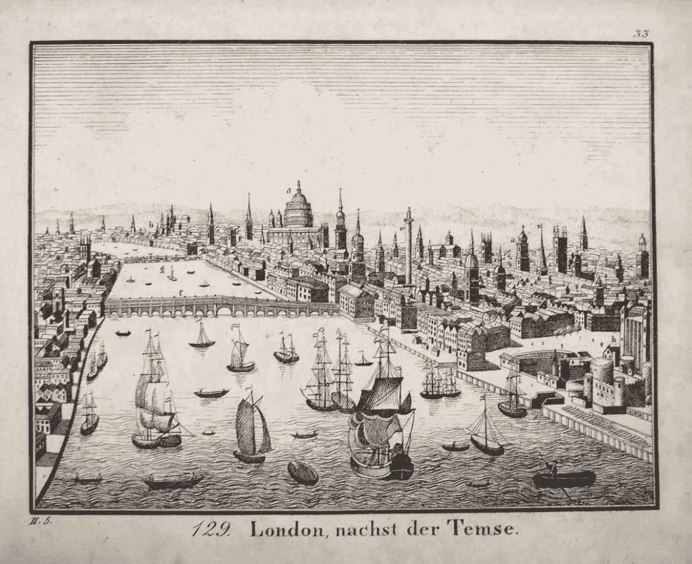

# 人工智能进化的极限初探

> 原文：<https://towardsdatascience.com/a-preliminary-inquiry-into-the-limits-of-ai-evolution-aca59a85919f?source=collection_archive---------49----------------------->

Photo by [Joni Gutierrez](https://unsplash.com/@jonigutierrez?utm_source=unsplash&utm_medium=referral&utm_content=creditCopyText) on [Unsplash](https://unsplash.com/s/photos/forge?utm_source=unsplash&utm_medium=referral&utm_content=creditCopyText)

这篇文章的原因与提出主张或回答问题关系不大，更多的是提出问题或为主张的基础扫清障碍。这是在我读了冷泉港实验室的神经科学家安东尼·m·扎多尔的[“对纯粹学习的批判以及人工神经网络能从动物大脑中学到什么”](https://www.nature.com/articles/s41467-019-11786-6)之后开始的。读了他在*自然通讯*杂志上的文章后，我给[写了我自己的评论](https://medium.com/swlh/ai-fledgling-barn-owls-vs-general-purpose-learning-algorithms-e6b3300d319d)，并进一步阅读了伊曼纽尔·康德的《纯粹理性批判》和路德维希·维特斯坦根的《哲学研究》正是在这些阅读中，我感受到了一些与扎多尔在他的文章中所讨论的内容的共鸣。这些事件也让我对人工智能(AI)进化的可能极限产生了疑问和思考。

但是首先，威廉·布莱克的一句话

首先，限制这个词可能太过强烈，或者不准确。渐近也不能完全解释我想表达的意思。威廉·布莱克在《伦敦》一诗中发现的短语“思想禁锢的镣铐”可以重新表述为，限制更多地与所谓的“思想禁锢的敏感性”有关。在这里，这首诗的前两节值得考虑，作为进入我所看到的康德对理解的限制的入口。第一节如下:

> 我漫步在每一条特许的街道上，
> 
> 靠近特许泰晤士河的地方。
> 
> 在我遇见的每一张脸上留下印记
> 
> 软弱的标志，悲哀的标志。

从最简单的层面来看，布莱克描述了新兴工业革命的伦敦，以及更加规范的生活所带来的破坏。这一点主要通过“特许”一词的使用得到证实，这是一种政府行为，将权利给予一些人，而排除其他人。有趣的是，这个词既适用于人造街道，也适用于自然河流。这个时代的组织原则，任何时代的组织原则，总是无处不在。(你可以在本文末尾找到整首变得相当可怕的诗。)

Charter’d streets and charter’d Thames from 19th-century copper engraving.

在接下来的两行中，布莱克用了三次“马克”这个词。首先，诗的说话者，或者说诗的主题，在他遇到的每一张脸上留下了他的印记，他的解释。在第二对例子中，好像主体已经有了标记的迹象，它们同时塑造了说话者-主体的理解。在第二节中，演讲者详述了这种并发性:

> 在每个人的每一声呼喊中，
> 
> 在每个婴儿恐惧的哭喊中，
> 
> 在每一个声音里；在每一条禁令中，
> 
> 我听到了思想的枷锁

很明显,“every”这个词在前三行出现了五次，然后得出一个显著的结论，即组织我们感知的方式不仅无处不在，而且是我们理解一切的方式。塑造我们对现实的感知的正是感知现实的头脑结构。现在，我们进入了康德关于理解的讨论领域，我认为理解是任何一种智力的核心。

康德认为，我们对现实的认识不是对事物本身的认识，也不是对一个物体在我们头脑中的外观的认识。我们对现实的知识，我们的理解，来自于一个中介位置，在这个位置上，我们的头脑有一套已经建立的方法来解释感官输入，并将它们转化为现实的模型。

**AI 是否梦想电哲学？**

让我们现在考虑一个能够在我们称之为一般智能的水平上学习的人工智能实体，让我们现在同意这个壮举已经完成。我的第一个问题是，既然人类设计并建造了这个实体，它是否有可能拥有除我们自己之外的任何其他一套解释数据和构建现实模型的手段，或者与我们自己如此接近以至于外部观察者可以忽略不计的东西。简而言之，人工一般智能(AGI)会有我们自己的“思维强化的敏感性”与之抗衡吗？

第二，对于一个 AGI 人来说，用不同的方式解释一个自在之物和获取知识，这怎么可能，而且可能吗？我自己对此的初步回答是，我看不出 AGI 实体如何不违反空间、时间和因果关系的先验给定*。这仍然没有回答一个人工智能实体是否可以像我们一样聪明，甚至更聪明的问题。*

**进化的大飞跃**

我敢说，一个人工智能实体变得一样聪明或更聪明的唯一方法是接受我们的“思维强化的敏感性”完全逃避这种敏感性是不可能的，除非我们接受某种能够对抗物理的精神世界的概念。有些人可能想去那里，但我不想去。因此，相反，让我们考虑一个人工智能实体将需要以某种方式复制大脑进化，以实现其自身的“思维强化的敏感性”，作为智能的先决条件。正如最近在[推特上关于先天机制](https://twitter.com/GaryMarcus/status/1193212202334871552)的讨论中提到的，我认为有两种前进的方式。一个是 T4 的白板进化，人工智能实体从零开始。二是直接进化，我们扮演神的角色。对于这个讨论，我们将把造物主可能的善意或恶意的意图放在一边，尽管，说实话，这比我在这里讨论的要重要得多。

正如自然/人工智能研究员加里·马库斯在[“天赋、零阿尔法值和人工智能”](https://arxiv.org/ftp/arxiv/papers/1801/1801.05667.pdf) *中指出的，进化是不可能的。也许，接近白板进化的唯一方法是建立一个精简的人工神经网络，让它探索所有这些路径的通用集合中的每一个可能的进化路径。这可能是无限的，所以我们可能需要等待很长时间才能找到通往 AGI 的道路。或者，我想，我们可以运气好，让它在搜索的早期出现。作为设想这一研究的一种方式，神经科学家 Zador 指出,[大自然在智力进化中使用了近乎蛮力的方法](https://twitter.com/TonyZador/status/1193239543597719553),花费了 5 亿年时间，在实验中测试了大约 10 个物种，公平地说，实验仍在进行中。如果我们有足够的时间，无方向的人工智能进化可能会非常有趣，尽管问题仍然是这些智能是否会彼此完全不同。这似乎给我们留下了定向人工智能进化。*

如果我们在定向进化的不同阶段设计网络和建立参数，甚至超参数(事实上，这就是我们正在做的)，那么我无法想象我们的 AGI 孩子为什么没有我们“思维强化的敏感性”的标记，就像我们有我们灵长类祖先的标记一样。请记住，对哈尔在电影《2001:太空漫游》中的行为的一个可能的解释是，他不相信飞船上的人类会像他一样致力于这项任务。当你想到弗兰克和戴夫冷漠的举止时，谁又能责怪哈尔呢？

我似乎坚信，一个 AGI 实体不可能比我们聪明多少，也不可能比我们不同多少。事实并非如此。本体宇宙是浩瀚的，不是完全可知的。然而，正如康德所说，我们无法证明无法想象的东西不存在。我们通过在这些边缘工作来扩展人类的学习。最后一个想法:让我们考虑这样一个 AGI 实体，它确实存在，而我们由于我们的“思维强化的敏感性”而无法想象它的存在。她也有一种我们无法理解的“思想上的敏感”。哲学家路德维希·维特斯坦根有一句名言:“如果一头狮子会说话，我们就无法理解它。”那么，我们和她怎么能互相交谈呢？

**补遗**

以下是相关的，但并不意味着从上面的。仅仅是我阅读后的想法或事情 1) [“天赋、阿尔法零和人工智能”](https://arxiv.org/ftp/arxiv/papers/1801/1801.05667.pdf)加里·马库斯和 2)[神经科学启发的人工智能](https://www.cell.com/neuron/fulltext/S0896-6273(17)30509-3)戴密斯·哈萨比斯、*等人*。

> 1)好吧，这个有点刻薄！一个 AGI 实体能或愿意设计一个复杂到赢不了的游戏吗？
> 
> 2)由于似乎有大量关于视觉系统的人工智能研究(我想是因为我们人类如此注重视觉)，我想知道一个 AGI 实体需要什么样的感官？让我们假设这个 AGI 实体是在其他 AGI 实体的一些网络中的一个节点，具有一定程度的领土意识来建立身份。它需要什么感觉？其实运动的需求是什么？

# **伦敦**

## 威廉·布莱克

我漫步在每一条特许的街道上，

靠近特许泰晤士河的地方。

在我遇见的每一张脸上留下印记

软弱的标志，悲哀的标志。

在每个人的每一声呼喊中，

在每个婴儿恐惧的哭喊中，

在每一个声音里:在每一条禁令里，

我听到了思想的枷锁

扫烟囱的人如何哭泣

每个黑暗的教堂都令人恐惧，

倒霉的士兵叹息着

流淌在宫殿的墙上

但是大多数午夜的街道上，我听到

年轻的妓女如何诅咒

炸开新生婴儿的眼泪

用瘟疫摧残婚车