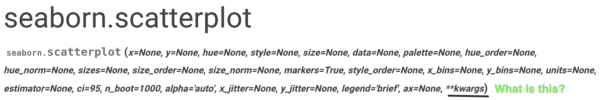
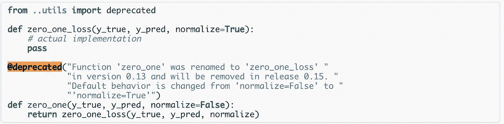

# *args，**kwargs 的初级读本，数据科学家的装饰者

> 原文：<https://towardsdatascience.com/a-primer-on-args-kwargs-decorators-for-data-scientists-bb8129e756a7?source=collection_archive---------14----------------------->

## [蟒蛇短裤](https://towardsdatascience.com/tagged/python-shorts)

## 对于编码来说，理解是至关重要的


Photo by [Almos Bechtold](https://unsplash.com/@almosbech?utm_source=medium&utm_medium=referral) on [Unsplash](https://unsplash.com?utm_source=medium&utm_medium=referral)

[Python](https://amzn.to/2XPSiiG) 有很多构造，在我们的代码中学习和使用起来相当容易。当我们在代码中遇到一些构造时，它们总是让我们感到困惑。

还有一些甚至是经验丰富的程序员也无法理解的。装饰者就是属于这一类的一些构造。

我猜我的许多数据科学朋友也面临过这些问题。

大多数 seaborn 函数都以某种方式使用*args 和**kwargs。



或者装修工呢？

每次你看到一个警告，像一些功能将在下一个版本中被否决。`sklearn`包为此使用了装饰器。你可以在源代码中看到`@deprecated`。这是一个装饰函数。



在这个名为**'**[**Python Shorts**](https://towardsdatascience.com/tagged/python-shorts)**，‘**的系列帖子中，我将解释 Python 提供的一些简单构造，一些基本技巧和我在数据科学工作中经常遇到的一些用例。

这篇文章是关于用一种简单易懂的方式解释一些难懂的概念。

# 什么是*args？

简单来说， ***你可以用*** `****args***` ***给你的函数任意数量的输入。***

## 一个简单的例子:

假设我们必须创建一个将两个数相加的函数。在 python 中我们可以很容易地做到这一点。

```
def adder(x,y):
    return x+y
```

如果我们想创建一个函数来添加三个变量呢？

```
def adder(x,y,z):
    return x+y+z
```

如果我们想让同一个函数加上未知数量的变量呢？请注意，我们可以使用`*args`或`*argv`或`*anyOtherName`来完成此操作。重要的是`*`。

```
def adder(*args):
    result = 0
    for arg in args:
        result+=arg
    return result
```

`*args`所做的是，它接受你传递的所有参数，并向函数提供一个可变长度的参数列表，你可以随意使用。

现在，您可以使用如下相同的函数:

```
adder(1,2)
adder(1,2,3)
adder(1,2,5,7,8,9,100)
```

诸如此类。

***现在，你有没有想过 python 中的 print 函数怎么可以带这么多参数？***

# 什么是**kwargs `?`


简单来说， **你可以使用** `****kwargs**` **给你的函数任意数量的*关键字输入*，并使用字典访问它们。**

## 一个简单的例子:

假设您想要创建一个打印函数，它可以将姓名和年龄作为输入并打印出来。

```
def myprint(name,age):
    print(f'{name} is {age} years old')
```

简单。现在让我们说，你希望同一个函数有两个名字和两个年龄。

```
def myprint(name1,age1,name2,age2):
    print(f'{name1} is {age1} years old')
    print(f'{name2} is {age2} years old')
```

你猜对了我的下一个问题是: ***如果我不知道我将需要多少个参数呢？***

我能用`*args`吗？猜不到，因为姓名和年龄顺序至关重要。我们不想写“28 岁是迈克尔的年龄”。

来图中的`**kwargs` 。

```
def myprint(**kwargs):
    for k,v in kwargs.items():
        print(f'{k} is {v} years old')
```

您可以使用以下方式调用此函数:

```
myprint(Sansa=20,Tyrion=40,Arya=17)Output:
-----------------------------------
Sansa is 20 years old
Tyrion is 40 years old
Arya is 17 years old
```

请记住，我们从未将珊莎、艾莉亚或提利昂定义为我们的方法参数。

这是一个非常强大的概念。许多程序员在编写包装器库时非常巧妙地利用了这一点。

例如，`seaborn.scatterplot`函数包装了 Matplotlib 中的`plt.scatter`函数。本质上，使用`*args`和`**kwargs`，我们也可以提供`plt.scatter`可以带给`seaborn.Scatterplot`的所有参数。

这可以节省大量的编码工作，并且使代码经得起未来的考验。如果在将来的任何时候`plt.scatter`开始接受任何新的参数，`seaborn.Scatterplot`函数仍然会工作。

# 什么是装修工？


简单来说: ***装饰器是包装另一个函数从而修改其行为的函数。***

## 一个简单的例子:

假设我们想在我们的一些功能中添加自定义功能。其功能是，每当调用函数时，打印“`function name`开始”，每当函数结束时，打印“`function name`结束”和函数花费的时间。

让我们假设我们的函数是:

```
def somefunc(a,b):
    output = a+b
    return output
```

我们可以在所有函数中添加一些打印行来实现这一点。

```
import time
def somefunc(a,b):
    print("somefunc begins")
    start_time = time.time()
    output = a+b
    print("somefunc ends in ",time.time()-start_time, "secs")
    return outputout = somefunc(4,5)OUTPUT:
-------------------------------------------
somefunc begins
somefunc ends in  9.5367431640625e-07 secs
```

***但是，我们能做得更好吗？***

这是装修工擅长的地方。我们可以使用 decorators 来包装任何函数。

```
from functools import wraps
def timer(func):
    [@wraps](http://twitter.com/wraps)(func)
    def wrapper(a,b):
        print(f"{func.__name__!r} begins")
        start_time = time.time()
        result = func(a,b)
        print(f"{func.__name__!r} ends in {time.time()-start_time}  secs")
        return result
    return wrapper
```

这就是我们如何定义任何装饰者。`functools`帮助我们使用`wraps`创建装饰者。本质上，在上面的装饰器中，我们在任何函数被调用之前做一些事情，在函数被调用之后做一些事情。

我们现在可以使用这个`timer`装饰器来装饰我们的函数`somefunc`

```
[@t](http://twitter.com/decorator_func)imer
def somefunc(a,b):
    output = a+b
    return output
```

现在调用这个函数，我们得到:

```
a = somefunc(4,5)Output
---------------------------------------------
'somefunc' begins
'somefunc' ends in 2.86102294921875e-06  secs
```

现在我们可以将`@timer`添加到我们想要打印时间的每个函数中。我们结束了。

真的吗？

# 连接所有的部分


如果我们的函数有三个参数呢？还是很多论据？

这就是我们到目前为止所学到的东西的联系。我们使用`*args`和`**kwargs`

我们将装饰函数更改为:

```
from functools import wraps
def timer(func):
    [@wraps](http://twitter.com/wraps)(func)
    def wrapper(*args,**kwargs):
        print(f"{func.__name__!r} begins")
        start_time = time.time()
        result = func(*args,**kwargs)
        print(f"{func.__name__!r} ends in {time.time()-start_time}  secs")
        return result
    return wrapper
```

现在我们的函数可以接受任意数量的参数，我们的装饰器仍然可以工作。

> Python 是不是很好看？

在我看来，装修工可能会很有帮助。我只提供了装饰者的一个用例，但是有几种方法可以使用它们。

您可以使用装饰器通过检查函数中的参数来调试代码。或者可以使用装饰器来计算特定函数被调用的次数。这可能有助于计算递归调用。

# 结论

在这篇文章中，我谈到了一些你可以在 [python](https://amzn.to/2XPSiiG) 源代码中找到的结构，以及你如何理解它们。

没有必要现在就在代码中使用它们。但是我想理解这些东西是如何工作的有助于减轻每当这些结构出现时人们所面临的困惑和恐慌。

> 对于编码来说，理解是至关重要的

另外，如果你想了解更多关于 Python 3 的知识，我想向你推荐密歇根大学的一门优秀的中级 Python 课程。一定要去看看。

将来我也会写更多初学者友好的帖子。让我知道你对这个系列的看法。在 [**媒体**](https://medium.com/@rahul_agarwal) 关注我或者订阅我的 [**博客**](http://eepurl.com/dbQnuX) 了解他们。一如既往，我欢迎反馈和建设性的批评，可以通过 Twitter [@mlwhiz](https://twitter.com/MLWhiz) 联系。