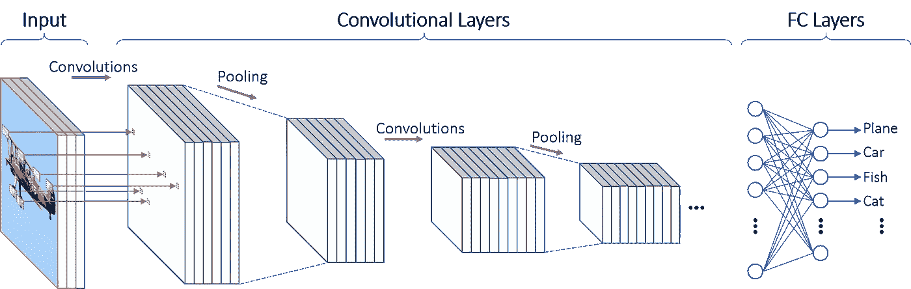

# 朱莉娅的计算机视觉初级读本

> 原文：<https://towardsdatascience.com/a-primer-on-computer-vision-with-julia-2c7068a35b32?source=collection_archive---------19----------------------->

## 学习如何使用 **CNN** 和**Julia**识别数字**。**


Image by [cocoparisienne](https://pixabay.com/users/cocoparisienne-127419/?utm_source=link-attribution&utm_medium=referral&utm_campaign=image&utm_content=1173863) from [Pixabay](https://pixabay.com/?utm_source=link-attribution&utm_medium=referral&utm_campaign=image&utm_content=1173863)

这个帖子是关于**卷积神经网络** (CNN)使用 **Julia** 的速成班。CNN 是一种奇特的功能，可以被“训练”来识别图像中的模式。在这篇博文中，我介绍了计算机视觉的**“Hello World”**:来自 [MNIST 数据集](https://en.wikipedia.org/wiki/MNIST_database)的手写数字分类。互联网上有数以千计的免费 Python 教程。

而是让我们使用 **Julia** 和包 **Flux.jl** 。为什么？因为 Julia 的速度很快，如果你有数百万张图片要分析，与 Python 相比，速度会大大加快。这篇博文的 Jupyter 笔记本可以在这里找到。

# 数据

MNIST 数据集包含灰度手写数字(0 到 9)的图像，这些图像居中对齐。每个像素由一个介于 0(黑色)和 255(白色)之间的数字表示。每幅图像都是 28 乘 28 像素。表示图像的一种方式是将其视为 28*28 = 784 像素的一维列向量。然而，这种表示忽略了图像的“结构”:彼此靠近的像素在我们试图识别的数字上是有信息的。CNN 是一个很好的工具，可以保持图像的空间结构，同时避免与[维度诅咒](https://en.wikipedia.org/wiki/Curse_of_dimensionality)相关的问题:图像是嘈杂和高维的输入数据。

# 美国有线电视新闻网的速成班

CNN 的两个关键组成部分是**卷积层**(因此得名)和**最大池层**。

# 卷积层

卷积层对每个点应用一个*模板*。卷积层的输出是较低维度的“图像”，它提供了输入图像的某些特征(形状、边缘等)的信息。).下图显示了卷积层的工作原理:


How a convolutional layer works. Source: [https://mitmath.github.io/18337/lecture14/pdes_and_convolutions](https://mitmath.github.io/18337/lecture14/pdes_and_convolutions)

# 最大池层

最大池层是一个*模板*，用于选择正方形内的最大值。下图是应用于 4x 4 图像的 maxpool 层:


Illustration of a maxpool layer. Source: [https://mauriciocodesso.com/post/convolution-neural-network/](https://mauriciocodesso.com/post/convolution-neural-network/)

# 步幅和衬垫

构建 CNN 时，必须指定两个超参数:**步幅和填充**

*   当跨度等于 1 时，我们一次移动一个像素的过滤器。当跨距等于 2 时，我们一次移动两个像素的过滤器，等等。
*   填充是指在图像的边界“加零”。填充可用于控制输出音量的大小，并有助于保持图像边界的信息

下面是一个应用于 5×5 输入的 3×3 滤波器示例，该输入使用 2×2 步长填充了 1×1 零边界:


How padding works. Source: [http://deeplearning.net/software/theano/tutorial/conv_arithmetic.html](http://deeplearning.net/software/theano/tutorial/conv_arithmetic.html)

CNN 的典型基础设施是首先对输入图像应用卷积层，然后使用最大池层，最后使用全连接层。在使用全连接(FC)层之前，可以将几个“卷积层—最大池层”单元堆叠在一起。请注意，激活层(通常为 [ReLU](https://en.wikipedia.org/wiki/Rectifier_(neural_networks)) )通常插在卷积层和最大池层之间。



CNN architecture. Source: [https://towardsdatascience.com/visualizing-the-fundamentals-of-convolutional-neural-networks-6021e5b07f69](/visualizing-the-fundamentals-of-convolutional-neural-networks-6021e5b07f69)

# 使用 Flux.jl

Flux.jl 是 Julia 生态系统中领先的机器学习包。接下来，我们加载 MNIST 数据集的训练样本和测试样本。训练样本是一组用于微调 CNN 参数的图像，而测试样本包含用于检查我们没有过度拟合训练样本的图像。过度拟合的确凿证据是训练样本的精度比使用测试样本图像的精度好得多。

Loading Julia packages and data


# CNN 架构

在使用 FC 层之前，我们的 CNN 有通常的 Conv->ReLU->MaxPool 组件。我们使用 1 乘 1 的填充，跨距为 1(默认值)。通过使用 2 乘 2 最大池层，输入的大小逐渐减小。Flux.jl 中的默认激活是函数 x->x。这里，我们使用校正线性单位函数(ReLU)来代替:

Building the model

ReLU 激活函数是分段线性函数。在 Krizhevsky 和合著者的[“使用深度卷积神经网络的 ImageNet 分类”](https://papers.nips.cc/paper/4824-imagenet-classification-with-deep-convolutional-neural-networks)论文中，作者写道:

> *我们把具有这种非线性的神经元称为整流线性单元(ReLUs)。具有 ReLUs 的深度卷积神经网络比具有 tanh 单元的等效网络训练速度快几倍。*

ReLU 激活功能也有助于减少由[消失梯度问题](https://en.wikipedia.org/wiki/Vanishing_gradient_problem)引起的实际问题。也就是用来寻找我们 CNN 的参数的最小化算法的失败。下面是 ReLU 激活功能的曲线图:

```
xgrid = collect(range(-1, 1, length=100)) plot(xgrid, NNlib.relu.(xgrid), label = "relu(x)", title="ReLU activation function", xlabel="x")
```


ReLU activation function

# 培养

# 定量

批量大小是一个参数，它告诉我们网络在“训练”时一次会“看到”多少幅图像。用技术术语来说，当执行梯度下降时，我们不会一次使用所有信息(因为内存限制，也因为不一定高效)。以下函数生成“批量”图像:

Batching

# 损失函数和最小化

CNN 要“学习”任何东西，它必须有一个“错”或“对”的概念。损失函数正是通过量化模型在识别数字方面的表现来做到这一点的。当输出是一个概率时，[交叉熵](https://en.wikipedia.org/wiki/Cross_entropy)损失函数是合适的。最后一步是选择一种算法来最小化损失函数。这里，让我们选择 [ADAM](https://arxiv.org/abs/1412.6980) 算法，我把它理解为某种带有动量和自适应学习率的[随机梯度下降](https://julienpascal.github.io/post/ols_ml/):

Loss function

该模块“训练”(微调 CNN 参数值)模型，直到达到预定的精度水平:

Training

# 预言

一旦模型被训练，预测值很容易获得如下:

```
# Get predictions and convert data to Array: 
pred = Tracker.data(model(test_set[1])); 

# Function to get the row index of the max value: 
f1(x) = getindex.(argmax(x, dims=1), 1) # Final predicted value is the one with the maximum probability: 
pred = f1(pred) .- 1; #minus 1, because the first digit is 0 (not 1)
```

让我们看看模型在测试集上的表现。CNN 可以使用训练模型时没有使用的图像来识别数字吗？正如您在下面看到的，我们的模型在识别手写数字方面做得非常出色:

```
println("Predicted value = $(pred[1])") a = reshape(test_imgs[1], NROWS, NCOLS)Predicted value = 7
```


```
println("Predicted value = $(pred[2])") a = reshape(test_imgs[2], NROWS, NCOLS)Predicted value = 2
```


```
println("Predicted value = $(pred[3])") a = reshape(test_imgs[3], NROWS, NCOLS)Predicted value = 1
```


# 准确性检查

我们现在有了一个模型，它在识别数字方面似乎做得很好。但是我们能改善它吗？如果是，如何实现？为了改进我们的模型，我们首先需要确定它失败的时间和原因。

## 混淆矩阵

为此，一个有用的报告工具是**混淆矩阵**。混淆矩阵的每一行显示真实值的实例，而每一列显示预测值的实例。理想情况下，我们希望我们的模型能够完美地预测结果。对于一个完美的模型，所有的实例都位于混淆矩阵的对角线元素上。

我最后一次检查时，`Flux.jl`没有一个内置函数来计算混淆矩阵。幸运的是，包`MLBase`中提供了一个实现。下一个代码块计算混淆矩阵并显示出来。大多数实例位于对角线上，这并不奇怪，因为我们的模型的准确率超过 97.0%

```
using MLBase # Adding 1 to outcome because the index 0 in arrays does not exist in Julia:
Cm = confusmat(10, test_labels .+ 1, vec(pred) .+ 1)# Normalize output: 
Cm = Cm ./ sum(Cm, dims=2) # Labels 
xs = [string(i) for i = 0:9] 
heatmap(xs, xs, Cm, aspect_ratio=1, color=:plasma)
```


Heatmap for the confusion matrix

为了可视化我们的模型在哪里出错，我们可以使用可选参数`clim`，给底层的颜色图加上一个上限。例如，下一个图显示我们的模型在区分 7 和 2 或者 8 和 2 时有困难。

```
# Limits to colormap, so we can see where errors are located: 
xs = [string(i) for i = 0:9] 
heatmap(xs, xs, Cm, aspect_ratio=1, color=:plasma, clim=(0., 0.01))
```


Heatmap for the confusion matrix

## 误差分析

下一段代码显示了 CNN 失败的数字:

```
using ImageView, Gtk.ShortNames
# indices for errors: 
mistakes = test_labels .!= vec(pred) 
max_images = 5 grid, frames, canvases = canvasgrid((1,max_images));k=0#counter 
for mistakes for (j, i) in enumerate(mistakes) 
    if i == true k+=1 # a false value has been found 
       println("Predicted value = $(pred[j])") 
       println("True value = $(test_labels[j])") 
       imshow(canvases[1,k], test_imgs[j]) 
    end 
    if k >= max_images 
       break 
    end 
end 
win = Window(grid); 
Gtk.showall(win);Predicted value = 5 True value = 9 
Predicted value = 5 True value = 6 
Predicted value = 4 True value = 8 
Predicted value = 3 True value = 2 
Predicted value = 7 True value = 2
```


Five first prediction errors

虽然从左边开始的两个数字(见上图)显然是 9 和 6，但剩下的 3 个元素并不简单。中间的 8 很容易与其他数字混淆，剩下的两个数字形状怪异。

# 结论

在处理图像时，卷积神经网络通常在识别模式方面表现出色。这篇博文是对这个主题的非技术性介绍。而 Python 是机器学习中偏爱的工具(Keras，TensorFlow 等。)，我猜测 Julia 会越来越受欢迎，因为 Julia 既好用又快。

# 参考

*这篇博文的代码大量基于这篇 Flux.jl 教程:[https://github . com/flux ml/model-zoo/blob/master/vision/mnist/conv . JL](https://github.com/FluxML/model-zoo/blob/master/vision/mnist/conv.jl)
*关于 CNN 和 PDEs 的链接:[https://MIT math . github . io/18337/lecture 14/PDEs _ and _ convolutions](https://mitmath.github.io/18337/lecture14/pdes_and_convolutions)
* CNN 的完整课程。大部分内容都可以在网上找到:[http://cs231n.github.io/convolutional-networks/](http://cs231n.github.io/convolutional-networks/)

*原载于 2019 年 12 月 5 日*[*https://Julien Pascal . github . io*](https://julienpascal.github.io/post/cnn/)*。*