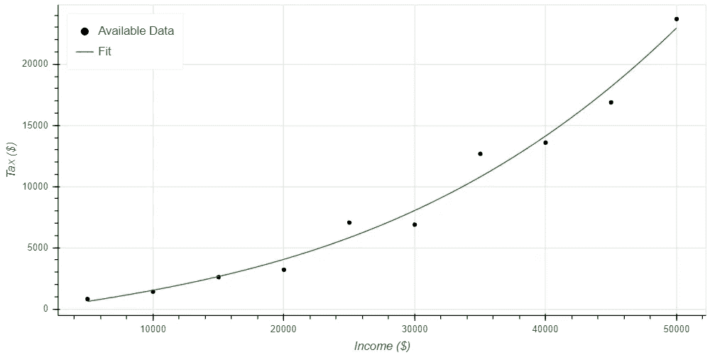

# 模型拟合入门

> 原文：<https://towardsdatascience.com/a-primer-on-model-fitting-e09e757fe6be?source=collection_archive---------18----------------------->

## 如何评估模型是否符合您的训练数据

数据科学本质上是使用数据来预测不同情况下会发生什么的实践。为了做到这一点，我们基于现有的数据集开发模型，然后使用这些模型来预测在相当类似的情况下会发生什么。这本质上是一种从已经发生的事情中学习的数学方法，并利用这种学习做出明智的选择。

这里显而易见的是，模型的预测和模型本身一样好。为了使模型返回准确的预测，它必须准确地匹配可用的数据集。如果它与可用的数据集不匹配，那么你可以肯定它不会返回不同情况下的准确预测。

## 模型怎么会和数据不匹配？

通常有两个术语用于描述模型如何无法匹配现有数据集。它们是:

*   欠拟合:欠拟合模型是一种不够复杂，无法匹配可用数据的模型。它在匹配可用数据方面做得很差，因为它无法复制所有观察到的变化。欠适应模型的一个例子是，在一个累进税制结构的国家，有人根据统一税收假设来估计纳税额。在这种情况下，一个人支付的税收百分比随着其收入而变化，但该模型将假设每个人每美元的税率相同。
*   **过度拟合**:过度拟合模型对于可用数据来说过于复杂。高复杂性使得模型对数据集有太多的改变，产生实际上并不存在的曲线和变化。它通常在匹配可用数据方面做得非常好，但无法准确预测数据点之间发生了什么。这种情况如何变得糟糕的一个例子是一个不确定模型的反面；一个基于累进税制结构(每一美元收入的税率都在变化)的假设的模型可能会正确地匹配每个人的纳税额，但对一个单一税制结构建模太复杂了。

图 1 提供了这些概念的可视化表示。用圆圈表示的系列称为“可用数据”,显示了累进税制结构下的理论所得税收入。假设的累进税制结构非常简单。第一万美元的税率为 10%，第二万美元的税率为 20%，第三万美元的税率为 30%，以此类推。增加了一点随机性，复制了不同家庭能够获得不同扣除额的事实(在美国税法中)。第二个系列用蓝线表示，称为“Underfit ”,是一个假设单一税收结构的模型。第三个数据系列名为“Overfit”，是一个 20 阶模型，假设了一个极其复杂的累进税制结构。

Figure 1: Underfit and Overfit Models for Our Theoretical Tax Structure

代表欠拟合模型的蓝线显然与数据拟合得很差。只有 3 点接近匹配的数据，要么高估或低估所有其他的。它也没有捕捉到数据的形状，没有捕捉到税率随着收入增加而增加的事实，产生了一个有点抛物线的数据集。

红线代表过度拟合模型，与可用数据几乎完全匹配。每一个数据点都以非常高的精确度匹配。它也很好地捕捉了数据的形状…直到年收入超过 40，000 美元。从每年 40，000 美元到 44，000 美元，该模型预测应付税款基本上没有变化，然后突然从每年 44，000 美元急剧增加到 45，000 美元。这个模型显然低估了这个范围。但真正的问题出现在 45，000 美元到 50，000 美元之间。该模型预测，当收入从 45，000 美元增加到 49，000 美元时，税收每年增加 22，000 美元，但没有任何数据表明这是准确的。然后，从每年 49，000 美元到 50，000 美元，预期税收减少 20，000 美元，以返回到匹配数据。该模型预测不存在的数据的趋势，并且无法预测可用数据点之间的税收值。

## 什么键可以识别欠拟合和过拟合模型？

当试图识别欠拟合和过拟合模型时，要寻找的关键点是图 1 的描述中提到的项目。为了明确地指出它们，这些不同类型的模型问题可以通过以下方式来识别。

可以识别欠拟合模型，因为它们:

*   未能与可用数据点紧密匹配，以及
*   没有捕捉到可用数据集的大致形状。

过度拟合模型可以被识别，因为它们:

*   非常好地匹配可用数据(注意，这本身不能识别过度拟合模型，但应被视为警告信号)，以及
*   显示可用数据中不存在的预测趋势。

## 完美的模特是什么样的？

一个合适的模型应该与可用的数据紧密匹配(完美是最好的，但可能性极小)，同时还要与数据的总体形状紧密匹配。图 2 提供了这种模型的一个例子。它呈现了与图 1 相同的总图，黑色圆圈仍然代表我们编造的数据集中可用的税收收据。绿线代表符合数据的三阶模型。

Figure 2: An Example of a Well Fit Model

请注意，代表三阶回归的绿线与可用数据并不完全匹配。这是不幸的，但却是现实的期望，尤其是因为数据集中包含了一点随机性。然而，它与每一个数据点都非常接近。此外，曲线的指数增长也符合可用数据的形状。对于可用数据来说，它既不像图 1 中的欠拟合模型那样过于简单，也不像过拟合模型那样过于复杂。相反，来自模型的每个预测都落在数据集中的高点和低点之间。因为它与数据的形状非常匹配，并且不会添加不准确的趋势，所以可以相信该模型在插值时会提供合理的预测。

## 我可以在哪里了解更多信息？

模型拟合，以及过度拟合和欠拟合的挑战，是数据科学中的核心概念。有许多不同的来源可以让你了解更多。我目前最喜欢的关于这些问题的讨论来源是 Joel Grus 的[从头开始的数据科学](https://www.amazon.com/gp/product/1492041130/ref=as_li_tl?ie=UTF8&camp=1789&creative=9325&creativeASIN=1492041130&linkCode=as2&tag=petergrantpub-20&linkId=0f4bc5e74e939af8ebf709da66ab294c)。在我之前的一篇文章的[中，我也提供了一个更加详细的模型开发和验证的描述。对于那些致力于投入大量时间尽可能多地学习的人，Coursera 提供了一门关于机器学习的](/automating-scientific-data-analysis-part-4-110d14421527)[优秀课程](https://www.coursera.org/learn/machine-learning?utm_source=gg&utm_medium=sem&utm_content=07-StanfordML-US&campaignid=685340575&adgroupid=52515609594&device=c&keyword=machine%20learning%20mooc&matchtype=b&network=g&devicemodel=&adpostion=1t1&creativeid=243289762946&hide_mobile_promo&gclid=Cj0KCQjwjrvpBRC0ARIsAFrFuV-VCvYRpwr-Y7o3M8BuKljdblU_zd2WEs7l9OLfHtWBQeQ5JwGv6rQaAvoMEALw_wcB)。

## 包装它

模型开发和验证是数据科学中的核心概念。为了进行任何有价值的数据科学，我们必须拥有准确表示可用数据集的模型，并且我们相信这些模型能够很好地预测在类似条件下会发生什么。

导致模型返回较差预测的两个常见问题是欠拟合和过拟合。拟合不足意味着模型对于数据集来说不够复杂。这导致模型与测量的数据不匹配，并且不能模拟数据集的一般形状。过度拟合意味着模型对于数据集来说过于复杂。它会生成一个与模型极其匹配的模型，但会向数据集添加实际上并不存在的趋势。它看起来非常好，因为它与数据匹配得非常好，但是在插值时会产生非常不准确的结果。

一个非常适合的模型可能不会完美地匹配可用的数据。每一个预测都可能有一些误差。然而，它应该能准确地预测所有这些。此外，它应该捕捉数据集的形状，表明插值预测也将是接近的。