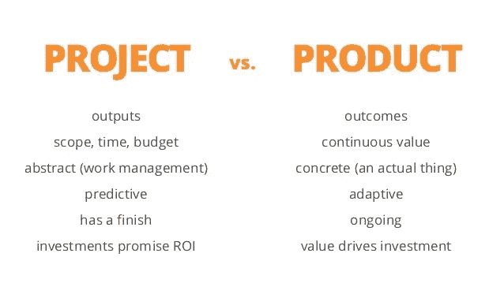

# 以产品为中心的数据视图

> 原文：<https://towardsdatascience.com/a-product-centric-view-of-data-e9b233eab6fa?source=collection_archive---------22----------------------->

## 如何从第一天开始就证明您的数据的价值

在我的职业生涯中，我有幸在许多技术本土公司工作过，在这些公司，敏捷性是业务的主要原则之一。然而，这种敏捷性源于这些公司的使命，即构建客户认为有价值的产品。像微软、亚马逊和 Expedia 这样的公司之所以能够持续增长，是因为它们使用数据进行内部优化，但通过为消费者构建新的数据智能产品来保护自己。

在过去的两年里，完全离开我在科技公司的舒适区，并在一个为我们的客户创造价值的绝大多数产品通常需要几个月时间，或者在推出新飞机的情况下，需要几年时间的行业工作，确实是一件有趣的事情。然而，仅仅因为一个业务不是数字化的，就没有理由不通过创造新的数据驱动的产品来推动公司走向未来。这可能只是需要多做一点工作，或者只是在政治上多一点难度。

所以，你可能首先会问。我的数据很好，为什么我要改变我使用数据的方式，或者我不知道你今天要求我改变什么。什么是产品思维，它与我们今天的工作方式有何不同？今天大多数项目组合管理团队运行数据构建的方式是以项目思维方式进行的。产品思维通常被视为数字团队领域的一部分。是的,“数字”团队……是的……那些被排挤的人藏在企业的一个不起眼的角落里，带着那些奇怪的白板、便利贴(wars)和纹身的潮人……或者更糟的是，给他们一个远离企业跳动的心脏的 WeWork 办公空间，因为他们不能整合(我的意思是……位于伦敦市中心的创新中心会有更高的效率)。我开玩笑(但我被允许)。我在这里支持的不是争论两者的优点和你应该选择哪一个，而是专注于其中一个的优点，作为从你的数据中获得更多价值的一种方式，甚至可能创建一个数据飞轮——这是我稍后将写的主题。

## 什么是产品思维模式，它与项目有何不同？

不想重新发明轮子，我发现这个定义是最有助于解释差异的定义之一。

> **产品**是可以提供给市场以解决问题或满足需求的任何东西。
> 
> 产品的生命周期由多个阶段组成。首先，产品被构思，然后被开发，然后在市场上被介绍和管理，最后，当对产品的需求减少时，产品被淘汰。
> 
> 一个**项目**是为了创造一种独特的产品或服务而进行的临时性努力。对于一个项目，有一个明确的定义，什么需要在指定的时间内交付。
> 
> 需要注意的是，一个产品只能在一个项目的环境中开发，而在一个产品的生命周期中可以有多个项目。
> 
> 与项目不同，产品没有明确的定义*需要交付什么*。客户需求自然会随着时间的推移而发展，产品也必须发展以满足这些客户需求。
> 
> —孔比亚[“产品和项目管理的区别”](https://www.koombea.com/blog/the-difference-between-product-and-project-management/)

非常简洁地:

**产品:价值导向
项目:任务导向**

许多数据团队首先以项目思维运作。这延伸到他们如何管理和治理数据、报告，甚至进行数据科学。定义的端点、设定的交付、以报告形式出现在表格中的数字，甚至是每季度一次可能对业务产生战略性影响的洞察。我在这个世界上已经呆了这么多年了。同样，这种思维方式本质上没有任何问题，它适合许多不同类型的数据追求——系统迁移、对现有 ERP 系统的更改请求或像 TPFs 这样的上世纪 70 年代遗留数据(不寒而栗)。

当用以产品为中心的观点来处理数据时，您日常工作方式的第一个主要变化是——“我的客户今天会受益于什么？”而不是“今天需要关闭的 CRs、票证等是什么？”一个公认的夸张，但我认为你得到了要点。

不可否认，大多数数据团队都是从真正的客户(在我们当前的案例中是乘客)中抽象出来的，这要困难得多。尝试告诉某人，您的数据团队需要 D3/Node/React javascript 开发人员将接口构建到当今的活动系统中，然后看着他们惊讶(不仅因为大多数人甚至不知道这些东西是什么，更不用说让数据(即分析团队)脱离操作系统)。大多数传统主义者将数据人员视为后端人员，这并不奇怪。我们大多数人都倾向于将自己的日常工作视为数据的守护者。

相反，从问题和解决用户问题的价值开始。“在我分析了 B 的数据并知道 C 是我需要采取的行动之后，我需要让 A 的行动变得简单得多。”衡量的结果本质上是你提供给最终用户/客户的价值。

我认识的大多数数据团队都止步于此，然后开始…“这不是我的问题。我给你 X 数据，BI 团队给你 Y 报告，数据科学团队给你 Z 洞察。”然而，这种思维模式实际上只实现了 B 部分或在紧要关头实现了 B 和 C 部分，并没有最终真正解决用户问题，这是 a。设计一个系统集成以允许用户严格做到这一点并不是一个数据问题。这种说法对于数据的项目/任务取向可能是正确的，但对于价值取向就不那么正确了。如果你真的想在持续的基础上证明分析的价值，进行测试和学习练习来证明你的数据的价值，那么*是的*，这个*从根本上来说是*一个数据问题。

## 这种心态如何改变团队的组成和他们关注的焦点？

**数据工程**优秀的数据工程师拥有不同于那些能够设计和构建优秀 API 的人的技能，这些技能也不同于那些能够构建优秀 UI 的人。根据用户的需要，您应该考虑在您的数据工程功能中使用非传统的技能。在我之前的一份工作中，我们雇佣了一个更专注于 javascript/UI 和少量数据的人来补充我们的数据工程团队。它产生了如此惊人的内部报告门户，然后它也将其作为面向外部的门户。

理想情况下，您的工程职能部门还应该拥有合适的软技能，以便加入数据产品团队，与您的业务和分析利益相关方举行构思会议。除此之外，这还意味着您采用持续集成管道，鼓励快速迭代和自动化，并且不严格要求团队在某个时间框架内发布(比如说，一个 sprint)。

**数据产品
数据产品团队的职责不仅仅是做业务分析师以前会做的事情，即接受需求，发送回交付，他们的工作是利用其余的数据和分析功能，以及企业/消费者来找出解决方案，了解他们有什么问题以及如何用基于数据/驱动的产品来解决这些问题。**

通过参与最终用户/消费者所需的解决方案的设计阶段，他们是整个数据团队和利益相关者的粘合剂。他们的评估和迭代不仅基于数据团队其他成员的优先级，还基于每个用例产生的客户价值(希望通过征求客户的反馈来获得)。努力将数据科学团队与消费者需求结合起来，引入其他部门，这些部门要么与消费者有现有的接口，要么在这些团队没有带宽或技能集的情况下建立自己的接口，您的数据产品人员是您的协作战略家，他们应该最深切地关心从数据中获取价值，无论数据如何到达消费者手中。

如今，大多数数据团队都缺乏这样的功能。如果他们这样做，它通常被用作提供数据管理的手段，而不是产品。允许他们主要关注提供最佳价值的解决方案(并与工程一起构建它们)，而不仅仅是提供分析所需的数据。

注意:如果你有一个数据产品团队，他们不仅仅是你的记录员，不仅仅是你的搬运工，他们也应该是技术专家。仅仅因为您的数据科学团队在 R/Shiny 中构建了一些东西，并不意味着解决方案应该只是让它保持运行。这可能是最容易获得 MVP 的途径，但并不总是最有影响力的。

**报告/商务智能和分析** 许多报告和商务智能人员往往被视为系统高手，点击这里，在那里编写一些 SQL 代码，瞧，一张你需要的表格。我经常看到如此广泛和复杂的报告，以至于最终用户只抓住一个数字不放，像鹰一样监控这个数字，完全忽略了更大的画面。我很幸运有非常具有商业分析头脑的商业智能分析师，他们不只是想停留在基于网格的报告上，或者只是一份漂亮的报告。

以价值为导向的分析师总是更进一步——用户会从中受益吗？他们经常问的几个问题是——“我如何展示这个指标变化的驱动因素是什么？”“我如何创建正确的报告套件，这些报告相互链接，以便无缝使用？”通常，现有的报告工具，如 Tableau/Qlik/PowerBI，并不支持这种具有分析洞察力的报告。能够将 R 等分析工具集成到这些可视化环境中可能是解决这个问题的关键，但这意味着传统 BI 分析师或开发人员的技能组合发生了变化。一个我仍在试图破解的问题——但至少有一些优秀的分析师在尝试。

数据科学
最后，但肯定不是最不重要的，最热门的工作……我就讲到这里。除了构建智能汽车和机器人的真正 AI/ML 用例之外，大多数终端消费产品都有来自数据科学团队的深刻概念证明，并与工程功能相结合。专注于任务的数据科学团队往往首先关注模型的准确性，并在醒着的最后一刻调整模型以获得最佳解释值。同样，这很好，如果它们是一次性的战略上一致的项目，需要最准确的答案，永远不会被再次使用。以价值为导向的数据科学功能倾向于关注对客户的影响或变化，以及帮助客户完成变化以提高采用可能性所需的内容，最初牺牲了模型的准确性/复杂性，知道他们将随着时间的推移不断迭代。

Emily Glassberg Sands 概述了数据科学团队如何帮助构建优秀的数据产品。她的 [HBR 文章](https://hbr.org/2018/10/how-to-build-great-data-products)讲述了如何建造它们的过程。然而，她从一个数字化的本土企业的角度来看，这个企业已经有了一个总体的产品功能。对于没有总体产品功能的公司，数据科学团队最适合与数据产品团队和业务部门合作，以实现整个解决方案。

**客户** 最后一点也是最重要的一点，打造优秀产品的数据团队中最不可或缺的一部分就是客户。现在，这里的客户有内部和外部两种形式，内部客户通常对错误/不正确的数据更加宽容。它们决定了产品的特性，并帮助我们理解产品的价值。没有它们，伟大的产品就不会存在，不管是不是数据驱动的。数据团队需要开发和构建让他们的生活更轻松的解决方案，这反过来又增加了他们的采用率和创造货币价值的能力。

以产品为中心的思维模式是当今大多数数据团队的范式转变。它让人们从以任务为导向，甚至简单的以结果为导向转变为以价值为导向。人们开始意识到，如果数据被用来推动正确的结果，它只是新的石油。石油以其最原始的形式存在了几千年，在我们找到造福人类的正确用途(产品)之前，它没有任何内在价值。数据作为推论是完全一样的。我们真正从数据中赚钱或创造价值的唯一方式是，我们的客户/最终用户从我们用数据创造的产品中受益。只有到那时，[数据革命](http://www.undatarevolution.org/)才真正扎根。因此，采取以产品为中心的数据观是创造可持续数据革命的下一步，这将使最终用户和公司都受益。