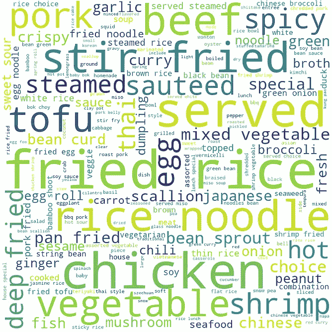
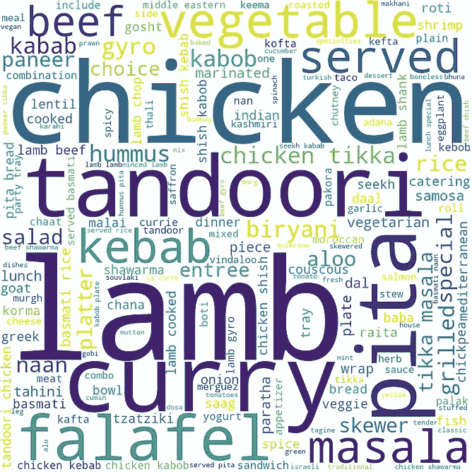
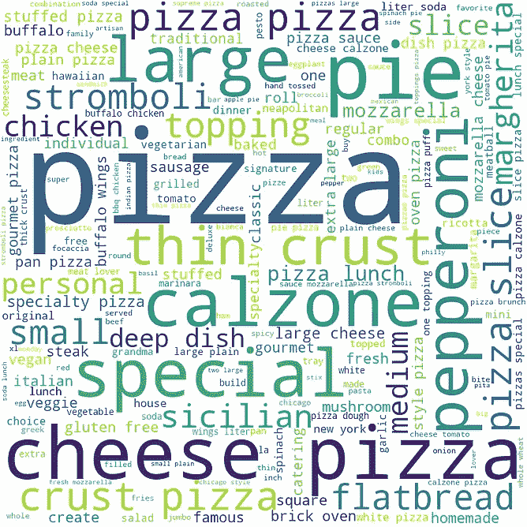
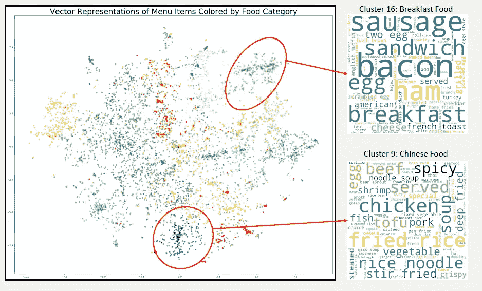

# 产品经理研究数据科学

> 原文：<https://towardsdatascience.com/a-product-manager-tries-data-science-2c3570d8b480?source=collection_archive---------32----------------------->

作为一名有抱负的数据科学产品经理，我一直在寻找通过实践积累技术知识的方法。在这个项目中，我与一家在线订购餐馆的初创公司合作，建立一个推荐系统。我面临的挑战是创造性地扩展有限的数据集，并应用无监督和有监督的学习方法来克服与处理极其混乱的餐厅菜单数据相关的困难。

# 问题是…

从业务角度来看，我们希望随着时间的推移，增加客户保持率和客户收入。许多企业的一个常见模式(此处可见)是收入的很大一部分来自一小部分回头客。我的假设是，提供个性化的推荐可以增加单个订单的价值，随着时间的推移增加收入。

创建推荐系统有很多有据可查的方法，但是和往常一样，以正确的格式获取数据是关键！餐馆菜单通常按食物类型分类——意大利餐馆、印度餐馆等。对于阅读这些内容的人来说，我们能够很容易地解释这些菜单项并将其映射到一个类别。当我们亲自点餐时，销售人员很容易推荐我们可能喜欢的其他类别，这是很常见的——“你想喝点什么吗？”

对机器来说不是这样！在不同的项目之间建立有意义的相似性是困难的！例如，两家比萨饼店可能都供应 10 英寸的奶酪比萨饼。在一份菜单上，它被称为*吉尔的 10 英寸玛格丽塔披萨*，在另一份菜单上，它被称为*著名的红酱披萨*。对于一个销售数百万比萨饼的大型连锁店来说，有足够的交易量来解释有意义的模式。然而，对于小餐馆来说，连接看似不同的订单对于建立有意义的交易量是至关重要的，这种交易量可以用于概括所有餐馆。

从事 MyFitnessPal 应用开发的安德玛大学科学家的一篇论文很好地总结了为什么与传统的文本聚类相比，这个问题特别困难:

“我们的餐厅食物匹配问题有其独特之处，因为要匹配的给定文本(即餐厅菜单项)和应用程序数据库中的匹配文本(即食物及其描述)的长度都很短。此外，每个单词的词汇和语法结构对整体准确性的影响比标准设置中的情况更大:“肉酱意大利面”需要与“肉酱意大利面”区别对待。“词序对整体匹配准确率也有很大影响:“巧克力牛奶”应该和“牛奶巧克力”区别对待。”所有这些细微差别结合在一起，使得直接应用以前的文本匹配问题成为一个挑战。"

# 解决问题

当我在研究这个问题的潜在解决方案时，我看到了一篇博客文章，它解决了 Caviar 的一个非常相似的问题:

[https://developer . square up . com/blog/caviars-word 2 vec-tagging-for-menu-item-recommendations/](https://developer.squareup.com/blog/caviars-word2vec-tagging-for-menu-item-recommendations/)

这种方法对我来说很有意义(并且与我在 NLP 课程中涉及的主题很一致)，所以我决定看看我是否能让它与我的数据一起工作！

为了解决连接不同菜单项的问题，Caviar 数据科学团队实现了一个 Word2Vec 模型。Word2Vec 是将单词输入映射到向量空间中的表示的神经网络，称为嵌入。它通过查看*上下文*来做到这一点——哪些单词经常在彼此附近出现？

通常，Word2Vec 模型使用 [*预训练嵌入*](https://code.google.com/archive/p/word2vec/)*——其他人在数十亿个例子上做训练模型的艰苦工作，向量表示可以被提取出来并用于像我这样的任务。然而，在这种情况下，我发现预训练的嵌入是不够的。*

## *网络抓取走向胜利*

*不幸的是，我最初的数据集只包含 50，000 个不同的菜单项。当我训练 Word2Vec 模型时，向量被证明不足以生成有意义的下游结果。*

*我需要增加训练数据的大小。经过一些研究，我偶然发现了 all menu s，这是一个全美餐馆菜单的聚合器。*

*为了建立一个网络刮刀，我求助于 Scrapy 。Scrapy 提供了一个强大的框架，抽象了 web 抓取的许多更具技术性的方面(节流、异步作业)，允许我专注于识别和捕获我需要的数据。*

*有了新的 web scraper 在手，我能够获得超过**180 万**个独特的菜单项及其描述——大大增加了我的培训数据！*

## *使用无监督学习创建食物类别*

*有了新数据，我用 [Gensim 包](https://radimrehurek.com/gensim/)训练了一个 Word2Vec 模型。与只对 5 万个菜单项训练模型时不同，我现在可以看到单词之间有意义的联系。看看和“煎饼”最相似的前 10 个词——所有的早餐食品，正如我们所料！*

**

*尽管这很酷，但总体目标是比较相似的菜单项，而不仅仅是单个单词。回到我们最初的例子，我们最终的模型应该考虑*吉尔的 10 英寸玛格丽塔披萨*和*著名的红酱披萨*都是*披萨。**

*为了做到这一点，我应用了鱼子酱数据科学家使用的相同技术——对于给定的菜单项(比如‘蓝莓煎饼’)，我对‘蓝莓’和‘煎饼’的词向量进行平均。*

*假设这行得通，我应该能够使用聚类算法将菜单项分组在一起。我使用 KMeans 集群，在 20 到 50 个集群之间进行测试和验证。通过手工检查，我发现 30 产生了最有意义的集群。*

*这些聚类很好地映射了人类对菜单类别的理解。我能够凭直觉找到啤酒、葡萄酒、甜点和其他多种菜肴的类别！下图显示了一些示例集群中菜单项的顶部单词。*

******

*Wordclouds generated from the menu items included in 3 clusters*

*最后，我使用 t-SNE 可视化集群，这是一种降维方法，特别适合二维可视化。当用聚类数着色时，结果显示出清晰可辨的类别。*

**

*Visualizing Menu Item Vectors through t-SNE*

## *使用监督学习提出建议*

*最终目标是在客户下订单时提供额外的建议。当客户在线订购时，商品会一次一件地添加到购物车中，订购流程如下所示:*

*[10 英寸马里纳拉披萨]*

*[10 英寸马里纳拉披萨，1 20 盎司可口可乐]*

*[10 英寸马里纳拉披萨，1 20 盎司可口可乐，1 个奶油甜卷]*

*在上面的例子中，我们想向只点披萨的顾客推荐可口可乐或奶油甜卷，目的是提高他们对订单的满意度，增加订单量。*

*我通过模拟上面的订购过程创建了训练数据。首先，我使用 K-Means 模型来预测事务中的每个菜单项应该属于哪个类别。对于每个事务，我遍历事务中的所有项，每次取出一项作为预测的目标，其余项作为特征。这创建了 160 万个事务示例作为训练数据。*

*将这些分为训练和测试数据，我使用 SKLearn 库对训练数据训练多项逻辑回归模型。该模型在测试数据上预测扣留类别的准确率达到 71%。*

*一些简单的比较基准是选择一个随机的类别和最受欢迎的类别。随机分类将产生 3%的准确度(30 分之一的机会)。一个每次都能猜出最受欢迎类别的虚拟模型有 10.3%的正确率。逻辑回归模型实现了比这些原始基线更高的准确性。*

# *讨论和后续步骤*

*结果向我表明，客户订购模式中有规律可循，可以用来提出建议。在目前的状态下，该模型足以提供简单的建议。如果顾客点了一道主菜，但没有点饮料，则该模型可以预测该菜应该配有饮料。推荐餐馆最受欢迎(或最赚钱)的饮料是一个可行的当前策略。*

*然而，顾客偏好的异质性限制了该模型在当前水平上的有效性。聚类的粒度虽然很好，但仍不足以做出真正的推荐。例如，该模型可能能够建议客户在汉堡订单中添加一道配菜，但不能有效地推荐薯条或配菜沙拉。这个项目的下一步是进一步细化类别，使之更加细化。*

*下一步是通过在逻辑回归模型中加入额外的特征来提高预测的准确性和质量。关于顾客先前点了什么或者餐馆菜单上什么项目最受欢迎的元信息可以从现有的交易数据中获得，我希望这将对模型产生重大影响。*

*然而，也许更重要的是，除了推荐方面之外，以完全无监督的方式将字符串聚类为不同的餐馆菜单项的过程仍然提供了显著的好处。将新菜单项标记和分组到类别中的过程现在可以自动化，并用于创建更好的菜单和业务分析。*

*虽然这还没有变成一个真正面向客户的项目，但获得一些真实世界的数据是一种很棒的体验。我研究了各种技术，创建了一个训练数据集，并应用了监督和非监督学习，所有这些都是在实现业务目标的背景下进行的，并在此过程中学到了很多东西。*