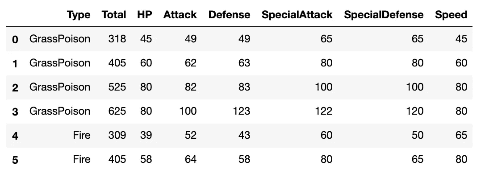
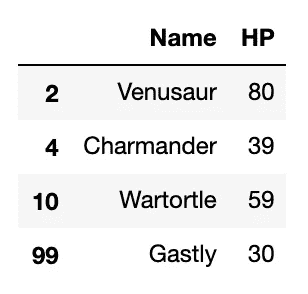
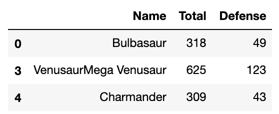
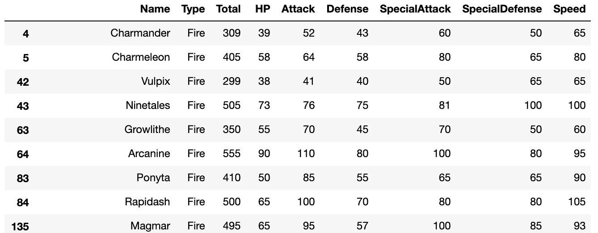

# Python 初学者的看法。通信线路（LinesofCommunication）

> 原文：<https://towardsdatascience.com/a-python-beginners-look-at-loc-part-1-cb1e1e565ec2?source=collection_archive---------7----------------------->

## 从熊猫数据框架中选择行和列

作为一个 Python 初学者，使用`.loc`来检索和更新 pandas 数据帧中的值对我来说并不合适。Python 不断扔给我的`SettingWithCopyWarning`消息清楚地表明我需要使用它，但感觉像是大量的试错消息来让它做我需要的事情。

我坐下来玩了足够多的时间，现在我开始感到舒服了，所以我想我应该分享我的漫游；如果你是初学者，希望它能帮助你。在这篇文章中，我将讲述如何通过`.loc`从*获取*数据；我将在未来的[文章](https://medium.com/@ljhopkins/a-python-beginners-look-at-loc-part-2-bddef7dfa7f2)中讲述*如何设置*数据。

我在亚特兰大大会上第一周的[数据科学沉浸式课程时，使用了一个神奇宝贝数据集(`#dadjokes`)进行了“探索”。](https://generalassemb.ly/education/data-science-immersive)

这里是`df.head(10)`的样子:


Header for the Pokémon dataframe I tested with

# 使用检索数据。通信线路（LinesofCommunication）

## 可索引属性，而不是方法

我的第一个提示是`.loc`不是一个数据帧*方法*；一个周六，用`()`代替`[]`花了我 45 分钟。在这些方括号中，`.loc`接受两个输入:一个行“索引器”和一个(可选的，用逗号分隔)列“索引器”:没有其他参数，像`inplace`或`axis`。

## 单个标签、切片和列表

那么你能用什么作为索引器呢？pandas 文档列出了允许的输入，它讨论的第一个是单个标签，所以让我们开始吧。

传递一个索引器(因为这个数据帧是 RangeIndex，我们传递一个整数)将返回一个 pandas 系列，其中包含具有该索引值的行的数据，在本例中是小火龙:

```
df.loc[4]Name              Charmander
Type                    Fire
Total                    309
HP                        39
Attack                    52
Defense                   43
SpecialAttack             60
SpecialDefense            50
Speed                     65
Name: 4, dtype: object
```

`.loc`将**总是**将整数解释为标签，而不是沿着索引的整数位置(你可以使用`[.iloc](https://pandas.pydata.org/pandas-docs/stable/reference/api/pandas.DataFrame.iloc.html)`来解释)。

只传递一个**列标签**或一个**空白行索引器**会给你一个错误，因为括号索引的第一个位置是寻找*行*索引，它是必需的:

```
>>>df.loc['Type']
KeyError: 'Type'>>>df.loc[, 'Type']
SyntaxError: invalid syntax
```

但是在使用 [Python 切片符号](https://stackoverflow.com/questions/509211/understanding-slice-notation)指定您想要的行(例如`[:]`指定所有行)之后，传递列标签将得到 pandas 系列中的列数据。注意，与通常的 Python 约定不同，`**.loc**` **切片包括两个端点**:

```
df.loc[:5,'Type']0    GrassPoison
1    GrassPoison
2    GrassPoison
3    GrassPoison
4           Fire
5           Fire
Name: Type, dtype: object
```

行和列索引名的切片能力是`.loc`的一个很好的优势，因为数据帧上的普通括号符号不允许这样做:

```
df.loc[:5,'Type':'Speed']
```



您还可以传递带有行或列索引名称的列表[来获取数据的子集。(](https://www.digitalocean.com/community/tutorials/understanding-lists-in-python-3)[列表理解](https://medium.com/better-programming/list-comprehension-in-python-8895a785550b)工作也是！):

```
df.loc[[2,4,10,99],['Name','HP']]
```



## 布尔列表

您可以作为索引器传递的最后一种类型的值是布尔数组，或者是一列`True`和`False`值。当我们开始使用`.loc`到*设置*值时，这种方法有一些真正的力量和巨大的应用。对应于索引器中`False`值的行和列将被过滤掉。数组的大小不必与对应的索引相同，但是`.loc`会将丢失的值视为`False`:

```
df.loc[
       [True, False, False, True, True],
       [True, False, True, False, False, True]
]
```



您也可以使用[布尔掩码](https://jakevdp.github.io/PythonDataScienceHandbook/02.06-boolean-arrays-and-masks.html)来生成您传递给`.loc`的布尔数组。如果我们只想看到“火”类型的神奇宝贝，我们将首先生成一个布尔掩码— `df[‘Type’] == ‘Fire’` —它为数据帧中的每一行返回一系列`True/False`值。然后，我们将该掩码作为行索引器在`.loc`中传递:

```
df.loc[df['Type'] == 'Fire']
```



The first several rows of the Boolean-filtered dataframe.

这里有各种可能性，比如获得超过 175 次攻击的神奇宝贝:

```
df.loc[df['Attack'] > 175]
```

或者那些生命值少于 100 而总属性超过 650 的人:

```
df.loc[(df['HP'] < 100) & (df['Total'] > 650)]
```

或者那些名字中带有字母“X”或“灵媒”类型的人:

```
df.loc[
    (df['Name'].str.contains('X')) |     
    (df['Type'].str.contains('PsychicFairy'))
]
```

当然，您可以在数据帧上用普通的括号符号来完成大部分工作，那么有什么特别的呢？在[这篇文章](https://medium.com/@ljhopkins/a-python-beginners-look-at-loc-part-2-bddef7dfa7f2)中，我将讨论`.loc`如何允许你*在数据帧中设置*值。