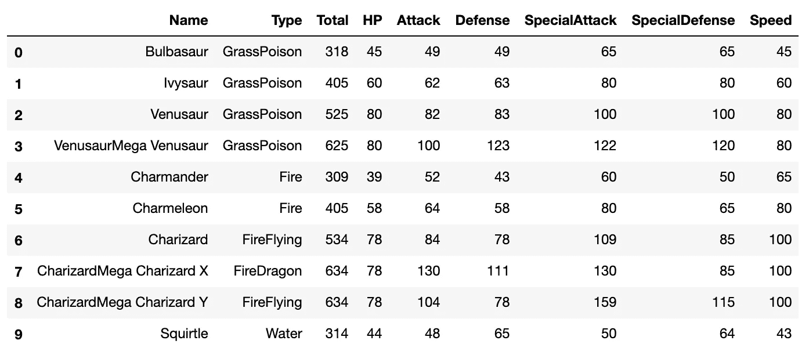

# Python 初学者的观察。通信线路（LinesofCommunication）

> 原文：<https://towardsdatascience.com/a-python-beginners-look-at-loc-part-2-bddef7dfa7f2?source=collection_archive---------12----------------------->

## 在 pandas 数据框架中设置行和列值

作为一个 Python 初学者，使用`.loc`来检索和更新 pandas 数据帧中的值对我来说并不合适。在之前的[帖子](https://medium.com/@ljhopkins/a-python-beginners-look-at-loc-part-1-cb1e1e565ec2)中，我分享了我所了解到的关于*与`.loc`检索*数据的情况。今天，我们将谈论*设置*值。

作为复习，这里是我们正在处理的神奇宝贝数据的前 10 行:



# 将一组单元格设置为单个值

使用`.loc`设置数据值很容易，所以让我们将 Mega Venusaur 的值设置为`0`。只需将指标值传递给 Mega Venusaur 出现的行(即`3`):

```
df.loc[3] = 0
df.head(5)
```


现在，让我们通过传递所有行(带有`:`)和列名来重置*所有*神奇宝贝到`60`的“速度”统计:

```
df.loc[:, 'Speed'] = 60
df.head(5)
```


最后，让我们把所有“灵异精灵”类型的神奇宝贝的生命值更新为`42`。(如果你需要一个关于如何构建布尔掩码的复习，请看[这篇文章](https://medium.com/@ljhopkins/a-python-beginners-look-at-loc-part-1-cb1e1e565ec2)。)

```
df.loc[df['Type'] == 'PsychicFairy', ['HP']] = 42
```


使用这种方法，*由`.loc`表达式返回的每个单元格*都将被更新为您指定的值，并且它们将直接在 dataframe 中被更改*，因此最好先测试一下您是否得到了您期望的行/列，而无需设置值。例如，当我构建这个例子时，我无意中在列索引器中有了`['Name', 'HP']`，所以我最终得到了一堆名为`‘42’`的具有`42`生命点的 PsychicFairies，并且我必须重新加载我的数据。*

# 将一组单元格设置为一组不同的值

但是如果您需要为一组单元格设置不同的*值呢？你所需要的只是一个你想要设置的值的列表(在形状上等同于你的`.loc`语句返回的数据)，而`.loc`会为你做这件事。*

举个例子，假设我们想改变火型神奇宝贝的名称，使其包含🔥表情符号:

1.  为火焰类型创建一个布尔遮罩:`df[‘Type’] == ‘Fire’`
2.  将掩码传递到 DataFrame，以过滤火类型神奇宝贝的行:`**df[**df[‘Type’] == ‘Fire’**]**`
3.  通过分割 DataFrame: `df[df[‘Type’] == ‘Fire’]**[‘Name’]**`)来隔离 Name 列。
4.  接下来，使用掩码建立列表理解，以生成新的表情符号增强的名称。我们将把它赋给一个名为`new_names` : `new_names = **[‘🔥’ + name + ‘🔥’ for name in** df[df[‘Type’] == ‘Fire’][‘Name’]**]**`的变量。
5.  最后，使用步骤 1 中的布尔掩码和`Name`列作为`.loc`语句中的索引器，并将其设置为 fiery 名称列表:

```
**df.loc[df['Type'] == 'Fire', 'Name']** = new_names
```


对多个列的更新也很容易。并且`.loc`将在任意数量的行&列中设置值；只传递相同维度的值。

让我们改变一些心灵精灵类型的攻击和特殊攻击值。


这里我们将让`.loc`引用三行两列，以及一个相同维度的值列表，我们就可以开始了。

```
rows_to_update = [305, 306, 487]
cols_to_update = ['Attack', 'SpecialAttack']
values = [[87,88],[187,188],[287,288]]df.loc[rows_to_update, cols_to_update] = values
```


以上就是我对`.loc`的了解。你有什么问题？其他提示？