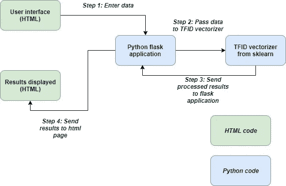
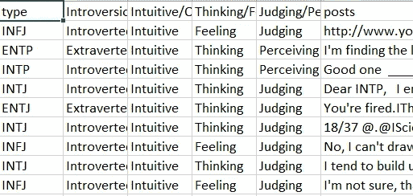

# python flask 应用程序，使用文本分析根据用户输入预测性格类型。

> 原文：<https://towardsdatascience.com/a-python-flask-app-that-predicts-the-personality-type-on-the-basis-of-user-entries-using-text-1269d6f644bd?source=collection_archive---------14----------------------->


Vertical Flow by I Rice Perreria

Irene Rice Perreria 的上图(名为《垂直流动》)是我最感兴趣的一幅作品。对我来说，它描述了颜色的异质性，同时也描述了这些不同的颜色如何来源于同一种本质。一天结束时，颜色在光谱上起作用，而不是作为单独的点。人们可以认为，人类的性格也在一个相似的光谱上运行，而不是孤立的，不同的性格类型在这个光谱上不断地重合和分离。在本文中，我描述了一个应用程序，它使用 python 中的文本分析，帮助用户预测自己在迈尔斯布里格斯性格谱(16 种性格)上的性格。最终的应用程序部署在 heroku 上，可以在这里访问[。该应用程序是用 python 开发的，使用“flask”进行应用程序开发，使用“sklearn”的“tfidvectorizer”进行文本分析。](https://personality-type-finder.herokuapp.com/)

## ***用于分析数据和我们的关键问题***

用于分析的数据是一个数据库，包含 reddit 用户对应不同性格类型的帖子。数据库可以在 kaggle [这里](https://www.kaggle.com/datasnaek/mbti-type)访问。*这是一个免费、开源、公共领域的数据集*。我们将创建一个个性查找应用程序，用户可以输入任何一组描述自己的单词。该应用程序将运行计算用户输入的文本与来自个性类型数据库的各种条目的相似性得分，以预测个性类型(16 种 Myers Briggs 个性之一)。它还将预测四个迈尔斯·布里格斯特征的可能性，如内向/外向、直觉/观察力、思考/感觉和判断/感知。下面的视频展示了最终的实际应用。该应用程序将显示前 5 个预测的相似性得分，使用户知道适合她或他的性格谱。


**应用程序的结构**

这是一个传统的 flask 应用程序，我们需要首先定义一个结构。我们将使用的结构是一个标准的 flask 应用程序结构，带有一个包含用户界面和托管结果的 index.html 文件，以及一个包含创建应用程序的代码的 python 文件。

```
#Structure of the flask application----Root folder
    --Base data files #This is basically just the csv with the base data from kaggle
    --application.py #This is the main python code file
    ----templates
        --index.html #The templates folder contains our index.html file with the user interface
    ----static
        #The static folder contains any images we will want to display in the application. 
```

下面是应用程序中数据流的图示



**定义用户界面(index.html)**

所以，让我们从用户界面本身开始。index.html 文件的第一部分很简单。这只是一些描述应用程序本身的基本文本和上面这幅画的简单图像，我们将把它放在我们的“静态”文件夹中。这看起来像是

```
<html> <head><section>    </section> <h1> Personality finder (developed using text analysis)</h1> <p> Find your personality type using this python flask application that makes use of a text vectorizer to analyze    posts by individuals identifying as different personality types. The app will yield your top 5 personalities from the     16 Myers Briggs personality types. Data downloaded from kaggle. By the way the paiting displayed here is "Vertical Flow" By I.Rice.Pereria.</p>    <p> Please note that the script might take a minute to run since it has to parse through over 8000 entries.</head>
```

现在，让我们创建一个表单，用户可以在其中提交我们将用于文本分析的单词或句子。这是一个简单的 html post 表单，带有一个提交按钮。我们将不得不跟踪我们分配给表单的名称，因为这将在后端使用。

```
<form method="post" > <input name="**question1_field**" placeholder="enter search term here"> <input type="submit"></form>
```

我将跳过对 html 页面 css 样式的解释。最后，我们将创建一个表，为用户输出前 5 个条目。我们还将打印出各种标题，如个性类型、相似性得分、搜索术语、行等。我们需要在 html 中定义表头(“th”)和表数据(“td”)。让我们先定义头部，

```
#Each of the heads is some data that we want to print out for the user<h2>Relevant personality types displayed below</h2>
<table>  
<tr>    
<th>Type</th>    
<th>SimiScore</th>    
<th>Search Term</th>    
<th>Rank</th>    
<th>Introversion/Extraversion</th>   
<th>Intuitive/Observant</th>    
<th>Thinking/Feeling</th>    
<th>Judging/Perceiving</th>    
</tr>
```

现在，数据将从 python 端引入。所以我们可以使用一些 jinja 代码来有效地访问我们的 python 数据帧变量。我们将在后端“文档”中调用我们的 python 数据框架。Jinja 将允许我们迭代这个 python 数据帧，如下所示。现在，调用每个变量的顺序应该类似于我们在上面的块中定义的头的顺序。

```

<tr>
<td>{{doc["type"]}}</td>
<td>{{doc["Simiscore"]}}</td>
<td>{{doc["Search Term"]}}</td>
<td>{{doc["Rank"]}}</td>
<td>{{doc["Introversion/Extraversion"]}}</td>
<td>{{doc["Intuitive/Observant"]}}</td>
<td>{{doc["Thinking/Feeling"]}}</td>
<td>{{doc["Judging/Perceiving"]}}</td> 
</tr>

</table>
```

**定义后端(python)**

完整的后台 python 代码文件可以在[这里](https://github.com/kanishkan91/Personality-type-finder/blob/master/application.py)访问。显然，第一步是导入所有需要的 python 库。因为我们将在 python 中使用文本分析，所以我们需要从 sklearn 包中导入 Tfidvectorizer 函数。此外，让我们继续在 flask 中创建应用程序本身。我们还将为应用程序创建一个标准的 get 和 post 路由，这样我们就可以有效地向它发送数据和从它那里接收数据。

```
#Import required packagesfrom flask import Flask, flash, redirect, render_template, request, session, abort,send_from_directory,send_file
import pandas as pd 
import numpy as np
import json
import xlrd
from sklearn.feature_extraction.text import TfidfVectorizer#Create a flask application
application= Flask(__name__)#Create an application route
@application.route("/",methods=["GET","POST"])
```

现在让我们使用 flask 应用程序中的主页功能来定义主页上将会发生什么。现在，在这里我们将首先尝试调用用户在上面定义的 html 表单中输入的数据。正如我们所知，表单本身被称为“问题 1 _ 字段”。我们可以使用一个调用表单数据的简单请求函数来访问这些数据。我们还可以指定一个默认单词，在用户没有选择任何单词的情况下将调用这个默认单词(本例中的默认单词是‘Education’)。让我们也使用 pandas 读入原始数据本身作为数据帧。我已经从 kaggle 的 reddit 数据中清理了用户条目。一个干净的 csv 版本可以在这里访问[。下面是数据集的截图。文章栏包含用户的多篇文章。请注意，这是一个开源数据集，可在 kaggle 上获得，不包含任何机密信息。](https://github.com/kanishkan91/Personality-type-finder/blob/master/Personalities.csv)



```
def homepage():
#Call value from HTML form  
words = request.form.get('question1_field', 'Education')#Read raw data as a dataframe
datasource1 = pd.read_csv("Personalities.csv")
```

*处理多个单词-* 用户可以输入多个单词作为单个条目的一部分。我们希望将这些单词拆分成多个条目，以便在对所有单词一起进行分析之前，可以分别对每个单词进行文本分析。我们还想为每个单词过滤数据帧中的帖子，并将这些过滤后的帖子放入我们将使用的不同数据帧中。因此，让我们为此创建另一个数据帧。创建了这个新的数据框架后，让我们删除重复的内容，以防相同的帖子被选中两次。

```
#Separate words into multiple entrieswords = words.split() #(This will be stored as separate items in a list)#Filter the data for posts that contain either of these words
datasource=[]for i in words:      
    d2 = datasource1[datasource1['posts'].str.contains(str(i))]          
    datasource.append(d2)

datasource = pd.concat(datasource, ignore_index=True)
datasource = datasource.drop_duplicates()
```

好了，在我们继续之前，让我们来讨论一下什么是相似性得分，以及在给定的上下文中，我们如何以及为什么要计算它。相似性得分或“成对相似性得分”基本上是特定单词与条目中其他单词的距离。所以基本上，如果一个用户说“我爱金属”，这些词将与提到任何与金属相关的帖子有很高的相似度。由于每个帖子对应一种性格类型，我们可以从技术上“预测”用户的性格与发帖用户的性格类型相似。

tfidf 矢量器将计算特定帖子中出现的单词的频率和重要性。因此，如果在上面的例子中，如果帖子中的单词 metal 只是偶然出现，tfid 得分将非常低，从而产生低相似性得分。tfid 矢量器将根据单词的频率及其唯一性来计算其得分。在本文中，我不会详细介绍 tfidvectorizer 的工作原理。因此，为了计算用户文本和文章文本之间的相似性，我们需要在一个数据帧中并排显示这两个值。我们已经有一个过滤的数据框架与用户的相关职位。让我们创建一个名为 documents 的空数据帧，用于文本分析。我们希望在每次用户文本改变时清除数据帧。所以，我们可以在下面的 for 循环中调用它。

```
 for i in range(0, len(datasource)):      
    documents = []      
    documents.append(words)      
    documents.append(datasource.loc[i, 'posts'])
```

现在，对于 dataframe 中的每一个条目，我们要计算文章相对于用户条目的 tfidf 分数。这可以通过 tfidvectorizer 函数来实现。该功能允许我们指定停用词，即该功能应忽略冠词(a、an 等)的词。)和介词(over，under，between 等。).因此，如果我们将函数中的 stop_words 参数设置为“english ”,这些单词将被自动忽略。添加 tfid 矢量器来计算每个条目的分数，我们的函数现在看起来如下。

```
for i in range(0, len(datasource)):      
    documents = []      
    documents.append(words)      
    documents.append(datasource.loc[i, 'posts'])

      tfidf = TfidfVectorizer(stop_words="english", ngram_range=(1, 4)).fit_transform(documents) #tfidf is the tfidf score we compute for this post with respect to the entered text.
```

现在我们知道了用户在每个选中的帖子中输入的单词的重要性。但是我们现在想要使用这个 tfidf 分数来计算相似性分数，即用户输入的单词与帖子中输入的单词有多相似。相似度也可以定义为单词之间的余弦距离。这篇来自堆栈溢出的[帖子](https://stackoverflow.com/questions/8897593/how-to-compute-the-similarity-between-two-text-documents)详细解释了成对相似性的计算。简单的解释是，您可以通过将 tfidf 得分乘以其转置来计算成对相似性。这产生了一个相似性矩阵，访问这个矩阵的第一个元素将给出相似性得分。我们还将格式化相似性得分，仅显示前四位小数，并将其作为自己的列添加到数据帧中。因此，上面带有成对相似性计算的代码变成了，

```
for i in range(0, len(datasource)):      
    documents = []      
    documents.append(words)      
    documents.append(datasource.loc[i, 'posts'])

    tfidf = TfidfVectorizer(stop_words="english", ngram_range=(1, 4)).fit_transform(documents) #Compute pairwise similarity by multiplying by transpose.
    pairwise_similarity = tfidf * tfidf.T #Then, extract the score by selecting the first element in the   matrix.
    simiscore =   pairwise_similarity.A[0][1] #Format the similarity score to select only 4 decimals
     simiscore = "{0:.4f}".format(simiscore)

     #Finally, add the similarity score to the dataframe
      datasource.loc[i, 'Simiscore'] = simiscore
```

既然循环已经完成，我们将为用户输入的文本计算数据集中所有帖子的相似性得分。接下来的步骤是对相似性得分进行排名，挑选出前 5 名，将搜索术语作为其自己的列添加到数据框架中，并选择我们想要显示的相关列。最终的输出将被分配给一个名为 docs 的数据帧，我们将把它传递给我们的 html 表。

```
#Compute the rank and add it to the dataframe as its own column
datasource['Rank'] = datasource['Simiscore'].rank(method='average', ascending=False) #Sort by the rank
datasource = datasource.sort_values('Rank', ascending=True)#Select top 5 entries
datasource = datasource.head(5)#Add the search term to the dataframe as its own column
datasource['Search Term'] = words #Select relevant columns and assign to a dataframe called docsdocs = datasource[ ["type" ,"Rank", "Simiscore","Search Term","Introversion/Extraversion","Intuitive/Observant","Thinking/Feeling","Judging/Perceiving"]]
```

因为我们要将这些数据发送到一个 html 表中，所以我们必须将它转换成 json 格式。幸运的是，在 pandas 中使用 to_json 函数可以很容易地实现这一点。我们还可以将方向设置为记录，这样每个条目都成为一条记录。我们可以通过返回一个叫做‘docs’的对象来完成 flask 中的主页功能，这是我们前端所期望的。我们将使用 flask 中的 render_template 函数将数据发送到我们的 index.html 文件中。

```
#Convert to json
docs = docs.to_json(orient="records")#return data to front end for display return render_template('**index.html**',**docs**=json.loads(**docs**))
```

最后，让我们以标准烧瓶样式完成我们的应用程序，

```
if __name__ == "__main__":    
   app.run(debug=True)
```

你有它！运行代码时，您应该会得到以下消息，其中包含一个指向本地驱动器上的应用程序的链接。

```
* Running on [http://127.0.0.1:5000/](http://127.0.0.1:5000/) (Press CTRL+C to quit)
```

运行访问此链接，您将被定向到一个工作的应用程序！


在那里！自己尝试一些单词。

以下是一些相关链接，

1.  链接到这个应用程序的 github 项目-[https://github.com/kanishkan91/Personality-type-finder](https://github.com/kanishkan91/Personality-type-finder)
2.  链接到部署在 heroku-【https://personality-type-finder.herokuapp.com/ 的应用程序的工作版本
3.  链接到用于此应用程序的基础数据-[https://github . com/kanishkan 91/Personality-type-finder/blob/master/personalities . CSV](https://github.com/kanishkan91/Personality-type-finder/blob/master/Personalities.csv)

PS-github 项目包含一个. gitignore 和 requirements.txt 文件，您可以使用该文件将该应用程序的修改版本部署到任何服务器上。

特别感谢 Anish Hadkar 和 Aditya Kulkarni 在开发过程中对该应用程序的反馈。欢迎您提供任何额外的反馈！