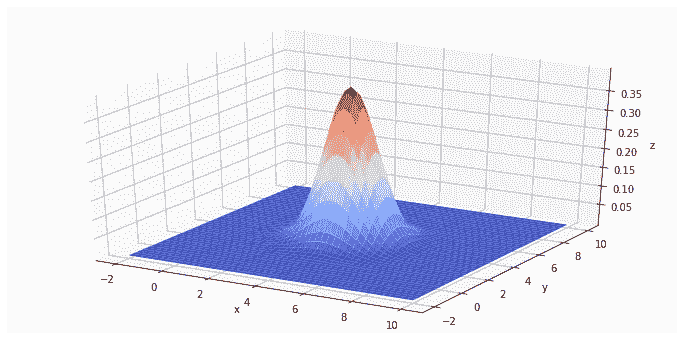
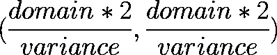
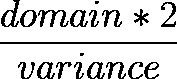
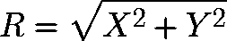
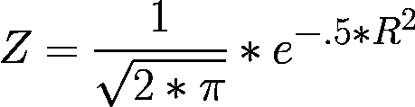
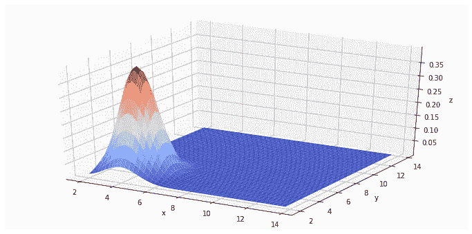
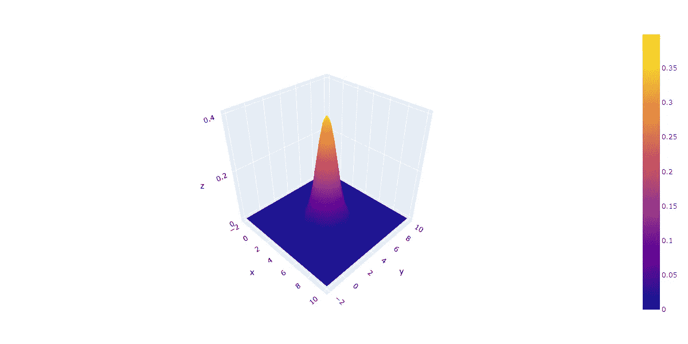
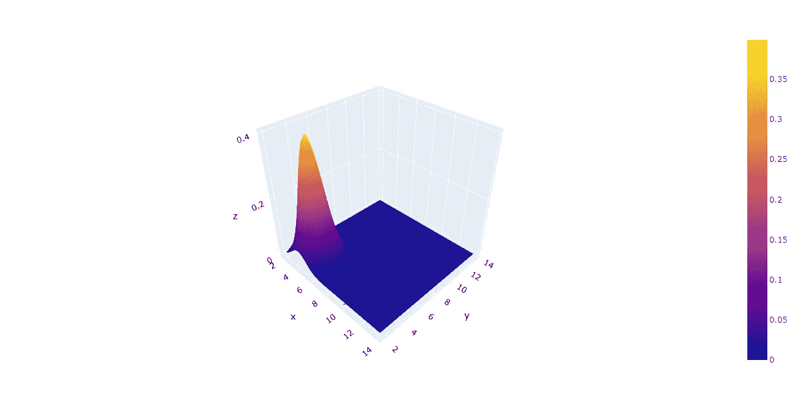

# 使用(Python/Numpy/tensor flow/py torch)和(Matplotlib/Plotly)生成和绘制 3D 高斯分布的教程。

> 原文：<https://towardsdatascience.com/a-python-tutorial-on-generating-and-plotting-a-3d-guassian-distribution-8c6ec6c41d03?source=collection_archive---------1----------------------->



# 问题陈述:

每当提到绘制高斯分布图时，通常都是关于单变量正态分布，这基本上是一种 2D 高斯分布方法，它从 X 轴上的范围数组中采样，然后对其应用高斯函数，并产生绘图的 Y 轴坐标。

然而，在 3D 高斯分布的情况下，采样发生在 X 轴和 Y 轴上，并且坐标投影在 Z 轴上。这种情况在教程中很少提到，虽然在很多情况下非常有用。

# 解决方案概述:

要在两个轴上采样:X 轴和 Y 轴，您需要对 X 轴上的每个样本进行所有 Y 轴采样。

两个轴上的完整采样将产生范围，一个在 X 轴上，一个在 Y 轴上。

完成后，您需要在 Z 轴上生成一个域，这可以通过计算(X，Y)样本的距离来完成。

然后，可以通过高斯函数运行 Z 域，以产生 Z 轴上的高斯范围。

然后可以构建一个 3D 绘图仪来利用所有三个范围来产生 3D 表面。

# 数学分解:

*   X 范围需要是大小为的 2D 矩阵:



*   X 中间范围是从“-域”到“+域”的行空间(1D 范围数组)，每一步的大小为“方差”，该 1D 数组中元素的数量应为:



*   X 范围是堆叠 X 中间范围的副本的结果，副本数应为:


*   Y 范围是 X 范围矩阵的转置。


*   Z 域是 X 和 Y 之间的距离:



*   Z 范围是对距离矩阵(Z 域)应用高斯函数的结果:



# 代码实现:

## 用纯 Python 制作的二元正态(高斯)分布生成器

*   X 范围的构造没有使用 numpy 函数。
*   Y 范围是 X 范围矩阵(ndarray)的转置。
*   最终得到的 X 范围、Y 范围和 Z 范围用 numpy 数组封装，以便与绘图仪兼容。

## 用 Numpy 制作的二元正态(高斯)分布生成器

*   X 中间范围由 numpy 使用“arange”函数构建。
*   Y 中间范围由 numpy 使用“arange”函数构建。
*   X，Y 范围是用 numpy 的“meshgrid”函数构建的。

## 用 Tensorflow 制作的二元正态(高斯)分布生成器

*   X 中间范围由 tensorflow 使用“range”函数构建。
*   Y 中间范围由 tensorflow 使用“range”函数构建。
*   X，Y 范围是使用 tensorflow 的“meshgrid”函数构建的。

## 用 PyTorch 制作的二元正态(高斯)分布生成器

*   X 中级范围由 torch 使用“arange”功能构建。
*   Y 中间范围由 torch 使用“arange”功能构建。
*   X，Y 范围是用 torch 的“meshgrid”函数构建的。

## 用 Matplotlib 绘制二元法线绘图仪

## 带 Plotly 的二元普通绘图仪(版本 4.0.0)

## 用 Matplotlib 绘制 Python 生成的二元正态分布

```
plt_plot_bivariate_normal_pdf(*py_bivariate_normal_pdf(6, 4, .25))
```


## 用 Matplotlib 绘制 Numpy 生成的二元正态分布

```
plt_plot_bivariate_normal_pdf(*np_bivariate_normal_pdf(6, 4, .25))
```



## 用 Matplotlib 绘制张量流生成的二元正态分布

```
plt_plot_bivariate_normal_pdf(*tf_bivariate_normal_pdf(6, 4, .25))
```


## 用 Matplotlib 绘制 PyTorch 生成的二元正态分布

```
plt_plot_bivariate_normal_pdf(*torch_bivariate_normal_pdf(6, 4, .25))
```


## 用 Plotly 绘制 Python 生成的二元正态分布

```
plotly_plot_bivariate_normal_pdf(*py_bivariate_normal_pdf(6, 4, .25))
```



## 用 Plotly 绘制二元正态分布图

```
plotly_plot_bivariate_normal_pdf(*np_bivariate_normal_pdf(6, 4, .25))
```



## 用 Plotly 绘制张量流生成的二元正态分布

```
plotly_plot_bivariate_normal_pdf(*tf_bivariate_normal_pdf(6, 4, .25))
```


## 用 Plotly 绘制 PyTorch 生成的二元正态分布

```
plotly_plot_bivariate_normal_pdf(*torch_bivariate_normal_pdf(6, 4, .25))
```


# 读者请注意:

请随时提供反馈，毕竟这些教程背后的原因是为了交流知识，并在出现错误时纠正课程。