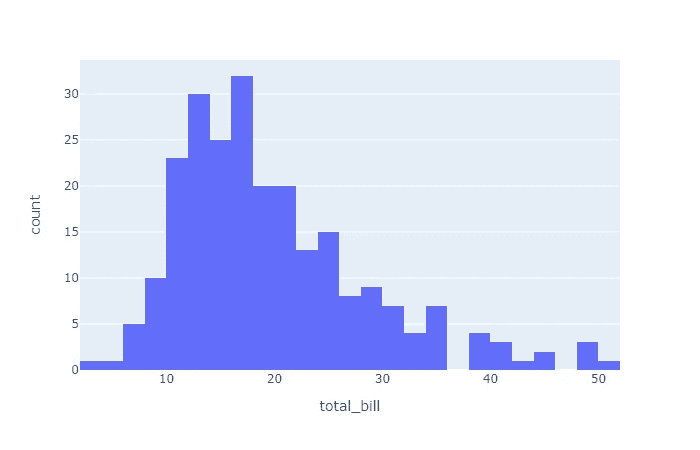
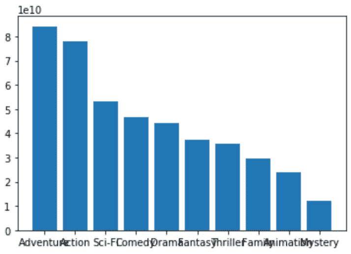
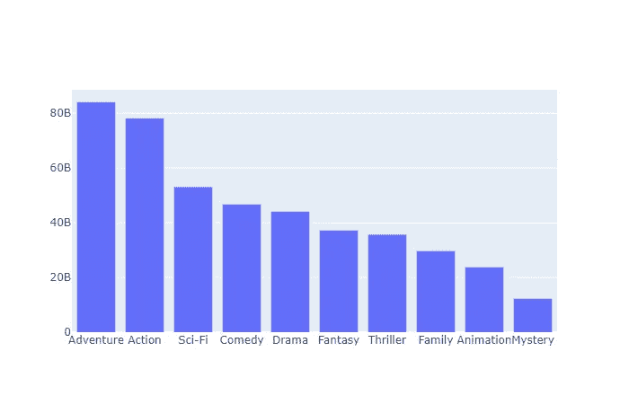
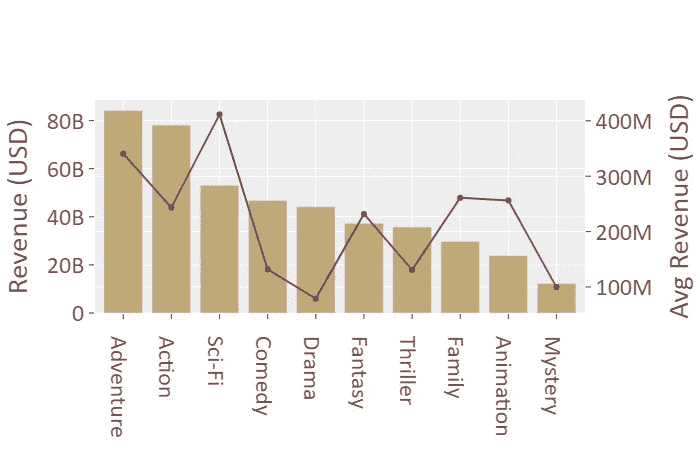

# Python 的 Plotly 可视化快速指南

> 原文：<https://towardsdatascience.com/a-quick-and-dirty-guide-to-visualization-in-plotly-for-python-6f79f2d06f2?source=collection_archive---------24----------------------->

## 在几分钟内开始制作美丽的情节

在 Python 中有无数的选项来创建情节，但是我已经开始倾向于使用的一个库是 Plotly。在 Jupyter 工作流程中，这是一个很好的选择，可以很容易地创建漂亮和可展示的情节。它有大量可定制的图供您用于可视化(整个选择可以在[这里](https://plot.ly/python/)看到)。

好吧，让我们深入到情节。Plotly 有两种风格，一种是 Plotly Express，另一种是 Graph Objects。

Plotly Express 可以被认为是制作剧情的更快捷的方式。它可以在您工作时用于可视化。使用 Plotly Express 的好处是通常只有很少的代码，但是您可以进行的绘图定制量也是有限的(与 Graph 对象相比，但与典型的图形库相当)。我个人不使用 Plotly Express，所以我不打算在这里介绍它，但是您可以在文档中阅读它，一旦您掌握了图形对象，它应该很容易使用。这是因为我更喜欢使用 Matplotlib 和 Seaborn 进行一般的可视化，因为它们与 Pandas 等流行的库集成得更紧密。当我需要制作非常像样的情节时，我会求助于 Plotly。下面是 Plotly Express 中的一个示例绘图和绘图代码。它直接来自文档。确保您已经安装了 Plotly。你可以在[这里](https://plot.ly/python/getting-started/)找到如何根据你的特定设备和环境做到这一点的细节。

```
**import** **plotly.express** **as** **px**
df = px.data.tips()
fig = px.histogram(df, x="total_bill")
fig.show()
```



现在，关于图形对象。使用这种方法的缺点是您通常需要编写更多的代码来创建这些图，但是优点是它们非常美观并且非常可定制。此外，您不必像在 Matplotlib 中那样处理重叠文本和缩放问题。对于我的用例来说，更多的代码行通常不是问题，我的用例是绘制出之前创建的图的最终版本。

下面是 Matplotlib 中的一个简单情节，使用了从[票房魔咒](https://www.boxofficemojo.com/)中获得的一些电影数据。

```
import matplotlib.pyplot as plt
plt.bar(top_genres, top_total);
```



正如您所看到的，如果我们不做一些额外的工作，它不会自动缩放轴以使其看起来更像样。下面是使用 Plotly 的相同情节。

```
plot_top_genres_total = go.Figure()
plot_top_genres_total = go.Figure([go.Bar(x=top_genres,
                                          y=top_total)])
plot_top_genres_total.show()
```



如您所见，开箱后更加干净。你不需要花太多的时间去让东西变得可读。

现在，说到我之前承诺的那部分。您可能需要保存这个片段。

这是一个复杂绘图的代码，有多个轴、多个图表、颜色选项、图例和轴标题。你可以添加、删除或更改部分代码来修改情节。

```
plot_name = make_subplots(specs= [[{“secondary_y”: True}]])# For a single axis plot use the following line instead
# plot_name = go.Figure() plot_name.add_trace(go.Bar(x=x_data,
                           y=y_data_1, 
                           name = ‘Plot 1 Name’, 
                           marker_color=  ’#bfa878'))plot_name.add_trace(go.Scatter(x=x_data, 
                               y=y_data_2, 
                               name = ‘Plot 2 Name’, 
                               marker_color= ’#7a4b4b’), 
                               secondary_y = True)plot_name.update_layout(yaxis_title = ”Y Axis Label”, 
                        showlegend = False,
                        template = ”ggplot2", font = dict(family= ”Calibri”,
                                    size = 24,
                                    color = ’#7a4b4b’))plot_name.update_yaxes(title_text = ”Secondary Y Axis Label”,
                       secondary_y = True)plot_name.show()
```

例如，要更改绘图类型，您可以将“条形图”和“散点图”关键字更改为“直方图”或“饼图”。打开文档，看看还有什么可用的。

要改变绘图颜色，只需在谷歌上搜索“颜色选择器”。然后，您可以选择您的颜色，并获得十六进制代码的 RGB 值，以替换上面的代码。

您可以通过删除第二个 add_trace 代码行和 update_yaxes 代码行来删除辅助绘图。

可以通过修改 update_layout 下的细节来更改字体、字体大小和字体颜色。

确保所有的 x 和 y 数据都在列表中。我发现在绘图中使用数据之前将数据处理成列表有助于避免错误。此外，在粘贴环境后，您可能需要修复环境中的缩进，这样代码才能工作。

下面是一个使用上面的代码和上面使用的相同数据创建的图的示例。



上面的代码可以满足您 90%的可视化需求(根据您所做的工作，可能多一点或少一点)。在你画了一些图之后，你应该熟悉 Plotly 的代码结构。你会感觉到要改变什么来超越这个情节的限制。

对于后 10%来说，一个好的方法是尝试浏览文档来寻找你想要的情节，而不是复制他们的代码，尝试将它集成到上面的代码中。尝试改变事物，了解事物是如何融合在一起的。这样做，你将开始逐步开发你自己的模块化系统来创建可视化，并节省宝贵的时间。

我希望这些信息可以帮助你在几分钟内开始使用 Plotly，并为你提供一个框架，随着你的需求变得越来越苛刻，你可以学习更多。祝你好运！