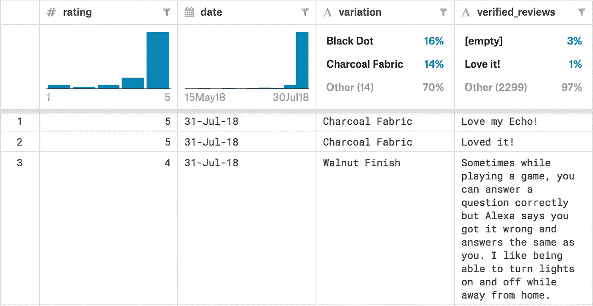
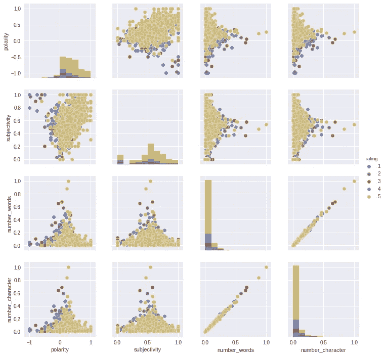
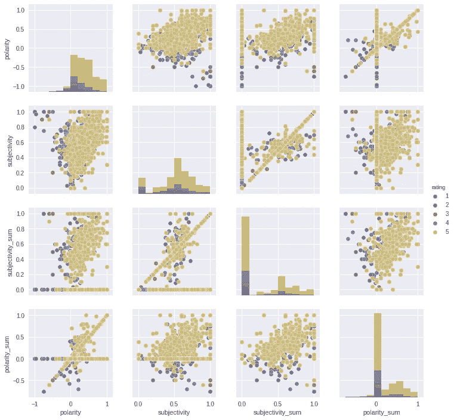
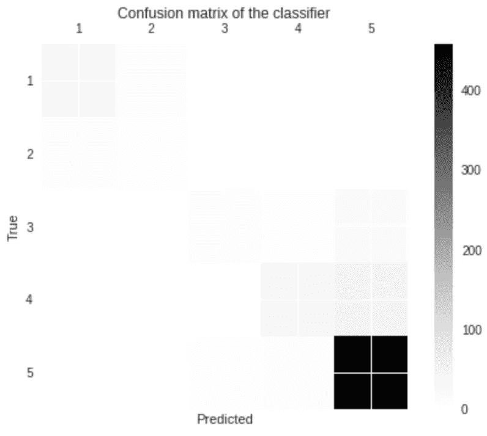

# 回声评论文本分类的自然语言处理快速探索

> 原文：<https://towardsdatascience.com/a-quick-exploration-of-nlp-for-text-classification-on-echo-reviews-6b65a9e2cc9e?source=collection_archive---------22----------------------->

## 简单几步的情感分析


Alexa，把你的评论分类。

自然语言处理(NLP)是以计算机可以“解释”的方式处理语言数据的领域/科学。Siri、Alexa、Google 等工具和服务。使用这些技术通过语言输入与人类互动，并解释文本数据。机器使用数字信息，这与语言学有本质的不同；因此，这项任务并不容易，需要创造性和复杂的解决方案。

在本文中，我们将使用 NLP 来预测用户对产品的评级，在本例中，是基于评论文本的 Amazon Echo Dot。这个例子需要对情感和极性以及数字分类输出等概念有一些低级的理解。让我们开始吧！

# 数据和预处理

第一步是打开一个 Google Colab python 笔记本，我们将使用这个环境来处理和可视化数据，构建模型，并做出最终预测。

本文的数据由 Kaggle 在以下位置提供:[https://www.kaggle.com/sid321axn/amazon-alexa-reviews](https://www.kaggle.com/sid321axn/amazon-alexa-reviews)

数据由以下字段组成:评级、日期、变化和审阅文本。



第一步是将这些数据导入我们的 Python 笔记本。要做到这一点，你需要一个 Kaggle 的账户，它是免费的，你可以用谷歌证书注册。

首先，我们需要安装允许我们与 Kaggle API 交互的包。

```
!pip install kaggle
```

现在，我们需要上传我们的 Kaggle 凭证。这是一个. json 文件，可以从 Kaggle 下载，有很多这方面的教程。只需执行下面几行代码并上传 kaggle.json 文件。

```
from google.colab import files
files.upload()
```

我们需要将刚刚上传的文件放入正确的目录中，以符合 API 协议。

```
!mkdir -p ~/.kaggle
!cp kaggle.json ~/.kaggle/
!chmod 600 ~/.kaggle/kaggle.json
```

现在我们准备下载数据。只需进入 Kaggle 页面，将链接复制到数据，或者复制下面的行。

```
!kaggle datasets download -d sid321axn/amazon-alexa-reviews
```

解压缩文件:

```
!unzip amazon-alexa-reviews.zip
```

现在我们将数据导入到熊猫数据框架中；但是首先，我们需要进口熊猫。

```
import pandas as pd
df = pd.read_table('amazon_alexa.tsv')
df.head()
```

数据帧中的一列包含代表用户正在查看的回声变化的分类值。给定有限数量的类别，对模型使用一次性编码来理解这个变量将是最有效的。一键编码为每个可能的类别创建一列，并根据相应的行是否包含相应的类别值给出 1 或 0。如果您只想专注于文本分析，请随意从输入变量中排除“variation”列！

```
df1 = df[['variation']]
df2 = df.drop(['variation'], axis = 1)
df1 = pd.get_dummies(df1)
df = pd.concat([df1,df2], axis = 1)
df.head()
```

需要处理的下一列是日期；在这种情况下，它以 dd-MMM-yy(例如 2018 年 7 月 31 日)。只接受数字输入的模型将无法解释这些信息。

解决方案是将字符串分解成独立的日、月和年的数字表示，然后将它们放在各自的列中。原始日期列也将被删除。

```
#df['Year'] = pd.DatetimeIndex(df['date']).year
df['Month'] = pd.DatetimeIndex(df['date']).month
df['Day'] = pd.DatetimeIndex(df['date']).day
df = df.drop(['date'], axis = 1)
df.head()
```

你可能注意到我把“年”注释掉了。所有审查的年份(2018 年)相同；因此，具有该列不必要地增加了计算负担，而没有提供任何好处。如果这个数据集的某个版本有更新的旧日期，请随意使用“Year”。

下一步将是收集一些与评论文本本身相关的信息。出于这个例子的目的，我们将使用一个工具 TextBlob，它将分析文本字符串并提供与情感相关的数字输出。TextBlob 将以元组的形式输出极性(范围-1 到 1)和主观性(范围 0 到 1)。这个过程的结果可以映射到分别包含极性和主观性的列中。

首先，让我们开始导入 TextBlob 并定义一个函数，该函数在给定一个字符串输入的情况下输出情感，如果输入无法处理，它将返回一个中性的输出。

```
from textblob import TextBlob
def sentiment_calc(text):
    try:
        return TextBlob(text).sentiment
    except:
        return TextBlob('hello').sentiment
```

现在，让我们使用一个 lambda 函数将这个新创建的函数应用于包含评论数据的列，并将输出设置为一个新列，我们称之为“情绪”然后，我们将情感元组映射到各个变量的各个列，并删除“情感”列。

```
df['sentiment'] = df['verified_reviews'].apply(lambda text: sentiment_calc(text))
df[['polarity', 'subjectivity']] = df['sentiment'].apply(pd.Series)
df = df.drop(['sentiment'], axis = 1)
df.head()
```

接下来，我们可以收集一些关于文本本身性质的附加元数据，包括字符数、字数、平均单词长度和停用词数。这将允许模型识别这些特征和评级输出之间的任何关系。

首先让我们定义一个返回平均单词长度的函数:

```
def avg_word(sentence):
  try:
    words = sentence.split()
    return (sum(len(word) for word in words)/len(words))
  except:
    return 0
```

现在，让我们基于 review 文本列为上述元数据元素创建新列。

```
df['number_words'] = df['verified_reviews'].str.split().str.len()
df['number_character'] = df['verified_reviews'].str.len()
df['avg_word'] = df['verified_reviews'].apply(lambda x: avg_word(x))
```

现在我们将创建一个包含评论文本中停用词数量的列。停用词通常被认为是更常见、意义更小的词，如“a”、“the”和“I”。我们还不知道这个变量和这个特定应用的输出之间是否有相关性；然而，我们有一个小的数据集和充足的内存，包含它不会有什么坏处！

我们将从 NLTK 导入“停用词”工具(我鼓励那些不知道这个工具包是什么的人去查一下)。导入工具包，然后使用 lambda 函数，通过执行以下代码行将其应用到评审中。

```
import nltk
nltk.download("stopwords")
from nltk.corpus import stopwords
stop = stopwords.words('english')df['stopwords'] = df['verified_reviews'].apply(lambda x: len([x for x in x.split() if x in stop]))
df.head()
```

让我们对这些输入应用一个定标器(Scikit-Learn MinMaxScaler ),以便于模型解释:

```
from sklearn.preprocessing import MinMaxScaler
scaler = MinMaxScaler()columns = ['number_character','number_words', 'avg_word', 'stopwords']
for col in columns:
  df[[col]] = scaler.fit_transform(df[[col]])
df.head()
```

此时，我们可以开始构建模型了！如果你喜欢，请随意这样做，因为有足够多的信息来做出一些可靠的预测。然而，我将通过一些额外的步骤来帮助从评论中挤出更多的信息！

这个过程将涉及文本摘要。我要做的是总结每次复习，然后应用前面的步骤。理论上，这应该从评论中分离出最重要的句子，然后收集最重要的观点。让我们试一试！

从 Gensim 导入汇总工具，然后定义一个可应用于列的函数。注意:如果摘要过程中有错误，这个函数将返回原始文本的副本。

```
from gensim.summarization import summarizedef sum_text(text):
  try:
    summed_text = summarize(text)
    return summed_text
  except:
    return text
```

现在，让我们应用这个函数，并收集与之相关的情绪。没有必要缩放输出，因为情感分数将总是在模型容易理解的范围内给出。

```
df['summed_text'] = df['verified_reviews'].apply(lambda x: sum_text(x))
df['sentiment_sum'] = df['summed_text'].apply(lambda text: sentiment_calc(text))
df[['polarity_sum', 'subjectivity_sum']] = df['sentiment_sum'].apply(pd.Series)
df = df.drop(['sentiment_sum'], axis = 1)
df.head()
```

现在，让我们创建一个可以输入到模型中的新数据帧。我们可以通过创建 dataframe 的副本来做到这一点，该副本排除了带有字符串的列。

```
df2 = df.drop(['verified_reviews', 'summed_text'], axis = 1)
df2.head()
```

# 数据可视化

为了更好的理解数据，我们用 Seaborn 来可视化吧！

导入依赖项:

```
import seaborn as sns
from matplotlib import pyplot as plt
```

绘制所需变量的图表:

```
sns_plot = sns.pairplot(df, hue = 'rating', vars=['polarity','subjectivity', 'number_words', 'number_character'])
#sns_plot.savefig('name_of_file.png')
#files.download('name_of_file.png')
```

请注意，最后两行被注释掉了，如果您想保存文件，可以随意取消注释！

以下是输出:



总结文本的数据呢？



正如您所看到的，存在某种程度的聚类，让我们希望我们的模型能够捕捉到细微差别！

# 构建和执行模型

我们已经完成了数据预处理，最困难的部分已经过去了！

下一步我们将使用 Scikit-Learn 实现一个随机森林分类器。如果您不理解这种形式的分类器是如何工作的，这是一个查找它的好机会！

让我们从创建测试和训练数据开始。我们需要将数据帧转换为标签的 numpy 数组和输入的 numpy 矩阵。我们将使用内置的 Scikit-Learn 测试训练函数来拆分数据。

```
from sklearn.model_selection import train_test_split
import numpy as npdf1=np.matrix(df2.drop(['rating'], axis = 1))
y=np.array(df2['rating'])X_train, X_test, y_train, y_test = train_test_split(df1, y, test_size=0.2)
```

现在让我们初始化模型，并使其适合训练数据。由于数据集很小，这应该会很快收敛。完成后会显示分数。

```
from sklearn.tree import DecisionTreeClassifierrfc = RandomForestClassifier(n_estimators=500, criterion='gini', max_depth=None, min_samples_split=2, min_samples_leaf=1, min_weight_fraction_leaf=0.0, max_features='auto', max_leaf_nodes=None, min_impurity_decrease=0.0, min_impurity_split=None, bootstrap=True, oob_score=False, n_jobs=None, random_state=None, verbose=0, warm_start=False, class_weight=None)rfc.fit(X_train,y_train)
score = rfc.score(X_test,y_test)
print(score)
```

最后，让我们将结果可视化。

```
from sklearn.metrics import confusion_matrixpredictions = rfc.predict(X_test)
cm = confusion_matrix(y_test, predictions)
labels = ['1','2','3','4','5']
fig = plt.figure()
ax = fig.add_subplot(111)
cax = ax.matshow(cm)
plt.title('Confusion matrix of the classifier')
fig.colorbar(cax)
ax.set_xticklabels([''] + labels)
ax.set_yticklabels([''] + labels)
plt.xlabel('Predicted')
plt.ylabel('True')
plt.show()
#print(cm)
```

要查看结果的数值，只需取消最后一行的注释，以 numpy 矩阵的形式打印出混淆矩阵。

输出应该类似于以下内容:



成绩还算不错！我们达到了大约 84%的准确率，大多数不正确的预测都在相邻的方块中(a 5 被归类为 a 4 或反之亦然)。

# 结论

在这篇文章中，我们已经下载了 Alexa 评论，预处理文本以创建我们的模型可以解释的数据框架，可视化数据，建立模型，并做出一些预测！

要进行更全面的分析，请考虑建立一个回归模型，将预测强制为 0 到 5 范围内最接近的整数。由于等级是线性数字等级，回归模型方法可能具有优势。

NLP 是一个强大的工具，我们只是触及了可能性的表面，我希望你能在这个主题上了解更多，并构建自己的应用程序和实现！

一如既往，有任何问题请联系我，我很乐意帮助您。