# 使用熊猫和海牛的描述性统计快速指南

> 原文：<https://towardsdatascience.com/a-quick-guide-on-descriptive-statistics-using-pandas-and-seaborn-2aadc7395f32?source=collection_archive---------0----------------------->

Image by [rawpixel](https://pixabay.com/users/rawpixel-4283981/?utm_source=link-attribution&utm_medium=referral&utm_campaign=image&utm_content=3295556) from [Pixabay](https://pixabay.com/?utm_source=link-attribution&utm_medium=referral&utm_campaign=image&utm_content=3295556)

描述统计学是一门研究数据分析的学科，以有意义的方式描述、显示或总结数据。它涉及各种测量的计算，例如中心测量值、**、可变性测量值**、**百分位数**以及表格&图的**构造。**

在本文中，我将介绍那些常见描述性度量的基本概念以及表格和图形的构造。同时，将使用 **Pandas 和 Seaborn 演示处理描述性测量的计算和构建表格和图表所需的实际步骤。** Pandas 和 Seaborn 是常用于统计分析和可视化的 Python 库。

# 先决条件 Python 库

*   **熊猫**
*   **Matplolib**
*   **Seaborn**

**注:**

这是强烈推荐使用 **Jupyter 笔记本**来完成本文中的所有编码任务。这里展示的所有 Python 脚本都是在 **Jupyter 笔记本**上编写和测试的。您可以参考 Jupyter 官方网站[获取在您的机器中设置 Jupyter 笔记本的更多说明。](https://jupyter.org/)

# 数据集

我们将使用与墨尔本房价相关的公共数据集"*Melbourne _ HOUSE _ PRICES _ less . CSV "*作为我们的样本数据。数据集可在 [Kaggle](https://www.kaggle.com/anthonypino/melbourne-housing-market) 获得。

# 主题 1:数据类型

## 1.1 数值和分类数据

在开始任何技术计算和绘图工作之前，理解统计研究中常见的数据类型非常重要。数据主要有两种类型:**分类数据(定性)和数值数据(定量)。**

*   **分类数据:**非数字信息，如性别、种族、宗教、婚姻状况等。
*   **数值数据:**测量或计数如身高、体重、年龄、工资、子女数等

## 1.2 实践中的 Python 代码

在统计分析或数据科学项目中，数据(分类数据、数字数据或两者兼有)通常以表格格式(如电子表格)存储在 CSV 文件中。

为了更好地理解，让我们从使用 Pandas 库可视化 CSV 文件(*MELBOURNE _ HOUSE _ PRICES _ less . CSV*)中的数据开始。

Read and show the first five rows of data

*   **第一行:**导入*熊猫*库
*   **第 3 行:**使用 *read_csv* 方法将 csv 文件中的原始数据读入到*数据帧 df 中。**数据帧*是用于统计和机器学习模型的二维数组式数据结构。
*   **第 4 行:**使用 *head()* 方法显示数据帧的前 5 行数据。

当我们运行 *Jupyter Notebook* 中的代码时，您将看到数据显示在一个包含 13 个变量(列)的表格中。

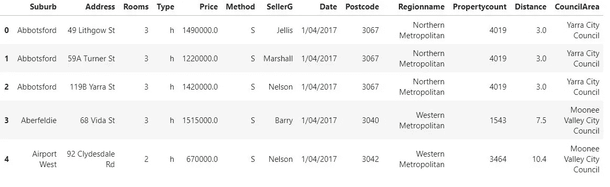

The first five rows of data in a tabular format

Pandas 还提供了另一个有用的方法， *info()，*来获得数据集中每个变量的数据类型的更多细节。在同一个 Jupyter 笔记本中，只需在前面的代码下创建一个新的单元格，添加以下代码行并运行它:

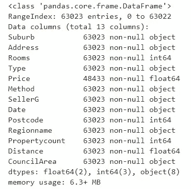

Details of data type for each column

结果显示数据集中总共有 63023 个条目。通常，与数据类型“ **int64** ”和“ **float64** ”相关联的列表示数值数据，而数据类型“ **object** 表示分类数据。

*唯一的例外是“邮政编码”。虽然邮政编码被表示为一个数字(int64)，但这并不一定使它量化。邮政编码只是应用于分类数据的数字。

只需一行代码， *Pandas* 就能让我们识别出由*“房间”、“价格”、“物业数量”*和*“距离”*组成的数字数据，其余的都是分类数据。

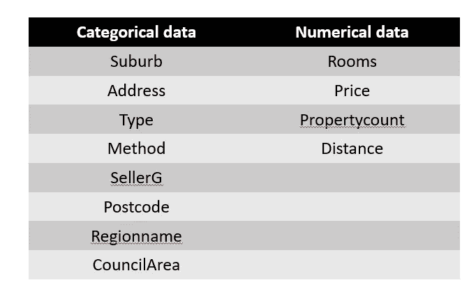

Categorical Data vs Numerical Data

# 主题 2:中心的测量

Photo by [Binyamin Mellish](https://www.pexels.com/@binyaminmellish?utm_content=attributionCopyText&utm_medium=referral&utm_source=pexels) from [Pexels](https://www.pexels.com/photo/home-real-estate-106399/?utm_content=attributionCopyText&utm_medium=referral&utm_source=pexels)

总结数字数据的一个常用方法是找出数据的中心趋势。例如，我们可能会问“在我们的数据集中，房价最典型的值是多少？”。为了解决这个问题，我们可以求助于两个最常见的中心测量:**均值和中位数。**

## **2.1 表示**

**Mean 是所有数字**的平均值。计算平均值所需的步骤是:

1.  对数据集中目标变量的所有值求和
2.  将总和除以值的个数

例如，如果我们有一组五个值，[70，60，85，80，92]，

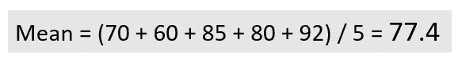

然而，有时平均值可能会产生误导，可能不能有效地显示数据集中的典型值。这是因为平均值可能会受到**异常值**的影响。

**异常值是指与数据集中的其余数字相比，要么非常高，要么非常低的数字。**

让我们看看另外两个数据集，[70，60，1，80，92]和[70，60，300，80，92]。

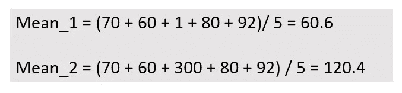

上方的 *Mean_1* 被极低的异常值“1”向下驱动。另一方面， *Mean_2* 由于具有极高的异常值“300”而被向上驱动。

## 2.2 中位数

**Median 是一个数字排序列表的中间值。**从一系列数字中获取中值所需的步骤如下:

1.  将数字从最小到最大排序
2.  如果列表中有奇数个值，中间位置的值就是中值
3.  如果列表中有偶数个值，中间两个值的平均值就是中值

下面的两个例子说明了如何从奇数个值和偶数个值中得到中值。

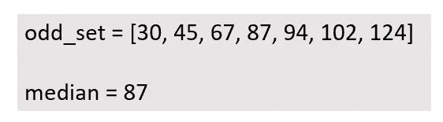

如果我们有一组八个值，[30，45，67，87，94，102，124]，

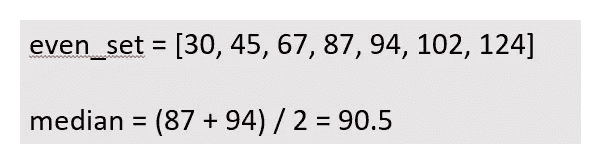

注意:中位数不受异常值的影响。

我们选择使用均值还是中值作为中心点的度量取决于我们要解决的问题。一般来说，在我们的统计研究中，我们应该报告平均值和中值，并让读者自己解释结果。

## **实践中的 2.3 Python 代码**

为了计算均值和中位数，Pandas 为我们提供了两种简便的方法， *mean()* 和 *median()* 。让我们用熊猫从数据集中得到我们房价的平均值和中值。

Get mean and median using Pandas

**第 1 行& 4:** *df['Price']* 将选择填充价格值的列。接着是点语法**来分别调用方法 *mean()和 median()。***

**第 2 行& 5** :打印平均值和中间值。

注意，熊猫的*意味着*和*中位数*的方法已经为我们封装了复杂的公式和计算。我们所需要的只是确保从数据集中选择正确的列，并调用方法来获得平均值和中值。输出如下所示:

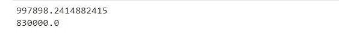

The mean and median of house prices

# **主题 3:变化的度量**

Photo by [Pritesh Sudra](https://unsplash.com/@pritesh557?utm_source=unsplash&utm_medium=referral&utm_content=creditCopyText) on [Unsplash](https://unsplash.com/s/photos/variation?utm_source=unsplash&utm_medium=referral&utm_content=creditCopyText)

在数据集中总是可以观察到变化。这是非常不寻常的，看到一整组数字共享完全相同的值，如下所示:

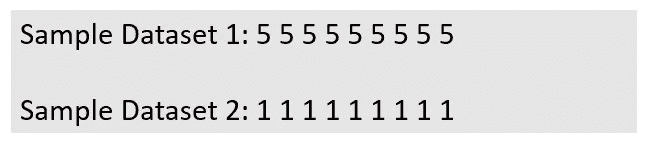

当比较两个数据集之间的差异/可变性时，平均值和中值不是一个好的选择。为了进一步解释这一点，让我们看下面的两个例子

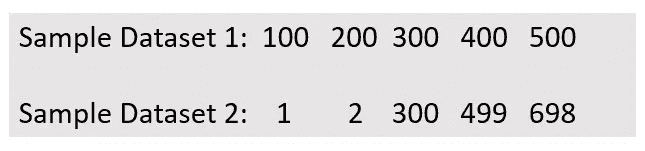

上述两个数据集共享相同的平均值和中值，即 **300** 。然而，它们有不同程度的变异。尽管第一个数据集中的数字和第二个数据集中的数字具有相同的平均值和中值，但两者的差异较小。因此，我们需要另一种测量来检查数据集的可变性。

## 3.1 标准偏差

测量数据集变化的一种常用方法是计算**标准差(SD)** 。SD 只是一种测量方法，用来告诉我们一组值是如何从它们的平均值分散开来的。较低的标准差显示数值接近平均值，较高的标准差显示数值偏离平均值较高。

计算 SD 的步骤如下:

1.  计算数据集的平均值
2.  对于数据集中的每个数字，用平均值减去它
3.  平方从步骤 2 获得的差值
4.  总结第 3 步的结果
5.  将步骤 4 的总和除以数据集中值的个数减 1
6.  平方根来自步骤 5 的结果

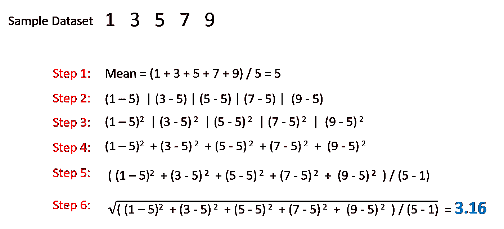

注意:

*   SD 必须是正数
*   SD 受异常值的影响，因为其计算基于平均值
*   SD 的最小可能值为零。如果 SD 为零，则数据集中的所有数字共享相同的值。

## 3.2 实践中的 Python 代码

熊猫还提供了一种简便的方法 *std()* 来计算 SD。让我们试着用熊猫法来计算我们房价的标准差。

**第 1 行:**调用方法 std()计算房价的 SD

同样，我们可以看到 Pandas *std()* 方法已经为我们封装了复杂的 SD 计算，我们可以动态地获得 SD 值。

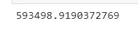

SD of house price

# 主题 4:以图形方式显示数字数据分布

Photo by [Lukas](https://www.pexels.com/@goumbik?utm_content=attributionCopyText&utm_medium=referral&utm_source=pexels) from [Pexels](https://www.pexels.com/photo/chart-close-up-data-desk-590022/?utm_content=attributionCopyText&utm_medium=referral&utm_source=pexels)

以上章节涵盖了使用单个值的两个描述性测量示例(中心测量和变化测量)**。在本节中，我们将了解如何使用**图形方式**探索数据分布。**

## 4.1 箱线图

揭示数据分布的一种方法是从我们的数据集**中找到一个**五位数摘要**。**五数汇总包括:

1.  最低限度
2.  第 25 个百分位数或第一个四分位数(Q1)
3.  中间值
4.  第 75 个百分位数或第三个四分位数(Q3)
5.  最大值

这里有必要解释一下“**百分位**的含义。

> 百分位数是统计学中使用的一种度量，表示一组观察值中给定百分比的观察值低于该值。例如，第 20 个百分位数是这样一个值，在该值以下可以找到 20%的观察值。(来源:[维基百科](https://en.wikipedia.org/wiki/Percentile))

五个数字的汇总提供了一种快速的方法，使我们能够粗略地定位数据集中的最小值、第 25 个百分点、中值、第 75 个百分点和最大值。呈现这五个数字汇总的一种图形化方式是创建一个**箱线图**。

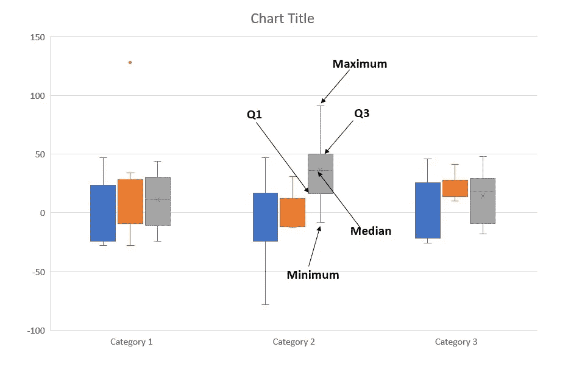

Samples of boxplot

## 4.2 直方图

**直方图是一种图形显示，使用矩形条来显示一组数字数据的频率分布。**直方图使我们能够可视化数据的潜在分布模式。

构建直方图所需的步骤如下:

1.  将我们的数据分成称为**仓**的区间。
2.  记录数据集中每个数字的出现次数(频率),并将它们制成**频率表**。
3.  根据步骤 2 中获得的频率表绘制直方图。

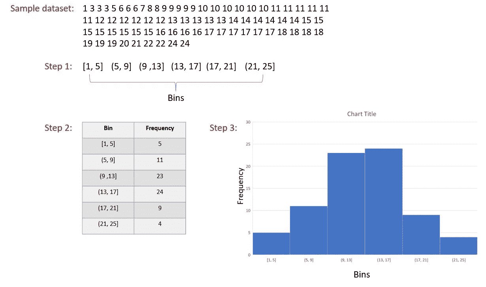

Steps to create a histogram

## 4.3 实践中的 Python 代码

在本节中，我们将使用 Seaborn 库为我们的房价创建一个箱线图和直方图。

首先，让我们从箱线图开始。

Create a boxplot using Seaborn

*   **第 1 行&第 2 行**:导入 Matplolib 和 Seaborn 库
*   **第 4 行:**一个神奇的函数，使我们的图形能够在 Jupyter 笔记本中呈现
*   **第六行:**设定一个海边的主题
*   **第 7 行:**设置绘图的图形大小
*   **第 8 行:**使用 *Seaborn boxplot()* 方法生成一个 boxplot。我们将*价格*设置为绘图数据的输入。参数“ *orient* ”中的“ *v* ”值用于以垂直样式呈现我们的箱线图。

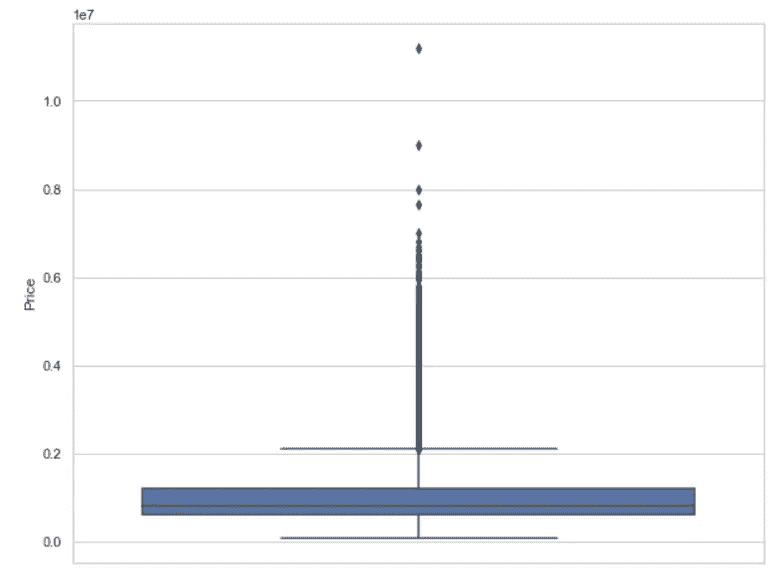

The Seaborn Boxplot of housing price

事实上，在我们的数据集中有三种不同类型的房屋，分别是“H”型房屋、“U”型房屋和“T”型联排别墅。我们可以为每种类型的房屋创建一个箱线图。为此，我们只需在我们的 *Seaborn boxplot()* 方法中添加另一个参数“y”。

Create Seaborn boxplot for each type of house

*   **行 1:** 设置“*类型*为 x 轴数据，“*价格*为 y 轴数据。

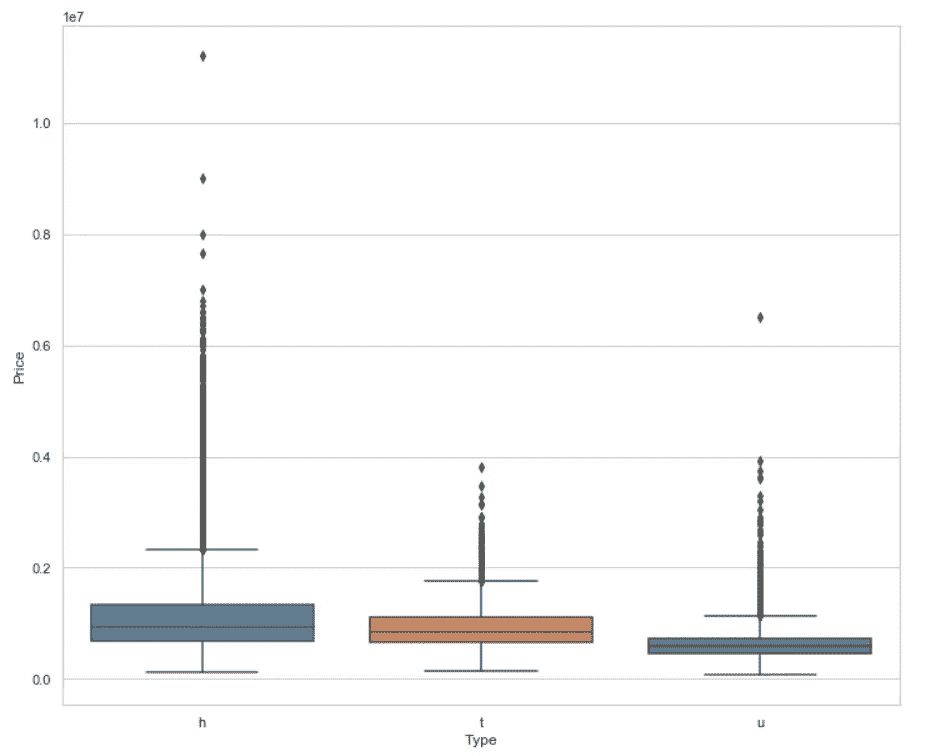

Seaborn boxplot for each type of house

现在，让我们尝试构建一个直方图来观察我们的房价数据的数据分布。我们将使用 *Seaborn distplot()* 来创建直方图。

Create Seaborn histogram

*   **第 1 行:**这是使用“dropna()”方法从我们的住房数据集中的“Price”列中删除所有空值的必要步骤。如果列中存在空值，Seaborn 将无法生成直方图。
*   **第 2 行:**设置直方图的图形大小。
*   **第 3 行:**使用 *distplot()* 方法生成直方图。只有一个必需的输入，即过滤后的房价数据(没有任何空值)。

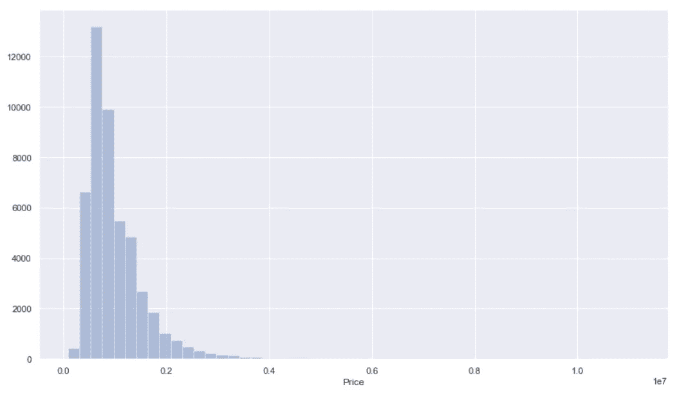

Seaborn Histogram for House Price

# 主题 5:探索分类数据

Photo by [Providence Doucet](https://unsplash.com/@providence?utm_source=unsplash&utm_medium=referral&utm_content=creditCopyText) on [Unsplash](https://unsplash.com/s/photos/group?utm_source=unsplash&utm_medium=referral&utm_content=creditCopyText)

在上面的章节中，我们只讨论了数字数据(房价)的描述性统计分析。分类数据怎么样？在我们看来，我们可能会对住房数据集中的分类数据有一些疑问:

*   在我们的数据集中，每种类型的房子(h - house、t-town house 和 u-unit)的比例是多少？
*   哪个地区的房产销售数量最多？

第一个问题可以通过绘制**饼图**来解决，而**条形图**可能是解决第二个问题的好选择。

## 5.1 饼图

**饼图是显示数据集中分类数据的数字比例的简单图形方式。**饼状图也被称为圆形图(来源:[维基百科](https://en.wikipedia.org/wiki/Pie_chart))，它被分成楔形块。每个片段的弧长与分类数据的相对频率成比例。

让我们看一个饼图的例子。

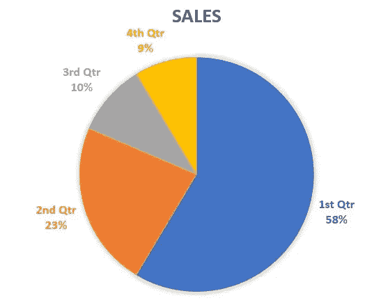

A sample Pie Chart

看一下上面的饼状图样本，我们就能立即了解一年的销售业绩。显然，超过一半的销售额是在第一季度实现的，而第四季度的销售额最低。

## 5.2 条形图

条形图是分类数据的另一种有效的图形显示。**条形图是一种图形显示，使用条形显示每个分类数据的出现次数或频率。**

让我们再来看一个条形图的例子。

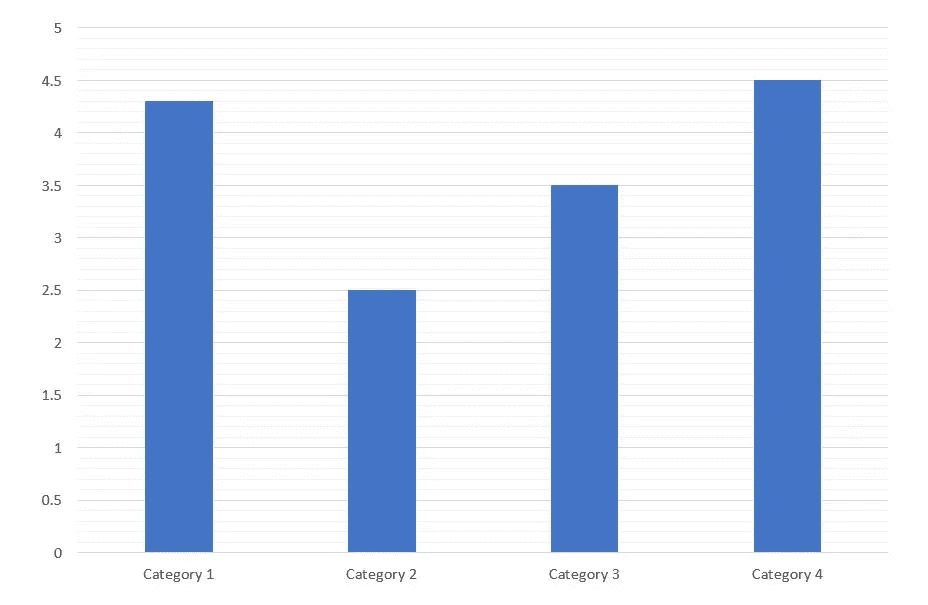

Sample bar chart

## 5.3 实践中的 Python 代码

Pandas 提供了一个绘图功能，可以生成一个饼图来显示每种类型的房屋在我们的数据集中所占的比例。

Create a Pie Chart to show the proportion of house

*   **第 1 行:**使用 Pandas 方法“ *value_counts()* ”获得每种房屋类型的频率。
*   **第 2–4 行:**创建一个新的数据帧， *df2。*这个新的数据框架只有一个单独的列，“ *house_type* ”来保存每个房屋类型的数量，“*type _ counts”*
*   **第 5 行:**将列名“ *house_type* ”赋给参数“y”。这使得 Pandas *pie()* 方法能够根据每个房屋类型的数量自动生成一个饼图。参数 *autopct* 启用，在饼状图中显示每种房型所占的百分比。

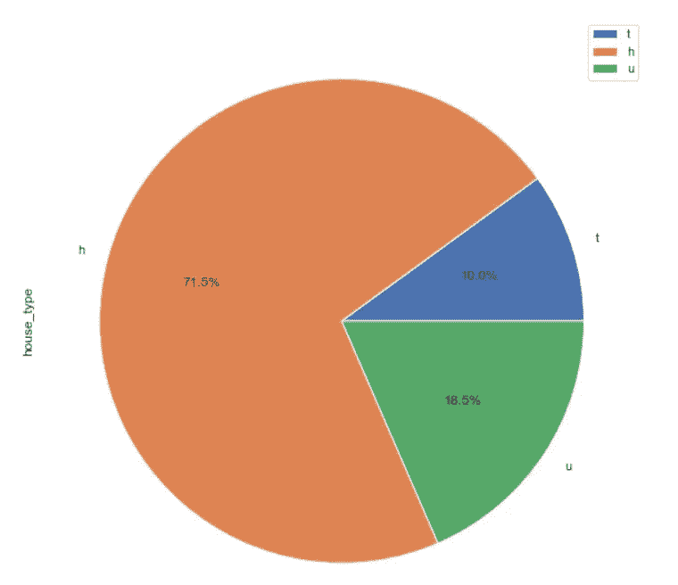

Pie Chart to show the proportion of each house type

从饼图中，我们可以很容易地确定每种类型的房子的百分比。

接下来，我们可以使用 Seaborn 创建一个条形图来显示基于地区的房产销售数量。

Create a bar chart using Seaborn

*   **第 1–2 行:**将 Seaborn 主题设置为“暗格”，并设置地块的图形大小
*   **第 3 行:**将分类变量“ *Regionname* ”赋给参数“ *x* ”。将绘图数据集“ *df* ”分配给参数“数据”。Seaborn " *countplot()* "方法将自动捕获每个区域的出现次数，并呈现一个条形图。

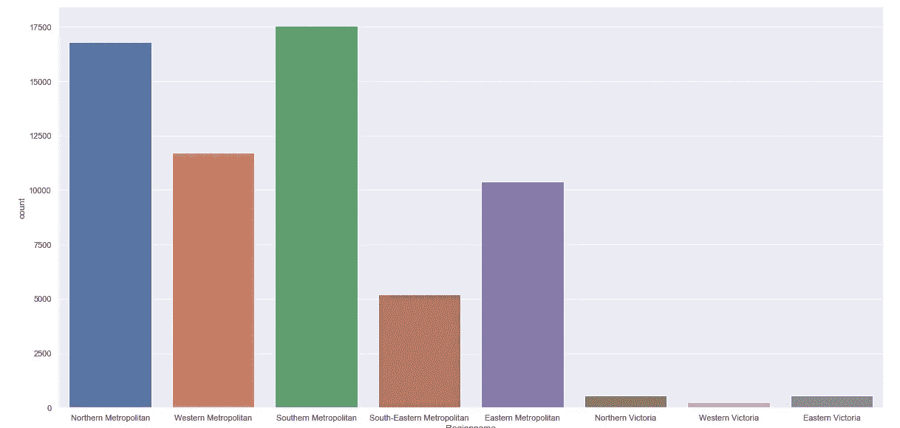

Bar Chart to show the number of property sales in each region

从上面的条形图中，我们可以得出结论，南部大都市的房产销售数量最多。

# 结论

这篇文章通过介绍一些被社会广泛采用的主要描述性度量和图形显示，提供了一个描述性统计的快速指南。主要目的是通过使用 Pandas 和 Seaborn，展示一些有意义地总结数据集的可能方法。对于那些希望参与统计分析或数据科学项目的人来说，Pandas 和 Seaborn 应该是两个必不可少的工具包。Pandas 和 Seaborn 的一个主要优势是，它们已经将大量复杂的计算和绘图步骤封装到几行 Python 脚本中。这使得数据分析过程变得更加容易和节省时间。

但是，这里涵盖的主题并不详尽，还有许多主题没有在这里讨论。此外，本文中介绍的现有主题也可以被分解并进行更详细的讨论(这可能需要更多的文章来专门讨论每个特定的主题)。

我希望这篇文章能为描述性统计提供一个起点和一个总的回顾。我希望你喜欢阅读。

# Github 资源:

这里展示的所有 Python 脚本都写在 Jupyter 笔记本上，并通过 Github Repo 共享。请随意从[https://github . com/teobeeguan 2016/Descriptive _ Statistic _ basic . git](https://github.com/teobeeguan2016/Descriptive_Statistic_Basic.git)下载笔记本

# 参考

1.  百分位数的定义(从 https://en.wikipedia.org/wiki/Percentile 的[检索)](https://en.wikipedia.org/wiki/Percentile)
2.  饼状图的定义(从 https://en.wikipedia.org/wiki/Pie_chart 的[检索)](https://en.wikipedia.org/wiki/Pie_chart)