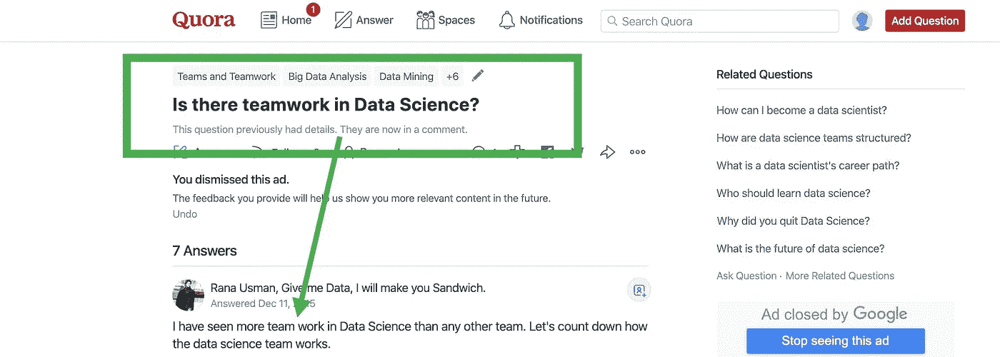

# 创建惊人数据科学项目的快速指南

> 原文：<https://towardsdatascience.com/a-quick-guide-to-create-astonishing-data-science-projects-6d848375471f?source=collection_archive---------28----------------------->

## 又名——擅长团队合作的入门指南

[Screenshot from Quora](https://www.quora.com/Is-there-teamwork-in-Data-Science)

> *如果你被困在付费墙后面，点击* [*此处*](/a-quick-guide-to-create-astonishing-data-science-projects-6d848375471f?source=friends_link&sk=8af3ba8b117d2ba33e5bdb7ae7d3c7a3) *阅读完整故事与我的朋友链接*

在过去的 8 年里，我有幸领导并成为不同国家和背景下的高绩效团队的一员。我构建伟大项目和产品的经历让我想到一件事:没有人独自创造出真正伟大的项目。 数据科学项目和产品也不例外。

最近，我与其他 3 名团队成员合作[“利用数据和 GIS 平台有效应对野火”](/how-data-scientists-can-use-gis-and-help-government-agencies-effectively-respond-to-natural-94e99a069bdc)。我将分享一些概念和想法，帮助我们一起快速行动，创造一个伟大的解决方案。

正如制作三明治的家伙 Rana Usman 所说:

> 让我们来倒数一下数据科学团队是如何工作的。

*   在第一次会议上建立团队文化:不要开始谈论挑战或问题、技术等。相反，邦德，谈谈你的优势和你想领导的东西——学习。不要深入细节，谈谈如何解决问题的想法。彼此感觉舒服，建立信任。
*   **选择项目管理工具:**我们的团队使用 Google Docs 来记录一切。这个想法是把任务、会议结论、提议、时间和结果放在一个共享的地方。我喜欢并强烈推荐 Podio 和 Trello 进行任务管理，但这是一个偏好问题。
*   为所有实验的工件选择一个单一的平台。保存的模型、代码、应用程序，应有尽有。通过这样做，当项目变得复杂时，我们节省了大量时间。我们团队用的是 Google Drive 和 GitHub。
*   最后一点让我想到了这一点，创造一种开放的文化，并习惯于分享:团队可以从彼此的代码和解决问题的方式中学到很多。分享每一份文件，并寻求反馈。
*   对快速的试验和改变保持开放的态度:当遇到这样的问题时，解决方案并不是直截了当的。在我们的项目中有一个点，我们每天都在改变任务和负责任务的人，直到我们到达我们想要的点。从第 0 天开始适应变化。
*   **安排固定时间-** 每天同步 15 分钟:这让每个团队成员都知道现在正在处理什么，挑战和下一步。
*   **强制执行同行代码和文档审查:**团队特别了解彼此的工作风格，额外的关注将使个人任务更上一层楼。
*   **只有一个沟通渠道:**使用 Slack。简单。
*   **开放地给予和接受反馈:**将*消极进取的反馈*抛在脑后，并习惯于给予和接受诚实而友好的反馈。如果你不同意某个可以改进的方法，那么在整个过程中，对好的和坏的方面保持透明。

我会结束这一切。**永远不要用“我”** **的方式说话，**一旦开始在团队工作，**就要用“我们”的方式说话和思考**。整个团队负责每一单'*'闪耀'**'和'*'成长'*** 的项目。*

*根据定义，数据科学项目是团队合作。它们由不断迭代新想法的平稳进展组成。希望这些基本但重要的要点将帮助您创建一个令人惊叹的数据科学团队项目。*

*如果你对团队建设和工作有任何其他建议，请在评论中分享。我很想读读它们。*