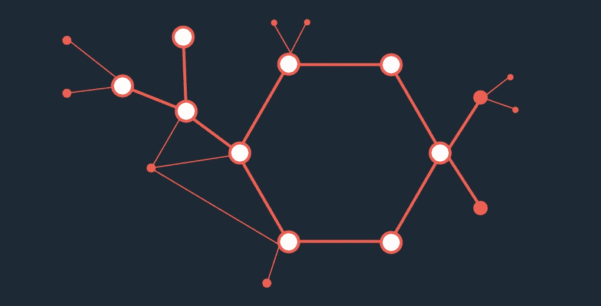

# 深度学习快速入门

> 原文：<https://towardsdatascience.com/a-quick-introduction-to-deep-learning-41af97e064da?source=collection_archive---------21----------------------->

在过去的几年里，深度学习已经离开了研究实验室，去征服非专家公众。谷歌、亚马逊、脸书和微软等公司通过使用深度学习算法取得的惊人成果，使其受到媒体的广泛关注。让我们在猫或狗分类问题的背景下发现深度学习算法的一些基本原则。

## 什么是神经科学中的神经元？

神经元是大脑的基本细胞，负责开发一些与智力、识别、决策等相关的机制。为了简化起见，让我们考虑一个神经元总是给出二进制输出；要么是**被激励**，输出信号非零，要么是**未被激励**，因此输出信号为零。假设有一个神经元负责区分猫和狗。为了做出决定，这个神经元必须考虑来自视觉和听觉等感官的输入信息，并变得兴奋地说猫，未兴奋的——零输出信号——意味着狗。

当然，收集的输入信息在神经元做出的最终决定中并不具有相同的普遍性。

这里，因为猫和狗可能有相同的颜色，所以关于颜色的输入信息不会像关于高度的信息那样有区别，这似乎没有关于动物声音的信息重要。这是一个生物神经元给它的每一个输入信息分配一个或大或小的重要性的地方，反映了这个信息与它的输出信号的相关程度。为了达到这个目标，信息通过**树突**提供给神经元，并流向**突触**，这些化学神经递质可以使**抑制**，减弱信号或者**兴奋**，增强信号。

A biological neurone

应该注意的是，这几乎是你开始做深度学习所需要知道的关于神经科学的所有知识。前面提到的机制要复杂得多，它们的核心解释超出了本文的范围。记住这一点可能是至关重要的，深度学习更多的是关于计算机科学和数学——我们将看到它是如何实现的——并且只与神经科学分享设计人工神经元的基本原则。我们不是在做神经科学。正如脸书大学深度学习领域的顶级研究员 Yann LeCun 教授所说的那样。深度学习的灵感来自神经科学，就像飞机的灵感来自鸟类一样，它们使用相同的原理，但细节却截然不同。

## 我们如何设计人工神经元？

人工神经元总体上依赖于上述机制；输入信息的重要性由一个数字来量化，称为**权重 w** 数字越大，神经元输出信号中的信息越占优势。

An artificial neurone with three entries

每个输入乘以其相应的重要性系数，**该条目的权重 wi I**，然后传输到神经元。这样，神经元将所有加权输入相加。假设一个高的结果应该被解释为一只猫—对应于 1 —当一个低的结果，作为一只狗—对应于 0 —时。也就是说，我需要一个真实的值来与之前的结果进行比较——输入的加权和——并做出决定，是猫还是狗。这个中间值被称为**偏差**，它属于神经元，不依赖于输入。

让我们来回顾一下，神经元接受输入，将每个输入乘以相应的权重，对这些加权输入求和，然后将这个和与其**偏差** **b** 进行比较，并做出最终决定，是猫还是狗。

这就相当于说，神经元对加权输入求和，加上它的偏差，如果结果是肯定的，决定是猫，否则是狗。让我们引入 **y** 来简化符号，

## 激活功能

为了理解激活功能，让我们想象你手中有一个打火机，为了科学起见，你戴上它，让它离你的手指更近。随着打火机离你的手指越来越近，你也越来越痛苦。因此，尽管输入，比如说热量增加了，但是负责评估手指疼痛的神经元传递了一个更大的信号，这个信号被解释为越来越痛。

考虑到这一点，我们不是说人工神经元为阳性 **y** 提供 1，而是说它提供与 **y** 成比例的反应。 **y** 越大，输出越大。由此可知， **c** 为常数的正 **y** 的输出为 **c.y** ，负 **y** 的输出为 **0** 。因此公式，由于 **c** 通常取为 1，如果为正，则输出为 **y** ，如果为负，则输出为 **0** 。这被称为**激活功能，**准确地说是 **RELU** ，*整流线性单元*激活功能。

RELU activation function curve

## 另一个激活功能

现在假设，皇家马德里队将与巴塞罗那队比赛，我们要求随机选择一个人——不是铁杆球迷——对比赛结果进行预测。即使我们给了这个人关于球员，工作人员等的所有信息，他也不会给出一个绝对的结果，就像他 100%确定的那样。既然总是有疑问，他大概会给出一个队获胜的可能性，比如说有 60%的把握 R.M .会赢这场比赛。我们赋予人工神经元同样的能力。神经元不是从 **y** 传递一个绝对的二进制结果，比如 0 或 1，而是给出一个介于 0 和 1 之间的数字，这里解释为动物是猫的可能性。这是通过对计算出的 **y 应用一个函数来完成的，所以输出是，**

Sigmoid activation function

这就是所谓的 **sigmoid** 激活函数，因为函数的曲线类似于 s

请注意，假设我们将 **y** 与零进行比较，并输出 0 或 1，正如我们首先介绍的那样，这也是一个具有以下曲线的激活函数，

Basic activation function

一般来说，对于激活函数 **f** ，神经元的输出是 **f(y)，**其中， **y** 是条目的加权和，加上神经元的偏差 b。

综上所述，激活函数是我们应用于结果 **y 的一个函数**f**；因此，神经元的最终输出是 f(y)。**功能 **f** 的选择取决于要解决的问题和经验。最常用的激活功能是 **sigmoid** 和 **RELU** ，因为它们是众所周知的并且导致更好的性能。现在你知道了所有关于人工神经元的知识，让我们用它们来解决猫或狗的问题。

## 多层感知器网络

决定一种动物是猫还是狗实际上是一项由单个神经元完成的相当困难的任务。然后将这个复杂的任务分成几个简单的子任务，分配给不同的神经元。这些神经元中的每一个都会考虑所有的条目，给它们分配权重，反映它们在最终决定中的重要性。这导致了一个更强大的网络。在这里，神经元 3 将做出最终决定。

A densely connected network with three neurones

由于相同的条目被提供给每个第一层神经元，并且一层的神经元连接到前一层的所有神经元，这被称为**密集连接的**神经网络。

这里我们有一个神经架构**、**——还不深——也就是说，**一个感知器**；由美国心理学家弗兰克·罗森布拉特于 20 世纪 50 年代首次提出。感知器在这里只有一层。大多数时候，在深度学习中，我们可以利用实际上大量的数据来解决复杂的任务。因为我们希望我们的神经网络足够强大，所以我们上面看到的层将由更多的神经元组成，128 或 256 或 512 个——一般是 2 的幂——然后，一个接一个，几十层将被堆叠起来；我们现在得到了一个**深度**多层感知器，因此得名**深度**学习。同一层的神经元应该具有相同的激活功能。但是从一层到另一层，激活功能可能不同。

A multi-layered perceptron with 6 layers

为了解决猫或狗的分类问题，我们可以设计一个**多层感知器**神经网络，其第 1 层到第 5 层具有 RELU 激活功能，第 6 层的神经元具有 sigmoid 激活功能，这被认为是产生猫的可能性。层 1 称为**输入层**，层 6 称为**输出层**；从 2 到 5 是**隐藏层**，因为隐藏在输入和输出层之间。这是我们在真正的深度学习模型中通常做的事情。现在我们已经建立了模型，它是如何工作的呢？

## **有监督的深度学习**

我们从设计神经元和我们为模型选择的层数开始。一旦这样做了，我们希望模型能够运行。然而，在最开始，我们不知道权重和偏差应该取什么值，这样模型才能做出正确的决定。因此，权重和偏差参数是用随机值初始化的，这意味着模型非常不准确。顺便说一句，该模型将自己学习神经元的权重 **w** 和偏差 **b** 的正确值，并提高准确性，因此在深度学习**中学习**。学习权重和偏差的步骤被称为**训练阶段**。

## 培训过程

训练的最终目标是将权重和偏差从初始随机值移动到优化值，因此该模型在说猫或狗时更准确。

**图像和其他类型的数据**

生物神经元接收来自视觉、听觉、嗅觉等的综合信息。深度学习模型大部分时间都将被图像喂养，但也可以为视频、声音、文本和表格设计。正如我们在上面看到的，每个神经元都将对条目进行数学运算，所以输入数据必须绝对是数字矩阵；只要与计算和数学运算兼容。

**图像到矩阵**

考虑如下的灰度图像，该图像实际上以像素矩阵的形式存储在您的计算机设备或电话中，其中像素是一个几乎不可见的正方形，颜色从白色(对应于 255)到黑色(对应于 0)。该矩阵用于为模型提供信息。

From a 100x100 px image zoomed in and the 100x100 matrix, here with random values.

放大图片时，像素变得可见；每个像素灰度——从 0 到 255——符合最右边矩阵中的一个数字。这里我们同样处理一个猫的图像。

Cat 100x100 px image and corresponding 100x100 matrix

在训练阶段，我们让模型计算这个矩阵 **x** 代表一只猫的概率**p**——通过 sigmoid 函数，见上文。由于模型还没有训练好，所以不太可能 **p=1** 。

## 价值函数

我们知道这张图片是一只猫，所以我们将模型的目标定为给出 1 的 **p** 值——这意味着 100%确定这是一只猫——为了测量模型与正确结果的差距，我们可以考虑差异 **1-p** 。通过这样做，我们引入了一些新的东西，一个**成本函数或损失函数**，它是我们期望的 **p** 的值和计算出的值之间的差异。

由于可能性 **p** 取决于模型的**权重 W 和偏差 b** ，因此成本函数也取决于它们。

如果 C(W，b) 是 0，那就完美了，意味着实际结果与计算结果相同。不幸的是，由于有成千上万的权重和偏差需要调整，很可能无法达到这个目标。因此，我们试图通过名为**梯度下降**的计算技术来最小化损失 **C(W，b)** 。我们同样处理成千上万不同的猫和狗的图像。对于它们中的每一个，模型都会移动权重和偏差，以减少损失并提高准确性。一旦训练完成，参数值，即模型的权重和偏差被优化以最小化损失；它们被冻结，以后不会被更改。因为我们需要人类的帮助来计算损失——我们需要实际的结果——这被称为**监督学习**。

## 测试阶段模型精度的计算

最后一步，在一个从未见过的猫和狗的独立图像数据集上测试该模型，在这里，模型不会学习，我们只是观察它的反应，看看它是否足够有效和训练有素。这是**测试阶段**。我们模型的准确率会是正确答案的比例。如果该模型足够高效和准确，它就可以部署在目标基础设施上，即联网设备、移动电话、自动驾驶汽车等。到这个时候，模型将在没有任何人类帮助的情况下对真实世界的图像做出决定。最先进的技术是在分类任务中对最好的模型有 99%的准确性，在实际应用中足够准确。

## 结论

本文的唯一目的是介绍神经元在深度学习模型和学习过程中的作用背后的直觉。如果你想更深入，发现深度学习的迷人世界，**梯度下降，生成模型**等。，不要犹豫，订阅时事通讯，发现我的下一篇文章。感谢您的阅读。

深度学习要开始的一些建议

使用 Python 进行深度学习

[https://www . Amazon . fr/Deep-Learning-Python-Francois-Chollet/DP/1617294438](https://www.amazon.fr/Deep-Learning-Python-Francois-Chollet/dp/1617294438)

使用 Keras 进行深度学习

[https://www . Amazon . fr/Deep-Learning-Keras-Implementing-Learning-ebook/DP/b 06 y2 ymrdw](https://www.amazon.fr/Deep-Learning-Keras-Implementing-learning-ebook/dp/B06Y2YMRDW)