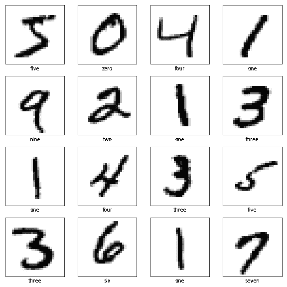
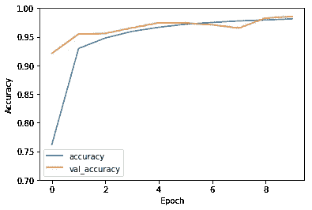
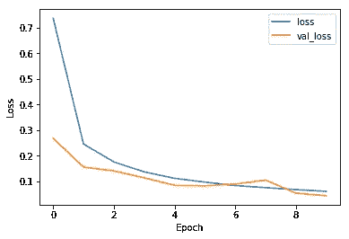

# 深度学习 TensorFlow 2.0 快速入门

> 原文：<https://towardsdatascience.com/a-quick-introduction-to-tensorflow-2-0-for-deep-learning-e740ca2e974c?source=collection_archive---------4----------------------->


> 想获得灵感？快来加入我的 [**超级行情快讯**](https://www.superquotes.co/?utm_source=mediumtech&utm_medium=web&utm_campaign=sharing) 。😎

经过大量的社区宣传和期待， [TensorFlow 2.0](https://www.tensorflow.org/) 终于在 2019 年 9 月 30 日由 Google 发布[。](https://medium.com/tensorflow/tensorflow-2-0-is-now-available-57d706c2a9ab)

TensorFlow 2.0 代表了图书馆发展的一个重要里程碑。在过去的几年里，TensorFlow 的主要弱点之一，也是许多人转而使用 PyTorch 的一个重要原因，就是它非常复杂的 API。

定义深度神经网络需要的工作比合理的要多得多。这导致了位于 TensorFlow 之上的几个高级 API 的开发，包括 [TF Slim](https://github.com/tensorflow/models/tree/master/research/slim) 和 [Keras](https://keras.io) 。

现在事情又回到了起点，Keras 将成为 TensorFlow 2.0 的官方 API。加载数据、定义模型、训练和评估现在都变得容易多了，Keras 风格的代码更干净，开发时间更快。

本文将快速介绍使用 Keras 进行深度学习的新 TensorFlow 2.0 方式。我们将经历加载数据集、定义模型、训练和评估的端到端流程，所有这些都使用新的 TensorFlow 2.0 API。如果你想自己运行全部代码，我已经设置了一个包含全部内容的 [Google Colab 笔记本](https://colab.research.google.com/drive/1KRi0k5XTJoKEuRGOMRy3xhaUU_txNCYm)！

# 导入和设置

我们将从导入 TensorFlow、Keras 和 Matplotlib 开始。请注意我们如何使用`tensorflow.keras`直接从 TensorFlow 中提取 Keras，因为它现在就捆绑在 tensor flow 中。我们还有一个 *if* 语句来安装 2.0 版本，以防我们的笔记本运行的是旧版本。

接下来，我们将加载数据集。对于本教程，我们将使用 [MNIST 数据集](https://en.wikipedia.org/wiki/MNIST_database)，它包含 60，000 张训练图像和 10，000 张数字从 0 到 9 的测试图像，大小为 28x28。这是一个非常基本的数据集，一直用于快速测试和概念验证。还有一些使用 Matplotlib 的可视化代码，因此我们可以查看数据。



Visualizing MNIST digits

# 创建用于图像分类的卷积神经网络

做图像分类最好的方法当然是用一个[卷积神经网络](http://cs231n.github.io/convolutional-networks/) (CNN)。API 将拥有我们构建这样一个网络所需的一切。由于 MNIST 非常小——图像大小为 28x28，只有 60，000 个训练图像——我们不需要超级庞大的网络，所以我们将保持简单。

在过去的几年中，构建一个好的 CNN 的公式在很大程度上保持不变:堆叠卷积层(通常为 3×3 或 1×1 ),中间有非线性激活(通常为 ReLU ),添加几个完全连接的层，并在最后添加一个 Softmax 函数来获得类概率。我们已经在下面的网络定义中完成了所有这些工作。

我们的模型共有 6 个卷积层，每个卷积层之后都有一个 ReLU 激活。在卷积层之后，我们有一个 GlobalAveragePooling 来将我们的数据放入一个密集的向量中。我们完成了我们的全连接(密集)层，最后一个有 10 个 MNIST 的 10 类大小。

同样，请注意我们所有的模型层都来自于`tensorflow.keras.layers`，并且我们使用的是 Keras 的功能 API。使用函数式 API，我们将模型构建为一系列顺序函数。第一层将输入图像作为输入变量。接下来，每个后续层都将前一层的输出作为其输入。我们的`model.Model()`简单地连接了从输入到输出张量的“管道”。

有关该模型的更详细描述，请查看下面`model.summary()`的打印结果。

```
Model: "model_1" _________________________________________________________________ Layer (type)                 Output Shape              Param #    ================================================================= input_3 (InputLayer)         [(None, 28, 28, 1)]       0          _________________________________________________________________ conv2d_12 (Conv2D)           (None, 28, 28, 32)        320        _________________________________________________________________ activation_16 (Activation)   (None, 28, 28, 32)        0          _________________________________________________________________ conv2d_13 (Conv2D)           (None, 14, 14, 32)        9248       _________________________________________________________________ activation_17 (Activation)   (None, 14, 14, 32)        0          _________________________________________________________________ conv2d_14 (Conv2D)           (None, 14, 14, 64)        18496      _________________________________________________________________ activation_18 (Activation)   (None, 14, 14, 64)        0          _________________________________________________________________ conv2d_15 (Conv2D)           (None, 7, 7, 64)          36928      _________________________________________________________________ activation_19 (Activation)   (None, 7, 7, 64)          0          _________________________________________________________________ conv2d_16 (Conv2D)           (None, 7, 7, 64)          36928      _________________________________________________________________ activation_20 (Activation)   (None, 7, 7, 64)          0          _________________________________________________________________ conv2d_17 (Conv2D)           (None, 7, 7, 64)          36928      _________________________________________________________________ activation_21 (Activation)   (None, 7, 7, 64)          0          _________________________________________________________________ global_average_pooling2d_2 ( (None, 64)                0          _________________________________________________________________ dense_4 (Dense)              (None, 32)                2080       _________________________________________________________________ activation_22 (Activation)   (None, 32)                0          _________________________________________________________________ dense_5 (Dense)              (None, 10)                330        _________________________________________________________________ activation_23 (Activation)   (None, 10)                0          ================================================================= Total params: 141,258 Trainable params: 141,258 Non-trainable params: 0 _________________________________________________________________
```

# 培训和测试

最精彩的部分来了:训练并获得实际效果！

首先，我们需要做一些数据预处理，以便为训练正确格式化数据。我们的训练图像需要在一个 4 维的阵列中，格式为:

**(批量 _ 尺寸，宽度，高度，通道)**

我们将图像转换为类型为 *float32* 的图像，这是正确训练的一个要求，并进行归一化，使每个像素的值在 0.0 和 1.0 之间

至于标签，因为我们正在使用 [Softmax](https://en.wikipedia.org/wiki/Softmax_function) 激活，我们希望我们的目标输出是一个热编码向量的形式。为此，我们使用了`tf.keras.utils.to_categorical()`功能。函数中的第二个变量被设置为 10，因为我们有 10 个类。

我们选择[亚当](/adam-latest-trends-in-deep-learning-optimization-6be9a291375c)作为我们的优化器——它非常容易使用，开箱即用。我们将损失函数设置为`categorical_crossentropy`，这与我们的 Softmax 兼容。训练 CNN 就像用我们的数据作为输入调用 Keras `.fit()`函数一样简单！

请注意，所有这些几乎都是纯粹的 Keras。真正唯一的区别是我们使用了 TensorFlow 的 Keras 库*，*，即`tensorflow.keras`。它非常方便，因为它包含在一个漂亮的包中 TensorFlow 的强大功能和 Keras 的易用性。太棒了。

MNIST 是一个简单的数据集，所以我们的 CNN 应该很快达到高精度。在我自己的实验中，它在 5 个时期内达到了大约 97%。

一旦训练完成，我们可以绘制损失和准确性的历史。我们再次使用纯 Keras 代码从历史中提取损失和准确性信息。Matplotlib 用于轻松绘图。



Accuracy (left) and loss (right) results from our CNN on MNIST

要评估我们的网络，我们可以使用…你猜对了，Keras `.evaluate()`功能！我们将应用它，然后打印出精度。

我们的 CNN 模型在测试集上达到了 98.52%的准确率。

# 喜欢学习？

在推特[上关注我，在那里我会发布所有最新最棒的人工智能、技术和科学！也在 LinkedIn](https://twitter.com/GeorgeSeif94) 上与我联系！