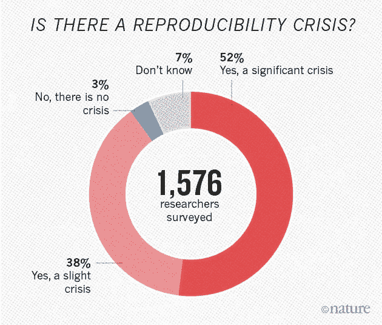
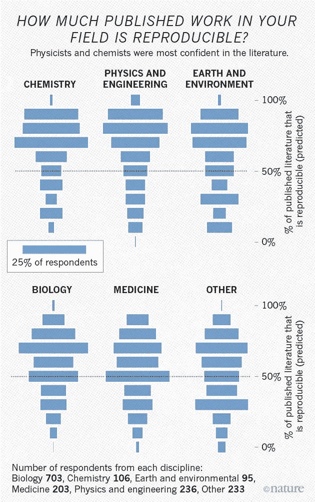
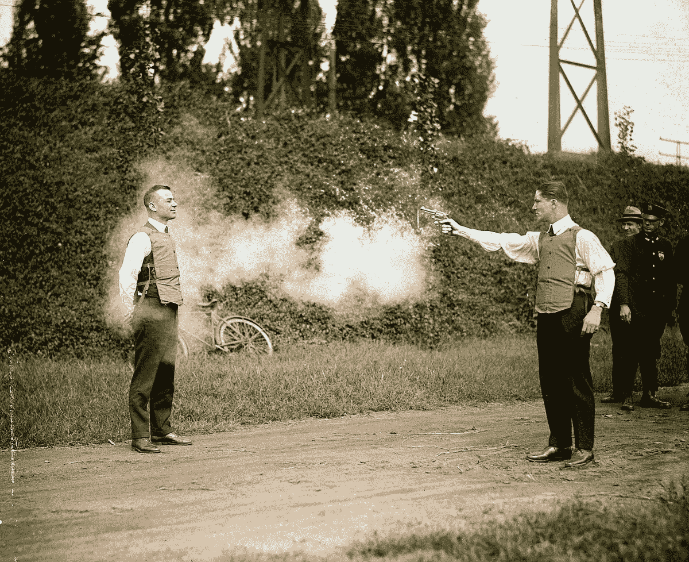
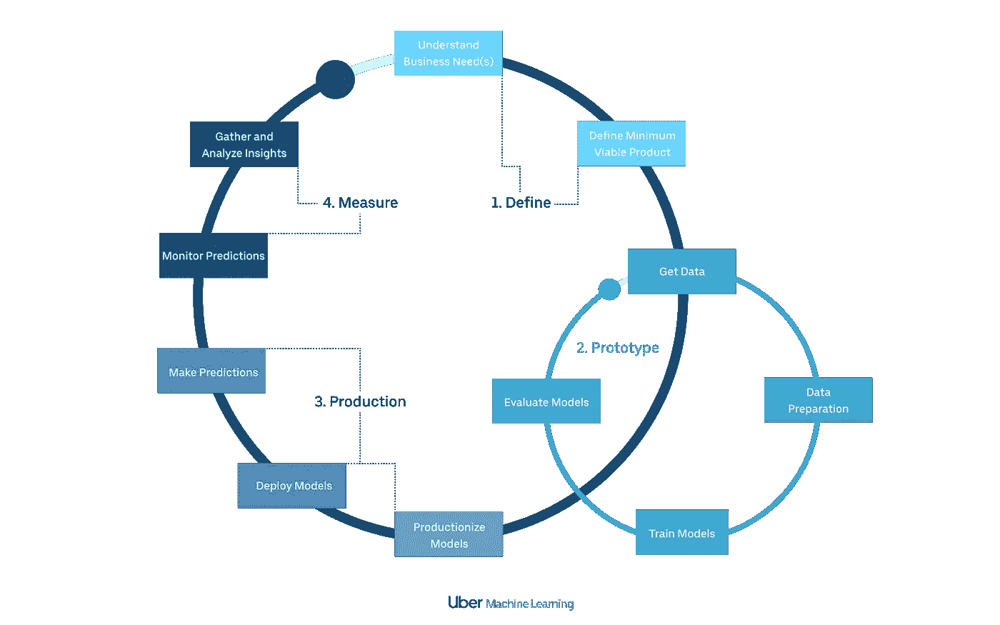
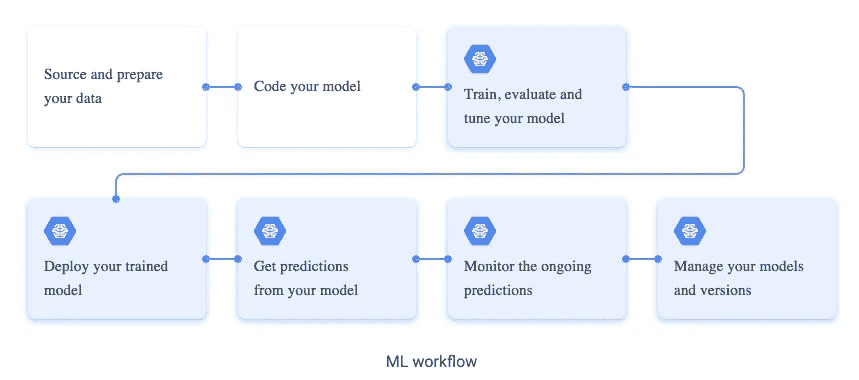
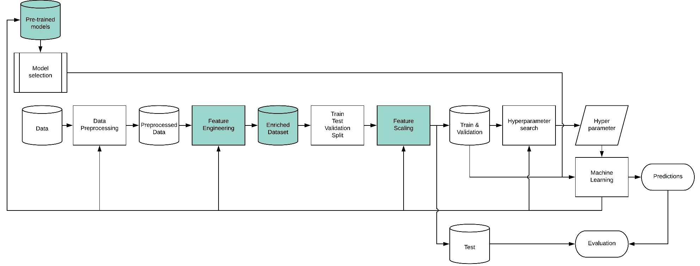
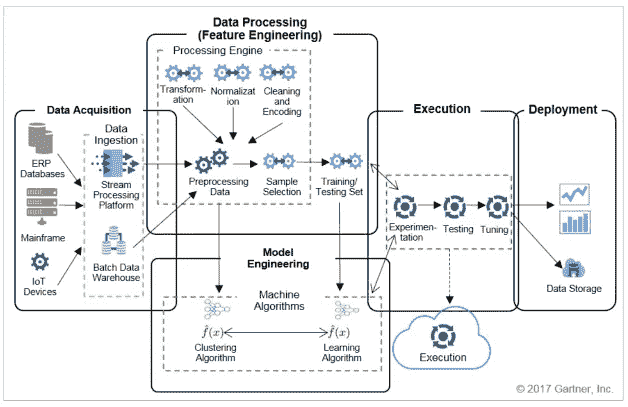
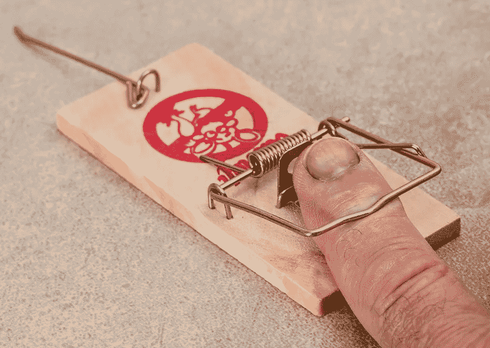
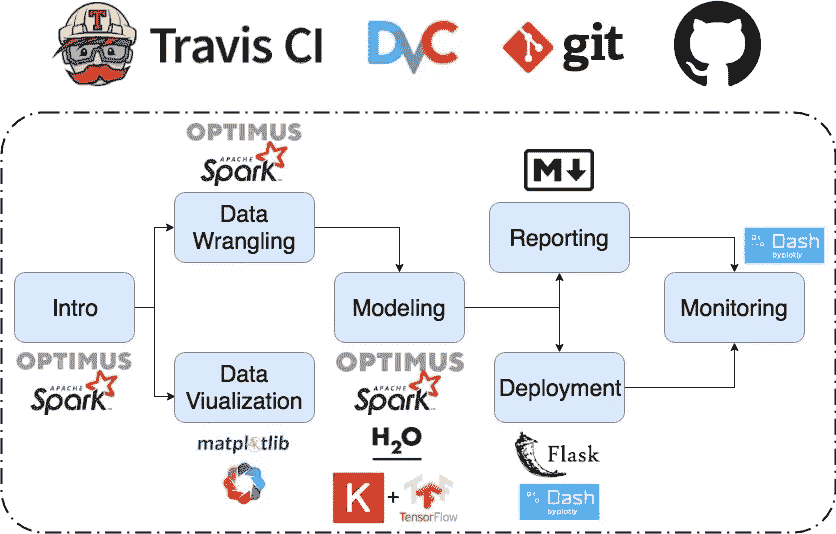

# 对 Genevera Allen 关于机器学习“导致科学危机”的快速回应

> 原文：<https://towardsdatascience.com/a-quick-response-to-genevera-allen-about-machine-learning-causing-science-crisis-8465bbf9da82?source=collection_archive---------18----------------------->

## 这不是咆哮，我是认真对待这些文章，并解释作者提出的一些观点是错误的。剧透:有些没有错。

[https://dailyhive.com/toronto/ago-crowdfunding-infinity-mirrors](https://dailyhive.com/toronto/ago-crowdfunding-infinity-mirrors)

# 文章

在这里我将谈论这两篇文章:

 [## 机器学习“引发科学危机”

### 成千上万的科学家用来分析数据的机器学习技术正在产生误导性的结果…

www.bbc.com](https://www.bbc.com/news/science-environment-47267081)  [## 我们能相信使用机器学习做出的科学发现吗？

### 华盛顿-(2019 年 2 月 15 日)-莱斯大学统计学家 Genevera Allen 表示，科学家必须不断质疑…

www.eurekalert.org](https://www.eurekalert.org/pub_releases/2019-02/ru-cwt021119.php) 

请在此之前阅读它们，这样你可以创造你自己的观点。

以下是更多评论:

 [## 统计学家:机器学习正在引发一场“科学危机”

### 莱斯大学的统计学家 Genevera Allen 在本周一个著名的科学会议上发出了严重警告

futurism.com](https://futurism.com/machine-learning-crisis-science)  [## 机器学习导致了科学领域的“再现性危机”

### 来自莱斯大学的统计学家说，使用机器学习技术做出的科学发现不能被自动信任。

www.technologyreview.com](https://www.technologyreview.com/the-download/612982/machine-learning-is-contributing-to-a-reproducibility-crisis-within-science/)  [## 统计学家对机器学习的可靠性发出警告|数字趋势

### 机器学习在科技领域无处不在。但是机器学习技术真的有多可靠呢？一个…

www.digitaltrends.com](https://www.digitaltrends.com/cool-tech/machine-learning-reliability-reproducibility/) 

# 什么没错

不要误解我的意思，文章中有很多重要的观点，我只是认为它们的理由可能不正确。

## 科学中存在可复制性的危机

[https://www.nature.com/news/1-500-scientists-lift-the-lid-on-reproducibility-1.19970](https://www.nature.com/news/1-500-scientists-lift-the-lid-on-reproducibility-1.19970)

这是真的。我们有麻烦了。在某些科学领域，只有 36%的研究被重复。这还不够。

更多数据:

[https://www.nature.com/news/1-500-scientists-lift-the-lid-on-reproducibility-1.19970](https://www.nature.com/news/1-500-scientists-lift-the-lid-on-reproducibility-1.19970)

他们在研究中指出:

> 尽管我们调查中的绝大多数研究人员都未能重现实验，但不到 20%的受访者表示，他们曾被另一名无法重现其工作的研究人员联系过。

这也是一些严重的问题，因为一小部分人试图重复研究，他们中的一些人在重复实验中失败了，但只有 20%的人告诉其他人，所以你知道你做的是错的机会是最小的。

但是正如你从上面的图片中看到的，这个问题几乎在每一个科学领域都存在。**这一点以后再说。**

## 机器学习不是防弹的

[https://rarehistoricalphotos.com/testing-bulletproof-vest-1923/](https://rarehistoricalphotos.com/testing-bulletproof-vest-1923/)

如果存在危机，那就是如何正确地进行数据科学(DS)的危机。许多数据科学项目失败了，这并不是因为缺乏技能或知识(有时)，数据科学项目需要一个清晰有效的攻击计划才能成功，并需要一个运行它的方法。

大多数机器学习项目都在 DS 世界内部(以某种方式)，我们在 DS 内部运行机器学习周期的方式存在问题。

以下是一些最“有组织”的机器学习工作流:

[https://eng.uber.com/scaling-michelangelo/](https://eng.uber.com/scaling-michelangelo/)

[https://cloud.google.com/ml-engine/docs/tensorflow/ml-solutions-overview](https://cloud.google.com/ml-engine/docs/tensorflow/ml-solutions-overview)

[https://medium.com/datadriveninvestor/my-machine-learning-workflow-7576f7dbcef3](https://medium.com/datadriveninvestor/my-machine-learning-workflow-7576f7dbcef3)

[https://www.gartner.com/binaries/content/assets/events/keywords/catalyst/catus8/preparing_and_architecting_for_machine_learning.pdf](https://www.gartner.com/binaries/content/assets/events/keywords/catalyst/catus8/preparing_and_architecting_for_machine_learning.pdf)

你看到那里的问题了吗？

我的问题:

*   我们确定我们能重现我们得到的结果吗？
*   我们的测试足够吗？
*   我们如何版本化我们的模型？
*   我们是否对数据进行了版本控制？
*   我们是否向读者提供了足够的信息来重现我们的发现？
*   我们是否愿意回答关于我们在做什么和如何做机器学习的问题？

我认为对于大多数组织来说，答案是**不**。

# 分析什么是错的

在这里，我将看看作者提到的一些我认为不正确的事情，以及为什么。

> 越来越多的科学研究涉及使用机器学习软件来分析已经收集的数据[……]他们得出的答案很可能是不准确或错误的，因为软件正在识别只存在于数据集而不是真实世界中的模式。

错误是因为:

*   在大多数情况下，我们拥有的数据来自现实世界，我们在这里是说我们用来做预测模型的交易没有发生吗？
*   数据可能是脏的(大多数时候是脏的)，但我们有很多方法来改进我们拥有的数据，并了解它是否脏。
*   常见的机器学习周期包括将我们的数据分为训练、验证和测试，这些“验证”或“测试”数据集的行为就像新的“真实数据”。因为它们来自原始数据集，它们都可以被认为是正在发生的事情的“真实”表现。

> 通常这些研究不会被发现是不准确的，直到有另一个真正的大数据集，有人应用这些技术，并说‘哦，我的天哪，这两个研究的结果没有重叠’

错误是因为:

*   大数据不一定意味着更好的结果。这就是科学工作的方式，就像说我们在物理学上有危机，因为我发现我的结果和其他文章不一样。
*   我不是说结果有时不会错，但我们正在研究如何在发布前欺骗我们自己的系统来确保这一点。

> 现在科学界普遍认识到了再现性危机。我敢说，其中很大一部分确实来自科学中机器学习技术的使用。

错误是因为:

*   诚然，几乎每个科学领域都在使用机器学习来改善他们的工作方式和结果，但我不认为问题出在机器学习本身。数据问题有时会被忽视，糟糕的机器学习工作流程，糟糕的测试等等。我想说这里不是关于机器学习，而是一些人正在做的方式。
*   将再现性危机归咎于机器学习和数据科学是不了解全貌的。

> 这些技术中有很多都是被设计用来做预测的。他们从来不会带着“我不知道”或“我什么也没发现”的回答回来，因为他们没有被要求这么做。

错误是因为:

*   是的，这个系统是为寻找数据中的模式而设计的，但是如果你做得正确，你会明白其中一些见解是没有意义的。
*   有些系统带有‘我不知道’，当我们评估我们的模型时，我们会发现它们实际上对数据一无所知。
*   机器学习不仅仅是运行一个算法，它还包括测试它们，进行基准测试，验证它们等等。

# 什么不是完全错误的

作者说:

> 我们真的可以相信目前使用应用于大型数据集的机器学习技术做出的发现吗？在许多情况下，答案可能是，“不检查就不行”，但下一代机器学习系统的工作正在进行中，该系统将评估他们预测的不确定性和可重复性。

我认为，如果我们有一个能够理解何时出现问题的系统，我们就可以相信自己的预测。我们有这样做的工具，数据科学方法包括越来越多的:

*   数据治理；
*   数据版本化；
*   代码版本控制；
*   持续集成/部署；
*   模型版本控制。

所有现代技术的发展都是可能的，因为我们找到了处理大数据和小数据的方法。离成功构建防弹工作流还有很长的路要走，但也不远了。在这里，我提出一个非常简单的方法(**免责声明:**这是正在进行的工作):

 [## 擎天柱的数据科学。第 1 部分:简介。

### 用 Python、Spark 和 Optimus 分解数据科学。

towardsdatascience.com](/data-science-with-optimus-part-1-intro-1f3e2392b02a) 

# 下一步是什么？

小心你正在阅读的东西。我并不是说我掌握了真相，我只是从一个作为数据科学家一直在生产中应用机器学习的人那里给出我的意见，并且它正在努力使它更具可重复性、透明性和强大性。

感谢 Genevera 带来了这个重要的话题，我不想在这里冒犯你，只是打开一个对话。