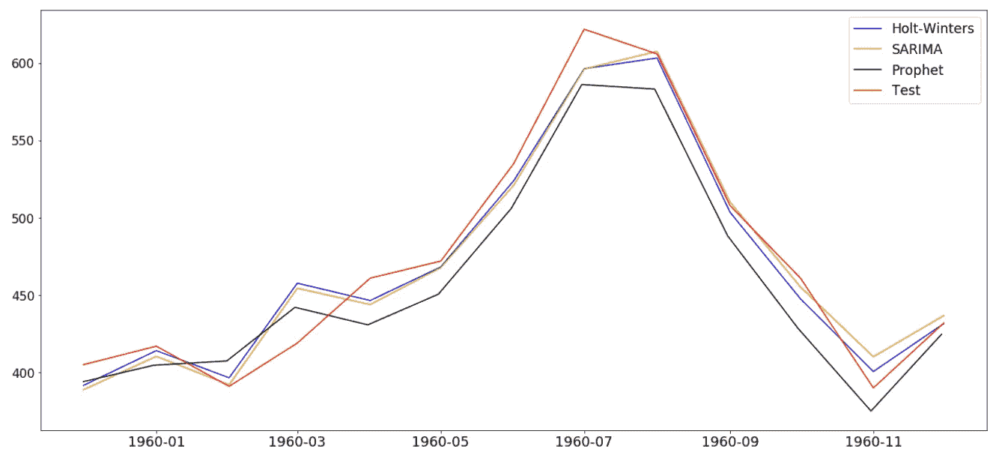
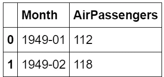
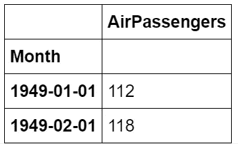
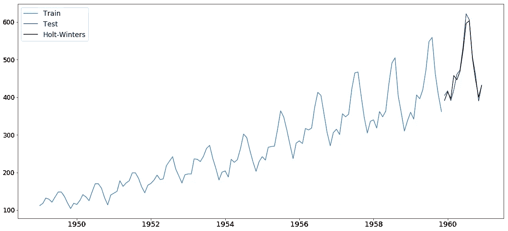
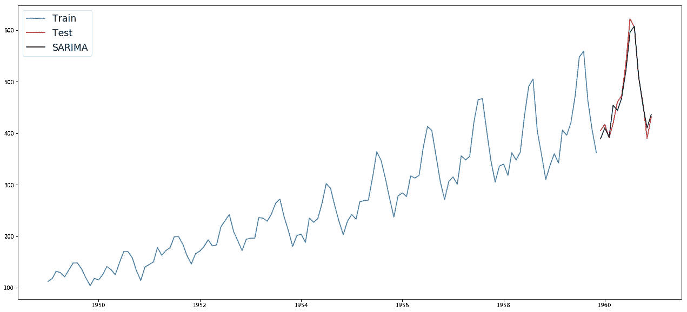
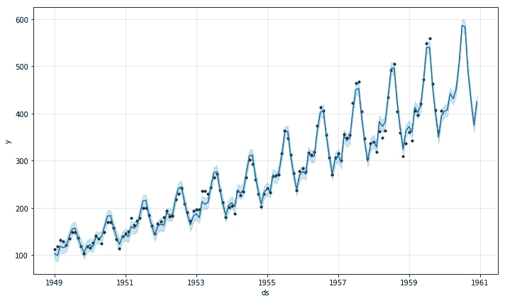
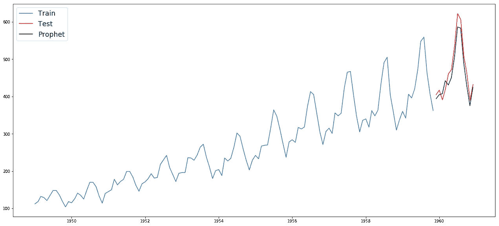
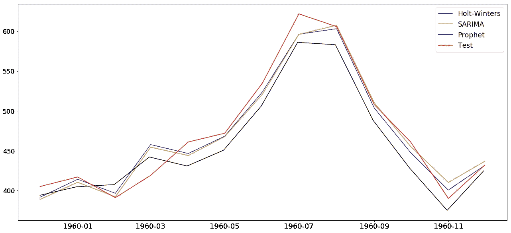

# 快速浏览霍尔特-温特斯，季节性 ARIMA 和 FB 先知

> 原文：<https://towardsdatascience.com/a-quick-run-through-of-holt-winters-sarima-and-fb-prophet-c6370c6f32f1?source=collection_archive---------15----------------------->

[](https://github.com/gianfelton/Comparing-Holt-Winters-SARIMA-and-FBProphet/blob/master/Holt%20Winters%2C%20SARIMA%20and%20FBProphet.ipynb) [## 詹费尔顿/比兴-霍尔特-温特斯-萨里玛-和-FBProphet

### 这是一个比较 Holt-Winters，SARIMA 和 FBProphet 输出的简单笔记本。关于参数的信息…

github.com](https://github.com/gianfelton/Comparing-Holt-Winters-SARIMA-and-FBProphet/blob/master/Holt%20Winters%2C%20SARIMA%20and%20FBProphet.ipynb) 

上面的链接将带你到笔记本，下面的代码是从那里获得的。

这篇文章的目的是展示霍尔特温特斯，萨里玛和 FB 先知的快速运行。我跳过了任何关于参数调整的内容，因为这可能是多篇文章。

首先，让我们获得 Holt Winters 的导入，以及数据集。

```
**import** **numpy** **as** **np**
**import** **pandas** **as** **pd**
**import** **matplotlib.pyplot** **as** **plt**
**from** **statsmodels.tsa.holtwinters** **import** ExponentialSmoothing
%matplotlib inline
**import** **warnings**
warnings.filterwarnings("ignore")

dataset = pd.read_csv('AirPassengers.csv')
```

数据集可以在本文开头的链接中找到。这是航空乘客的数据，在网上很容易找到。

看前两行就能对形状有个概念。



对于我们的分析，我们需要将 Month 列放入索引中。

```
dataset['Month'] = pd.to_datetime(dataset['Month'])
dataset.set_index('Month', inplace=**True**)
```

这会让我们得到这个:



我们需要做的下一件事是设置索引频率，并将数据集分为训练和测试。

```
dataset.index.freq = 'MS'
train, test = dataset.iloc[:131, 0], dataset.iloc[131:, 0]
```

在这里，我们可以用训练数据创建和拟合模型。

```
model = ExponentialSmoothing(train, 
                             trend='add', 
                             damped=**False**, 
                             seasonal='add', 
                             seasonal_periods=12).fit()
```

模型准备好了，我们现在可以做预测了。

```
holt_pred = model.predict(start=test.index[0], end=test.index[-1])
```

为了查看我们的预测，我们可以将它与训练和测试数据一起绘制出来。

```
plt.figure(figsize=(22, 10))
plt.plot(train.index, train, label='Train')
plt.plot(test.index, test, label='Test', color='r')
plt.plot(holt_pred.index, holt_pred, label='Holt-Winters', color='k')
plt.legend(loc='best', fontsize='xx-large')
plt.xticks(fontsize=18)
plt.yticks(fontsize=16)
plt.show()
```



接下来，我们来试试萨里玛。

```
**import** **statsmodels.api** **as** **sm**
**import** **itertools**
**import** **warnings**
warnings.filterwarnings("ignore")
```

通常情况下，我们会区分和绘制 ACF 和 PACF，以确定我们的条款。一个人应该做这些事情，但我们将跳过这个帖子。下面是对 SARIMA 订单和 seasonal_order 进行参数搜索的函数。

```
**def** find_best_sarima(train, eval_metric):

    p = d = q = range(0, 2)
    pdq = list(itertools.product(p, d, q))
    seasonal_pdq = [(x[0], x[1], x[2], 12) **for** x **in** list(itertools.product(p, d, q))]

    counter = 0
    myDict = {}

    **for** param **in** pdq:
        **for** param_seasonal **in** seasonal_pdq:
            **try**:
                counter += 1
                mod = sm.tsa.statespace.SARIMAX(train,
                                                order=param,
                                                seasonal_order=param_seasonal,
                                                enforce_stationarity=**False**,
                                                enforce_invertibility=**False**)

                results = mod.fit()
                myDict[counter] = [results.aic, results.bic, param, param_seasonal]

            **except**:
                **continue**

    dict_to_df = pd.DataFrame.from_dict(myDict,orient='index')

    **if** eval_metric == 'aic':
        best_run = dict_to_df[dict_to_df[0] == dict_to_df[0].min()].index.values
        best_run = best_run[0]
    **elif** eval_metric == 'bic':
        best_run = dict_to_df[dict_to_df[1] == dict_to_df[1].min()].index.values
        best_run = best_run[0]

    model = sm.tsa.statespace.SARIMAX(train,
                                      order=myDict[best_run][2],
                                      seasonal_order=myDict[best_run][3],
                                      enforce_stationarity=**False**,
                                      enforce_invertibility=**False**).fit()

    best_model = {'model':model, 
                  'aic':model.aic,
                  'bic':model.bic,
                  'order':myDict[best_run][2], 
                  'seasonal_order':myDict[best_run][3]}

    **return** best_model
```

输出是一个带有我们的拟合模型的字典，以及 aic、bic、订单元组和季节性订单元组。我们可以调用这个函数来检索我们的模型。

```
best = find_best_sarima(train, 'aic')
```

模型准备好了，我们现在可以做预测了。

```
sarima_pred = best['model'].predict(start=test.index[0], end=test.index[-1], dynamic=**True**)
```

为了查看我们的预测，我们可以将它与训练和测试数据一起绘制出来。

```
plt.figure(figsize=(22, 10))
plt.plot(train.index, train, label='Train')
plt.plot(test.index, test, label='Test', color='r')
plt.plot(sarima_pred.index, sarima_pred, label='SARIMA', color='k')
plt.legend(loc='best', fontsize='xx-large')
plt.show()
```



考验脸书先知的时候到了

```
**from** **fbprophet** **import** Prophet
**import** **logging**
logging.getLogger().setLevel(logging.ERROR)
```

与 Holt Winters 和 SARIMA 不同，我们需要月份列作为列，而不是索引。

```
df = dataset.reset_index()
df.columns = ['ds', 'y']
```

我们的预测规模将设定为过去 12 个月。在那之前，我们的训练数据就是一切。

```
prediction_size = 12
train_df = df[:-prediction_size]
```

现在，我们可以创建模型并使其适合训练数据。

```
m = Prophet(seasonality_mode='multiplicative')
m.fit(train_df)
```

我们希望从预测中得到的是一个数据框架。值得研究一下你从中能得到什么。这是相当有用的数据。

```
future = m.make_future_dataframe(periods=prediction_size, freq='M')
forecast = m.predict(future)
```

现在我们可以绘制数据了。

```
single_plot = m.plot(forecast)
```



现在让我们用我们的训练和测试来绘制预测。

```
plt.figure(figsize=(22, 10))
plt.plot(train.index, train, label='Train')
plt.plot(test.index, test, label='Test', color='r')
plt.plot(forecast['ds'][131:], forecast['yhat'][131:], label='Prophet', color='k')
plt.legend(loc='best', fontsize='xx-large')
plt.show()
```



现在让我们放大到测试阶段，看看它们是如何叠加的。

```
plt.figure(figsize=(22, 10))
plt.plot(holt_pred.index, holt_pred, label='Holt-Winters', color='b')
plt.plot(sarima_pred.index, sarima_pred, label='SARIMA', color='y')
plt.plot(forecast['ds'][131:], forecast['yhat'][131:], label='Prophet', color='k')
plt.plot(test.index, test, label='Test', color='r')
plt.legend(loc='best', fontsize='xx-large')
plt.xticks(fontsize=18)
plt.yticks(fontsize=16)
plt.show()
```



当然，任何这些模型都可能发生许多不同的参数调整。我只是想针对同一个数据集快速浏览一下。谢谢你。