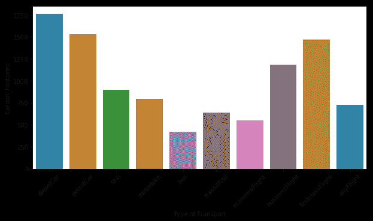
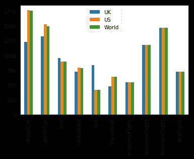

# 全球旅行碳排放的研发评估

> 原文：<https://towardsdatascience.com/a-r-api-d-assessment-of-travel-carbon-emissions-around-the-world-e1a2b8508827?source=collection_archive---------37----------------------->


作为一个关注气候的消费者，我经常想知道我从东海岸到盐湖城的日常旅行对环境的影响。在看到最近许多强调航空旅行令人惊讶的高碳排放率的头条新闻之一后，我想知道:乘坐火车、公共汽车或驾驶汽车是否比乘坐飞机更有利于地球？

谢天谢地，我偶然发现了一个由伦敦程序员 Tobe-Nicol 开发的易于使用的 API，它允许你比较各种旅行方式的碳足迹。为了地球，我准备把价格、舒适和方便放在一边，我从这个 API 中取出来比较我的选择，并提出了一系列关于沿途旅行的能源强度的问题。

**什么是 API 参数？**

我在 Twitter 上发现了这个 API，并且能够在 Jupyter 笔记本上做一些快速的实验，这要感谢简单明了的文档。该 API 具有以下参数:

*   活动(必需):这可以是车辆的燃料消耗，也可以是以英里为单位的行驶距离。因为我们在比较不同的交通方式，所以我将这个参数设置为“3，910”——从纽约到盐湖城的往返行程长度，以英里为单位。
*   activityType:该参数表示上面输入的整数值。
*   方式:指运输方式。有几个选项可供选择:柴油汽车、汽油汽车、任何汽车、出租车、经济舱、商务舱、头等舱、任何航班、摩托车、公共汽车和轻轨。
*   燃料类型:这与上面列出的模式配对:车用汽油(也称为汽油)、柴油、航空汽油和喷气燃料。

我假设所有商业航班都使用喷气燃料，但将参数“anyFlight”与航空汽油配对，以查看这两种燃料类型之间的碳足迹是否有重大差异。我还将“柴油汽车”、“公共汽车”和“轻轨”归入柴油燃料；我假设所有其他模式使用汽油。

我首先将这些参数放入两个长度相等的列表中，将每种运输方式与每种燃料类型关联起来。我还从列表中删除了“anyCar”，因为它与“taxi”和“petrolCar”重叠，似乎是多余的。以下是列表:

```
list_of_modes = ['dieselCar', 'petrolCar', 'taxi', 'motorbike', 'bus', 'transitRail', 'economyFlight', 'businessFlight', 'firstclassFlight', 'anyFlight' ] 

list_of_fuels = ['diesel', 'motorGasoline', 'motorGasoline', 'motorGasoline', 'diesel', 'diesel', 'jetFuel', 'jetFuel','jetFuel', 'aviationGasoline']
```

我没有手动将每个参数输入到系统中，而是编写了一个函数来遍历这两个列表，并将 API 请求输出为一个字典。在导入了必要的包之后，我定义了函数，插入了列表并将输出打包成一个字典(完整的代码，请参见这篇博文所附的 jupyter 笔记本)。

```
#import necessary packages 
import requests
import json
import pandas as pd
import seaborn as sns
import matplotlib.pyplot as plt
import numpy as np
%matplotlib inline #use carbon_slc_nyc function to create dictionary with mode of #transportation as keys and of carbon footprint as valuescarbon_footprint = {}
carbon_footprint = carbon_slc_nyc(list_of_modes, list_of_fuels)
```

将输出打包成字典后，我将它转换成熊猫数据框架，将列重命名为更合适的标题，并将“碳足迹”列数据转换成浮动数据，为绘图做准备。

```
df = pd.DataFrame(list(carbon_footprint_ground.items()))
df.rename(columns = {0 :'Type of Transport'}, inplace = True)
df.rename(columns = {1 :'Carbon_Footprint'}, inplace = True)
df['Carbon_Footprint'] = df['Carbon_Footprint'].astype('float64')
```

有了这个数据框架，我绘制了一个条形图来显示每种交通方式在 3910 英里的旅程中排放了多少碳。

```
plt.figure(figsize=(10,5))
sns.barplot(x=df_ground['Type of Transport'], y=df_ground['Carbon_Footprint'])
plt.xticks(rotation=45)
```



有意思。如果我要选择一种平均油耗的交通方式，坐公共汽车、火车或经济舱是我的最佳选择。然而，结果产生了许多问题。这个数据满足了一个合乎逻辑的解释，即驾驶自己的汽车不如共乘一辆车和将一辆车的总排放量分散给许多人，如在飞机、公共汽车或火车上。但是为什么一张头等舱机票比经济舱机票差那么多呢？为什么你的普通巴士在这次旅行中的碳足迹是最低的？除了电动或液化天然气燃料的城市公交车，我不认为柴油燃料的灰狗巴士或协和蔻驰巴士是非常环保的。

我认为这种分布是美国独有的，并使用了另一个参数来比较各国之间交通运输方式的平均碳足迹。API 要求输入“usa”、“gbr”和“def”来比较美国、英国和全球平均水平之间的足迹。虽然这个新参数只允许我与其他两个选项进行比较，但我想看看在美国以外行驶 3910 英里是否会改变巴士的气候优势。



世界平均水平与美国大致相同，但在英国，公共汽车污染严重得多。所有的航空旅行都差不多，这表明这个排放计算器在全球范围内标准化了排放，考虑到该行业的国际性质，这是有意义的。在英国，乘坐火车或经济舱是我的最佳选择。

如何计算排放量？

查看了这些结果后，我进一步查看了文档，以了解排放量是如何计算的。有两种方法。对于上面的代码，API 使用给定国家车辆的平均排放系数，并根据行驶距离参数调整结果。然而，API 也提供了一个更具体的计算方法，使用车辆的燃油效率。在这种方法中，API 将燃油消耗总量乘以该燃油的排放系数。排放系数通常由政府机构提供，由 IPCC 推荐。

```
Total Emissions = Fuel Emission Factor * Fuel Usage
```

为了更准确地评估我的旅行选择，我需要知道每种交通方式的引擎消耗了多少能量。我从第一次描述性分析中挑选了三个最佳选项，并将结果限制在美国。在接下来的 API 调用中，我加入了我妈妈的 Suburu 的燃油效率(每加仑汽油 33 英里)，一辆典型的灰狗巴士(每加仑柴油 6 英里)，以及一架空客 A220 100 的每加仑喷气燃料英里数。

空客的油耗颇具挑战性，因为官方的维基百科燃油经济性数据要么以千克/公里列出，要么以每座加仑英里数列出，这意味着我要么必须将千克/公里数转换为每加仑英里数，要么将每座加仑英里数乘以空客 A220 100 的座位数(我假设我会飞完全程——SLC 和纽约是受欢迎的目的地)。我不确定 API 的碳计算器是否会自动将燃料消耗参数转换为公共交通的每座加仑英里数，所以我双向调用数据，输入每加仑英里数和每座加仑英里数，以免重复计算。不管怎样，这形成了一个有趣的对比。

通过快速的谷歌搜索，我发现空客 A220s 可以有 120 到 160 个座位。我选了 140 个座位。

```
#miles per seat gallon divided by seats on the plane 
A220_mpg_A = (85.6 / 140) 
suburu_mpg_A = 33 
greyhound_mpg_A = 6A220_gal_A = 3910/A220_mpg_A
suburu_gal_A = 3910/suburu_mpg_A
greyhound_gal_A = 3910/greyhound_mpg_Alist_gallons_A = [suburu_gal_A, greyhound_gal_A, A220_gal_A]
list_fuel_type_A = ['motorGasoline', 'diesel', 'jetFuel']#call API and create dataframe 
carbon_footprint_A = {}
carbon_footprint_A = carbon_fuel(list_gallons_A, list_fuel_type_A) 
df_A = pd.DataFrame(list(carbon_footprint_A.items()))
df_A.rename(columns = {0 :'Fuel_Type'}, inplace = True)
df_A.rename(columns = {1 :'Carbon_Footprint'}, inplace = True)
df_A['Carbon_Footprint'] = df_A['Carbon_Footprint'].astype('float64')#now adjust to miles per seat gallon
A220_mpg_B = 85.6 
suburu_mpg_B = 33 
#adjusting to miles per seat gallon with 55 seats
greyhound_mpg_B = 6 * 55 A220_gal_B = 3910/A220_mpg_B
suburu_gal_B = 3910/suburu_mpg_B
greyhound_gal_B = 3910/greyhound_mpg_Blist_gallons_B = [suburu_gal_B, greyhound_gal_B, A220_gal_B]
list_fuel_type_B = ['motorGasoline', 'diesel', 'jetFuel']#call API and create dataframe
carbon_footprint_B = {}
carbon_footprint_B = carbon_fuel(list_gallons_B, list_fuel_type_B)
df_B = pd.DataFrame(list(carbon_footprint_B.items()))
df_B.rename(columns = {0 :'Fuel_Type'}, inplace = True)
df_B.rename(columns = {1 :'Carbon_Footprint'}, inplace = True)
df_B['Carbon_Footprint'] = df_B['Carbon_Footprint'].astype('float64')
```

结果如下:


在绘制了第一次 API 调用的结果后，很明显，驾驶我自己的飞机从纽约到盐湖城并返回会产生很大的环境影响，就像驾驶我自己的灰狗巴士一样。一个人开我妈妈的 Suburu 显然更有效率，因为它小得多。


然而，当在载满乘客的飞机或公共汽车上传播高 MPG 和碳排放时，很明显，公共汽车的碳足迹最低。尽管飞机的载客量是公共汽车的两倍多，从纽约到 SLC 的速度也比任何公路旅行都快，但公共汽车的优势在于使用污染更低、能源密度更低的燃料，同时仍将气候成本分摊到 55 个人身上。我妈妈的 Suburu 虽然拥有汽油驱动汽车市场上最高效的发动机之一，但无法与之相比——即使我搭载了两个搭便车的人(我算过)。

**结论**

如果限制个人的碳排放是你的首要任务，那就不要开车。尽管在全国范围内移动一辆公共汽车或商业客机需要更多的能源(和更多的碳)，但当你选择乘火车、公共汽车或飞机旅行时，你会将气候成本分摊给更多的人。这种分析可以通过更多的细微差别和粒度数据集来改进，但很明显，在高层次上，激励更多的人乘坐大型车辆从 A 地到 B 地应该在制定脱碳战略中发挥作用。

Github 链接:【https://github.com/kbaranko/SLC-to-NYC-Carbon-Costs 