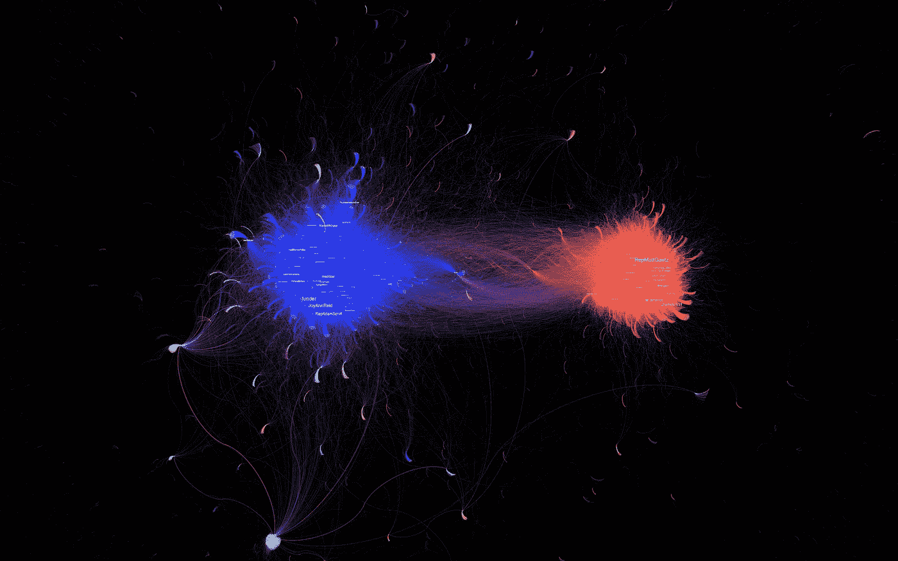
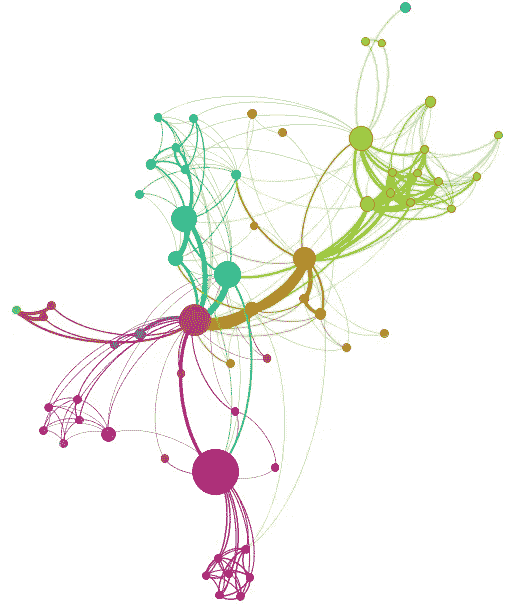
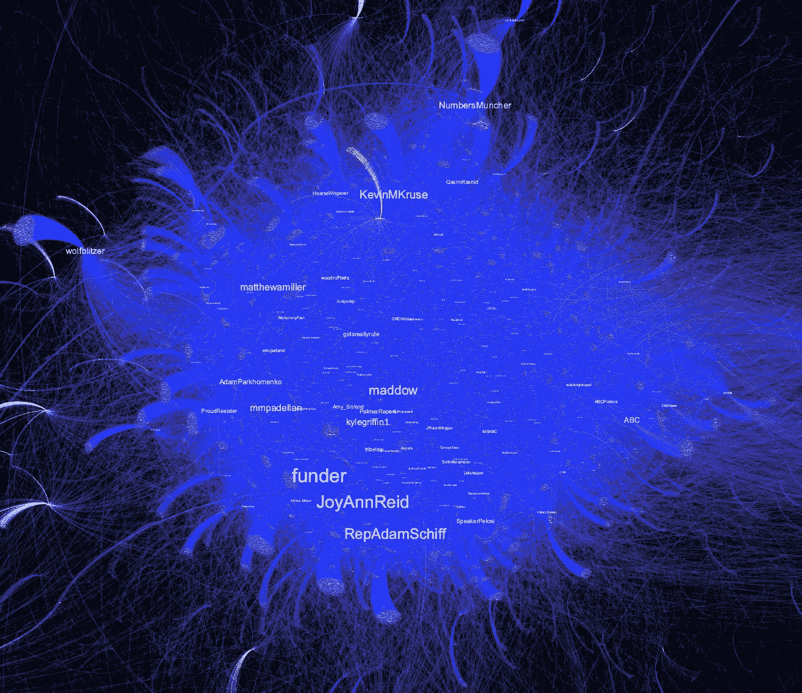
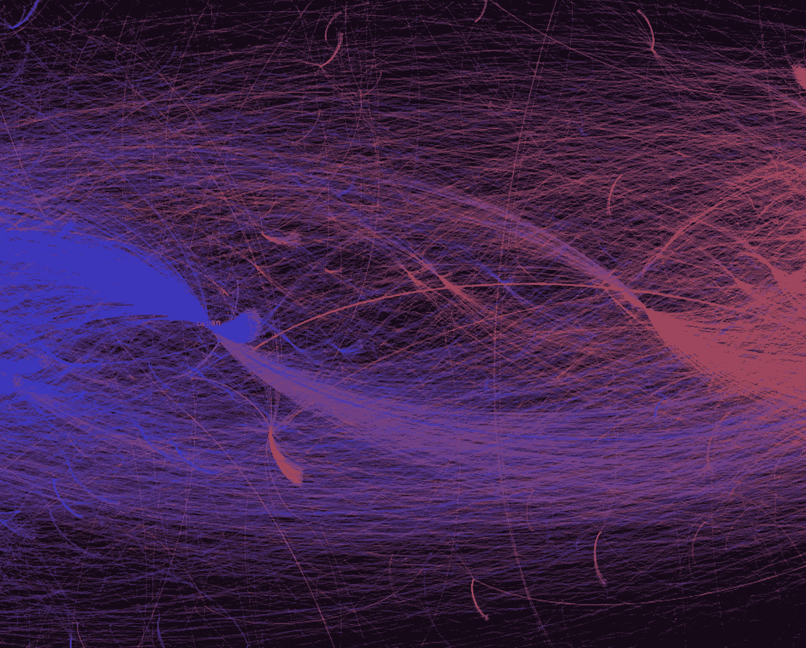
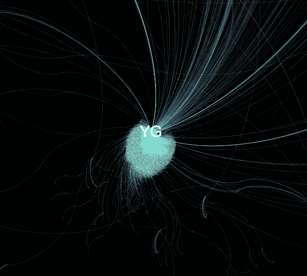
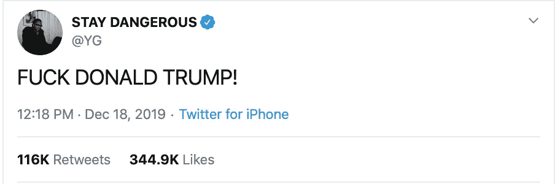
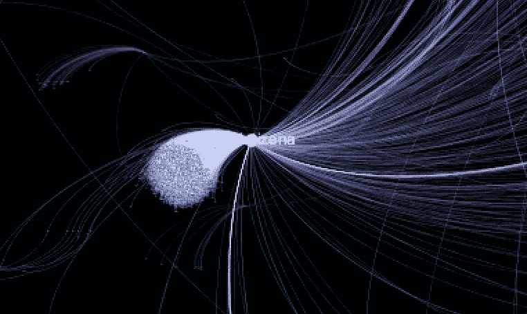
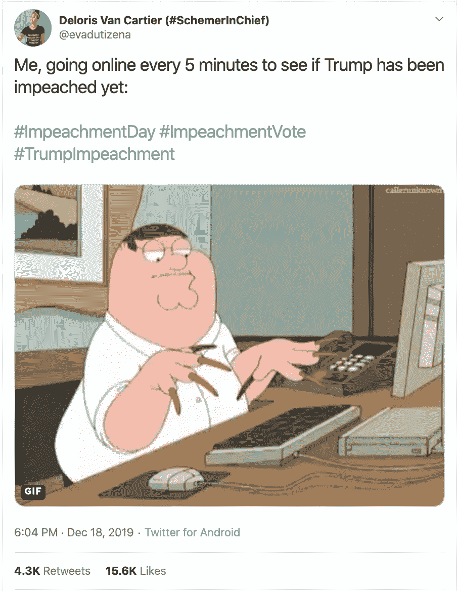
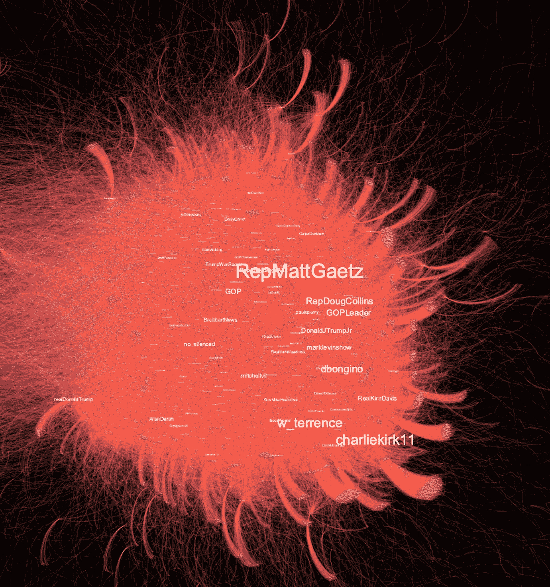

# 使用 Twitter 数据和 Gephi 对特朗普弹劾前后的政治极化进行可视化评估

> 原文：<https://towardsdatascience.com/a-radiography-of-trumps-impeachment-86284710ae1d?source=collection_archive---------24----------------------->

The conversation on Twitter around Trump’s impeachment on December 18th

## 围绕导致美国历史上第三次总统弹劾的事件，美国在网上是如何互动的？

美国是两极化的，这是事实。但是这种两极分化会是什么样子呢？没有比 Twitter 这个全球数字对话的圣地更好的地方来回答这个问题了，所以我从 12 月 18 日周四开始下载了 50 万条推文，那天众议院举行了弹劾唐纳德·j·特朗普的最终投票。结果既美好又令人生畏。

Pic by History HD on Unsplash

先看方法论。正如我提到的，我使用 Twitter 公共 API 连接到 Twitter 服务器，并获取所有包含通用关键字的推文，如“特朗普”或“弹劾”。不过，这个过程很漫长，我那台含咖啡因的*MacBook 花了几天时间才达到 50 万条推文的大关(不用说，在那段时间里，用电脑几乎不可能完成任何事情)。当然，还有其他方法，比如实时传输推文，这更容易，计算成本也更低，但我无法在那个周五下午回到过去，因为太晚了，无法实时捕捉推文。*

> 为了连接到 Twitter API，你需要创建一个[开发者档案并申请一个许可](https://developer.twitter.com)。这个过程并不长，如果你做得对，你将很快拥有自己的驾照。

有了推文之后，是时候做一些网络理论了。想想看:如果参与对话的每个帐户都被表示为空间中的一个点(比如说一个*节点*)，如果每次他们中的任何一个通过回复、转发或引用与另一个进行交互时，我们都在他们之间画一条线，那么我们最终会用我们称之为*边*的东西将一堆节点链接在一起。因此，我们可以将 12 月 18 日发生的对话表示为一个社交网络，更好的是，我们可以用图表来直观地评估正在发生的事情。

An example of a network graph - Taken form the Gephi Blog on Wordpress.

我的绘图工具是 [Gephi](https://gephi.org) ，一个开源的网络绘图软件(关于它有大量的在线教程)。您需要传递给 Gephi 的只是一个简单的 csv 文件，它有两列:生成交互的帐户(“源”列)和接收所述交互的帐户(“目标”列)。在那之后，你可以自由地摆弄你的网络，并以你喜欢的任何方式来表现它。我是这样做的:

1.  选择 ForceAtlas2 布局。
2.  计算模块化得分。
3.  设置节点标签，其大小与每个节点的入度成比例。

## 技术插曲

让我们一步一步地重温一下:

第一，布局。有几种算法可以计算网络中的各种基本方面，例如，某些节点的中心位置如何，它们之间应该相距多远或多近，在网络中可以找到哪些节点群，边的长度或弹性如何，等等。对于当前的绘图任务，我选择了 [ForceAtlas2](https://journals.plos.org/plosone/article?id=10.1371/journal.pone.0098679) ，顾名思义，它是 ForceAtlas 的续集，更适合更大的网络。本质上，该算法采用了几个物理定律来达到力之间的稳定平衡或平衡状态:它模拟节点之间的排斥，就好像它们是带电粒子一样(遵循[库仑定律](https://en.wikipedia.org/wiki/Coulomb%27s_law)，同时使边缘吸引它们的节点，就像弹簧一样(遵循[胡克定律](https://en.wikipedia.org/wiki/Hooke%27s_law))。

第二，模块化。这是一种通过给出一个分数来检测网络中的社区的方法，该分数决定了网络分成模块的强度。高度模块化意味着网络在社区或模块中具有密集连接的节点，而与其他社区或模块中的其他节点的链接相当松散或稀疏。

最后，标签。至关重要的是，我们知道哪些社交网络代理在给定时间是最相关的，因此我们可以简单地在图上包括他们的标签(例如，他们的 Twitter 处理程序)。但是，想象一下，一个有几十万个标签的图表:它看起来会很混乱，无法辨认。要解决这个问题，我们可以简单地要求 Gephi 计算每个节点的平均加权度。

什么现在？节点的度是与它交互的边的总和:例如，在我们的例子中，转发了一个帐户获得的消息或转发了一个帐户发出的消息。鉴于我们的图形本质上是有向的，我们非常关心每个动作的方向。换句话说，我们最关心的是哪个账号转发得最多(入度)或者哪个账号转发得最多(出度)。所述度的权重简单地与节点的边的重要性或质量相关。例如，当两个特定节点之间存在重复交互时，该边将具有较高的权重，因此在给定这种权重的情况下将考虑其程度。当你有了度数，你可以让 Gephi 相对于它们的度数来标记节点，这样网络中最相关的节点将是最可见的。

> 我们选择了加权入度来展示图表中每个节点的重要性:我们希望通过谁被转发、回复或引用最多来了解谁对对话的影响最大。

# *La pie ce de resistance，*我们的图表。

毫不奇怪，有两个定义明确的主要模块或社区，它们对应于政治辩论的两极，民主党人(用蓝色表示)和共和党人(用红色表示)。

The Democratic community.

民主社区在对话中展示了大约十个重要人物。他们从政治家到作家到新闻主播(佩洛西当然也在其中)。在社区的右侧可以看到 ABC。民主团体代表了图表中超过 50%的节点。

The bridge between the two communities.

对话中两个明显的政治极端之间的桥梁展示了一个有趣的关键节点:C-SPAN。

American rapper YG has his own alt-module.

美国说唱歌手 YG 有自己孤立的另类社区，是除了两个主要社区之外唯一值得一提的代表，拥有图表中超过 6%的节点。这主要是由他的明确声明引起的:

Source: [https://twitter.com/YG/status/1207349489255628800](https://twitter.com/YG/status/1207349489255628800)

@evadutizena catching some lights with a meme.

一项荣誉要归功于@evadutizena，她通过一个迷因，整合了网络中几乎 2.5%的节点。恭喜你，德洛丽丝！

Source: [https://twitter.com/evadutizena/status/1207436447898320897](https://twitter.com/evadutizena/status/1207436447898320897)

最后，社交网络图中的共和党社区，有超过 30%的节点。

The Republican community.

在这里，只有大约八个帐户似乎抓住了眼球。与民主党社区不同，共和党本身有一些明确的活动和影响力，还有其他政治家、节目主持人、喜剧演员和作家，以及总统的儿子本人。说到这，你能找到川普吗？

现在是时候看看整个数字对话的画像了，这是对当今美国政治的准确描述，也是 2020 年美国政治格局的基石。尽情享受吧！

Portrait of the polarization of the American political debate around Trump’s impeachment. All rights reserved.

# 乐章结尾部

我觉得这张图讲述了一系列的故事，所有的故事都同样相关，特别是在 2020 年和总统大选之际:

1.  虽然两极分化很明显，但是两极分化本身早就有了。这不是什么新鲜事，但在过去的几十年里，它一直在增长。
2.  共和党社区仅拥有对话图中 30%多一点的节点，这一事实不足以说明今天美国共和党人占总人口的比例是 30%。因为我们只处理 Twitter 数据，所以存在很大的选择偏差，这不允许我们对美国的一般人口做出统计上无偏见的推断。
3.  民主党社区包含了网络中超过 50%的节点，这表明，在 12 月 18 日，更多倾向于民主党的行动者支持弹劾程序，或者至少，他们在 Twitter 上的数字对话中更加直言不讳。
4.  在数字辩论中仍然有替代叙事的空间，尽管与两个主要叙事相比很小，但它代表了政治观众/光谱的第三部分。
5.  没有办法根据这个图表来预测结果，我们还得等着看参议院会发生什么。然而，2020 年的选举可能会完美地向两个方向发展，民主党被众多强大但不同的候选人分裂，或者一个规模稍小但更加团结的共和党(如图所示)连任，这是美国历史上第一次被弹劾的总统。

别忘了留下评论，祝大家新年快乐！

在推特上关注我！