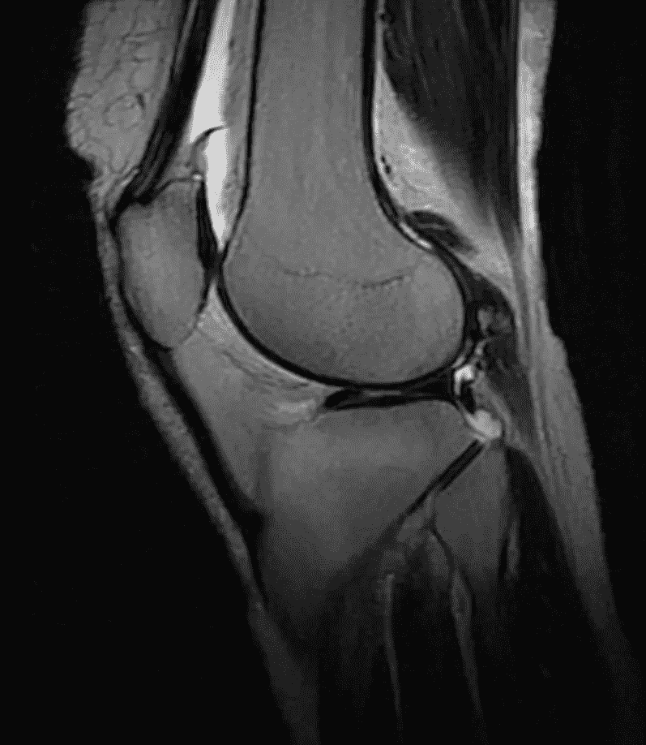
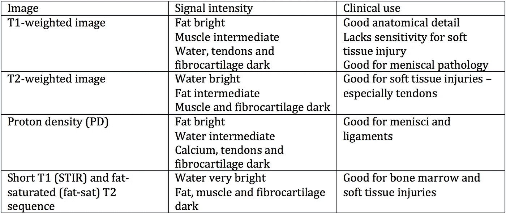
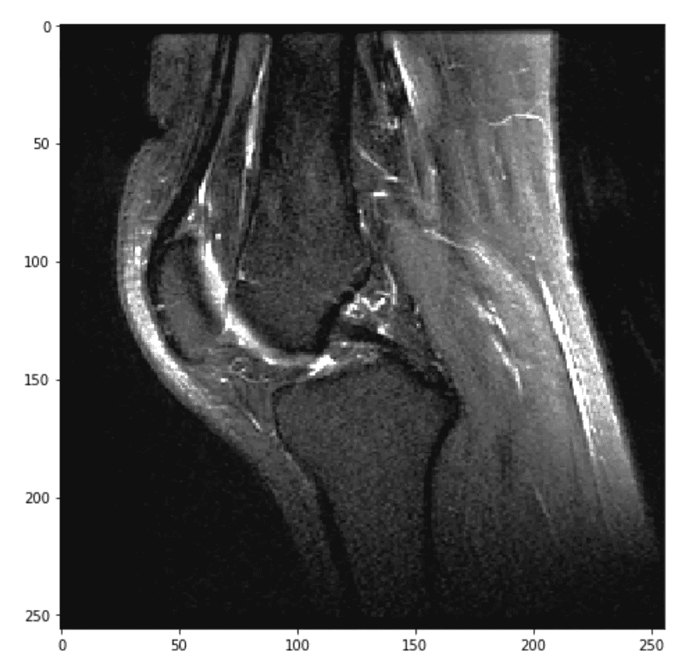
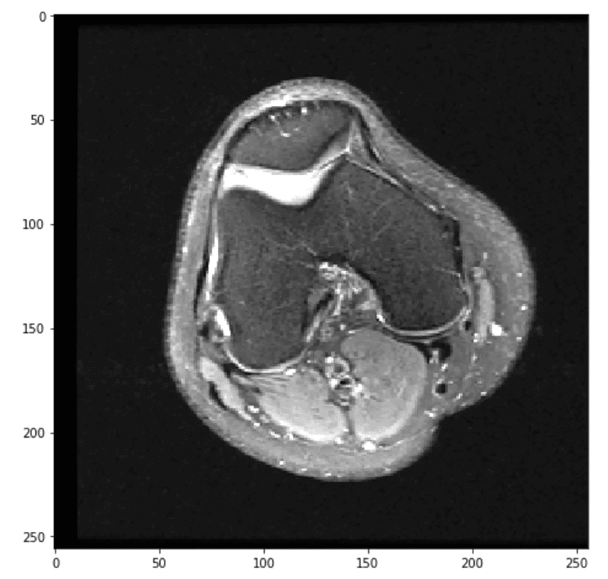
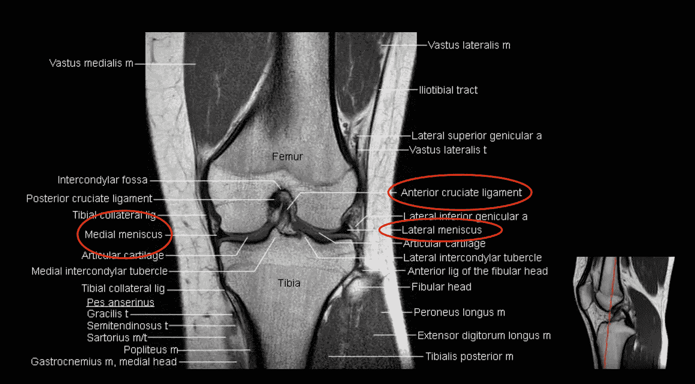
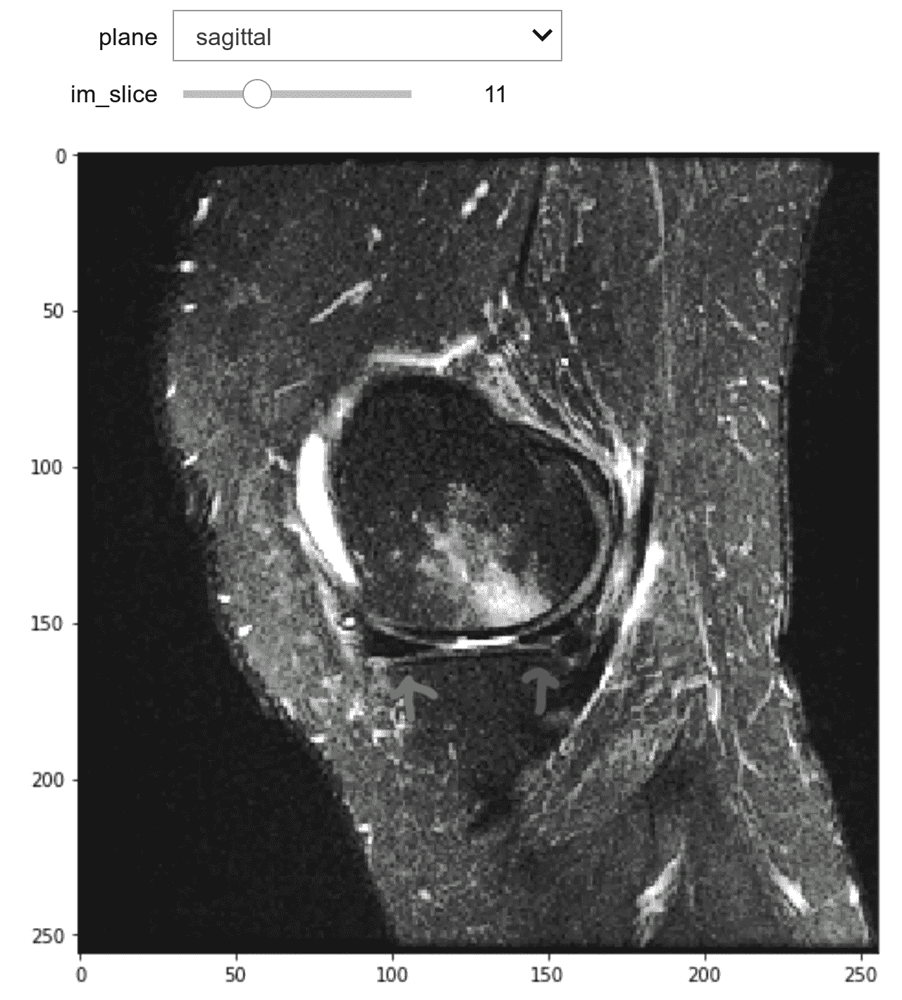
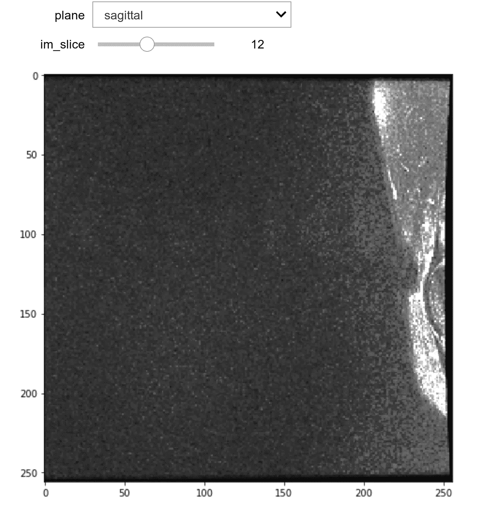
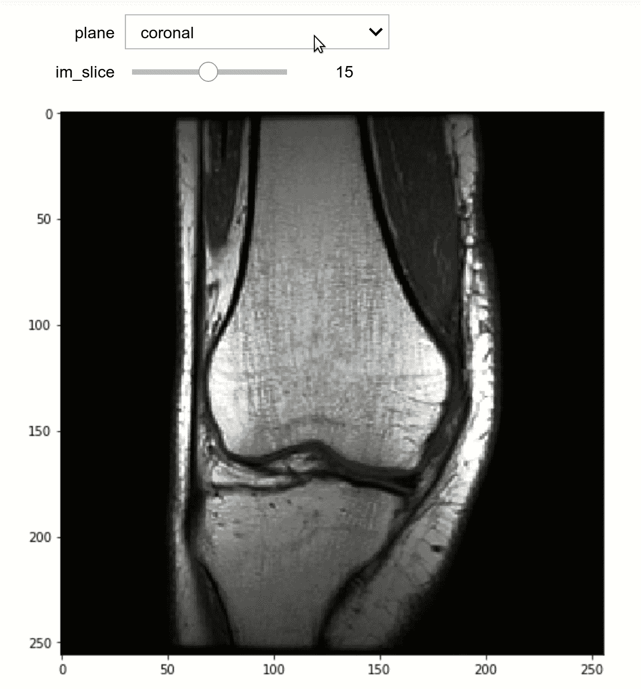

# 一位放射科医生对斯坦福 ML 集团 MRNet 数据的探索

> 原文：<https://towardsdatascience.com/a-radiologists-exploration-of-the-stanford-ml-group-s-mrnet-data-8e2374e11bfb?source=collection_archive---------16----------------------->

## 医学影像领域知识的数据探索

*这篇文章回顾了最近发布的斯坦福 MRNet 膝关节 MRI 数据集和竞赛。由于我是一名高级放射科住院医师，我将专注于通过基础领域知识探索数据，解决非医生可能会感到困惑的数据分布方面的问题。我还将包含一些 Python 代码，感兴趣的人可能会发现这些代码对自己探索数据集很有用。*



# 介绍

斯坦福 ML 小组最近发布了他们的第三个医学影像检查公共数据集，称为 MRNet，可以在这里[找到](https://stanfordmlgroup.github.io/competitions/mrnet/)。从网站:

> MRNet 数据集由斯坦福大学医学中心进行的 1，370 次膝关节 MRI 检查组成。数据集包含 1104 个(80.6%)异常检查，其中 319 个(23.3%)为前交叉韧带撕裂，508 个(37.1%)为半月板撕裂；标签是通过从临床报告中手工提取获得的。

这个数据集伴随着斯坦福 ML 小组工作的发表，可以在[这里](https://stanfordmlgroup.github.io/projects/mrnet)找到。他们再次举办了一场比赛，以推动医学成像自动化分析的创新。

参赛作品将在私人测试数据集上进行评估，评估标准如下:

> 排行榜报告了异常检测、ACL 撕裂和半月板撕裂任务的平均 AUC。

你可以在网站上找到更多关于比赛的细节。我这篇文章的目标如下。

# 目标

*   基本医学成像术语
*   竞赛的数据集和任务概述
*   基础膝关节解剖学
*   目标膝盖病变的例子
*   潜在“坏”数据点的示例
*   用于检查数据的 Python 代码

# 基本医学成像术语

磁共振成像(MRI)是一种**横截面成像模式**，这意味着 2D 图像或多或少是在不同的成像**平面**中连续采集的。MRNet 数据集中包含的标准成像平面有:**轴位、冠状位和矢状位**。MR 图像可以在任何平面上获得，但这超出了本文的范围。

MR 图像通过射频(RF)脉冲序列(**脉冲序列**或——简单地说——**序列**)采集。不同的序列被设计成产生一个信号，该信号可以被采集和处理以揭示生物组织中不同的**信号强度**模式。T1 加权、T2 加权和质子密度(PD)加权是肌肉骨骼成像中使用的 3 种核心脉冲序列类型。

了解这 3 个序列的脂肪、水和肌肉的基本信号强度模式是很有帮助的(下面的*表*)。还有一个有用的知识是*皮质骨和纤维结构(如韧带、半月板)在所有序列上都应该是黑色的*。由于脂肪和水在 T2 和 PD 序列上都是中等亮度，因此**脂肪饱和度** (fat-sat)是一种可用于增强水在这些序列上的外观的技术。

> **异常液体信号(无论是数量还是位置)通常是肌肉骨骼病理(或任何病理，就此而言)的关键指标，因此液体敏感图像确实是膝关节 MRI 的主力。**



Source: [https://www.fifamedicinediploma.com/lessons/radiology-mri/](https://www.fifamedicinediploma.com/lessons/radiology-mri/)

**附加术语:**

*   **切片** : 一个单独的图像通常被称为切片
*   **系列**:在给定的平面上，用给定的脉冲序列采集的一整叠图像
*   **视场(FOV)** :图像的空间覆盖范围

# 竞赛的数据集和任务概述

警告:我还没有审查所有提供的数据。这些评论是基于对数据的有限的初步审查。

同样，数据可以通过上面的链接获得。你必须先在斯坦福 ML 集团注册一个账户，然后你会收到一封链接到数据的电子邮件。共享数据是被明确禁止的，即使是和比赛中的队友。

下载并解压缩数据后，您应该会看到这个目录树:

```
.
├── train
│ ├── axial
│ ├── coronal
│ └── sagittal
├── train-abnormal.csv
├── train-acl.csv
├── train-meniscus.csv
├── valid
│ ├── axial
│ ├── coronal
│ └── sagittal
├── valid-abnormal.csv
├── valid-acl.csv
└── valid-meniscus.csv
```

`*.csv`文件包含箱子的标签。`train`和`valid`子目录下的`*.npy`文件是维度为`(slices, x, y)`的 NumPy 数组。在所有检查中，`x`和`y`尺寸始终为 256 x 256，且`int`值范围为 0 至 255。这意味着像素数据已经被斯坦福 ML 小组标准化了。

*注意:*每个检查的图像堆栈可以包含不同数量的图像，并且每个检查对于任何给定的平面可以具有不同数量的切片。*这对于医学影像数据来说是完全正常的。*

为了不与竞赛规则相冲突，我将避免在标签中张贴重叠的汇总数据表。但是，有必要注意以下几点:

> 1.有许多不正常的检查不包含前交叉韧带或半月板撕裂。
> 
> 2.包含前交叉韧带撕裂和半月板撕裂的检查远远多于仅包含前交叉韧带撕裂的情况。

> 这些发现表明，数据集对于现实世界中会遇到的情况可能是相当现实的。

其原因如下:

*   膝关节核磁共振成像通常不用于无症状患者。
*   膝关节核磁共振检查中最常见的异常是在软骨和下面的骨头中。
*   由于损伤机制和撕裂 ACL 所需的力，半月板也经常受伤。

**图像数据的预览**

尽管该网站声明数据集中的 MRI 膝关节检查的标准协议包括各种序列，但我迄今为止查看的数据包含每个病例的三个序列:

*   冠状 T1 加权图像*无*脂肪饱和


*   矢状 T2 加权图像**和脂肪饱和**(流体敏感)



*   轴向 PD 加权图像**和脂肪饱和**(流体敏感)



# 基础膝关节解剖学

我将在这里包括一个图像的膝盖解剖的基本概述。对于那些有兴趣了解更多关于膝关节在核磁共振成像上的外观的人来说，[这个网站](http://www.freitasrad.net/pages/atlas/Knee/Knee.html)(下图的来源)可能会有所帮助。



Source: [http://www.freitasrad.net/pages/atlas/Knee/Knee.html](http://www.freitasrad.net/pages/atlas/Knee/Knee.html)

# 目标膝盖病变的例子

1.  **半月板撕裂**:下图矢状 T2 fat-sat 图像显示正常的内侧半月板前角(*绿色箭头* —图像左侧的黑色三角形)和内侧半月板后角撕裂(*红色箭头* —图像右侧的黑色三角形内的小点亮信号)。*注意:这张图片上还有几处其他异常，但这些不在本文讨论范围之内。*



Sagittal T2-weighted image with fat saturation

2.**前十字韧带撕裂:**

首先，我将展示一个正常前交叉韧带的矢状 T2 脂肪卫星图像。*注:图像中前交叉韧带正上方信号增强的波纹代表腘血管的搏动伪影。*


Normal ACL

现在，前交叉韧带撕裂。在下图中，*红色箭头*指向一个信号强度相对较高的长方形结构，纤维韧带的正常暗带(见上图)缺失。


Torn ACL

# 潜在“坏”数据点的示例

同样，在撰写本文时，我还没有完整地研究这些数据。然而，我观察到一些潜在的“坏”数据点，增加了这场竞争的挑战。我说*潜在*不好，因为其中一些可能会被深度学习模型处理得相当好。在这里，我展示了几个例子，并简要解释了为什么这些代表了麻烦的数据点。

我观察到的一个问题是矢状图像堆栈，其中膝盖的大部分在 FOV 之外，导致图像堆栈对于比赛任务基本上无用，因为相关的解剖结构都不可见。这可能是由于 MRNet 数据集中的治疗图像预处理中的错误，或者是由于源数据的问题。到目前为止，这是一个很少遇到的问题。



潜在“坏”数据的另一个原因对于医学成像来说相当典型。在一些情况下，我看到图像伪影严重到使人阅读图像非常困难。然而，深度学习算法可能会“通读”工件，就像我们放射科医生为了病人护理的利益而试图做的那样。这里，腘动脉的搏动导致在膝关节水平的整个图像中出现混叠伪影。


Extensive pulsation artifact can make images hard to read/analyze

# 用于查看数据的 Python 代码

下面的代码将把一个案例中的数据加载到 NumPy 数组的`dict`中，然后由`KneePlot`类使用它来生成下面的`*.gif`中显示的交互式绘图。



# 结论

我希望这篇文章能让你对 MRNet 数据集有所了解。也许更重要的是，我希望你已经了解了一点关于膝盖核磁共振成像的知识。虽然我还没有探索它的全部，但我认为这个数据集对 ML 社区来说是一个有价值的资源。我期待着阅读通过比赛开发的模型。感谢您的阅读！