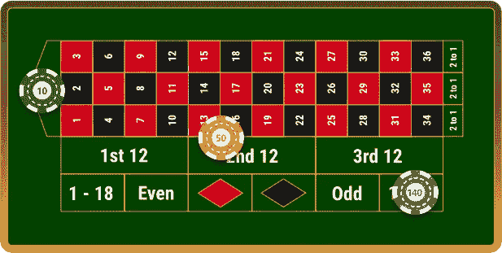
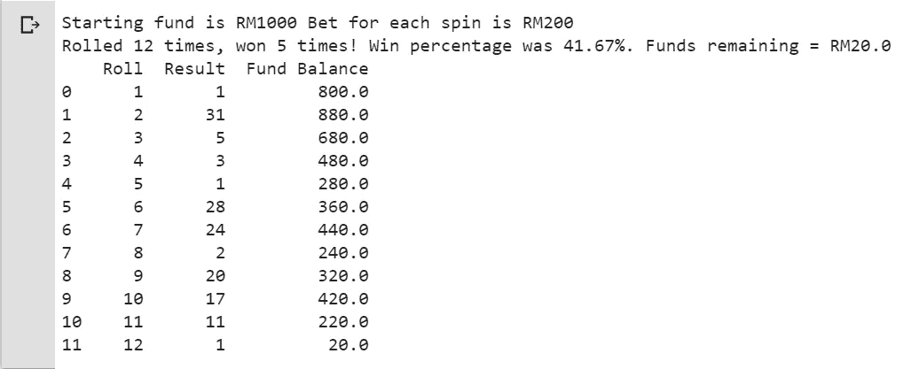
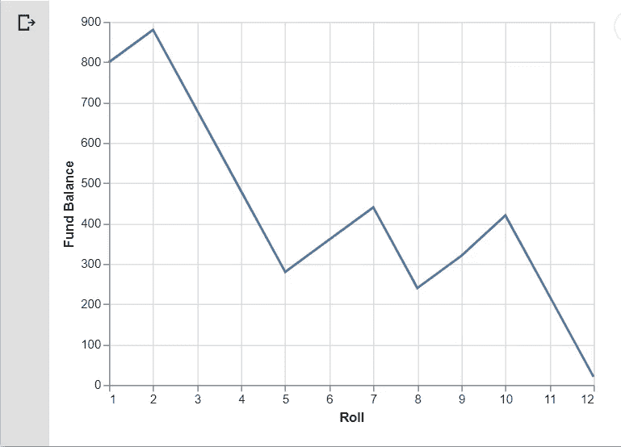
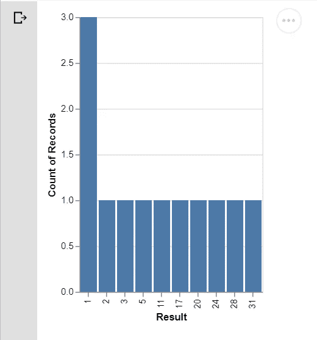

# 轮盘赌桌上的随机会议——有熊猫和牛郎星

> 原文：<https://towardsdatascience.com/a-random-session-at-the-roulette-table-with-pandas-and-altair-9a147471dac3?source=collection_archive---------13----------------------->

最近我去了一家赌场玩，我很好奇，想知道我赢的几率有多大，在给定预算、标准下注金额和下注策略的情况下，我会在赌场呆多久。

所以我决定快速编写一些代码来可视化轮盘赌桌上的随机会话。我在这里编写代码的方式与我在轮盘赌桌上进行游戏的方式完全一样:遵循一个下注策略，在固定的旋转次数下相同的赌注(或者直到我的预算资金用完)。

首先，我们从导入所有必需的库开始:

```
**# Import libraries**import random
import pandas as pd
import altair as alt
from vega_datasets import data
```

这里我们导入了随机包，我们需要它来模拟轮盘赌桌上的随机旋转，pandas 包将我们的结果输出到可读的数据帧中，Altair 包用于快速可视化我们的结果。

接下来，我们初始化我们的全局变量:我为这个环节预算的资金数量，每次旋转的赌注数量，以及轮盘赌的旋转次数。

我为这些变量分别设置了 1000、200 和 24。在这里指定这些变量的好处是，你可以很容易地在这里修改它们(而不是在我们后面要写的函数中)。

```
**# Initialise all the global variables**funds = 1000
bet_amount = 200
num_spins = 24
```

接下来，我们将轮盘游戏会话定义为一个函数。这个函数写得有些复杂，包括下注策略支出。不可否认，这不是编写轮盘游戏函数的最佳方式(更好的方式是遵循面向对象的编程，将不同的下注策略作为轮盘游戏*类*的独立*对象*)，但是让我们将就一下。

```
**# Function for a random session at the Roulette table**def roulette_game(funds, bet, num_spin):
    print("Starting fund is RM" + str(funds), "Bet for each spin is RM" + str(bet))
    count = 0
    wins = 0
    rolls = []
    balance = []

    **# Loop for each Roulette spin**

    for each in range(num_spin):
        if funds >= bet:
            spin = random.randint(0,36)
            rolls.append(spin)

 **# Bond Roulette strategy payout**            if spin >= 19:
                funds += (0.4 * bet)
                wins +=1
            elif spin >= 13 and spin <= 18:
                funds += (0.5 * bet)
                wins += 1
            elif spin == 0:
                funds += (0.8 * bet)
                wins += 1
            else:
                funds -= bet

            balance.append(funds)
            count += 1

        else:
            break **# To stop playing when you've run out of funds**

    win_percentage = wins/count
    print("Rolled " + str(count) + " times, won " + str(wins) + " times! Win percentage is " + str("{:.2%}".format(win_percentage)) + ". Funds remaining = RM" + str(funds))
    return rolls, balance
```

简单介绍一下我使用的下注策略:债券轮盘策略是一种涵盖轮盘上 37 个号码中的 25 个号码(胜率为 67.5%)的策略，如下所示:



Credit for image to [https://www.casinoreviews.co.uk/roulette/strategy/](https://www.casinoreviews.co.uk/roulette/strategy/).

如果球落在数字 13 到 18 上，利润是下注金额的 50%，在这种情况下是 100 令吉。如果落在数字 19 到 36，利润是 40%或 80 令吉。如果落在数字 0 上，利润是 80%或 160 令吉。如果它落在数字 1 到 12 上，我们就输掉全部赌注，在这种情况下是 200 令吉。

然而，像所有轮盘赌策略一样，债券轮盘赌策略无法克服众议院优势，在这种情况下是 2.70%。其他带有附加 00 数字的轮盘赌台的牌局优势甚至更高，为 5.26%。

因此，预计随着房子的边缘，任何球员将最终耗尽他或她的资金后，一个漫长的游戏。但是大多数玩家不会在赌场停留太长时间。

在这里，我们将进行一次测试，总共包括 24 次轮盘旋转(假设每次旋转花费 5 分钟，则相当于 2 小时)。

```
**# Conduct a test session**test1_rolls, test1_balance = roulette_game(funds, bet_amount, num_spins)
df_test1 = pd.DataFrame({‘Roll’:np.arange(1,len(test1_rolls)+1), ‘Result’:test1_rolls, ‘Fund Balance’:test1_balance})print(df_test1)
```

从下面的代码输出来看，这个测试会话似乎并不好:



Not so lucky this time, lasted only 12 rolls before I ran out of funds!

这在图表上看起来怎么样？这里我使用了 Altair，这是我最近发现并喜欢的 Python 可视化工具，因为它易于使用。我只需要几行代码就可以生成如下两个不同的图表:

```
**# Visualise one random session at the Roulette table**alt.Chart(df_test1).mark_line().encode(
 y=’Fund Balance’,
 x=’Roll'
)
```



This chart shows that I got into a losing streak. Like a stock market crash.

```
**# Count frequency of numbers during the Roulette session**alt.Chart(df_test1).mark_bar().encode(
 x=’Result:O’,
 y=’count()’
)
```



It looks like I hit number 1 three times unlucky.

总之，这是一个在轮盘赌桌上可视化随机游戏过程的快速尝试。我最初很想报道游戏的蒙特卡洛模拟，但我认为在牌桌上想象一个单独的随机游戏会更有趣！