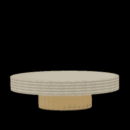

# 使用开源机器学习模型的方法

> 原文：<https://towardsdatascience.com/a-recipe-for-using-open-source-machine-learning-models-within-your-company-1aed833a59b5?source=collection_archive---------20----------------------->

## 一步一步地寻找，评估和使用开源神经网络模型

Photo by [Luca Bravo](https://unsplash.com/@lucabravo?utm_source=unsplash&utm_medium=referral&utm_content=creditCopyText) on [Unsplash](https://unsplash.com/search/photos/machine-learning?utm_source=unsplash&utm_medium=referral&utm_content=creditCopyText)

机器学习继续为越来越多的任务产生最先进的(SOTA)结果，越来越多的公司正在寻找 ML 来解决他们的问题。随着机器学习研究令人难以置信的快速发展，许多这些 SOTA 模型来自开源这些模型的学术和研究机构。通常，使用这些开源模型中的一个来引导您公司内部的机器学习工作，会比从头构建一个模型更有效。

然而，这些模型通常是由研究人员发布的，他们的重点不一定是使他们的模型易于使用和修改(尽管有许多例外)。将这些开源模型用于您的任务可能会非常困难。

在这篇文章中，我的目标是提供一个方法，你可以按照这个方法来评估和使用开源 ML 模型来解决你自己的任务。这些是我在自己的工作中反复使用的步骤(在撰写本文时，我已经建立了超过 15 个开源模型的 anaconda 环境)。由于我的工作主要是将深度学习用于视觉和 NLP，因此我在这里的重点是专门使用基于神经网络的模型。

无论你是试图使用机器学习来解决公司内部的实际问题，还是在家里试验一些有趣的 SOTA 结果，我希望在这篇文章之后，你会有一条通往**的道路，采用开源模型，修改并使用它来解决你自己的数据集的任务。**

# 步骤 1:命名任务

第一步是弄清楚你的特定任务在研究文献中被称为什么，这样你就可以成功地搜索它。这最初可能会非常令人沮丧。例如，寻找图片中一只狗的所有实例将是一个“对象检测”任务。但是如果你想知道图片中哪些像素对应于狗，这就叫做“图像分割”

有几种方法可以尝试解决这个问题。首先，如果你碰巧认识任何 ML 研究者或从业者，一定要从那里开始。另一个选择是在 [r/machinelearning](https://reddit.com/r/machinelearning) 或 [r/learnmachinelearning](https://reddit.com/r/learnmarchinelearning) 中询问。如果这些都不成功，下一步就是尽你所能去谷歌一下。当你看到研究论文时，你会经常在文献中看到与任务相关的名字。

# 第二步:寻找文件和代码

一旦您知道要搜索什么，下一步就是找到那些最适合您的任务的开源模型。这里有一些有用的资源:

[**papers with code**](https://paperswithcode.com/)**:**按任务组织的论文和相关代码的存储库。这是一个非常好的起点，尤其是如果这是一个众所周知的任务。

[**arxiv-sanity**](http://www.arxiv-sanity.com/)**:**很多开源模型都和研究论文有关联。机器学习大部分论文都是(幸好！)公开发表在 arxiv 上。搜索 arxiv 寻找解决您的任务的最新论文是另一个好的起点。并非所有发表的论文都有相关的代码。如果找到喜欢的论文，可以尝试搜索“<论文名称> github”看看代码是否已经发布。

[**Kaggle**](https://www.kaggle.com/)**:**如果恰好有一个任务与你相似的 ka ggle 比赛，这可能是一个获得高质量、最先进模型的好方法。要特别关注以往比赛的获胜者博客，这些博客通常有很好的解释和代码。用来赢得比赛的小技巧通常对你的任务也很有价值。

**数据集基准:**如果有一个基准数据集与您正在处理的任务相似，则该基准的排行榜是一种快速查找具有明显 SOTA 结果的论文的方法。

**Google:** 像图像分割这样的标准/常见任务，搜索“图像分割 github”、“图像分割 pytorch”或者“图像分割 tensorflow”会给你很多结果。

# 第三步:阅读报纸

这可能是令人生畏的，因为学术论文可能很难获得，即使是对有经验的软件工程师来说。但是如果你把注意力放在摘要、介绍、相关工作、结果上，把很多深层的细节/数学推迟到以后的阅读，你会发现你可以从论文中得到很多，对问题有更深的理解。

特别注意他们使用的数据集以及这些数据集或其模型的约束。通常，您会发现约束可能对您不适用，但它们是模型设计的基础。例如，imagenet 的分类模型期望在一幅图像中有且仅有一个显著对象。如果您的图像没有、有一个或多个要识别的对象，这些模型可能不直接适用。这不是你在投入时间建立模型后想知道的事情。

还有，跟着一些参考文献走，尤其是你在多篇论文里看到的！你会经常发现，至少有一篇参考文献非常清晰地描述了这个问题，极大地加深了你的理解。引用的论文也可能变得更有用，并且可能有更好的代码与之相关联，所以在这里做一点挖掘是值得的。

# 步骤 4:确保代码是可用的

一旦你找到了一篇有开源代码的论文，确保它是可用的。具体来说:

**检查许可:**虽然许多代码是在自由开源许可下发布的(麻省理工学院、BSD、Apache 等)，但有些不是。你可能会发现这个模型只有非商业使用许可，或者根本没有许可。根据您的使用案例和公司，代码可能对您有用，也可能对您无用。

**检查框架:**如果你正在使用一个特定的框架(比如 Tensorflow，Pytorch)，检查模型内置的框架。大多数情况下，您会被自己得到的东西所困扰，但是有时候，在您喜欢的框架中会有模型的重新实现。快速谷歌一下这个(例如“<论文名> pytorch”)可以帮你省去很多麻烦。

**检查语言:**类似地，如果模型在 Lua 中，而你不是 Lua 开发人员，这真的很痛苦。看看在你选择的语言中是否有一个重新实现(通常是 Python，因为在深度学习中 Python 应该是你的一部分)，如果没有，你最好找另一个模型。

**检查编码风格**:研究人员并不都是软件工程师，所以你不能像其他开源项目那样有很高的门槛，但是如果代码完全是一团糟，你可能需要寻找另一种模式。

# 步骤 5:让模型运行起来

Results from NVIDIA’s [StyleGAN](https://github.com/NVlabs/stylegan) trained on a custom furniture dataset

一旦你找到了一个你认为合适的模型，试着让它运行起来。这里的目标是按原样运行模型的训练和推理循环，而不是让它在您的特定数据集上运行或进行任何重大修改。您所要做的就是确保您有正确的依赖项，并且模型像宣传的那样训练和运行。为此目的:

**为模型创建一个**[**conda**](https://www.anaconda.com/distribution/)**环境:**你可能在尝试多个模型，所以为每个模型创建一个 conda 环境(假设是 Python)(NVIDIA-docker 在这里是另一个选项，但个人觉得大材小用)。

我经常这样设置我的环境:`conda create -n <name of the github repo> python=<same version of python used by the repo>`

判断回购使用的 python 版本的一个快速方法是查看`print`语句。如果没有父母，那就是 python 2.7，否则 3.6 应该可以。

**安装库:**我*强烈*建议从安装与原始代码用来启动的框架完全相同的版本开始。如果模型说它能与`pytorch>0.4.0`一起工作，不要认为它能与 pytorch 1.0 一起工作。在这个阶段，你不想修复这些类型的错误，所以从`pytorch=0.4.0`开始。您可以用命令`conda install pytorch=0.4.0 -c pytorch`安装一个特定版本的框架(例如 pytorch)。许多代码不会有一个`requirements.txt`文件，所以可能需要一些调查和迭代来找出你需要安装的所有库。

**获取原始数据集并运行脚本:**此时，您应该能够下载原始数据集并运行测试和训练脚本。您可能需要修改一些路径，并使用自述文件和源代码来计算出正确的参数。如果有一个预先训练好的模型，从测试脚本开始，看看你是否得到了与论文相似的结果。

一旦您运行了测试脚本，尝试启动培训脚本。您可能需要处理各种异常，并做一些小的修改才能让它正常工作。训练脚本的最终目标是看到损失随着每个时期减少。

如果是直白的(即。只需要更改一些命令行标志)，此时您可以尝试在自己的数据集上运行训练脚本。否则，我们将在步骤 7 中执行此操作。

# 步骤 6:创建你自己的测试笔记本

在这一点上，您已经确认了模型是有效的，并且您已经设置了能够使用它的合适的环境。现在你可以开始真正地玩它了。在这一点上，我建议创建一个 Jupyter 笔记本，在测试脚本中复制粘贴，然后修改，直到您可以使用它的一个数据项。例如，如果您正在使用一个在图像中找到狗的对象检测模型，您需要一个笔记本，您可以向它传递一张图片并让它输出狗的边界框。

这里的目标是了解输入和输出、它们必须如何格式化以及模型如何准确工作，而不必处理额外的复杂训练或将您自己的数据转换成正确的格式。我建议在 Jupyter 笔记本上这样做，因为我发现能够看到每一步的输出对弄清楚它非常有帮助。

# 步骤 7:用数据集创建自己的培训笔记本

现在您已经对模型和数据有了一些了解，是时候尝试创建一个培训笔记本了。与步骤 6 类似，我首先在训练脚本中复制和粘贴，将其分成多个单元，然后修改它以适合我的需要。

如果您已经对该模型感到满意，您可能希望直接修改培训笔记本，使其适用于您的数据集。这可能涉及编写与模型中现有数据加载器输出相同格式的数据加载器(或者简单地修改这些数据加载器)。如果您还不习惯这样做，可以从让培训脚本在笔记本中按原样工作开始，并删除您认为无用的代码。然后努力让它与你的数据集一起工作。

请记住，这里的目标不是修改模型，即使它还没有完全解决您想要的确切任务。这只是为了让模型与您的数据集一起工作。

# 第八步:开始修改模型以适应你的任务！

至此，您应该有一个可以训练模型(包括输出适当的度量/可视化)的笔记本，以及一个可以测试您创建的新模型的笔记本。现在是开始深入研究并对模型进行修改(添加要素、附加输出、变化等)的好时机，以使其适用于您的任务和/或数据集。希望有一个现有的艺术模型的起点能节省你很多时间，并提供比你从零开始更好的结果。

很明显，在这一步中发生了很多事情，您将使用所有现有的模型构建策略。然而，下面是一些在现有模型基础上构建时可能特别有用的提示。

**在修改模型之前修改数据集:**将数据转换成模型期望的格式通常比修改模型更容易。隔离问题更容易，引入的错误也更少。令人惊讶的是，有时仅仅通过改变数据就可以将模型推进多远。

**尽可能多地重用预训练的模型:**如果你的模型变化不是很大，尝试重用预训练的模型参数。你可能会更快地得到结果和迁移学习的好处。即使您扩展了模型，您也可以经常将预训练的参数加载到模型的其余部分(例如，在 pytorch 中加载模型时使用`strict=False`)。

**进行增量更改并定期检查绩效:**使用现有模型的一个好处是，您对开始时的绩效有所了解。通过进行渐进式的改变，并在每次改变后检查性能，你会立即发现你什么时候犯了一个错误或者走上了一条错误的道路。

寻求帮助:如果你完全被卡住了，试着联系作者，寻求一些指点。我发现他们经常愿意帮助你，但是记住他们是在帮你的忙，请相应地采取行动。

Automatically texturing a 3D model using [neural renderer](https://github.com/daniilidis-group/neural_renderer)

# 步骤 9:归因和贡献

根据许可证和您分发模型的方式，您可能需要向原始代码的开发者提供归属。就算不要求，反正做了也挺好的。

如果你能的话，请贡献你的力量！如果您在自己的开发过程中遇到了错误并修复了它们，提交一个 pull 请求。我相信写得好的错误报告是受欢迎的。最后，如果没有别的事，给作者发一封简短的感谢信，感谢他们的辛勤工作，总是令人感激的。