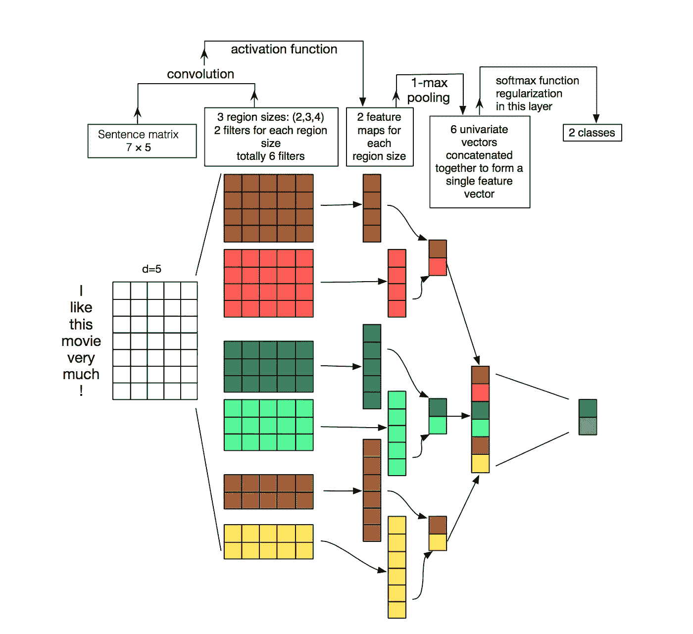

# 救援任务:深度学习可以打击人口贩运的 3 种方式

> 原文：<https://towardsdatascience.com/a-rescue-mission-3-ways-deep-learning-could-combat-human-trafficking-85700eb62be5?source=collection_archive---------39----------------------->

## 深度学习如何阻止现代人类奴役的全球事业。

Figure 1: A 2-Dimensional t-SNE feature model illustrating useful and non-trivial relationships in the Trafficking-10k dataset.

现在是晚上 6 点——阳光透过你后座的窗户，散发出微妙而熟悉的橙色光芒。这是七月的仲夏，你和你的家人开车回到芝加哥紧张的低收入居民区。今天，你的父亲开着车，慢慢地进入有裂缝的车道，直到他到达一个轻松的停车点。当你打开车门时，你被完美的、超凡的、空灵的夏日微风所淹没。最终，灿烂的阳光、23 度的北风和诱人的蓝天最终让你问你的妈妈****我们可以去公园吗？****在这个没有任何气氛压力的日子里，你的母亲提供了一个愉快而响亮的*“是！”*。兴奋地，你和你的妈妈手牵着手，带着纯洁的幸福和天真，像仪式一样漫步到当地的社区公园。操场的平台是用几十年前的混凝土混合物铺成的，它的中心是一个由旧的摇摇欲坠的秋千、单杠和摇摇晃晃的滑梯组成的“临时”迷宫。**

**今天，当地的公园看起来很反常，慢慢地陷入了一个深渊，没有了通常的动物般的孩子们荡秋千、追逐打闹和相互追逐。然而，12 岁的“你”独自拥抱这种沉浸式的探索性游戏和活动的时刻*，而你的母亲坐在离游戏区 12 码远的木凳上。看起来，你的母亲接到了一个令人震惊的电话——是她的一个朋友打来的——所以她站了起来，走到长椅后面大约 4 码远的地方，低头看着地面，全神贯注地进行着私人谈话。你和你的母亲已经参观这个公园*成千上万次了，所以你对这个地方的导航和直觉应该成为你的第二天性。****

**最终，在你从秋千到单杠的过渡过程中，你看到一个中年男子若无其事地向你走来，他穿着一件棕色毛衣和一条破旧的蓝色牛仔裤。几乎同时，他冲向你，抓住你的手，把你扛在肩上，而你则流着惊慌的眼泪向你妈妈尖叫。你妈妈跑步但是不能及时赶到。他把你扔进后座，当汽车驶向你未知目的地的边缘时，他立即锁上车门。最终,“失踪儿童”海报的爆炸在商店、街道和市中心街区的当地公告栏中变得猖獗。**

****

**Figure 2: A conventional galleried array of missing children profiles in a Walmart entrance encouraging inflows and outflows of customers to report significant information.**

**这个家庭在执法文件、地方-州级犯罪网络和过时的青少年绑架数据库方面花费了数千美元和心血，留下了松散连接的关键数据点。商店里的海报和“走失儿童”公告故意等待“合适的人”带着 1。)丰富的信息还是 2。)对关键人口贩运调查的坚定承诺。同时，没有人注意海报上松散联系的信息要点，因为旁观者很少与事件周围的环境有任何相对联系/包含。然而，深度学习(DL)可以在几天内解决一年复杂的人口贩运犯罪调查，方法是将数据置于背景中，对其重要性进行排序，并将最重要的关键点联系起来。最终，DL 有能力改变秘密和非法犯罪企业的边界，人口贩运就是一个显著的例子。**

# ****1。)使用 NLP 对高风险性交易广告进行分类****

**自然语言处理(NLP)通常利用与递归神经网络(RNN)主干分层的长短期记忆(LSTM)模型来将句子的意图、内在含义和信息置于上下文中。LSTM 体系结构通过建立单词的临时记忆状态、对这些单词进行矢量化、并输出句子中意图/背景含义的推断概率来工作。典型地，针对 NLP 的 LSTM 方法已经被实现用于短文本的情感分类。例如，之前的 [Kaggle 竞赛](https://www.kaggle.com/c/jigsaw-toxic-comment-classification-challenge/overview)要求用户检测和分类多类有毒评论(例如 Youtube 评论)，以便对短句进行自动严重性排名。**

****

**Figure 3: A Deep Neural Network (DNN)-based NLP model that uses embeddings for binary classification across a given input sentence.**

**王等人在“ [**一种基于词嵌入的短文本情感分类方法**](https://www.aclweb.org/anthology/O18-1021) ”一文中利用上下文词嵌入来推断社交媒体帖子中的情感。最具活力的用户文本交流平台包括社交媒体平台、短信以及其他相关的快捷交流方式。换句话说，这些平台包含独特的俚语和现代缩写，只为特定的文化/人群所理解。此外，对于深度神经网络(DNNs)，短的 50-100 个字符的信息交换不能为有效的分类提供足够丰富的特征。为了推断和概括短上下文行，研究人员可以利用单词嵌入和 LSTM 模型的组合。单词嵌入充当文本的学习表征，其中具有相似意思的单词/短语具有**相似表征**。单词嵌入模型对松散紧密相关的单词进行矢量化，以用最少的上下文对句子的意图进行分类和概括。**

****

**Figure 4: Word embeddings create sequence-lengthed representations of words in a sentence to eventually create output scores in an NLP model.**

**由于组合的 LSTM-单词嵌入模型在稀缺特征上概括上下文的能力，它在由混杂或少量字符组成的文本情况下提供了潜在的应用。童等人在论文“ [**用深度多模态模型**](https://arxiv.org/pdf/1705.02735.pdf) 打击人口贩卖”中，通过执行词嵌入对人口贩卖押运广告的风险进行向量化和推断。他们创建了新颖的 Trafficking 数据集，为这个监督训练任务浮现了超过 10，000 个带注释的广告。更重要的是，研究小组基本上将这些贩运文本/交流的单词嵌入整合到 LSTM 中，以产生新的上下文感知嵌入。最后，本文使用了一个直观的两步过程，首先从原始文本中提取低级嵌入特征，并通过语言 LSTM 网络将其翻译成上下文感知嵌入。**

****

**Figure 5: A language network processes tokenized input sentences through four LSTM’s into a Convolutional Decision Network to eventually output classification results for the traffick dataset.**

**此外，研究人员创建了一个 2D t-SNE 模型表示的贩运数据集，以证实其在 traffic-10k 中的精细特征分布。t-SNE(t-分布式随机邻居嵌入)模型将三维数据点压缩到 2D 模型中，其中点的聚类表示相似特征的区域。研究人员在下图中说明了他们的基线模型的不同输入特征的离散表示。聚类数据的划分表明，研究人员的新贩运数据集并非微不足道，而是具有可理解和结构良好的特征:**

****

**Figure 6: A 2-Dimensional t-SNE feature model illustrating useful and non-trivial relationships in the Trafficking-10k dataset.**

# ****2。人口贩运出口中的反洗钱****

**洗钱计划涉及犯罪分子通过金融系统循环非法资金，通常用于大规模金融转移，如跨境贩毒集团，在这种情况下，用于人口贩运。估计有 700，000 人被输出到人口贩运行业，这一行业奴役了 4，000 多万人。在人口贩运领域，人口“出口”可互换地被视为流动利润，因为它们在性贩运和与其他人贩子的交易中具有货币价值。虽然命题是 ***非常*** 初步的，但深度学习最有趣的集成涉及到使用图形 CNN 来分析密集/动态的法医金融数据，在韦伯等人的论文“ [**可扩展图形学习反洗钱:第一次看**](https://arxiv.org/pdf/1812.00076.pdf) ”中，反洗钱(AML)使用几种广泛和新兴的技术来理解全球经济中可疑货币的流通。本文扩展了图分析法，以确定实体之间的现金流关系(即网络结构)。在图形分析中，金融系统中的单个账户被表示为顶点，单个交易被表示为边。边和顶点的大小与账户和交易的潜在规模成比例。下图说明了图形分析的动态。**

****

**Figure 7: An illustration of vertice and edge graph analyses, where nodes (the vertices-circles) represent account holders and the edges (connecting lines) represent transactions.**

**对图分析的传统攻击包括通过基于人类的推断来手动绘制顶点和节点之间的关系/边。换句话说，人眼经常负责捕捉个人账户和资产之间的可疑金融关系。然而，在一个大规模的行业中，洗钱每分钟可能涉及数百万个账户处理，这使得一个人/一组人很难定位这些模式。然而，通过采用深度学习和嵌入来矢量化这些账户/财务表示，深度学习模型可以在几秒钟内自动创建和处理这些图表分析。**

****

**Figure 8: An example model for AML employed in a business for real-time alerts based on data analytics.**

**除了在非法金融关系中建立自动图表分析，Weber 等人还强调了 NLP 在 AML 中的实施。最终，NLP 可以实时处理非结构化的异构数据，以产生可疑性得分和可视化，从而加强人类的法医分析。NLP 研究人员可以利用大量更新的数据流，如新闻文章、财务报告、社交媒体和公共/私人欺诈数据库。国际-国内银行可以与执法机构一起实施该系统，以便在长期内做出明智的反洗钱决策。然而，在实际规模上，基于图的学习通过实时事务关系理解呈现出最有希望的结果。下表展示了 Weber 等人的“1M 节点和 9M 边的训练时间和结果”。**

****

**Figure 9: Graph Learning on AMLSim Data (1M nodes, 9M edges)**

# **3.通过酒店识别加快人口贩运调查**

**分散的人口贩卖中心包括旅馆和汽车旅馆。这些都是性交易和劳动力交易的重要场所，可以迅速展开，不留痕迹。然而，本文中最重要的平台是为广告网站保驾护航。护送网站不仅包括被出口或交换的受害者的注释描述，还附上受害者的数码照片，通常以酒店壁纸/家具为背景。在 Stylianou 等人的论文“[**Hotels-50K:A Global Hotel Recognition Dataset**](https://arxiv.org/pdf/1901.11397.pdf)”中，通过实现用于图像归属和标记的 CNN 来识别和操纵酒店图像背景在人口贩运调查中的价值。**

****

**Figure 10: Example of correspondence between query image background and the ground truth prediction in the hotel dataset.**

**该研究团队从 50，000 多家酒店收集了超过 100 万张带注释的酒店房间图像。该数据集由从美国东西部、西欧以及世界各地受欢迎的海岸线延伸的多样化酒店位置组成。Stylianou 等人收集的地点是从旅游网站和酒店房间简介网站中提取的。下图显示了他们集体酒店的地理分布-50K 数据集。**

****

**Figure 11: Global geographic distribution of the hotel dataset- includes the U.S., Western Europe, and notable coastlines.**

**在计算机视觉领域，由于特征提取的性质，场景识别一直是一个主要障碍。当主要特征包括人脸、身体和四肢时，让 CNN 架构提取背景场景对于传统的计算机视觉模型来说是一项困难的任务。该小组使用了在 ImageNet 上预先训练的 Resnet-50 分类网络。Resnet-50 使用残差网络来简化训练，而不管在大型数据分区上训练的极深层。Resnet 架构如下图所示:**

****

**Figure 12: A massive Resnet network which uses a series of Residual layers and convolutions to create easier training.**

**最终，多样化的酒店数据集和基于经典 ImageNet 权重/数据集的深度驱动 Resnet-50 架构相结合，可以让执法部门快速识别整个州/国家的潜在酒店位置和感兴趣区域。此外，由于数据集通过整个北美的图像得到了加强，因此任何由人口贩运计划引起的全国性移动都可以被考虑在内。**

# ****结论****

**人口贩卖的全球剧场是一个超复杂的游戏，包括多层动态的关键人物。更重要的是，坦率地说，人口贩运是一种战略性的经济交易，涉及具有货币价值的人体出口。由于这些转账的金融价值，它已经深深扎根于非法洗钱经济和秘密的在线护送平台。然而，深度学习架构的实施可以将调查时间缩短十倍以上，为执法部门和受害者家属提供更有效的数据保证。通过在文本挖掘、图形分析和图像存储库中大量使用开源数据，模型可以被训练和私人部署，供相关官员及时使用。很明显，随着人口贩卖在 21 世纪变得更加先进，从长远来看，人工智能将会超越它。**

# ****参考书目****

**Stylianou，A. (2019)。Hotels-50K:全球酒店识别数据集。 *Arxiv，*1–8。检索于 2019 年 7 月 8 日，来自[https://arxiv.org/pdf/1901.11397.pdf.](https://arxiv.org/pdf/1901.11397.pdf.)**

**童，E. (2017)。利用深度多模态模型打击人口贩运。1–10.检索于 2019 年 7 月 8 日，来自[https://arxiv.org/pdf/1705.02735.pdf.](https://arxiv.org/pdf/1705.02735.pdf.)**

**王，法学博士。基于词嵌入的短文本情感分类的 LSTM 方法。 *2018 计算语言学与语音处理会议，*214–223。检索于 2019 年 7 月 8 日，来自[https://www.aclweb.org/anthology/O18-1021.](https://www.aclweb.org/anthology/O18-1021.)**

**m .韦伯(2018)。反洗钱的可扩展图学习:初步研究。 *Arxiv，*1–7。检索于 2019 年 7 月 8 日，来自[https://arxiv.org/pdf/1812.00076.pdf.](https://arxiv.org/pdf/1812.00076.pdf.)**