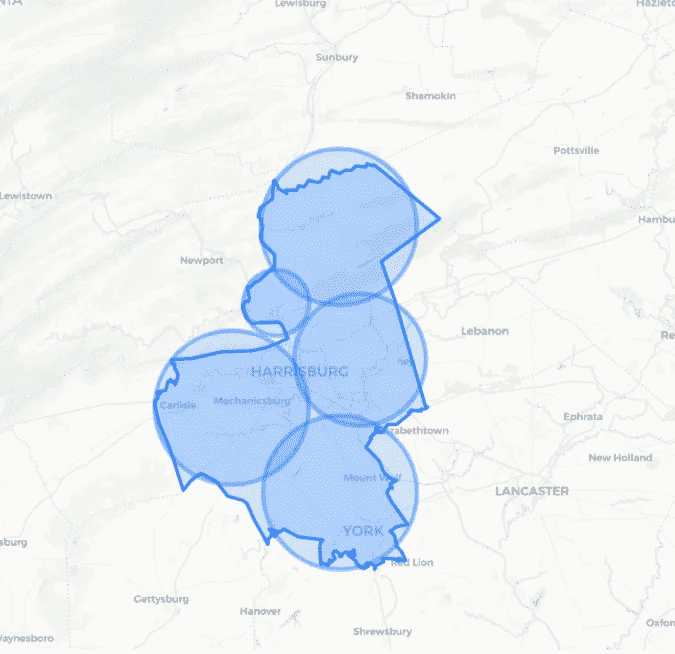

# 基于递归神经网络的推特美国中期选举回顾与预测分析

> 原文：<https://towardsdatascience.com/a-retrospective-and-predictive-analysis-on-2018-u-s-midterms-with-recurrent-neural-networks-858141838921?source=collection_archive---------31----------------------->

尽管几年前曾有怀疑者和批评者，但我猜想**过去几个月里，每个人都感受到了社交媒体在公共辩论舞台上的影响和作用**，涵盖了社会问题、政策制定、政治和政治选举。

然而，这往往只能通过**新闻媒体来体验，这些媒体描述了经济和政治游说**之间极具争议的因果关系或相关性，旨在产生特定的政治影响。有时这是基于客观分析，有时只是基于目击者，甚至只是感知结果..从而导致仍然有争议的权利要求的可论证性。

另一方面，**技术分析在数据科学、**计算机科学和网络科学社区中不断涌现，它们对此进行了大规模的研究。相反，它们通常非常笼统，不能提供正在发生的事情的实际见解。

相反，我想在这里报告的是**在政治背景下的一个简单的数据科学练习**，但是**有一个非常集中的目的，旨在回应*不明显的*问题**。

我们实施了一项分析(意味着一种方法和一种系统),旨在**在 2018 年中期选举期间，在竞争最激烈的 68 个众议院选区中，衡量当地对美国两大政党的支持。**

> 剧透:整个分析实现和结果都有。有关材料和链接，请参见下一页。

# 目标

该分析试图反映**【普通投票】**民意调查，即对特定地区选民的调查，旨在通过询问参与者他们投票给“普通”民主党或共和党候选人的可能性来衡量全国性政党在当地的受欢迎程度。我们收集了包含 68 个竞争最激烈的地区的全国性政党和政治家的推文。我们所说的最具竞争力指的是他们被[库克政治报告](https://www.cookpolitical.com/)评为:**投出**、 **50%-50%** 或**精益**。

这意味着我们正在解决一个极具挑战性的分析和预测问题，而忽略了更简单的情况(每个人都擅长预测显而易见的事情！).

除了这种通用的投票模型，我们还试图捕捉到**“On Ballot”**模型，旨在获得当地候选人的支持，即实际参与国会竞选的候选人。然而，这一模式具有明显的偏见，不能像普通投票模式那样在选举前得到验证。因此，我们只报告第一个分析。

# 数据收集

在这种分析中，查询和提取推文的方法有时会被忽略。但是，查询过程本身可能会引入偏差，这在过程的后期阶段很难检测到，因此需要仔细设计。我们的解决方案采用 *Twitter 搜索 API* 来查询提到国家领导人或政党的推文，这些推文是从有限的地理区域(即每个特定的国会选区)发布的。例如，以下查询提取了关于共和党的推文:

> 特朗普或众议员或共和党人或共和党人或麦克·彭斯或保罗·瑞安或#共和党人或#众议员或 [@realDonaldTrump](http://twitter.com/realDonaldTrump) 或 [@SpeakerRyan](http://twitter.com/SpeakerRyan) 或 [@senatemajldr](http://twitter.com/senatemajldr) 或 [@VP](http://twitter.com/VP) 或 GOP 或 [@POTUS](http://twitter.com/POTUS)

为了将搜索限制在每个国会选区，我们在 API 的搜索查询中使用了 *geocode* 字段，它基于中心和半径的坐标来查询一个圆形区域。由于国会选区的形状不规则，每个选区都需要多个查询，因此我们构建了一组定制的气泡来近似选区的形状(参见图中的 PA-10 区及其近似值)。其他人已经提出了其他方法，这些方法没有将搜索限制在地理标记的推文中，但对于我们的目的来说，这些方法不够精确。

# 分析

为了分析推文，我们采用了递归神经网络，即在推文上训练的 RNN-LSTM 二元分类器。这种架构在包括情感分析在内的许多 NLP 任务中被证明是准确的，因为它能够捕捉单词序列上的依赖性。为了建立训练和测试数据，我们收集了具有明确政治倾向的用户的推文，包括候选人、政治活动家以及不太了解的用户，他们精通政治术语。
在选举日前的 6 个月里，所选账户在**产生了大约 280，000 条推文，这些推文根据作者的政治派别进行标注。
在标记、预处理和标记化之后，我们保留了 15000 个最常用的单词用于进一步分析。所处理的数据训练 128 宽的 Word2Vec 嵌入层来学习令牌的抽象表示。结果被馈送到由两层组成的 RNN，其在超参数优化之后的维度分别是 256 和 64。许多不同的技术被用来调整网络，包括丢弃或者使用第二层来帮助抽象**

Map of the political alignment of the critical districts in 2018 mid-term elections based on geolocated Twitter data.

# 确认

我们首先在选举前验证了我们的方法，通过考虑验证一组 10 个地区，对于这些地区，传统的民意测验给出了有把握的预测(一个政党领先 10%或更多)。在这个集合中，总是预测正确的结果，即，我们的方法获得 100%的成功。
总体而言，我们的推文分类器在随机验证集上达到了 83%的准确率。培训之后，在卡瓦诺听证会的那一周，收集了一套特别具有挑战性的测试；尽管内容奇特，但该模型无论如何都能正确分类超过 72%的推文。通过设定 75%的置信阈值，准确率提高到了 80%左右。
最后，在地区预测层面，我们的解决方案对 68 个最具竞争力的地区中的 60%以上进行了正确分类，识别出 10%的其他地区中非常接近的竞选。

本文基于 2018 年 12 月在华盛顿州西雅图举行的 [IEEE 大数据会议](http://cci.drexel.edu/bigdata/bigdata2018/)上发表的一篇简短的[科学论文](http://10.1109/BigData.2018.8622441)，以及 Antonio Lopardo 之前的一篇媒体文章。进一步的细节可以在文件中找到。

如果你想引用这部作品，你可以这样做:

A.Lopardo 和 M. Brambilla，“用递归神经网络分析和预测 Twitter 上的美国中期选举”， *2018 年 IEEE 大数据国际会议(大数据)*，美国华盛顿州西雅图，2018 年，第 5389–5391 页。doi:10.1109/bigdata . 2018 . 8622441 . URL:【http://ieeexplore.ieee.org/stamp/stamp.jsp?tp=】T2&ar number = 8622441&is number = 8621858

在线运行的原型、项目的完整描述、结果和源代码可在 http://www.twitterpoliticalsentiment.com/USA/[获得。](http://www.twitterpoliticalsentiment.com/USA/)

请注意，该方法是一个通用的政治目的的独立于语言的分析框架，可以应用于任何国家或地方的背景。