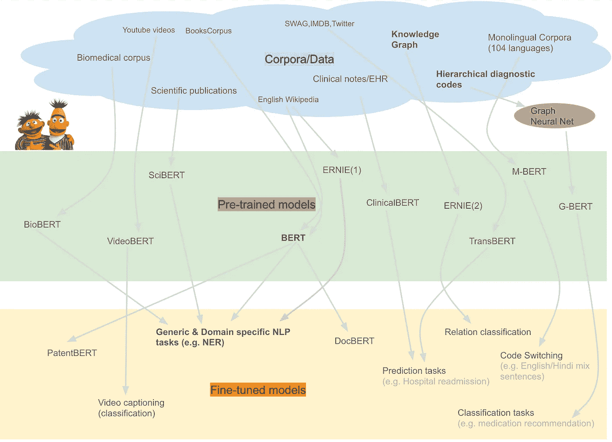
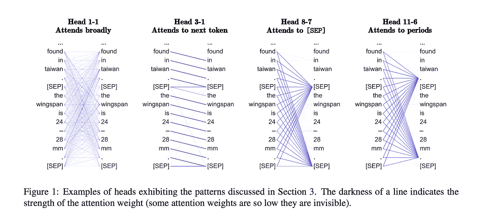
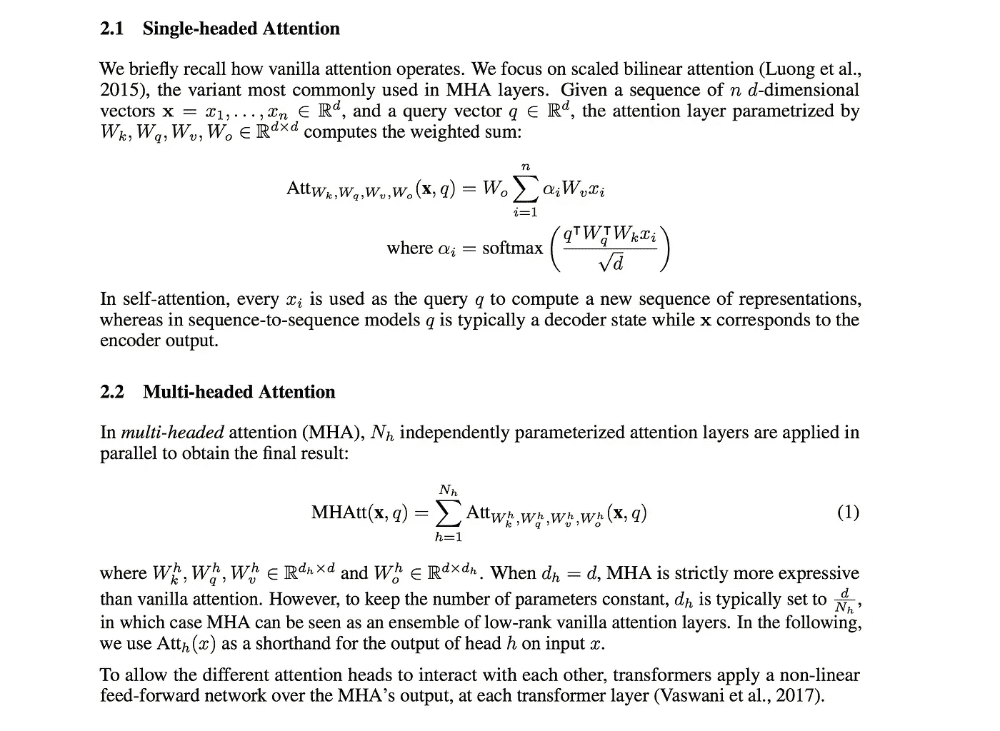
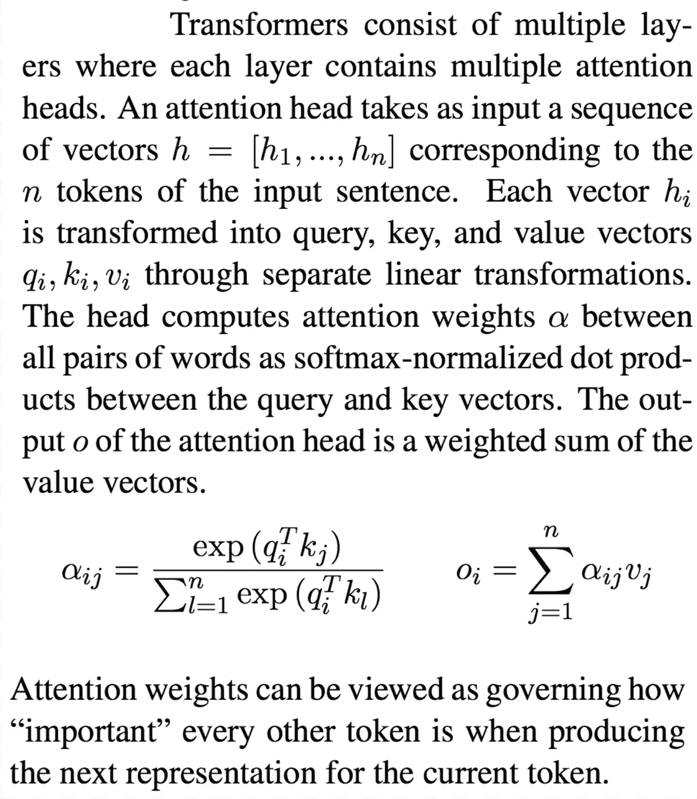
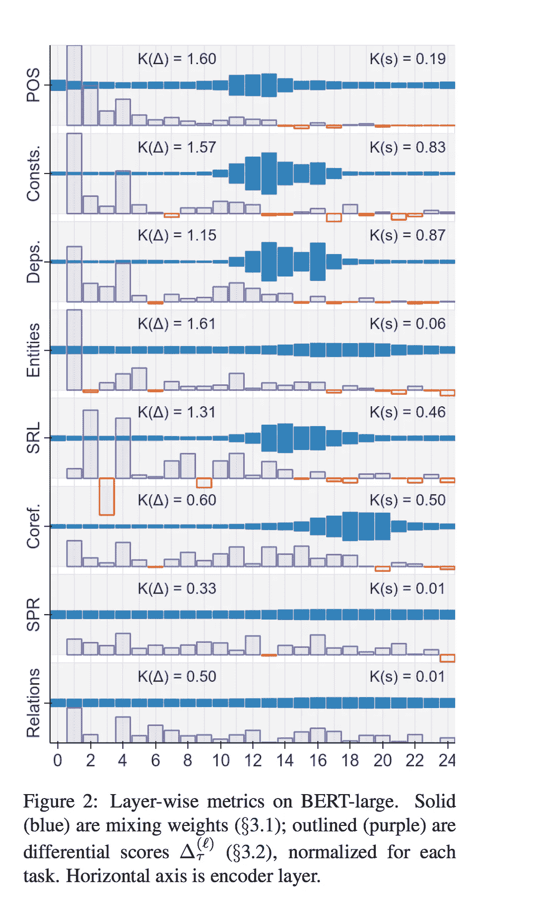
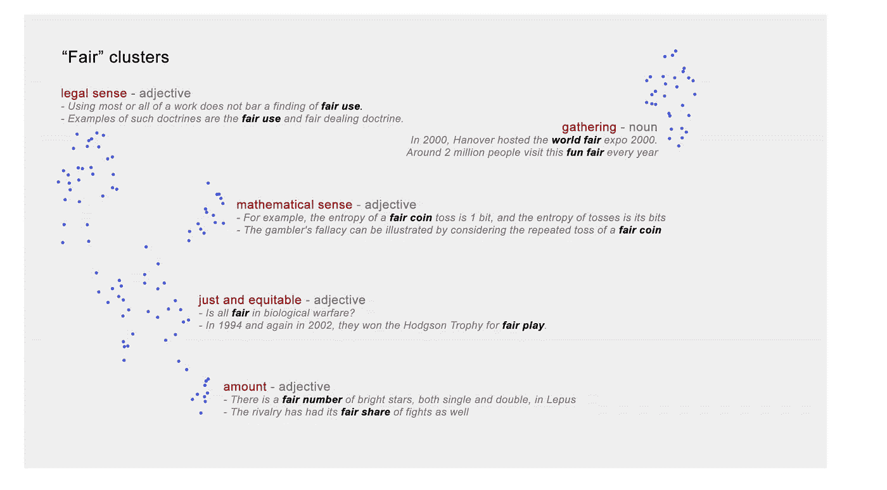
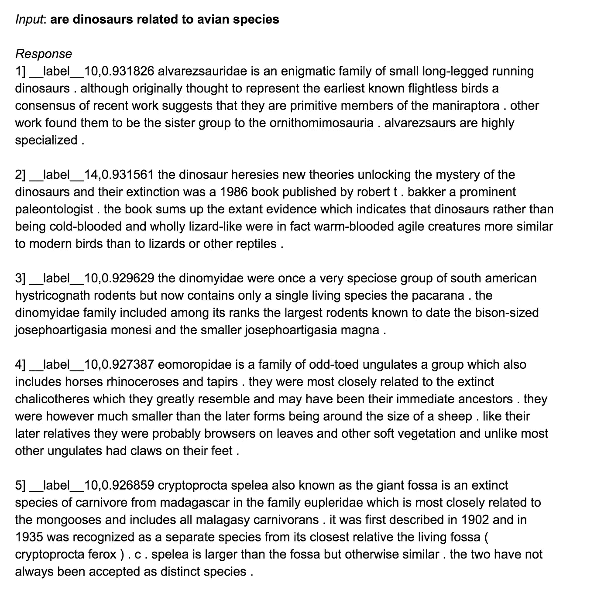
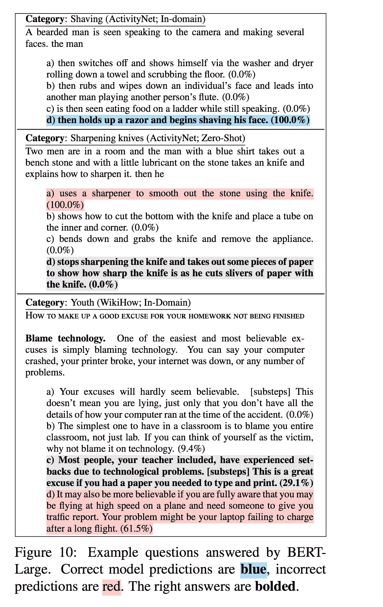

# 基于 BERT 的模型综述

> 原文：<https://towardsdatascience.com/a-review-of-bert-based-models-4ffdc0f15d58?source=collection_archive---------7----------------------->

## 另外:一些最近的线索/见解让伯特变得如此有效

[Image source](https://www.cbc.ca/radio/q/blog/are-bert-and-ernie-a-gay-couple-finally-the-answer-1.4828952) for the BERT & Ernie figures

注意——通过对输入进行加权平均来聚焦于输入的显著部分的简单想法，已被证明是一大类神经网络模型中的关键因素。特别地，多头注意力已经被证明是诸如基于 BERT 和 Transformer 的机器翻译模型之类的最新自然语言处理模型成功的原因。多头注意力——实质上是“*多个注意力头* ***参加*** *到并行输入的不同部分*”，使得复杂功能的表达超越了仅仅一个注意力头的加权平均。

自从 word2vec 产生了如此多的分支模型以来，还没有一个 NLP 模型产生过如此多的分支模型——要么以其名称作为前缀/后缀嵌入其中 *(* [*doc2vec，node2vec，lda2vec*](https://github.com/MaxwellRebo/awesome-2vec) *等等。)*或在其核心思想上展开 *(* [*跳过思想向量*](https://arxiv.org/abs/1506.06726) *s、*[*fast text*](https://arxiv.org/abs/1607.01759)*、*[*Adagram*](https://arxiv.org/abs/1502.07257)*等。)*

BERT 模型值得称赞的是，它的许多分支结合了它的名字和它的核心架构思想。举个例子，

*   **预训练模型**。在领域/应用特定语料库上预处理的模型— [BioBERT](https://arxiv.org/abs/1901.08746) *【生物医学文本】*[SciBERT](https://arxiv.org/abs/1903.10676)*(科学出版物*)[clinical Bert](https://arxiv.org/pdf/1904.05342.pdf)【1】和[clinical Bert](https://arxiv.org/pdf/1904.03323.pdf)【2】*【临床笔记】*。在特定领域语料库上的训练已经表明，当在下游 NLP 任务如 NER 等上对它们进行微调时，会产生更好的性能。对于那些领域，对比微调 [BERT](https://arxiv.org/pdf/1810.04805.pdf) *(在图书语料库和维基百科上训练过)*。
*   在来自 104 种语言的单语语料库( [M-BERT](https://arxiv.org/pdf/1906.01502.pdf) )上预训练的模型，用于零触发跨语言模型转移*(一种语言中的任务特定注释用于微调模型以在另一种语言中评估)*
*   模型在一个大型语料库上进行预训练，该语料库在输入中结合了知识图([厄尼](https://arxiv.org/pdf/1905.07129.pdf))。几乎在同一时间*(2019 年 3 月至 4 月)*发布了另一款车型，令人惊讶的是，它还将知识融入了预训练中。 [ERNIE](https://arxiv.org/pdf/1904.09223.pdf) (2)将知识融入预培训，但通过使用 KG 屏蔽实体和短语。
*   使用三阶段训练方法的模型( [TransBERT](https://arxiv.org/pdf/1905.07504.pdf) ) —无监督，然后是两个监督步骤，用于故事结尾预测任务
*   通过将视频帧表示为特殊的描述符标记以及用于预训练的文本，联合学习视频和语言表示学习的模型( [videoBERT](https://arxiv.org/pdf/1904.01766.pdf) )。这用于视频字幕。
*   一种结合了图形神经网络和 BERT ( [G-BERT](https://arxiv.org/pdf/1906.00346.pdf) )功能的模型，用于医疗/诊断代码表示和推荐。使用 GNNs 对具有分级表示的医疗代码进行编码，并在用 EHR 数据进行预训练期间将其作为输入。然后对其进行微调，以提供医疗建议。
*   **微调型号**。使用预先训练的模型针对特定任务进行微调的模型— [DocBERT](https://arxiv.org/pdf/1904.08398.pdf) (文档分类)、 [PatentBERT](https://arxiv.org/pdf/1906.02124.pdf) (专利分类)。除了这些大部分 NLP 任务 POS，NER 等。如前所述，针对应用领域对预先训练好的基于 BERT 的模型进行微调，以获得更好的结果。

上面的模型只是基于 BERT 的模型的一个子集，代表了广泛的类别。关于 BERT*(arXiv 至今至少 150 篇)*的论文不少。其他几个类是对伯特*(下面讨论)*的探索/可视化，还有几个类研究伯特*(也在下面讨论)的局限性。*还有其他工作，比如在认知神经科学研究中使用 [BERT，这里没有涉及。](https://arxiv.org/pdf/1905.11833.pdf)

一个自然产生的问题是

> 是什么让 BERT 在如此广泛的任务中如此有效？

最近的一组论文试图通过使用各种各样的探针来回答这个问题[【1】](https://arxiv.org/pdf/1906.04341.pdf)[【2】](https://arxiv.org/pdf/1906.02715.pdf)[【3】](https://arxiv.org/pdf/1905.10650.pdf)[【4】](https://arxiv.org/pdf/1905.05950.pdf)[【5】](https://nlp.stanford.edu/pubs/hewitt2019structural.pdf)*(*[*其中的几个在之前的一篇文章*](/deconstructing-bert-reveals-clues-to-its-state-of-art-performance-in-nlp-tasks-76a7e828c0f1) *中有所评述)。*

在我们查看探针之前，快速回顾一下 BERT 模型。

## 伯特模型评论

经过训练的 BERT 模型将句子作为输入，并输出句子中每个单词的向量。它为一个单词输出的向量取决于它出现的上下文。例如，句子“他死于监狱*细胞*”中的单词*细胞*的向量与“血液*细胞*样本被污染”中的单词*细胞*的向量不同。此外，第一句中单词“细胞”的矢量可能更接近单词*的矢量*(余弦距离)*和单词*的矢量，而第二句中的单词*细胞*将更接近*基因的矢量(如下图)*。

BERT 按如下方式构造单词的向量:

*   BERT 具有固定大小的词汇，包括[单词/子单词](https://arxiv.org/pdf/1609.08144.pdf) *(* [*单词块嵌入*](https://arxiv.org/pdf/1609.08144.pdf)*)*——任何输入单词都被映射到这些单词/子单词。例如，一些像“the”这样的常用词，甚至像“quantum”、“constantinople”这样的不常用词都出现在 BERT 词汇表*(base and large model vocab)*——所以这是这些词的直接映射。但是没有电动力学这样的词。所以它被分解成 4 个子词-*electro # # dy # # Nami # # cs*其中这些子词出现在 vocab *中。*此外，固定大小的 vocab 的一个实际优势是，将 BERT 模型加载到 GPU 中不受语料库中唯一单词数量的限制——任何语料库，无论其唯一 vocab 大小如何，都由大约 30k 的子单词 vocab 表示。
*   在训练过程中，BERT 使用其注意力头*(本质上是一组学习矩阵，我们将在下面看到)*和其他变换矩阵*(所有这些也是在训练过程中学习的)*来学习其固定大小 vocab 的矢量表示。然后，在评估/测试期间，通过首先将单词映射到固定的 vocab 单词/子单词，并将单词在输入句子中的位置编码到其表示中，使用经过训练的模型以及其 vocab 的学习向量来动态构建句子中任何单词的向量*。*
*   作为一个具体的例子，考虑“猫和狗是宠物”这句话。所有这些单词都存在于 BERT vocab 中，因此它们不会被分解成子单词。
*   聚焦于单个注意力头部，它将单词“dogs”的向量构建为句子中包括其自身在内的所有单词的向量*(它们的变换版本)*的加权和。本质上，单词“dogs”的向量通过不同的度量 [*被拉得更靠近句子中的所有单词(将向量 A 的小分量添加到向量 B 等于将向量 B 拉得更靠近 A 一点)*](https://www.quora.com/How-does-word2vec-work-Can-someone-walk-through-a-specific-example/answer/Ajit-Rajasekharan) 每个单词向量的量(*例如*)。*“猫和狗是宠物”句子中的“猫”*)对“狗”向量的创建的贡献部分地由注意力头部矩阵*(主导因素)*、“猫”在句子中的位置*(由输入时添加到“猫”的位置编码捕捉)*，以及两个单词向量有多接近*(计算为“狗”和“猫”的向量之间的点积)。*这个步骤值得与 [word2vec 训练过程](https://www.quora.com/How-does-word2vec-work-Can-someone-walk-through-a-specific-example/answer/Ajit-Rajasekharan)进行比较——其中，句子*(例如，狗)*中每个单词的向量被拉得更靠近其相邻单词*(在固定大小的窗口内——比如每边 5 个单词)*，拉的距离由该单词向量与窗口内其他单词向量的接近程度决定。 *BERT 使用单个注意头为句子中的单词创建上下文敏感向量，这与 word2vec 中为单词创建全局向量有些相似，尽管 BERT 考虑了单词顺序和单词位置，最重要的是考虑了邻居(包括其自身)的贡献，这在很大程度上由注意头矩阵决定。*
*   BERT 模型的每一层都有多个注意力头 *(12 个在底部，16 个在大处)*，一个非线性前馈层接收这些注意力头输出，并允许它们在被馈送到执行上述相同操作的下一层之前相互作用。

[figure from ref. 5](https://arxiv.org/pdf/1906.04341.pdf)

*   最后，在论文中对注意头的大多数描述中，我们经常看到*“第三层注意头 1 关注句子中的下一个标记”*这种形式的陈述。虽然这是区分每个头的功能的有用方法，但值得记住的是，在实现中，上面的语句意味着对一个单词的向量输出最大的贡献者是紧随其后的单词。
*   下面的描述用两段简洁的数学形式概括了上面描述的所有内容。关键的一点是，每个注意力头由四个 W 矩阵 *(Wk，Wq，Wv 和 Wo)* 组成，这些矩阵是在训练中学习到的。它们扮演上述角色——Wo 和 Wv 参与单词向量的加权平均，Wq 和 Wk 参与计算权重αi

[Figure from ref. 2](https://arxiv.org/pdf/1905.10650.pdf)

下面描述了单个注意头的等效但可替换的视图，其中矩阵 Wq Wk 和 Wv 被用于输入向量的线性变换，然后加权平均被计算为单词的向量和它的邻居之间的点积。

[figure from ref. 5](https://arxiv.org/pdf/1906.04341.pdf)

## 检查模型学习的内容

不同的探索/可视化提供了伯特模型所学内容的线索/见解

*   [视觉化注意力](https://arxiv.org/pdf/1906.05714.pdf)权重*(上面等式中的αI)*就像我们上面看到的，显示了每个头部在每一层都在关注什么。这些注意力地图对应于[语法和共指](https://arxiv.org/pdf/1906.04341.pdf)的语言学概念。例如，我们发现中心语非常准确地关注动词的直接宾语、名词的限定词、介词的宾语和共同参照的提及。
*   [根据权重](https://arxiv.org/pdf/1906.02715.pdf) *(上述等式中的αI)*[从句子中两个单词之间的每个注意头](https://arxiv.org/pdf/1906.02715.pdf)构造向量*(对于 12 层 12 头 BERT 模型，该向量将是 144 维的)*并且针对句子中的一对单词在该全局注意向量上训练线性分类器，以查看这两个单词之间是否存在关系以及关系的类型，指示句法关系*(一个单词对*
*   使用句子输出向量的特定线性变换，显示了 BERT [在它为句子输出的单词嵌入中近似编码语法树](/deconstructing-bert-reveals-clues-to-its-state-of-art-performance-in-nlp-tasks-76a7e828c0f1)。

[figure from ref. 5](https://arxiv.org/pdf/1905.05950.pdf)

*   对特定 NLP 任务*的每一层的重要性进行评分(例如，POS、NER 等)。)*，表示在网络中基本句法信息被更早地*(较低层)*捕获，随后是更高层的语义信息。这反映在右图中。*(这个观察结果也类似于在 ELMo 模型中看到的情况)*。
*   此外，与句法任务相关的信息似乎更多地局限在几个层中，其中语义任务的信息( [SPR](https://aclweb.org/anthology/Q15-1034) and Relations)通常遍布整个网络*(见深蓝色阴影条)*
*   检查输出单词向量显示，不仅单词的不同含义被捕获在不同的表示中，它们还以细粒度的方式 *(如下所示)*[。](/deconstructing-bert-reveals-clues-to-its-state-of-art-performance-in-nlp-tasks-76a7e828c0f1)

[Example of word sense separation for the word “Fair”](https://arxiv.org/pdf/1906.02715.pdf)

*   由于 BERT 将单词意义分成单独的表示，同时考虑到单词*的位置(例如，在句子“他带着手机去监狱牢房从囚犯那里收集血细胞样本”中，单词“cell”的表示对于每次出现都有不同的意义)，通过简单地将这些单词向量相加而构建的*句子向量对于搜索任务可能是有用的。例如，使用 [bert-as-service](https://github.com/hanxiao/bert-as-service) 我们可以构建句子向量*(在构建句子向量时，我们需要注意不要使用 SEP 和 CLS 令牌)*，这对相似性搜索应用程序非常有用。下面显示了几个例子*(下面每个响应开头的标签是一个调试文本，显示所有响应都是语义相关的。这些句子来自 Fasttext 句子分类测试数据，其中每个句子被分为大约 14 个类别，并带有标签。第二列值“余弦度量”在作为两个句子之间距离的绝对度量时没有用，最多可以解释为显示输入与句子 1 的距离比与句子 2 的距离近多少的度量)*

*   最后，最近的一项工作通过消除*(消融)*注意力头来评估模型在任务中的表现，从而检验所有注意力头是否同等重要。本研究显示 ***在测试时间*** ，对于许多任务，可以移除几个头，而不会显著降低性能。这将导致推断时间的减少。在一些层中，头的数量可以被修剪以只留下一个头。然而，机器翻译更依赖于多头，其中头的使用不是自我关注，而是编码器/解码器层中的多头关注。

## 在出版物中引用的 BERT 模型的一个局限性(可能还有其他的)[【1】](https://arxiv.org/pdf/1905.13497.pdf)[【2】](https://arxiv.org/pdf/1905.07830.pdf)

BERT 及其基于 transformer 的亲戚 GPT-2 最近证明，如果在大型语料库上训练，在句子完成任务*(包括在 Winograd 挑战句子中的适度表现)*方面相当不错。然而，最近构建的句子完成任务显示，如果[句子完成任务](https://arxiv.org/pdf/1905.07830.pdf)需要无法从语料库中收集的世界知识*(常识)*，那么与人类相比，这些模型的表现相当差。下面是一个例子。

[Figure from ref. 3](https://arxiv.org/pdf/1905.07830.pdf)

这也许不是模型的限制。正如 Yoshua Bengio 教授最近提到的那样，这可能是一种指示性的[*(2019 年 4 月 26 日)*，我们需要的模型不仅要通过对输入文本进行训练来学习单词嵌入，还要学习这些单词在环境中的含义*(语言学习和世界建模协同进行)*。这种形式的学习*(称为*](https://youtu.be/IU9cQ1JdC7Y)*)是目前比较活跃的一个研究领域。*

## *参考*

1.  *[可视化和测量伯特的几何形状，6 月 20 日](https://arxiv.org/pdf/1906.02715.pdf) 19*
2.  *[16 个头真的比 1 个头强吗？2019 年 5 月](https://arxiv.org/pdf/1905.10650.pdf)*
3.  *机器能完成你的句子吗？2019 年 5 月*
4.  *[BERT 重新发现经典 NLP 管道 2019 年 5 月](https://arxiv.org/pdf/1905.05950.pdf)*
5.  *伯特在看什么？伯特注意力分析，2019 年 6 月 11 日*
6.  *[在单词表示中寻找语法的结构探针 2019 年 4 月](https://nlp.stanford.edu/pubs/hewitt2019structural.pdf)*
7.  *[BioBERT-用于生物医学文本挖掘的预训练生物医学语言表示模型，2019 年 1 月](https://arxiv.org/abs/1901.08746)*
8.  *[SciBERT:科学文本的预训练语境化嵌入，2019 年 3 月](https://arxiv.org/abs/1903.10676)*
9.  *[ClinicalBert:模拟临床记录并预测医院再入院，2019 年 4 月](https://arxiv.org/pdf/1904.05342.pdf)*
10.  *[公开发布的临床 BERT 嵌入，2019 年 4 月](https://arxiv.org/pdf/1904.03323.pdf)*
11.  *[伯特 2019 年 6 月](https://arxiv.org/pdf/1906.01502.pdf)多语种*
12.  *[厄尼:用信息实体增强语言表达，2019 年 6 月](https://arxiv.org/pdf/1905.07129.pdf)*
13.  *[可转移伯特的故事结局预测 2019 年 5 月](https://arxiv.org/pdf/1905.07504.pdf)*
14.  *[VideoBERT:视频和语言表征学习的联合模型，2019 年 4 月](https://arxiv.org/pdf/1904.01766.pdf)*
15.  *[PatentBERT:通过微调预训练的 BERT 模型进行专利分类，2019 年 6 月](https://arxiv.org/pdf/1906.02124.pdf)*
16.  *[doc Bert—Boer for document class ification，2019 年 4 月](https://arxiv.org/pdf/1904.08398.pdf)*
17.  *[用于药物推荐的图形增强变压器预培训，2019 年 6 月](https://arxiv.org/pdf/1906.00346.pdf)*
18.  *[注意力是(不是)你进行常识推理所需要的全部，2019 年 5 月](https://arxiv.org/pdf/1905.13497.pdf)*
19.  **Github 到源代码的链接在上面列出的大多数论文中都可以作为脚注链接获得**