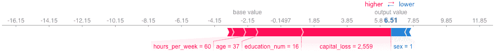

# NeurIPS 2018 综述

> 原文：<https://towardsdatascience.com/a-review-of-neurips-2018-89cf3f38a868?source=collection_archive---------24----------------------->

## 从事金融工作的数据科学家的观点

*苏刘与，R &维数据科学家* [*穆达诺有限公司*](http://www.mudano.com) *，爱丁堡英国*

利用我们的个人发展预算，一个由 Mudano 提出的伟大计划，我和我的同事 Boris 参加了去年在蒙特利尔举行的神经信息处理系统(NeurIPS)会议。这是世界上最大、最著名的人工智能会议，现在已经是第 32 届了，有超过 8500 人参加。注册在几分钟内售罄，所以我们非常幸运地获得了我们的位置！

这是紧张的六天，充满了机器学习所有领域的教程、研讨会和演示。我们了解了最新的前沿研究，以及世界各地的技术公司如何使用和开发机器学习工具。

除了谷歌、脸书和微软这样的大公司，我们还与一些小型创业公司的研究人员进行了有趣的讨论，他们中的许多人所研究的问题与我们在 Mudano 遇到的问题类似。我们还与大型咨询公司和金融服务公司(如 EY 和摩根大通)的数据科学家进行了交谈，了解了他们如何利用数据科学和机器学习。

以下是会议的一些关键主题和我们在这一周学到的东西。

# 可解释性至关重要

随着模型变得越来越复杂，理解和信任它们的需求也在增长。剑桥大学的 Spiegelhalter 教授做了一场精彩的全体会议演讲，他描述了他的团队如何谨慎地使用统计学来解释和验证乳腺癌诊断和治疗建议的算法，从而使患者信任这些模型并确保可能的最佳结果。

在数据科学家处理信用贷款和欺诈检测等问题的金融服务领域，理解机器学习算法所做决策背后的原因也非常重要。在“金融中的人工智能”研讨会上，30 张海报中有超过 10 张致力于模型可解释性的主题。

对于最近的一个原型，我们使用了一个名为' [shap'](https://github.com/slundberg/shap) 的新 Python 库来解释哪些特性在分类问题中起了最大的作用。我们在会议上与其他机器学习研究人员讨论了这一点，他们同意这是一个非常好的库，用于解释本地和全球层面上的功能重要性。该算法通过将博弈论(数学的一个分支)应用于[开发精确的树解决方案](https://arxiv.org/abs/1802.03888)来识别机器学习模型的唯一和一致的特征重要性，以预测每个类别。(在下面的例子中，年龄=37 使候选人更有可能获得贷款。)这将成为我们解释机器学习模型的工具包的一部分。由于‘shap’是一个 Python 库，我们面向客户的数据科学家也可以很容易地访问它。

另一个有趣的方法是使用模型对其输入的敏感度来评估特性的重要性。它在神经网络中特别有用，因为它们本身是可微分的，并且允许导数(灵敏度)的集合来识别模型的局部和全局行为。来自 J.P. Morgan 的作者使用信用卡默认数据集演示了一种基于敏感度的方法，并制作了一个即将发布的开源 Python 包。

解决可解释性的另一种方式是通过使用反事实。在这种方法中，计算翻转分类器结果的输入向量组的最小变化。例如，在确定信贷申请结果的问题中，一旦建立了分类器，我们就可以找到导致相反预测结果的申请人的输入变量集(例如，工资、年龄、以前的申请)的最小变化，并对它们的相对重要性进行加权，以通知申请人他们的申请被拒绝的原因。这是一个非常直观的想法，所以我们将实现这个方法，并与 Mudano 的其他团队分享。

除了可解释性，我们可能感兴趣的其他研究包括如何使用主动学习来分配风险分数，从不平衡数据中重新采样和学习的新方法，使用 textCNN 从基于文本的报告中自动分类客户尽职调查。这些只是几个例子，我们正在筛选会议文件，寻找其他有趣的想法。

# 机器学习需要软件工程师

机器学习即服务在过去几年中获得了巨大的吸引力。我们与一些成功的初创公司进行了交谈，包括 Element AI、Borealis AI 和 Stratigi，它们已经从咨询公司发展成为机器学习软件提供商。

这些公司识别市场需求，并制造机器学习产品，然后出售给他们的客户。这意味着一个产品可以卖给多个买家，让 R&D 的研究人员有时间进行更多的创新研究，并领先于竞争对手。

这些成功公司之间最显著的共同特征是，机器学习研究得到了软件开发人员和数据工程师团队的良好支持，他们可以构建健壮、高效和适销的产品。这是因为，虽然机器学习科学家花了数年时间来研究和开发前沿算法，但数据工程师和软件开发人员花了类似的时间来构建完全开发的产品，这些产品在所有类型的平台上都是高效、紧凑和健壮的。他们能够在机器学习科学家花费的一小部分时间内将原型投入生产，因为这是他们的专长所在。

在 QuantumBlack(麦肯锡公司的子公司)，开发人员与数据科学家的比例约为 1:1，而在一些更基于产品的公司，这一比例接近 2:1。充分利用前沿研究需要专家工程师的支持，他们可以开发产品并构建安全的基础设施。

# **Deepmind(和其他人)**

不出所料，一些最好的演讲来自 Deepmind，尤其是他们与穆尔菲尔德医院在视网膜疾病的[检测中的合作，该论文发表在 9 月份的《自然》杂志上。就在会议之前，Deepmind 推出了](https://deepmind.com/blog/moorfields-major-milestone/) [DeepFold](https://github.com/largelymfs/DeepFold) ，这是一种经过预先训练的高效蛋白质结构搜索模型，在药物发现中至关重要。

鲍里斯会见了 AlphaZero 团队，该团队负责创建一个强化学习自主代理，该代理在没有任何先验知识的情况下，掌握了最复杂的两人完全可观察零和游戏——围棋、国际象棋和五子棋。该算法开始随机与自己对弈，然后学习一个策略，在给定当前位置的情况下，哪些移动最有希望，以及一个估计每个位置获胜概率的值函数。然后它重复这个过程，这一次使用学习到的策略和值函数来与自己对抗。然后，它再次重新训练，四个小时(和数百万次游戏)后，它比任何人类或人类制造的国际象棋引擎都强。

AlphaZero 团队透露了一些以前不为人知的信息——他们的测试游戏是一种较小规模的围棋游戏，通常由初学者玩，但远未被职业选手解决。这个游戏被认为几乎和国际象棋一样复杂，但 AlphaZero 完全学会/解决了这个游戏，用白色获得了 100%的胜率。

全体会议是关于人工智能和机器学习的更一般的方面。我们参加了关于如何与公共决策者互动，如何使研究具有可重复性，以及机器学习将如何影响软件开发的会谈。其中一个最吸引人的演讲是关于神经系统外的生物电计算，比如如何通过修改离子通道来创造多头蠕虫。这完全超出了传统机器学习的范畴！这些演讲邀请我们思考人工智能在社会中的作用，提醒我们研究需要严谨才能可信，并跳出框框思考——并对未来感到兴奋！

# 穆达诺大学机器学习研究的未来

机器学习，特别是深度学习，现在已经达到了一个成熟的水平，可以用来解决许多行业问题。在广泛的学科领域，研发仍在快速推进，但在 NeurIPS 2018 上几乎没有突出的关键主题:

1.  由于在国际象棋、扑克和围棋等游戏中的成功，强化学习现在是一个主要领域，有超过四次会议专门讨论它，并且有最多的研讨会出席。从这个领域的投资金额来看，我们可以看到它有一个长远的未来。
2.  人们对可解释的人工智能更感兴趣，这导致了因果学习的教程和研讨会，这是一个与穆达诺非常相关的领域。
3.  我们需要一种一致的方法来处理模型和数据中的不确定性，人们对贝叶斯方法有着持续的兴趣和研究。

在接下来的几个月里，我们将深入研究这些主题，并发展我们对如何应用它们来解决 Mudano 中的机器学习问题的理解。

我们很幸运在苏格兰有许多世界领先的机器学习研究人员，特别是在爱丁堡大学的信息学系。我们在会议上遇到了他们中的一些人，并了解了他们的研究兴趣，包括强化学习、多任务学习和贝叶斯网络。

他们总是乐于接受新思想，他们的许多博士生都有工业赞助人。这可能是一种与大学建立更紧密联系的方式，并为 Mudano 带来知识和专业技能。

# 结论

我们在蒙特利尔度过了一段美好的时光，这是一个美丽的城市，有着迷人的法国风情。这是忙碌的一周，但也很有趣。这次会议的规模使得会见许多有趣的人成为可能，不管他们在哪个领域工作。我们在演示中也玩得很开心:在其他事情中，人们展示了他们的人形机器人如何响应语音命令来捡起东西；如何使用 ML 教人们演奏巴赫赋格曲，如何学习玩竞争性对抗游戏，以及如何使用 ML 学习跳舞，实时 2D/3D 超分辨率。

It’s Boris’ chessboard!

尤其是鲍里斯，他玩了许多国际象棋和围棋游戏(并且赢了大部分游戏！)并一路结交了朋友。一位国际象棋和围棋选手是德国情报研究员，专注于密码学问题。他提出了一个有趣的见解，即如果你关心你的秘密~15 年后，那么目前的加密方法是不够的。

基本原理是，当前的加密方法可以很容易地被 500-2000 台量子位计算机破解，这些计算机预计将在 15 年内问世，攻击者可能会耐心地存储您当前的加密通信，并知道他们在以后能够解密它们。并非一切都是暗淡的，因为抗量子攻击的方法已经存在。

这次旅行给了我们一个与深度学习社区互动的绝佳机会。我们了解了最有趣的问题是什么，谁是特定领域的领导者，以及数据科学公司正在做什么。所有这些在家里都很难学会。这无疑拓宽了我们的视野，也必将为 Mudano 的数据科学和机器学习增添价值。