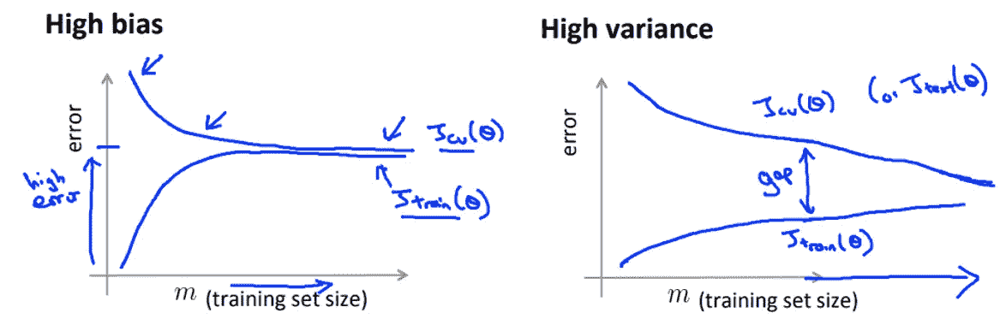
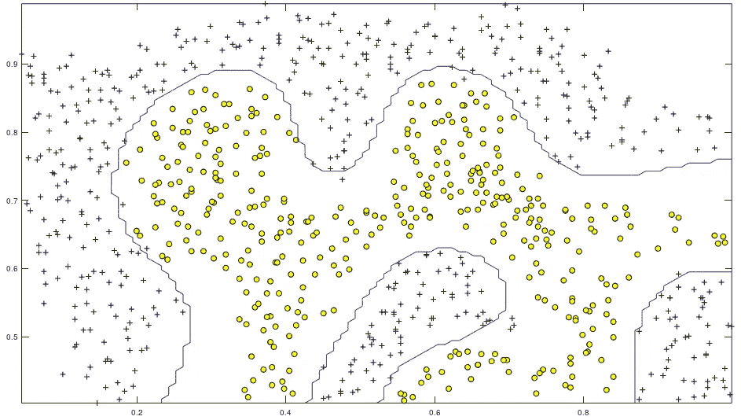

# 斯坦福大学机器学习认证述评

> 原文：<https://towardsdatascience.com/a-review-of-stanfords-machine-learning-certification-9614ebee2b06?source=collection_archive---------13----------------------->

## 在快速变化的数据科学环境中，这仍然值得吗？

Photo by [Andrew Neel](https://unsplash.com/@andrewtneel?utm_source=medium&utm_medium=referral) on [Unsplash](https://unsplash.com?utm_source=medium&utm_medium=referral)

作为最受欢迎的大规模数据科学开放在线课程(MOOC)之一，注册人数超过 260 万(截至 2019 年 11 月)，目前平均用户评分为 4.9/5……毫无疑问，斯坦福大学通过 Coursera 提供的机器学习认证是一个巨大的成功。

毫无疑问，这在一定程度上要归功于该课程的创始人吴恩达的卓越能力，他将 ML 的一些更复杂的方面简化为直观和易于学习的概念。

然而，当我开始学习这门课程时，我有两点保留意见:

1.  这个课程是 2011 年制作的，它仍然有用吗？
2.  我会重复我已经知道的事情吗？

关于后者，在 2018 年夏天，我很幸运地获得了一笔赞助，随后成为一名数据科学家，在我的雇主已经工作了近三年的一份大合同上研究自动化的 NLP(手动，有一个大团队)。这是一个惊人的机会，也是我目前大部分知识的来源。

在本文的剩余部分，我想回答这两个问题，并概述一下对这门课程的期望。

## 这门课程包括什么？

这门课程涵盖了 ALOT，它设法在一个看似很短的时期内塞进了大量惊人的细节。这并不是说它缺乏深度，事实上，我认为材料的深度是这门课的优势。

您将涉及线性和逻辑回归、矢量化、正则化、神经网络、前馈和反向传播(这非常好)、成本函数、网络初始化、支持向量机、降维、监督/非监督学习、主成分分析(PCA)、K 均值聚类、异常检测、推荐系统等等。

还有许多关于应用机器学习的建议，例如诊断偏差与方差误差，实施训练验证测试集，如何测量模型性能(准确度、精确度、召回率和 F1 分数)，哪些算法在大量/缺乏数据的情况下工作得更好，以及如何调整所述算法以更好地适应我们的需求和/或情况。

# 我的经历，一周又一周

## 第 1 周—简介、线性回归和线性代数

这个星期是相当直接的，我认为这是一个很好的介绍，特别是如果你有一段时间没有学习或研究数学的话。还有一些简单的逻辑问题和对统计学和机器学习基础的介绍，如分类对回归和监督对非监督学习。

本周的评估非常简单，只有两个小测验。还有一个关于线性代数的选修课。我认为，即使你对线性代数很熟悉，浏览一下这一部分也是很好的，因为我发现吴安迪有时会以不同于我通常思维的方式解释事情，我相信从尽可能多的角度理解概念总是有用的。

## 第 2 周—更多线性回归，Octave(或 MatLab)介绍

本周我们来看看多元线性回归。从单变量线性回归到多变量线性回归并不难，我不认为许多人会觉得这太难。

还有一个我以前从未使用过的正规方程的介绍，同样，这并不难，但使用起来很有趣！本周最具挑战性的部分是在第一次编程任务中将它翻译成 Octave 代码。

当然，在分配任务之前，我们会被介绍给 Octave(或者 MatLab，如果你喜欢的话)。Octave 是简单的开源 MatLab，所以如果你使用过 MatLab(或者 Python，语法非常相似)，它很容易上手。

## 第 3 周—逻辑回归，规范化

我认为这是课程开始学习更复杂概念的地方。在这里，您将涵盖许多重要的 ML 概念，如分类、假设、决策边界、成本函数、梯度下降(以及高级优化技术的简要介绍)、多类分类、过度拟合、调节等。

这一周并不太难，但我认为它涵盖了许多重要的话题，所以这肯定是至关重要的一周。本周真正的焦点是逻辑回归，线性回归之后是一个很好的(不太难)进步！

编程任务很简单，但由于我的代码中的小错误*(想想(1/n*x)而不是(1/n)*x)* ，我确实被卡住了，令人尴尬的是，我花了比我想承认的长得多的时间来解决这个问题…

## 第 4 周——神经网络:表现

本周我们从两个动机视频开始，着眼于非线性假设和神经网络与大脑神经元之间的暗示。

本周余下的时间将深入探讨神经网络是如何工作的，安迪在本周出色地解释了神经网络背后的直觉。

本周以另一个编程任务结束。这个比较复杂，但是不太难，我发现它很有趣！

## 第 5 周——神经网络:学习

在本周，我们将触及成本函数(再次简单地)和反向传播。前半部分是反向传播，背后的数学和直觉。第二部分是如何检查我们是否正确实现了它(梯度检查，非常有用)以及我们如何/为什么随机初始化网络权重。

这周很难熬。尽管我在大约一年前使用 NumPy 报道过这个问题，但我发现我已经忘记了除了对正在发生的事情的高层次理解之外的一切。反向传播直觉很难。只有当我完成编程任务时，我才意识到我对这个算法的直觉是多么的少。

我发现不断重复你所采取的步骤真的很有帮助。通过纸上的前馈和反向传播步骤，检查数组维数如何随着每一步而变化，并试图理解它为什么工作。

## 第 6 周—应用机器学习的建议

令人惊讶的是，正是在这一点上，我的第二个保留意见是“我会重温我已经知道的东西吗？”上来了。然而，我发现自己真的受益于这一周，因为我觉得重做这些材料真的是在我之前的经验上的复合。

A relationship that explained a lot, was very simple, but I had simply never seen it displayed visually before.

此外，安迪优雅地详述了每一个优化概念背后的利弊，并将其与数学符号联系起来，这种方式非常棒。虽然我知道这个概念，但我以前从未真正用符号来看它们。总的来说，这是非常好的一周。

## 第 7 周—支持向量机

这是我第一周没有真正了解这个主题。我知道支持向量机，我知道它们相对简单，但是我以前没有真正使用过它们。尽管如此，因为我怀疑支持向量机背后的理论和数学很简单，所以我在几个工作日晚上度过了这个星期。

我很享受这一周，我还在从第五周的恢复中，所以缺乏强度是一种解脱。它很好地涵盖了支持向量机背后的直觉，还引入了高斯核，这也是我意识到但却无意识地回避的东西。我发现关于何时何地使用支持向量机的部分及其背后的直觉特别有用。

The SVM model decision boundary built during the programming exercise.

编程练习可能太简单了，我本来想手动实现一个 SVM 模型，但我们只是定义了一个高斯核函数，这非常简单。练习的后半部分很有趣(但也很简单)，因为我们使用支持向量机来研究垃圾邮件分类。这让我想起了我在介绍中提到的许多大型商业 ML 项目，其中我使用递归神经网络(RNNs)和 word2vec 以及其他多种方法来分类客户电子邮件，这很酷！

## 第 8 周——无监督学习

我这周还没有接触过无监督学习。我知道 K-means 聚类背后的基本概念，但仅此而已。我意识到的第一件事是 K-means 超级简单，这是一种解脱！优化本质上与高斯核函数相同(现在我想到了许多其他优化函数)。尽管如此，它还是非常有趣，我可以看到它非常有用。

后半周看主成分分析(PCA)。在高层次上，我对此有一些了解，但非常少。我曾经使用过一个叫做 t-SNE 的改进版本来进行单词向量可视化，但是从来没有深入研究过它的内部工作原理。就这门课的范围而言，我认为 PCA 已经讲得很好了，而且也不太难，我怀疑这很大程度上是由于吴恩达的深刻理解和教学能力。

最后，编程练习并不太难。我发现编码逻辑比第 6 周和第 7 周稍微难一点，但也不太难。我发现这个练习对于完成 K-means 和 PCA 非常有用。

## 第 9 周—异常检测和推荐系统

同样，我对本周的内容没有真正的经验。前半部分着眼于使用高斯和多元高斯分布(或密度估计)的异常检测。这非常直接，但非常有用，我打算测试实现异常检测的多元高斯分布，作为我经常使用的数据分析工具的附加功能！

本周后半周将重点讨论推荐系统。就我个人而言，我不认为我会发现这很有用，但它肯定很有趣，我喜欢学习复杂程度越来越高的几种算法的形式。

## 第 10 周和第 11 周

这两周很短，没有编程作业。更多的是整理和总结我们已经学过的东西。我在从北京到伦敦的长途飞行中完成了这两个星期！幸运的是，因为没有编程作业，你可以下载视频，并从你的手机上完成 2 个测验，这太棒了！

虽然很短，但我仍然发现 10 和 11 都很有用，是结束课程的一个很好的方式。

# 结论

一个优秀的，全面的机器学习基础。优点包括:

*   涵盖了广泛的 ML 方法
*   不害怕解决数学问题，吴恩达在教授直觉方面非常出色
*   课程的重要部分集中在神经网络基础上
*   惊人的覆盖如何实际应用方法和大多数 ML 工程师的典型陷阱

骗局

*   后来的编程任务有时过于抽象，后来的几周感觉像是，*写一个计算，让其余的预写代码做繁重的工作*。

最终赞成/反对

*   编程作业是在 Octave 中完成的——这是一个允许学习者绕过许多其他语言可能出现的语法/逻辑问题的程序。但这是一个缺点，因为它不是一种在行业中特别广泛使用的语言…

总的来说，我相信在课程结束时，会有更具挑战性和更深入的作业，但除此之外，我真的很喜欢这门课程，我觉得我从中受益匪浅。我强烈推荐任何想进入 ML/数据科学或者想巩固基础的人。

请让我知道你的想法或在下面的回复中提问！

*在这个课程之后，我开始了 IBM 的高级数据科学专业化，如果您对我在第一个课程中的关键收获感兴趣，请参见这里:*

 [## 对 IBM 可伸缩数据科学基础的回顾

### 我的想法是，在 IBM 的高级数据中，对可伸缩数据科学基础中的关键概念进行分解…

towardsdatascience.com](/a-summary-of-the-advanced-data-science-with-ibm-specialization-1-4-5caf48c011df) 

谢谢，