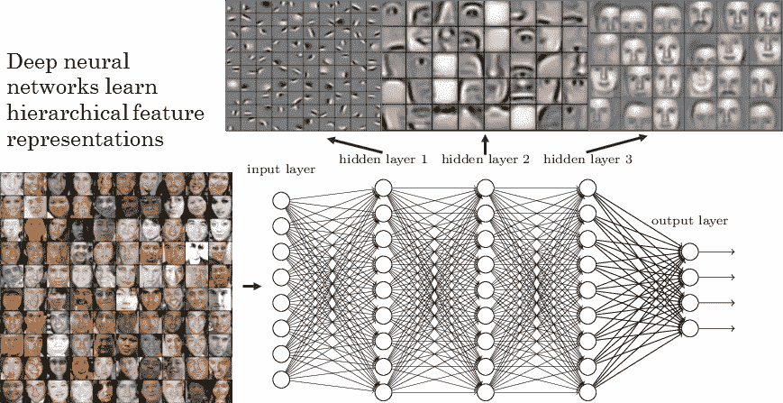

# 深度学习的路线图

> 原文：<https://towardsdatascience.com/a-road-map-for-deep-learning-b9aee0b2919f?source=collection_archive---------11----------------------->

深度学习是机器学习的一种形式，它允许计算机从经验中学习，并从一个概念层次中理解事物，其中每个概念都是从一个更简单的概念中定义的。这种方法避免了人类指定计算机需要的所有知识的需要。概念的层次结构允许计算机学习复杂的概念，通过许多层的深层设置将它们建立在彼此之上。

# 第 1 部分:应用数学

当谈到学习深度学习时，你需要学习的第一件事是应用数学，这是深度学习的基本组成部分。

## 线性代数

线性代数是数学的一个分支，广泛应用于整个工程领域。然而，由于它不是离散数学的一种形式，许多计算机科学家对它没有多少经验。对线性代数的良好理解对于理解和使用许多机器学习算法是必不可少的，尤其是那些涉及深度学习的算法。

**线性代数要知道的话题:**

标量、向量、矩阵、张量、乘法矩阵和向量、单位矩阵和逆矩阵、线性相关性和跨度、范数、特殊矩阵和向量、特征分解、奇异值分解、Moore-Penrose 伪逆、迹算子和行列式。

## 概率和信息论

概率论是我们用来表示不确定性的数学概念。它提供了一种量化不确定性的方法。在人工智能应用中，我们主要以两种方式使用概率:

*首先，它告诉我们我们的人工智能系统应该如何推理。*

*第二，我们可以用概率和统计来分析人工智能系统的行为。*

**从概率上知道的话题**:

随机变量，概率分布，边际概率，条件概率，条件概率链规则，独立性和条件独立性，期望，方差和协方差，常见概率分布，常用函数的有用性质，贝叶斯规则，连续变量，信息论，概率模型。

## 机器学习的数值计算

机器学习算法几乎总是需要大量的数值计算。这通常指的是 ML 算法用来解决数学问题的迭代过程。常见的操作包括优化(找到使某个函数最小化或最大化的值)以及求解线性模型和方程组。

**机器学习中数值计算的学习主题:**

溢出和下溢、调节、基于梯度的优化和约束优化

## 机器学习基础

深度学习实际上是一种特殊的机器学习。要理解深度学习，必须对机器学习有扎实的理解。您需要了解诸如什么是学习算法(如线性回归算法)、如何使数据适合该算法、在数据中寻找模式以及超参数调整等内容。机器学习最终只是非常复杂的应用统计学，它使用计算机，因为它们可以更容易地估计复杂的函数。

**机器学习要学习的主题:**

学习算法、容量、过拟合和欠拟合、超参数、验证集、估计器、偏差和方差、最大似然、贝叶斯统计、监督学习算法、非监督学习算法、随机梯度下降和构建机器学习算法

# 第 2 部分:深度学习现代实践

深度学习为监督学习提供了一个强大的框架。通过创建一个神经网络，并在每一层中添加更多的层和更多的单元，你就有能力表现越来越复杂的功能。

## 深度前馈网络

深度前馈网络，也称为前馈神经网络，或多层感知器，是典型的深度学习模型。这些前馈网络之一的目标是逼近某个函数 f。

**从深度前馈网络学习的主题:**

基于梯度的学习、隐藏单元、架构设计、反向传播和其他差分算法

## 深度学习的正则化

机器学习中的一个常见问题是如何创建一个不仅对训练数据，而且对新输入都表现良好的算法。ML 中的许多策略旨在减少测试错误，通常以增加训练错误为代价。这些策略被称为正规化。深度学习的众多目标之一是开发更有效的正则化策略。

**深度学习正则化要学习的主题:**

参数范数罚分、作为约束优化的范数罚分、正则化和欠约束问题、数据集扩充、噪声鲁棒性、半监督学习、多任务学习、早期停止、参数捆绑和参数共享、稀疏表示、打包和其他集成方法、丢弃、对抗训练、正切距离、正切 Prop 和流形正切分类器。

## 训练深度模型的优化

深度学习模型在许多方面都涉及到优化。例如，主成分分析等模型中的推理涉及到解决优化问题。深度学习中最困难的优化问题是神经网络训练问题。

**深度模型训练优化要学习的主题:**

学习与纯优化、神经网络优化的挑战、基本算法、参数初始化策略、具有自适应学习速率的算法、近似二阶方法、优化策略和元算法

## 卷积神经网络

卷积神经网络是一种专门用于处理数据的神经网络，具有已知的网格状拓扑。这方面的例子有时间序列数据，它可以被看作是以规则的时间间隔采样的一维网格，我们也有图像，它可以被看作是二维像素网格。卷积是一种特殊的线性运算。

**CNN 需要学习的主题:**

卷积运算、动机、池化、卷积和池化、基本卷积函数的变体、结构化输出、数据类型、高效卷积算法以及随机或无监督特征

## 递归神经网络

递归神经网络是用于处理顺序数据的神经网络家族。这些与 CNN 非常相似，事实上它是专门用于处理网格值的，但是它们使用一个系统来处理一系列值，并对它们进行归纳。

**学习 RNNs 的话题:**

展开计算图、双向 rnn、编码器-解码器序列到序列架构、深度递归网络、递归神经网络、长期依赖性的挑战、回声状态网络、泄漏单元和多时间尺度的其他策略、长短期记忆(LSTM)和其他门控 rnn、长期依赖性的优化、显式记忆

## 深度学习方法论

成功应用深度学习技术需要的不仅仅是对现有算法和解释它们如何工作的原理的良好知识。在机器学习系统的日常开发过程中，实践者需要了解是否要收集更多的数据、增加或减少模型的复杂性、添加或删除特征、改进模型的优化、改进模型中的近似推理或调试模型的实现等等。所有这些都非常耗时，因此能够确定正确的行动方案非常重要。

**深度学习方法论主题:**

性能指标、默认基线模型、确定是否收集更多数据、选择超参数以及调试策略

## 深度学习应用

深度学习可用于解决计算机视觉、语音识别、自然语言处理和其他领域的应用。当涉及到设计算法时，这些任务中的每一个都需要某种程度的专门化。

**深度学习应用需要学习的主题:**

大规模深度学习、计算机视觉、语音识别和自然语言处理

# 第 3 部分:深度学习研究主题

这一节将只列出更有雄心和更先进的深度学习方法的主题。

## 线性因素模型

概率 PCA 和因子分析、独立分量分析(ICA)、慢特征分析、稀疏编码和 PCA 的流形解释

## 自动编码器

欠完整自动编码器、规则化自动编码器、代表性能力、层大小和深度、随机编码器和解码器、去噪自动编码器、具有自动编码器的学习流形、收缩自动编码器、预测稀疏分解以及自动编码器的应用

## 表征学习

贪婪的逐层无监督预训练、迁移学习和领域适应、因果因素的半监督解开、分布式表示、深度的指数增益以及发现潜在原因的线索

## 深度学习的结构化概率模型

非结构化建模的挑战，使用图形描述模型结构，从图形模型中采样，结构化建模的优势，了解依赖关系、推理和近似推理，以及结构化概率模型的深度学习方法

## 蒙特卡罗方法

抽样和蒙特卡罗方法，重要性抽样，马尔可夫链蒙特卡罗方法，吉布斯抽样，以及分离模式之间混合的挑战

## 配分函数

对数似然梯度、随机最大似然和对比散度、伪似然、分数匹配和比率匹配、去噪分数匹配、噪声对比估计和估计配分函数

## 近似推理

作为优化的推理、期望最大化、映射推理和稀疏编码、变分推理和学习以及学习的近似推理

## 深度生成模型

波尔兹曼机器、受限波尔兹曼机器、深度信念网络、深度波尔兹曼机器、用于实值数据的波尔兹曼机器、卷积波尔兹曼机器、用于结构化或顺序输出的波尔兹曼机器、其他波尔兹曼机器、通过随机操作的反向传播、定向生成网络、从自动编码器抽取样本、生成随机网络、其他生成方案以及评估生成模型

所有这些信息将导致对深度学习的超级坚实的理解:

以下是一些资源，涵盖了大部分(如果不是全部)上述主题:

[伊恩·古德菲勒的深度学习书籍](https://amzn.to/2PdwiXC)

[神经网络和深度学习](https://amzn.to/2IpzcIf)

我还致力于创建一个专属社区，我将与这些人一起成为数据科学家，我在这里创建了一个小组，它完全免费加入:[数据科学，机器学习，深度学习&人工智能](https://www.facebook.com/groups/409269336323871/)